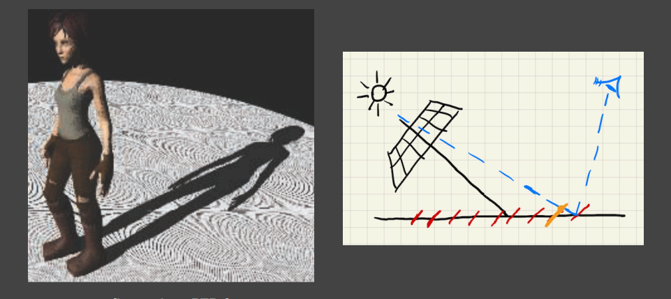
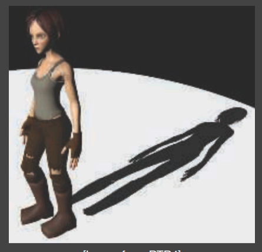
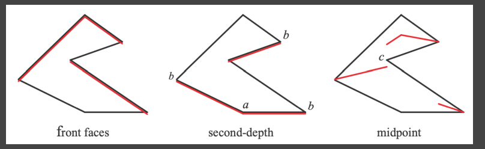
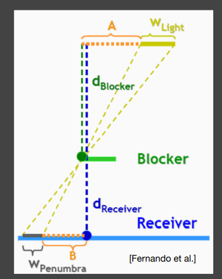

### ShadowMap的优点和缺点

shadowmap是一个图像空间的算法，不需要场景的几何信息，用起来也比较简单。

但是缺点主要是两个问题，一个是自遮挡，另外一个就是由于图像精度带来的走样

自遮挡问题的原因如右图，就是由于记录的深度是不连续的，因此在某些着色点，会出现与由于数据精度导致的自遮挡现象

自遮挡问题和光与阴影接收物的夹角有关。当光是垂直的时候，就不会有这个问题

解决自遮挡问题的方式主要是bias，通过添加一个偏移量，来进行处理。这个bias可能会导致截断效果。如下图

处理这个的方式依旧是调整bias的值，同时，我们可以让它是变化的，例如在光线夹角不同时使用不同的bias.另外，还可以使用阴影级联。在近处应用精度较高的shadowmap，但是在远处使用较差的shadowmap

另外，还有一个方法来解决这个问题，即second depth shadow mapping

这个方法是记录最小深度和次小深度，然后取中间值

性能较差，而且需要是有正面和反面的模型

#### PCF(Percentage Closer Filtering)

PCF最开始的设计思路是用于解决shadowmap的走样问题。它的思路为选定一块区域，根据里面的平均遮挡情况计算可见性。

例如我采样一个3*3的区域
$$
\matrix
{
1 &0 &1\\
1 &0 &1\\
1 &1 &0
}
$$
那么我们就可以得到一个平均可见性 0.667。

这里面有一个很有意思的地方，当我们的filter小，那么就会更锐利，filter大就会更柔软，恰好符合软阴影的需求

### 软阴影

#### PCSS(Percentage Closer Soft Shadows)

根据我们的实际情况来看，当阴影的投射物理接收物近，阴影就会越锐利，而远，就会更柔软

根据图中的相似三角形，我们可以得到一个结果

pcss

s1 blocker search

计算遮挡物的平均深度

s2 使用平均深度确定filter size

s3 pcf

1,3都是开销大

