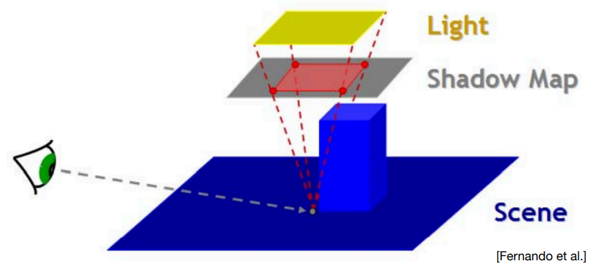

### ShadowMap的优点和缺点

shadowmap是一个图像空间的算法，不需要场景的几何信息，用起来也比较简单。

但是缺点主要是两个问题，一个是自遮挡，另外一个就是由于图像精度带来的走样

自遮挡问题的原因如右图，就是由于记录的深度是不连续的，因此在某些着色点，会出现与由于数据精度导致的自遮挡现象

自遮挡问题和光与阴影接收物的夹角有关。当光是垂直的时候，就不会有这个问题

解决自遮挡问题的方式主要是bias，通过添加一个偏移量，来进行处理。这个bias可能会导致截断效果。如下图

处理这个的方式依旧是调整bias的值，同时，我们可以让它是变化的，例如在光线夹角不同时使用不同的bias.另外，还可以使用阴影级联。在近处应用精度较高的shadowmap，但是在远处使用较差的shadowmap

另外，还有一个方法来解决这个问题，即second depth shadow mapping

这个方法是记录最小深度和次小深度，然后取中间值

性能较差，而且需要是有正面和反面的模型

#### PCF(Percentage Closer Filtering)

PCF最开始的设计思路是用于解决shadowmap的走样问题。它的思路为选定一块区域，根据里面的平均遮挡情况计算可见性。

例如我采样一个3*3的区域
$$
\matrix
{
1 &0 &1\\
1 &0 &1\\
1 &1 &0
}
$$
那么我们就可以得到一个平均可见性 0.667。

这里面有一个很有意思的地方，当我们的filter小，那么就会更锐利，filter大就会更柔软，恰好符合软阴影的需求

### 软阴影

#### PCSS(Percentage Closer Soft Shadows)

根据我们的实际情况来看，当阴影的投射物理接收物近，阴影就会越锐利，而远，就会更柔软

根据图中的相似三角形，我们可以得到一个结果

$$
W_{Penumbra} = (d_{Receiver}-d_{Blocker})*w_{Light}/d_{Blocker}
$$
PCSS的步骤总共来说共分为三步

1. Blocker search  (获取遮挡物的平均深度）
2. 根据遮挡物的平均深度确定filter的大小
3. PCF

其中，有一个很大的问题，我们应该获取多大的区域的平均深度呢，这里有一个经验的做法，类似于计算视锥的大小，我们可以通过一些参数来进行规定

不过总体来看，感觉还是看自己来设定

从数学角度去证明pcf，略

接下来，我们开始研究一下，如何去提高这个的性能

其中一个办法就是在1,3步中，我们进行一些采样，这样就会产生噪声，但是也能提高性能。常规的做法就是进行稀疏采样，然后再进行一个图像空间降噪处理。

#### VSSM

首先我们可以明显的看出，1,3肯定是特别的慢的。毋庸置疑。接下来，我们将进行一些非常聪明的推导

考虑到PCF，假设我们将区域内所有深度进行一个排序，我们这是想要获取的的最终结果，实际上就是需要计算比当前点要大的深度的点的比率。

VSSM的核心思路就是快速计算出所需要的平均值和方差。

Mean(平均值)可以使用mipmap或者是SAT

方差可以利用方差公式
$$
Var(X) = E(X^2) − E^2(X)
$$
通过平方的均值减去均值的平方。这只需要在生成shadowmap的时候顺手生成一下就OK了

回到上面的问题，我们想要解决的问题就是获取到比当前点要大的深度的点的比率。因此这时候，vssm使用了一个特别聪明的办法，即使用一个切比雪夫不等式
$$
P(x>t)\le\frac{variance}{variance+(t-mean)^2}
$$

当然这也是有局限的，我们这里假设的是这是一个单峰。并且我们要这个t是在均值的右边

继续回到上述的步骤1，这一步也需要一个循环，。这里我们需要计算的是区域中会遮挡的物体的平均深度。正如下图

$$
\frac{N_1}{N}Z_{unocc} + \frac{N_2}{N}z_{occ} = z_{Avg}
$$
我们将非遮挡物的深度都假设为当前shadingpoint的深度一样

#### PCSS具体实现

 代码忘了保存，这里就先不贴了

### Distance field soft shadows（SDF）

基于距离场的的软阴影,SDF的问题主要缺陷是存储的开销

距离函数：定义了空间中一个点到物体表面的最小距离的函数。

可以用于运动物体物体的边界，如下图

第一种用法

#### ray marching

假设有一个光线，又有一个SDF，我们可以利用一个点的SDF的值，以这个值的为半径的圆内，就一定不可能有和物体相交

即可以根据SDF(p)的值，移动任意方向。如下图

这里需要注意的是，形变的物体不能用sdf

#### 生成软阴影

根据ray marching的思路，我们可以找到一个“安全角”，这个角度越小，能看的东西就越少，即阴影越黑

如何找到最小的角呢？我们在raymarching过程中，一个接一个点往前走，那么可以得到n个安全角，而这一系列点的最小安全角度，就是最小安全角了。

这个角度怎么算呢，arcsin，当然是可以的，但是这个性能比较差，因此我们用一个新的做法
$$
min\{\frac{k*SDF(p)}{p-o},1.0\}
$$
我们可以发现，右边的sin已经可以说明角度了，k的作用是什么呢，k越小，证明阴影越软，而k越大，则阴影越硬

总结一下SDF的优缺点。优点如下。

1. fast

2. high quality

缺点

1. 预计算

2. 大量的存储

3. artifact

4. 不好贴纹理

不过有前面的两点，基本上就会有很多人喜欢用了

