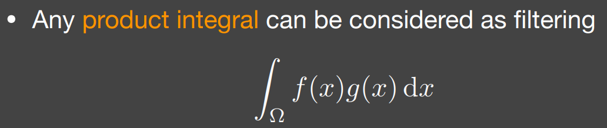
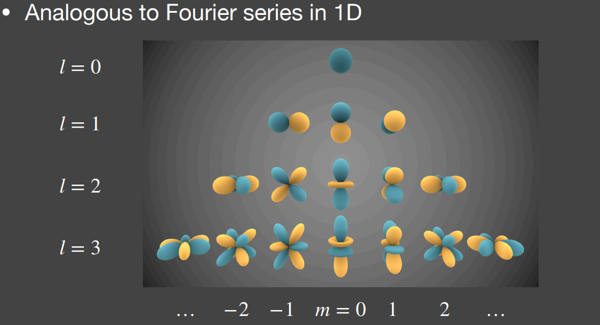
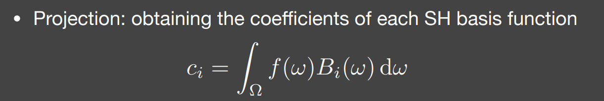
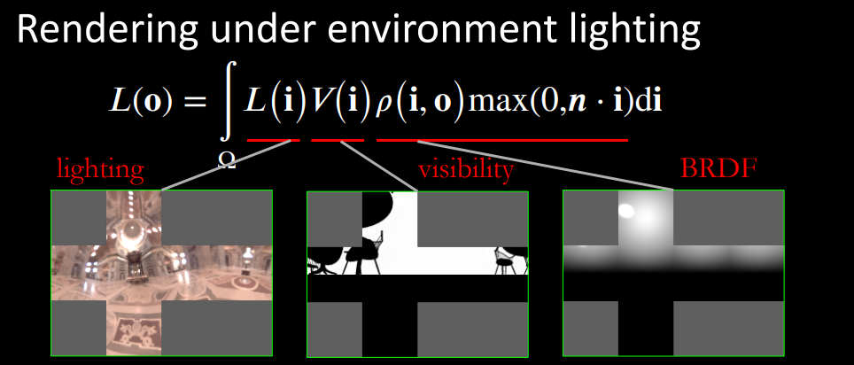
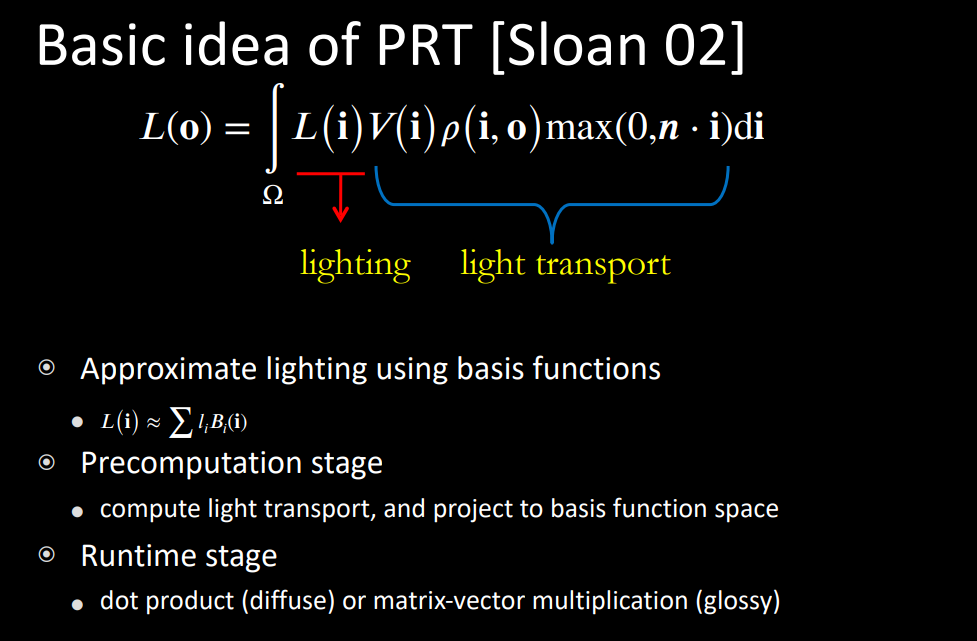
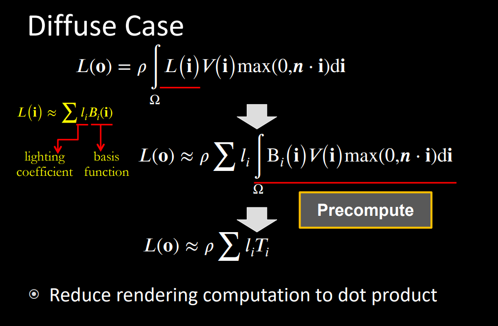
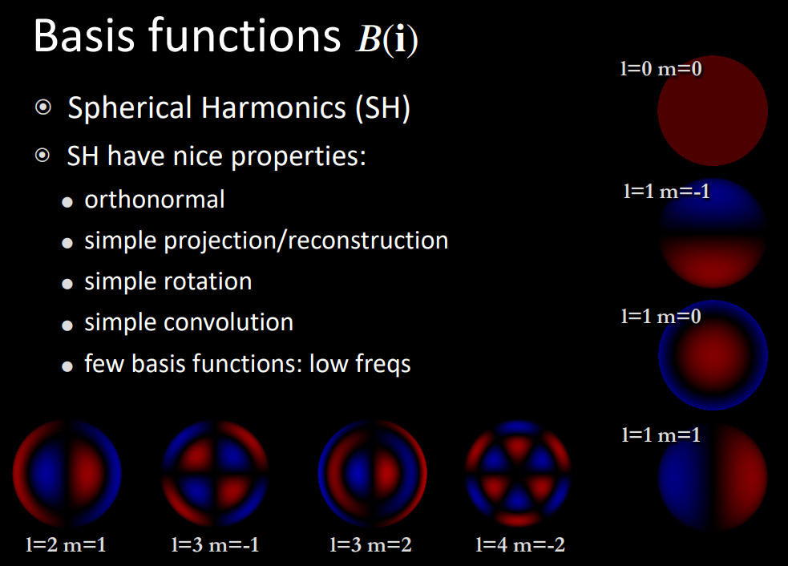

基函数

#### 基本概念

我们用一张图，来记录任何方向的光照得到的结果

#### IBL(Image-Based Lighting)

我们拿到任何一个shadingpoint 的值

即解rendering equation
$$
1111
$$
先不考虑visible

如果我的brdf是glossy的，那么就是

如果brdf是diffuse，那就是smooth了

这时候就是一个公式
$$

$$
这里将brdf进行拆分

拆分了之后，将light拆分出来

即吧IBL这张图变模糊了

即是一个filtering

根据不同的核，就可以得到mimap相当的做法

这是一个观察，我们从某个方向看一个shadingpoint，我们将要采样一定范围，然后进行加权平均。就和先做好一个filtering，然后再进行采样相似

目前拆分后，有两部分的函数

最终把后半部分打成了一个纹理就整成了

即splitsum

ssbo近似

假设了constant environment lighting

工业做法 

生成一个或者多一点的最亮的光源的阴影

RTRT

PRT Precomputed radiance transfer

PRT

傅里叶级数展开

时域卷积 频域乘积

product integral 

两个函数乘起来积分就相当于卷积

低频率 = smooth函数/变化的比较慢

Basic Functions 
$$
f(x) = \sum_i{c_i*}B_i(x)
$$
Spherical Harmonics 球谐函数？

一系列的定义在球面上二维的基函数(对方向的函数？这个方向可以两个数描述)

和一维下的傅里叶级数相似

不同频率函数，个数也不同

每一层的函数的数量是$2*l+1$

l是阶数

还有一个编号，是$-l~l$

前n阶一共有$n^2$个

适合用它分析球面上函数的性质

二维函数被归类为各种不同频率的段，每种频率有不同数量的函数

通过勒让德多项式来定义

给一个函数，用这个函数的线性组合，来表述它

给一个定义在球面上的函数，展开，写成sh的线性组合

任何一个函数，在任何一个basicfunction上的投影

我们可以通过恢复原来的函数

我们可以只使用前n阶

图中颜色是值，蓝色大，黄色绝对值）

product integral  本质是一个点乘

解决环境光照下，diffuse物体的shading问题

环境光，先prefiltering+single query = no filtering+multiple queries

基本等价

diffuse brdf 简单，类似于low-pass filtering

投影到sh后，只有前面几阶有值，但是后面的就灭有了

差不多三阶。就可以描述的比较好了

环境光照diffuse物体，不管光照的频率如何，不考虑visible，都没有高频

前三阶sh，结果基本一致

任意光照，我们只需要前三阶的sh，就可以描述一个diffuse的光照

lighting球面函数 visibility 球面函数

brdf  

如果要强行计算的话，可能就是6\*64\*64，非常麻烦且耗

认为渲染的时候其他东西不变，只有光照变换

换一种光照，或者光照旋转

light会变，其他东西都不变，那么light transport就成了一个固定的东西，就可以预计算

假设brdf是diffuse的情况，那么这个brdf是一个长值

经过提取化简以及交换积分与求和之后，我们发现这个就是sh计算出来的系数

因此对于任何一个shadingpoint,包括shadow，我们只需要计算一个点乘

这就意味着场景是不能动的,但是光源是可以切换的

sh的性质

正交性

简单投影和重建

简单旋转

简单

低频

我用的阶数越多，那么复原的效果就越好

#### 补充

SHfor glossy transport

wavelet

