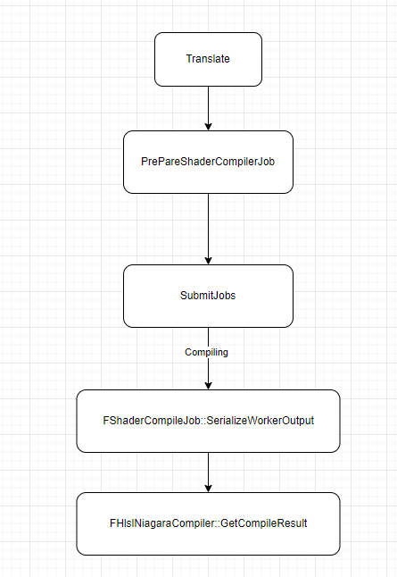

#### 整体shader编译

UE的shader在代码层面，最底层的是**FShader**，**FShader**是一个已经编译好的着色器代码和它的参数绑定的类型，是我们在渲染代码中最基础、核心、常见的一个类型

FShader存储着Shader关联的绑定参数、顶点工厂、编译后的各类资源等数据，并提供了编译器修改和检测接口，还有各类数据获取接口。

FShader实际上是个基础父类，例如材质shader,globalshader，Niagarashader都是它的子类

FGlobalShader包含了后处理、光照、工具类、可视化、地形、虚拟纹理等方面的Shader代码

FMaterialShader主要包含了模型、专用Pass、体素化等方面的Shader代码，可以是VS、PS、GS等。

**FNiagaraShader目前推测，主要包含的是Niagara系统在GPU粒子环境下，init和update两个阶段用的CS，因为实际绘制的时候看起来还是用的材质shader**

Shader的C++层通过Shaderparameter宏定义

ShaderMap是存储编译后的shader代码，材质有材质的shadermap,FNiagaraShader也有对应的shadermap**NiagaraShaderMap**。**目前感觉不仅存了材质shader,还存了Niagarashader，不过不一定，没有石锤**。目前Shadermap的保存暂时还不构成问题，先不理会

//....后续补充Shader编译详解

#### Niagara的Shader体系

在Niagara中，我们可以发现这么一个函数 FNiagaraShaderMap::Compile 函数

这个函数是编译的入口

负责处理各种shader的环境的setup，最后通过delegate来注册一个编译Shader的函数，这部分比较复杂，后续补充

但是最终调用的函数是**INiagaraHlslTranslator::Translate**函数，这个函数是整个NiagaraShader编译的关键中的关键

这个函数也比较长，大约有1K多行

//TODO 补充一下这里的详细解析...

#### Niagara绘制JOB控制

//TODO

#### CPU模拟

Niagara的Shader编译是在Translate函数中完成的，它会生成一些shader缓存下来

而如果是CPU粒子的话，则不会生成Shader，转而生成bytecode

这部分bytecode其实就是上面的Translate函数中生成的的shader来生成的。但是这里有一个问题，实际的bytecode并不是从这里来的。

我们看实际赋值bytecode的位置，即GetCompileResult函数，在编译结果成功之后，我们会将bytecode从job的compileoutput中放回到编译result之中

```c++
TOptional<FNiagaraCompileResults> FHlslNiagaraCompiler::GetCompileResult(int32 JobID, bool bWait /*= false*/)
{
	
    if (CompilationJob->ShaderCompileJob->bSucceeded)
	{
		const TArray<uint8>& Code = CompilationJob->ShaderCompileJob->Output.ShaderCode.GetReadAccess();
		FShaderCodeReader ShaderCode(Code);
		FMemoryReader Ar(Code, true);
		Ar.SetLimitSize(ShaderCode.GetActualShaderCodeSize());
		Ar << CompilationOutput;

		if (!CompilationOutput.Errors.IsEmpty())
		{
			Warning(FText::Format(LOCTEXT("VectorVMCompileWarningMessageFormat", "The Vector VM compile generated warnings:\n{0}"), FText::FromString(CompilationOutput.Errors)));
		}

		Results.bVMSucceeded = true;
	}
    
    //......
	if (!Results.bVMSucceeded)
	{
		//For now we just copy the shader code over into the script. 
		Results.Data->ByteCode.Reset();
		Results.Data->Attributes.Empty();
		Results.Data->Parameters.Empty();
		Results.Data->InternalParameters.Empty();
		Results.Data->DataInterfaceInfo.Empty();
		Results.Data->UObjectInfos.Empty();
		//Eventually Niagara will have all the shader plumbing and do things like materials.
	}
	else
	{
			//Build internal parameters
		SCOPE_CYCLE_COUNTER(STAT_NiagaraEditor_HlslCompiler_CompileShader_VectorVMSucceeded);
		*Results.Data = CompilationJob->TranslatorOutput.ScriptData;
		Results.Data->ByteCode.SetData(CompilationOutput.ByteCode);
		Results.Data->NumTempRegisters = CompilationOutput.MaxTempRegistersUsed + 1;
		Results.Data->LastAssemblyTranslation = CompilationOutput.AssemblyAsString;
		FixupVMAssembly(Results.Data->LastAssemblyTranslation);
		Results.Data->LastOpCount = CompilationOutput.NumOps;
		//......
    }
	//......
}
```

这里，我们可以看到，数据源的真正由来是ShaderCompileJob。那这个ShaderCompileJob是怎么来的呢

先试图找一下编译完成之后数据的流转

相关代码如下

```c++
int32 FHlslNiagaraCompiler::CompileScript(const FStringView GroupName, const FNiagaraCompileOptions& InOptions, const FNiagaraTranslateResults& InTranslateResults, const FNiagaraTranslatorOutput& TranslatorOutput, const FString& TranslatedHLSL)
{
	SCOPE_CYCLE_COUNTER(STAT_NiagaraEditor_HlslCompiler_CompileScript);

	CompileResults.Data = MakeShared<FNiagaraVMExecutableData>();
    
	//.............
    
	CompilationJob = MakeUnique<FNiagaraCompilerJob>();
	CompilationJob->TranslatorOutput = TranslatorOutput;
	//这里判断是否编译成功
	CompileResults.bVMSucceeded = (CompilationJob->TranslatorOutput.Errors.Len() == 0) && (TranslatedHLSL.Len() > 0) && !InTranslateResults.NumErrors;

	// only issue jobs for VM compilation if we're going to be using the resulting byte code.  This excludes particle scripts when we're using
	// a GPU simulation
    //这里处理一些条件
	const bool bCompilingGPUParticleScript = InOptions.IsGpuScript() && UNiagaraScript::IsParticleScript(InOptions.TargetUsage);
	if (bCompilingGPUParticleScript)
	{
		CompileResults.bComputeSucceeded = false;
		if (CompileResults.bVMSucceeded)
		{
			//Clear out current contents of compile results.
			*(CompileResults.Data) = CompilationJob->TranslatorOutput.ScriptData;
			CompileResults.Data->ByteCode.Reset();
			CompileResults.bComputeSucceeded = true;
		}
	}

	//其他处理
	return JobID;
}
```

上面的代码中显示了CompileResult已经被赋值了，但是我们仔细看就会发现，实际上我们只赋值了ScriptData。但是真正的job创建还在后面的其他处理中,这里有个关键处理就是根据translate函数的结果，来判断编译情况。因此，我们可以发现，在上面其他处理函数的中，有一段这样的代码

```C++
if (CompileResults.bVMSucceeded)
	{
		SCOPE_CYCLE_COUNTER(STAT_NiagaraEditor_HlslCompiler_CompileShader_VectorVM);
		CompilationJob->StartTime = FPlatformTime::Seconds();

		FShaderType* NiagaraShaderType = nullptr;
		for (TLinkedList<FShaderType*>::TIterator ShaderTypeIt(FShaderType::GetTypeList()); ShaderTypeIt; ShaderTypeIt.Next())
		{
			if (FNiagaraShaderType* ShaderType = ShaderTypeIt->GetNiagaraShaderType())
			{
				NiagaraShaderType = ShaderType;
				break;
			}
		}
		if (NiagaraShaderType)
		{
			TRefCountPtr<FShaderCompileJob> Job = GShaderCompilingManager->PrepareShaderCompileJob(JobID, FShaderCompileJobKey(NiagaraShaderType), EShaderCompileJobPriority::Normal);
			if (Job)
			{
				TArray<FShaderCommonCompileJobPtr> NewJobs;
				CompilationJob->ShaderCompileJob = Job;
				Input.ShaderFormat = VVMFormatName;
				if (GNiagaraSkipVectorVMBackendOptimizations != 0)
				{
					Input.Environment.CompilerFlags.Add(CFLAG_SkipOptimizations);
				}
				Job->Input = Input;
				NewJobs.Add(FShaderCommonCompileJobPtr(Job));

				GShaderCompilingManager->SubmitJobs(NewJobs, FString(), FString());
			}
			bJobScheduled = true;
		}
	}
	CompileResults.Data->LastHlslTranslation = TranslatedHLSL;
```

 这部分代码根据编译结果，设置了一个type为VVMFormatName的job。这个format实际上代表这种format `FName(TEXT("VVM_1_0"));`看起来这是一个专门给虚拟机用的代码格式

总体流程大概是这样的



总体来说这里还是挺坑的

而实际编译Shader的部分，我们可以从FShaderCompiling::launchWorker中发现，是通过命令行调用某个东西来进行编译的

后续我们可以知道，这个EXE就是ShaderCompileWorker.exe

Shader的编译过程应该就是它支持的其中一个Shader编译过程中的一部分。我们可以看到的是，UE应该支持了相关的的ShaderByteCode的编译和使用。

#### VM是如何使用bytecode的

在CPU粒子模式下，上面编译出来的ByteCode会使用UE的虚拟机运行

UE使用的虚拟机是VectorVM，整体看代码来说是一个完善的虚拟机体系。

调用VectorVM的时候，我们使用的是FNiagaraScriptExecutionContext，这是一个负责组织VM运行的结构体，在EmitterInstance中保存。在每帧的Tick中执行。我们另一篇文章中也有提及也有所提及

VM运行时需要使用的是bytecode，bytecode是通过我们上面的编译流程中生成的。


执行之前，我们先要填充FVectorVMExecArgs,这是VM的配置文件，会设置各种配置还有编译出来的buffer数据等等，从这里也可以看出，这个VM实际上是一个CPU端的computeshader运行器


实际执行我们调用的是VectorVM::EXEC函数。这个函数会将传入的bytecode逐语句执行，将bytecode翻译成operator，即EVectorVMOp,这是一个个数字，代表着一个执行命令


然后根据switch的结构，来对整个bytecode进行执行。

总体十分复杂

逐语句执行到之后，BUFFER的值也就更新了


#### 绘制shader的生成和使用

这部分比较简单，基础的vertexfactory的使用。编译完成后的shader目测还是存贷NiagaraShadermap中，然后使用的时候再具体根据实际绘制取用不同的Shader（但是材质也有可能用的是材质的ShaderMap）

TODO 看一下这里shadermap的差异

