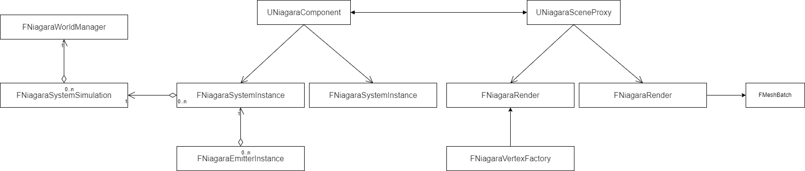
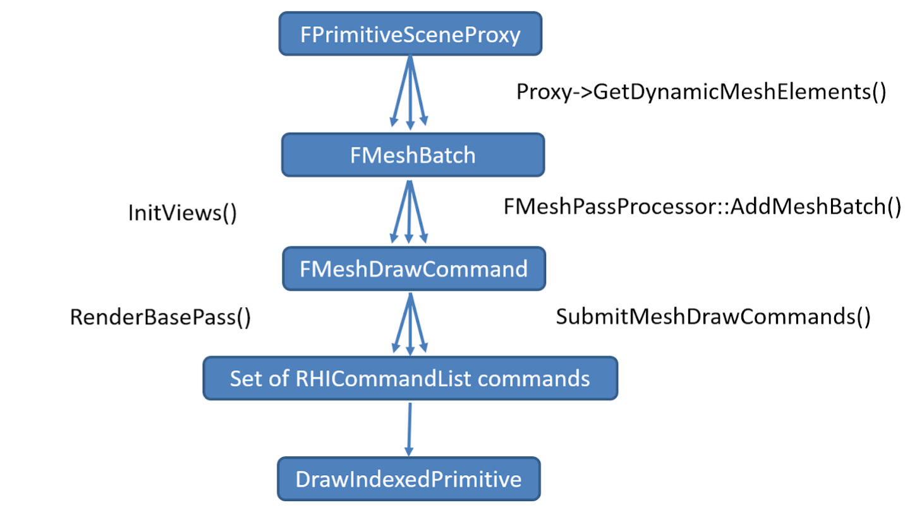

### 整体架构概览

Niagara的整体架构，从使用者的角度，我们需要创建一个Niagara系统，然后再这个系统中，我们会添加各种emitter，在emitter中我们又会添加各种脚本来执行各种功能，最后Emitter则会使用各种renderer来绘制各种例子效果。而从代码角度，这部分则是这样子的一个结构


从代码角度，我们使用Niagara 的地方是使用UNiagaraComponent来进行，其主要是进行控制和Niagara系统的交互。

我们在编辑器中资源对应的是UNiagaraSystem和UniagaraEmitter。一个UNiagaraComponent会拥有指定的一个UNiagaraSystem对应。（即组件和资产）

因此在实际运行中，UNiagaraComponent初始化时会构建对应FNiagaraSystemInstance，同样System里面的Emitter会生成对应的FNiagaraEmitterInstance。

对于每个UNiagaraSystem，会有⼀个相对应这个System类型的的FNiagaraSystemSimulation。相当于每一种发射器都会有一个模拟器对象，场景中同样的System的实例都会使用这个模拟器。

相同的System的Spawn和Update与数据存储的大小和类型是相同的。提高缓存一致性和数据的存储效率。

所有的FNiagaraSystemSimulation都由FNiagaraWorldManager统一进行管理。

初始化Component的时候，会调用InitializeSystem函数来创建对应的实例。

### 粒子数据的更新和传输

和其他各种模块一样，在逻辑线程有的对象，在渲染线程也会有一个对象，整体的效果就入这个图所示



不过我们这里主要聊

#### 更新流程

不管其他流程作何操作，最终我们都要将数据传输给Emitter所使用的Renderer中。

生成这部分数据的过程，就是粒子数据每帧生成/更新的过程。因此，我们可以在FNiagaraEmitterInstance中找到实际绘制所需要的数据。

最终传递给渲染线程的数据存储在每个Emitter实例FNiagaraEmitterInstance的FNiagaraDataSet身上

我们将FNiagaraDataSet的数据作为每帧更新的数据继续传递。FNiagaraDataSet最主要的数据是两个buffer

```c++
	/** Buffer containing the current simulation state. */
	FNiagaraDataBuffer* CurrentData;

	/** Buffer we're currently simulating into. Only valid while we're simulating i.e between PrepareForSimulate and EndSimulate calls.*/
	FNiagaraDataBuffer* DestinationData;
```

粒子的更新核心在于FNiagaraEmitterInstance的tick函数，主要包括两个，一个pretick函数，一个tick函数。其调用堆栈大致如下


其中，FNiagaraSytemIntstanceTickConcurrentTask是由FNiagaraSystemSimulation调用的。

在FNiagaraEmitterInstance::PreTick中，最主要的是执行Emitter的Spawn和Update脚本。

```c++
void FNiagaraEmitterInstance::PreTick()
{
	//.....

	checkSlow(ParticleDataSet);
	FNiagaraDataSet& Data = *ParticleDataSet;

	bool bOk = true;
	bOk &= SpawnExecContext.Tick(ParentSystemInstance, NiagaraEmitterData->SimTarget);
	bOk &= UpdateExecContext.Tick(ParentSystemInstance, NiagaraEmitterData->SimTarget);
	//.....
}
```

最重要的更新是在FNiagaraEmitterInstance::Tick。并且更新我们最终需要提交的数据FNiagaraDataSet。在FNiagaraDataSet中真正存储数据的Buffer为FNiagaraDataBuffer。其为了保证线程间的安全与准确一共有两个。我们将对将要使用的那个buffer其中TryLock，准备进行写入。

具体相关的函数为 FNiagaraDataSet::ResetBuffers

```c++
void FNiagaraDataSet::ResetBuffers()
{
	//checkSlow(CompiledData);
	
	if (GetSimTarget() == ENiagaraSimTarget::CPUSim)
	{
		ResetBuffersInternal();

		if (GNiagaraReleaseBuffersOnReset)
		{
			for (auto it=Data.CreateIterator(); it; ++it)
			{
				FNiagaraDataBuffer* Buffer = Data[it.GetIndex()];
				if (Buffer->IsBeingRead())
				{
				
					// In this path the buffer might still be in use on the render thread for rendering the last frame therefore we push it into the deferred destruction queue as we can not release the data as we would race.
#if NIAGARA_MEMORY_TRACKING
					BufferSizeBytes -= Buffer->GetFloatBuffer().GetAllocatedSize() + Buffer->GetInt32Buffer().GetAllocatedSize() + Buffer->GetHalfBuffer().GetAllocatedSize();
#endif
					Buffer->Destroy();
					it.RemoveCurrentSwap();
				}
				else
				{
					Buffer->ReleaseCPU();
				}
			}
		}
	}
	else
	{
		checkSlow(GetSimTarget() == ENiagaraSimTarget::GPUComputeSim);
		ENQUEUE_RENDER_COMMAND(ResetBuffersCommand)(
			[this](FRHICommandListImmediate& RHICmdList)
			{
				for (FNiagaraDataBuffer* Buffer : Data)
				{
					Buffer->ReleaseGPU();
				}
				ResetBuffersInternal();
			}
		);
	}
}
```

#### Component和数据同步

因此我们最终传递给渲染线程的数据存储在每个Emitter实例FNiagaraEmitterInstance的FNiagaraDataSet身上。

最终传输的数据如下

```c++
struct FNiagaraDynamicDataBase
{
	NIAGARA_API explicit FNiagaraDynamicDataBase(const FNiagaraEmitterInstance* InEmitter);
	NIAGARA_API virtual ~FNiagaraDynamicDataBase();

	UE_NONCOPYABLE(FNiagaraDynamicDataBase);

	NIAGARA_API bool IsGpuLowLatencyTranslucencyEnabled() const;
	NIAGARA_API FNiagaraDataBuffer* GetParticleDataToRender(bool bIsLowLatencyTranslucent = false) const;
	FORCEINLINE FMaterialRelevance GetMaterialRelevance() const { return MaterialRelevance; }

	FORCEINLINE void SetMaterialRelevance(FMaterialRelevance NewRelevance) { MaterialRelevance = NewRelevance; }

	FORCEINLINE FNiagaraSystemInstanceID GetSystemInstanceID() const { return SystemInstanceID; }

	virtual void ApplyMaterialOverride(int32 MaterialIndex, UMaterialInterface* MaterialOverride) {};

protected:
	FMaterialRelevance MaterialRelevance;
	FNiagaraSystemInstanceID SystemInstanceID;

	FNiagaraDataBufferRef CPUParticleData;
	INiagaraComputeDataBufferInterface* ComputeDataBufferInterface = nullptr;
};
```

从传递的数据来看，如果我们是CPU粒子，将直接把最终的模拟结果对应的buffer传递给renderer。而GPU粒子则应该传递的是各种ri资源。具体的传输流程则是

在NiagaraComponent中的SendRenderDynamicData_Concurrent中触发更新。关键代码有两个

```C++
void UNiagaraComponent::SendRenderDynamicData_Concurrent()
{	
    		//.................前面另外情况略过
			else
			{
                //创建emitter数据
				SystemInstanceController->GenerateSetDynamicDataCommands(SetDataCommands, *RenderData, *NiagaraProxy);
			}

			ENQUEUE_RENDER_COMMAND(NiagaraSetDynamicData)(UE::RenderCommandPipe::NiagaraDynamicData,
				[NiagaraProxy, CommandsRT = MoveTemp(SetDataCommands), NewProxyDynamicData]
				{
                    //.................
                    //设置绘制数据,最终调用SetDynamicData_RenderThread
					FNiagaraSystemRenderData::ExecuteDynamicDataCommands_RenderThread(CommandsRT);
					NiagaraProxy->SetProxyDynamicData(NewProxyDynamicData);
				}
			);
		}
	}
}
```


在GenerateSetDynamicDataCommands中，我们可以在这个函数中看到这么一段每个Emitter的渲染器创建自己的DynamicData。

```C++
void FNiagaraSystemRenderData::GenerateSetDynamicDataCommands(FSetDynamicDataCommandList& Commands, const FNiagaraSceneProxy& SceneProxy, const FNiagaraSystemInstance* SystemInstance, TConstArrayView<FMaterialOverride> MaterialOverrides)
{
    for (int32 i = 0; i < SystemInstance->GetEmitters().Num(); i++)
	{
		FNiagaraEmitterInstance* EmitterInst = &SystemInstance->GetEmitters()[i].Get();
		//.....
		EmitterInst->ForEachEnabledRenderer(
			[&](const UNiagaraRendererProperties* Properties)
			{
					if (bRendererEditorEnabled && !EmitterInst->IsComplete() && !SystemInstance->IsComplete())
					{
						NewData = Renderer->GenerateDynamicData(&SceneProxy, Properties, EmitterInst);

						//.....
					}

					Commands.Add(FSetDynamicDataCommand(Renderer, NewData));
                //.....
			}
		);
	}
}
```

接下来就是在渲染器中进行数据更

```C++
void FNiagaraRenderer::SetDynamicData_RenderThread(FNiagaraDynamicDataBase* NewDynamicData)
{
	if (DynamicDataRender)
	{
		delete DynamicDataRender;
		DynamicDataRender = NULL;
	}
	DynamicDataRender = NewDynamicData;
}
```


### 粒子绘制

#### Ue绘制体系介绍和Niagara绘制

ue的绘制可以说分为几个部分，首先是整体的绘制。这部分说简单也很简单



总体来说，在渲染线程，我们有一个Proxy对象，这个proxy对象会在每帧绘制时获取所有需要绘制的对象，然后对这个对象进行数据的收集，然后进行绘制。大致流程可以分为以下几步

1. 每个PrimitiveSceneProxy，通过重载GetDynamicMeshElements()函数来进行meshbatch的创建和收集。
2. 前面收集FMeshElemnt，创建FMeshBatch，在这个过程结束之后，会立马调用SetupMeshPasses函数，遍历需要绘制的Pass，在SetupMeshPass阶段对需要用到的Pass并行化地生成DrawCommand。
3. 将FMeshBatch转换到FMeshDrawCommand后，command会被保存到FMeshPassProcessor的FMeshPassDrawListContext成员变量中。为后续绘制做准备
4. FMeshBatch转换成FMeshDrawCommand后，每个Pass都对应了一个FMeshPassProcessor，每个FMeshPassProcessor保存了该Pass需要绘制的所有FMeshDrawCommand，以便渲染器在合适的时间触发并渲染。
5. 通过FMeshDrawCommand的数据构建Rhi命令后并进行提交

粒子系统的渲染流程与一般的Mesh 的流程并没有什么区别。如果自己是非透明的材质，和普通非透明物体的渲染位置一致，如果是透明物体则在透明Pass中进行渲染。粒子系统整体来说数量比较大，但是都比较统一，因此使用实例化渲染是一个好的选择

考虑到粒子系统的绘制，我们目前只需要关注到从proxy到meshbatch相关的内容，以spriterenderer为例，它也实现了这个函数

```c++
void FNiagaraRendererSprites::GetDynamicMeshElements(const TArray<const FSceneView*>& Views, const FSceneViewFamily& ViewFamily, uint32 VisibilityMap, FMeshElementCollector& Collector, const FNiagaraSceneProxy *SceneProxy) const
{
	//generate mesh batch
    //....
    			if (NumInstances > 0)
			{
				SetupVertexFactory(RHICmdList, ParticleSpriteRenderData, VertexFactory);
				CollectorResources->UniformBuffer = CreateViewUniformBuffer(ParticleSpriteRenderData, *View, ViewFamily, *SceneProxy, VertexFactory);
				VertexFactory.SetSpriteUniformBuffer(CollectorResources->UniformBuffer);
				const uint32 GPUCountBufferOffset = SortInfo.CulledGPUParticleCountOffset != INDEX_NONE ? SortInfo.CulledGPUParticleCountOffset : ParticleSpriteRenderData.SourceParticleData->GetGPUInstanceCountBufferOffset();
				FMeshBatch& MeshBatch = Collector.AllocateMesh();
				CreateMeshBatchForView(RHICmdList, ParticleSpriteRenderData, MeshBatch, *View, *SceneProxy, VertexFactory, NumInstances, GPUCountBufferOffset, ParticleSpriteRenderData.bNeedsCull);
				Collector.AddMesh(ViewIndex, MeshBatch);
			}
}
```

在上述的函数中CreateMeshBatchForView则是具体组织了数据

```c++
void FNiagaraRendererSprites::CreateMeshBatchForView(
	FRHICommandListBase& RHICmdList,
	FParticleSpriteRenderData& ParticleSpriteRenderData,
	FMeshBatch& MeshBatch,
	const FSceneView& View,
	const FNiagaraSceneProxy& SceneProxy,
	FNiagaraSpriteVertexFactory& VertexFactory,
	uint32 NumInstances,
	uint32 GPUCountBufferOffset,
	bool bDoGPUCulling
) const
{
	//......
	MeshBatch.VertexFactory = &VertexFactory;
	MeshBatch.CastShadow = SceneProxy.CastsDynamicShadow() && bCastShadows;
#if RHI_RAYTRACING
	MeshBatch.CastRayTracedShadow = SceneProxy.CastsDynamicShadow() && bCastShadows;
#endif
	//.....
	//......
	FMeshBatchElement& MeshElement = MeshBatch.Elements[0];
	MeshElement.IndexBuffer = &GParticleIndexBuffer;
	MeshElement.FirstIndex = 0;
	MeshElement.NumPrimitives = NumIndicesPerInstance / 3; 
	MeshElement.NumInstances = FMath::Max(0u, NumInstances);
	MeshElement.MinVertexIndex = 0;
	MeshElement.MaxVertexIndex = 0;
	MeshElement.PrimitiveUniformBuffer = SceneProxy.GetCustomUniformBuffer(RHICmdList, IsMotionBlurEnabled());
	//....
}
```

可以看到，MeshBatch主要是处理了相关绘制数据的填充，其中，MeshElement的NumInstances代表着粒子数量。

在实际绘制时，上述的收集流程大概是这样的


#### NiagaraShader和一点点UEShader套路介绍

前面聊到了绘制，在这个过程中，FMeshBatch中有一个非常重要的对象，FVertexFactory，它的作用是保存和提供各种顶点相关的数据。

我们都知道在引擎中存在着静态网格、蒙皮骨骼、程序化网格以及地形等等类型的网格类型，而材质就是通过顶点工厂FVertexFactory来支持这些网格类型。实际上，顶点工厂要涉及各方面的数据和类型，包含但不限于：

- 顶点着色器。顶点着色器的输入输出需要顶点工厂来声明数据的布局。
- 顶点工厂的参数和RHI资源。这些数据将从C++层传入到顶点着色器中进行处理。
- 顶点缓冲和顶点布局。通过顶点布局，我们可以自定义和扩展顶点缓冲的输入，从而实现定制化的Shader代码。
- 几何预处理。顶点缓冲、网格资源、材质参数等等都可以在真正渲染前预处理它们。

总体来讲，vertexFactory会绑定各种Shader，声明顶点布局和buffer。这里仅展示一下顶点工厂如何绑定顶点输入布局和Shader

以下面这段函数为例，这些操作会绑定顶点工厂和各种参数

```c++
IMPLEMENT_VERTEX_FACTORY_PARAMETER_TYPE(FNiagaraSpriteVertexFactory, SF_Vertex, FNiagaraSpriteVertexFactoryShaderParametersVS);
IMPLEMENT_VERTEX_FACTORY_PARAMETER_TYPE(FNiagaraSpriteVertexFactory, SF_Pixel, FNiagaraSpriteVertexFactoryShaderParametersPS);
#if RHI_RAYTRACING
IMPLEMENT_VERTEX_FACTORY_PARAMETER_TYPE(FNiagaraSpriteVertexFactory, SF_Compute, FNiagaraSpriteVertexFactoryShaderParametersVS);
IMPLEMENT_VERTEX_FACTORY_PARAMETER_TYPE(FNiagaraSpriteVertexFactory, SF_RayHitGroup, FNiagaraSpriteVertexFactoryShaderParametersVS);
#endif // RHI_RAYTRACING
IMPLEMENT_VERTEX_FACTORY_TYPE(FNiagaraSpriteVertexFactory,"/Plugin/FX/Niagara/Private/NiagaraSpriteVertexFactory.ush",
	  EVertexFactoryFlags::UsedWithMaterials
	| EVertexFactoryFlags::SupportsDynamicLighting
	| EVertexFactoryFlags::SupportsRayTracing
	| EVertexFactoryFlags::SupportsRayTracingDynamicGeometry
	| EVertexFactoryFlags::SupportsPSOPrecaching
);
```

其中，NiagaraSpriteVertexFactory.ush代表着具体绑定的shader,FNiagaraSpriteVertexFactoryShaderParametersVS代表具体的参数具体的参数

```c++
class FNiagaraSpriteVertexFactoryShaderParametersPS : public FNiagaraVertexFactoryShaderParametersBase
{
	DECLARE_TYPE_LAYOUT(FNiagaraSpriteVertexFactoryShaderParametersPS, NonVirtual);
public:
	void GetElementShaderBindings(
		const FSceneInterface* Scene,
		const FSceneView* View,
		const FMeshMaterialShader* Shader,
		const EVertexInputStreamType InputStreamType,
		ERHIFeatureLevel::Type FeatureLevel,
		const FVertexFactory* VertexFactory,
		const FMeshBatchElement& BatchElement,
		class FMeshDrawSingleShaderBindings& ShaderBindings,
		FVertexInputStreamArray& VertexStreams) const
	{
		FNiagaraVertexFactoryShaderParametersBase::GetElementShaderBindings(Scene, View, Shader, InputStreamType, FeatureLevel, VertexFactory, BatchElement, ShaderBindings, VertexStreams);

		const FNiagaraSpriteVertexFactory* SpriteVF = static_cast<const FNiagaraSpriteVertexFactory*>(VertexFactory);
		ShaderBindings.Add(Shader->GetUniformBufferParameter<FNiagaraSpriteUniformParameters>(), SpriteVF->GetSpriteUniformBuffer() );
	}
};
```

FNiagaraSpriteUniformParameters则是具体声明了一个顶点输入布局

```c++
BEGIN_GLOBAL_SHADER_PARAMETER_STRUCT( FNiagaraSpriteUniformParameters, NIAGARAVERTEXFACTORIES_API)
	SHADER_PARAMETER( uint32, bLocalSpace)
	//.....

typedef TUniformBufferRef<FNiagaraSpriteUniformParameters> FNiagaraSpriteUniformBufferRef;
```

总体来讲，ue的Shader和相关布局和VertexFactory息息相关。
