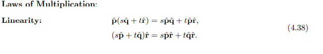
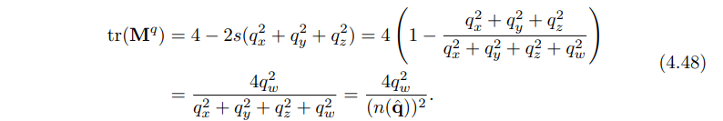

## 第二章：图形渲染管线

### 2.1 整体架构

1. 图形渲染管线和普通流水线一样，都是一个部分流水线主要处理一部分的内容，并且可以并行计算

2. 图形渲染可以说大体分为四个阶段：

   1. 应用阶段（application stage），这个阶段主要做的工作就是包括了真正使用的软件部分，它能够计算各种我们渲染时需要的数据，有一些物理相关的计算，如碰撞检测，全局加速算法那，动画，物理模拟等等都可以在应用阶段进行计算。
   2. 几何处理阶段（Geometry processing），这个阶段主要处理变换，投影，等等各种图形处理，这个阶段要决定什么需要渲染（比如说裁剪），在哪里渲染，要怎么渲染，该阶段开始就是在GPU中计算的了
   3. 光栅化阶段（rasterization stage），光栅化阶段就是将集合处理阶段的顶点数据，转换为我们实际显示需要的像素化的数据，他做的事情就是将找到各个三角形（三角形片元）需要的像素，然后传给下一个阶段
   4. 像素处理阶段（pixel processing stage）,这个阶段就是决定每个像素具体要显示什么颜色，并且可能会计算深度测试判断他是否可见，它还会做一些例如说逐像素的计算，例如说混合颜色等。

   每个阶段都是一个独立的流水线。

3. 一些概念定义

   1. FPS (frame per seconds)
   2. HZ(notation for 1/seconds)

总体而言，这个流水线的结构分成了四个部分，而之前常看见的，顶点着色器=>图元装配（shape assembly）=>几何着色器(geometry)=>=>光栅化（rasterization ）=>测试与混合（test and blending）=>片段着色器（fragment shader）=>光栅化（rasterization ）这个流水线则是上述四个部分的细化，例如前面的顶点着色器开始就是几何处理阶段，和片段着色器就到了最后的像素处理阶段，这也是为什么逐像素光照效果更好的缘故

### 2.2 应用阶段

​	应用阶段做的事情是开发者可以控制的，这种直接运行的程序。开发者在这里的操作会影响整个渲染过程。例如可以在应用层就可以减少需要渲染的三角形的数量。这个阶段可以做的事情有如下几个例子：

1. compute shader，我们可以将一部分计算交给gpu来运算，利用的是gpu强大的并行运算能力。例如说在戴森球计划里面，就大量的运用了这一技术
2. rendering primitives ,应用阶段我们将会将需要渲染的数据填充给几何处理阶段的程序，在性能优化阶段，我们常说的减少drawcall就是这个道理，在应用阶段我们会将需要渲染的点，线，三角形数据传递给下一个阶段。（CPU计算通常是并行的，而渲染管线的计算也通常是并行的，这意味着可能可以通过并行阶段同时feed每一个阶段）
3. 碰撞检测，应用层将会对对象之间的碰撞检测进行计算，这也会影响到某些输入输出
4. 一些优化算法，例如剔除算法（particular culling）

### 2.3 几何处理阶段

几何处理阶段，GPU会处理逐三角形（网格）和逐顶点的操作，这部分的内容主要包括有顶点着色，投影，裁剪，屏幕映射几个放米娜

#### 2.3.1顶点着色

顶点着色主要有两个大的作用一是计算顶点的位置和确定程序需要作为顶点输出的部分，例如输出法线和纹理坐标，传统来说，大部分阴影的计算是通过将光照应用到每个顶点的位置和法向量然后只在顶点数据中存储颜色信息。这部分颜色之后将会在三角形上进行插值计算。因为这个原因，这种可编程的顶点渲染被称为顶点着色器。

顶点着色器通常会计算一些更通用的和顶点相关的数据和信息，例如顶点着色器可以对一个对象进行动画运算。

1. 顶点位置的计算方式，首先我们通常需要一组坐标，在显示到屏幕的过程中，一个模型会被变换到各种不同的坐标系或者空间。
   1. 最初，模型的坐标都是基于他自身的模型空间，每个模型都有一个model transform 这样它才能够定位它自己。由于这个的存在，模型才能在同一个场景下拷贝出相同的结果。
   2. 经过转换，模型会被转换到唯一的世界坐标系中。
   3. 接下来，我们还需要将他转换到照相机的坐标系下，因为只有被摄像机看到的东西，才会被显示。摄像机在世界坐标系中也会有一个坐标来定位。视觉变换矩阵用于设置摄像机位于原点，并且面向Z轴的负方向，这是Y轴向上，而X轴向右，而有的会面向Z轴的正方向，（DX和OPGL），这个坐标系我们称之为view space ,eye space或者camera space
2. 渲染的时候，只渲染形状和位置是不足够的，整体模型的外观也是很重要的。比如光的影响，材质的影响。因此顶点处理还会处理一些额外的内容，比如法向数据，颜色数据，纹理坐标等。最后顶点着色的结果会被送去光栅化阶段进行插值处理，而这个处理总体而言会比像素处理效果差一些
3. 顶点着色的过程还会进行一个投影的处理，投影方式包括了正交/平行投影和透视投影。而投影的方式，这两种方式都可以通过一个4*4矩阵来进行计算。经过投影之后，模型可以说进入了裁剪坐标系中。而顶点着色器的输出结果都得在这个坐标系中，这样裁剪才能正常工作。投影过程中，Z值会被存储到Zbuffer中，这个时候就完成了3D转2D的转换

#### 2.3.2 额外的顶点处理

有些顶点着色处理有几个了额外步骤，平铺。几何着色，输出。当然这个很依赖与GPU，并且不是必须的操作。

1. tessellation: 这个操作的作用是，确定一个object合理的三角形数目，例如，一个足球模型，如果你使用过多三角形来描述它，但是场景中它很远，就是一种浪费计算时间，而这个处理就会选择一个合适的数量的三角形来完成一个更好的表面。顶点着色之后，我们获取到的其实是一系列顶点数据，而在tessellation过程中，它包括了几个步骤，包括了hull shader,tessellator domain shader等等，这些会将顶点坐标处理为新的一组数据，用于生成三角形，这样就能确定具体要显示多少个网格的三角形
2. 几何着色器 geometry shader:几何着色器更为普遍，几何着色器的常见操作例如说模拟一些图像效果例如烟火爆炸，粒子效果等，一个粒子效果，如爆炸，经常被表示为一个点，而几何着色器会将其转换为一个眠，通过两个三角形完成，然后使其面对摄像机，这样子就更方便的处理粒子效果 
3. 流式输出stream output: 这个部分让我们将GPU作为一个简单的几何处理器，在这个阶段那我们可以输出这里的数据用于额外用途，这些数据可以被CPU或者后面的GPU操作使用到，这部分内容也会用于粒子系统

这三个阶段的顺序为tessellation,几何着色，流式输出，而这三个阶段都是任意可选的

#### 2.3.3 裁剪

裁剪阶段，我们会将不需要渲染的部分给裁减掉，从计算来说，我们会将顶点数据和裁剪矩阵进行计算，从物理角度来说，这是使用一个6面的方块进行了裁切，同时，我们还可以定义一个额外的裁切平面进行裁切

在使用过裁剪之后，部分在视野之外的对象会经过额外的处理，会将在外的部分去掉，然后替换为新的顶点数据

#### 2.3.4 屏幕映射

经过裁剪之后，图像还是处于3D坐标系上，而要显示，则还需要映射到屏幕上

X,Y,Z都会被映射为一个新的区间【x1,x2】[y1,y2] 【z1,z2】(-1,1)/(0,1)

接下来我们会将坐标和像素对应，对应方式很简单，像素的中心为0.5(d=floor(c),c=d+0.5)

DX和opengl略有不同

### 2.4 光栅化

光栅化阶段，主要包括了图元装配（三角形setup）和三角形遍历，光栅化的过程主要是确定一个像素是否属于一个三角形

#### 2.4.1 三角形setup

在这个部分，会计算三角形所需要的数据，这些数据会在遍历三角形中所用到，包括了会在像素处理中用到的数据

#### 2.4.2 三角形遍历

在这个阶段，每个被三角形所覆盖的像素都会被检查，并且一个片段（用于片段着色器）将会在这个阶段中生成。每个三角形片段的生成过程会被称为三角形遍历。每个三角形都是通过顶点数据然后通过插值算法生成的。

### 2.5 像素处理

像素处理阶段所处理的像素，是和前面的数据相关联的。这个部分的内容主要分为两个部分，一是像素着色，二是混合

#### 2.5.1 像素着色

像素着色阶段，使用前面阶段计算完成的插值计算后的数据，计算的结果是一个或者多个颜色，然后会传递到下一个阶段，和图元装配和三角形遍历，这部分内容是使用可编程的GPU核心，因此，这部分的内容可以通过片元着色器来定制化。这部分的核心功能是纹理，纹理映射的意思就是将一张图映射到渲染对象上，

#### 2.5.2 混合

每个像素的信息都储存在颜色缓冲中，这是一个颜色矩阵。混合阶段主要负责将像素着色阶段的片段颜色和已经保存在颜色缓冲中的数据混合。这个stage也称作ROP（raster operations pipeline/Raster Operation/ROP-Unit/光栅化处理单元/渲染输出单元）,这个阶段不是完全可编程的，但是高度可配置的。

这个部分还负责处理可见性，即处理什么时候整个场景需要渲染。对于绝大部分图形硬件来说，这是通过Z-BUFFER来处理的，z-buffer和颜色缓冲是有相同大小的。Z值代表着离摄像机的远近，因此，z越大，离摄像机就越近。一个z值较小的像素则不会被渲染。然而这个算法是比较简单的，因此不能用来对半透明对象进行计算，因此半透明对象需要一个特别的算法，并且是需要从后往前进行渲染，需在最后来处理这个。基础z-buffer的弱点就是半透明运算。

α通道和颜色缓冲有关，它保存有每个像素的透明度，（old api）它还被用来做像素的可选性剔除，现在这个剔除操作被插入到片段着色器中，任何一个计算都可以触发一个剔除。α测试能用于保证一个完全透明的片段不影响整个z-buffer

*模版缓冲（*stencil buffer*）或印模缓冲* 是另外一种数据缓冲，和深度缓冲类似，它为屏幕上的每一个像素保存一个8位的无符号整数，从片元着色器出来的数据，在进入到深度测试之前，会进行一个模板测试，我们可以通过这个部分来控制进入到颜色缓冲和z-buffer的数据，从而做到丢弃或者保留某些像素的功能。模板缓冲对于实现某些特效特别有用，。

所有这些功能统称为混合操作，他们就是最终得出三角形的最终颜色的操作。总体而言，该阶段只有有限的可配置的操作，有一些API能够支持可编程的混合能力

帧缓冲（framebuffer）就是由所有上述系统的buffer组合而成的。当所有图形都通过了光栅化阶段，并显示到屏幕上时，他显示的是颜色缓冲中的内容，双缓冲在显示中使用上了。双缓冲的作用就是一个正在显示的前缓冲和一个随时准备替换内容的后缓冲，这部分的替换通常是在vertical retrace中进行替换的

### 2.6 总结整个流水线

==========================

## 3.图形处理单元（Graphics Processing Unit）

（直接翻译）传统上来说，图形加速会在显示三角形需要对每个像素进行插值的时候开始。包括了访问图像数据并将纹理映射到表面上。为插值运算和深度测试添加专门的增加了包含有内置可见性检测功能的硬件。因为频繁的使用，这些流程会交给专门的硬件，这就是GPU。GPU通过专注于一些高并发的任务来提高他们的速度，现在更需要了解的是GPU如何为它的可编程shader进行并发、

​	3.3解释了shader是怎么工作的，现在你需要知道的是，一个shader核心是一个负责做某些相对独立的过任务的处理器。比如说将一个顶点位置转换到一个屏幕坐标系，或者计算一个被三角形覆盖的像素的颜色。在成千上万的三角形被输送到屏幕显示的每一帧的同时，会有大量的shader调用。

​	延时是每个处理器都必须面对的问题，访问数据是需要花费一定的时间的，一个最基本的考虑延迟的方向是考虑当信息和处理器的传输距离越远，处理器需要等待的时间越长，。存储在内存中的信息会比在本地寄存器中的信息花费更长的时间去访问。关键点就在于数据传输的过程会降低性能，因为处理器会空转。

### 3.1 数据平行结构（data parallel architectures）

**CPU**: 为了避免处理器空转？（stalls）有很多种策略都被使用了，CPU被优化来处理更多的数据结构和更大的代码量，CPU可能有多个处理器，不过大部分都使用串行方式运行，受限制的SIMD（单指令多数据）向量处理是一个小小的例外，为了让延时的影响最小，大量的CPU由本地缓存，包含有可能在接下来会使用的数据的内存组成，CPU也会通过非常聪明的例如分支预测（branch prediction）指令重排（instruction reordering)，寄存器重命名（register renaming）和缓存预取（cache prefetching）

**GPU**: GPU使用不同的优化方法。大部分GPU的芯片是专用于某个大型的称为shader cores的大型处理器的。GPU是流式处理器，大量的相似的数据会依次被处理。由于这些数据的相似性，例如一组顶点或者像素，GPU可以使用大规模并行的方式处理这些数据。另一个非常重要的因素是这些调用会尽可能的独立，使得两个相邻的调用之间不会有需要共享的信息，也不会共用一个可写的内存地址。这些规则有时候会被打破，用来支持某些新的并且有用的功能，不过这些例外会带来的代价是潜在的延迟，因为有时候会让一个处理器等待另外一个处理器完成。

通过定义可处理数据的最大速率来对GPU吞吐量（through put）进行了优化。但是这种快速的处理还是有消耗的。当更少的芯片被用于保存内存和控制逻辑，在每个shader core中间的延迟通常都会被认为是高于CPU的

假设一个网格光栅化后有2000个像素包含有片段（fragment）（此处直译）需要处理（片元着色？），一个像素着色器程序将要被调用2000次，而假设这个GPU只有一个shader处理器，这个处理器开始处理这个片段。这个处理器需要对寄存器中的数据做一些算法运算，而寄存器是快速访问的，因此没有任何空转（stalls）,接下来，着色处理器接着处理下一个指令例如纹理映射，而纹理则是一个完全分隔的资源，并不是之前的像素处理中的任何一部分数据，而内存读取会耗费成百上千的时钟周期，而这段时间内GPU将什么都做不了，一直等着纹理数据进行返回。

为了优化这一部分内容，我们可以给每个片段（fragment）的本地寄存器一点空间来保存,因此在进行纹理获取的时候，shader处理器可以进行切换并运行另外一个片段的运算。这个切换是非常快的，而第一个和第二个片段都不会受到影响，然后就是第三个，第四个，最终2000个片段都被处理了，而这时处理器已经成功获取了纹理颜色并且可以使用了，这时候就开始进行下一步运算，和之前一样，这一步也会一直运算直到需要等待或者整个程序运算完成。并行运算将会大大降低一个一个的完整的运算

在这种架构中，延时被GPU切换去其他片段进行运算的行为"藏"起来了，GPU使用这种思想的跟进一步的设计，一个被称为SIMD（single instruction multiple data）单指令多数据的结构，这种结构安排在固定数量的着色程序中，以锁步（lock-step）的方式执行相同的命令。SIMD的优点包括和使用独立的逻辑发送单元相比在处理数据和切换上更加节能省硅？？。如果将我们刚刚的例子中的2000个片段放到现代的GPU当中去，每个片段的像素的着色指令被称为是一个线程，和GPU的线程不同，它包含了一部分输入着色器的值的内存，和着色器运行中需要的着色器空间一起。使用同一个着色器的线程会被组合成一个组，在NVIDIA中被称为一经纱（warp），而AMD中称为波前（wavefront），这些波会被根据GPU的着色核心安排运行的时间，使用SIMD结构运行，每一个线程都会被映射到SIMD lane上

假设有2000个片段需要着色，而我们的NVIDIAGPU包含有32个线程，那么我们产量（yield）就是2000/32 = 62.5warps，这意味着我们需要63warps来完成渲染（是否和纹理最好和2的n此方有关系？），其中一波将会是半空的，一个波的运行很像是我们之前的单个处理器的例子。着色程序锁步的在所有32个处理器上同时运行，当遇到一个内存获取事件时，所有线程都会遇到这个事件，因为所有线程都在执行相同的指令，而这时这一波将会停下来等待数据的获取，然后当前运行的波就会切换到另外一个32个线程的warp去，这个切换将会非常的快，每个线程中的数据不会因为warp的切换而被影响到。每一个线程都有他独立的寄存器，而每个warp都会记录哪一个指令正在被执行，切换到一个新warp只会影响指向不同线程来执行指令的核心。而这不会有间接成本

着色器程序的结构是非常重要的会影响效率的特性（是否写shader的时候将一些操作放到后面可优化？，更少创建东西来存数据能否优化？），主要的因素是每个线程使用的寄存器数量，当我们有更多的寄存器被着色器程序所需要，那我们就会有更少的线程，因此更少的warp能够存在于GPU中，那么延时就很难被平滑度过，GPU中存在的warp数量被称为occupancy值，这个值越大，意味着有很多warps可以被处理，那么就不会有闲置的处理器，较少的占用率会导致更差的性能，内存访问的频率也会影响有多少延时需要平滑度过。

另外一个影响整体性能的特点是动态分支，被__if__和__while__所影响（shader不要写太多ifwhile），如果在所有的线程中if的结果都是相同的，那处理器可以不用担心另外一个分支，但是如果某一些线程，或者某一个线程走了另外一个分支，那么warp必须要执行所有的分支，获取到一些不需要的结果，。这被称为线程分歧，如果有一少部分线程需要做一个循环或者执行一个if语句，而其他同warp的线程不需要，这会让他们在运行的实践中被闲置

所有的GPU都有实施这些结构的理念，这样使得GPU整体成为了一个被严格限制但是提供了大量的计算力的系统理解这个系统是怎么运行的有助于程序员完成一些更有效率的shader。

### 3.2GPU流水线概览

GPU实现了概念上的图形处理，光栅化，像素处理，这部分流程被分成了几个具有不同程度可配置或可编程的硬件阶段。下图中根据可编程或可配置的方式显示不同阶段的颜色编码 ，注意这些物理阶段和C2中的功能化的阶段有些许不同

我们在这里描述的是GPU的逻辑模型，这部分会给你暴露API让你使用。这部分逻辑化的流程是由供应商决定的。一个程序可能会被拆分成不同的部分然后被不同的子单元所运行，或者是通过一个完全独立的通道运行，逻辑模型可以让你知道什么会影响性能，但是不应该将它和GPU真正执行的流水线混淆

顶点着色器阶段是一个完全可编程的阶段，这部分用于执行几何处理，。几何着色器也是一个完全可编程的阶段，他会在一个图元（点，线，三角形）的顶点上执行，它能够用于执行pre-primitive shading operation.用于销毁图元或者重新建立模型。镶嵌（tessellation）阶段，和几何着色器阶段都是可选的，，而且不是所有硬件都能支持他们

裁剪，三角形装配，和三角形遍历阶段是被固定功能的硬件所完成的。屏幕映射阶段则是被窗口大小和视口设置所影响，它会在内部实现一个简单的缩放和重定位。像素着色阶段也是完全可编程的（片元着色？）。而尽管合并阶段是不可以编程的，但是它是高度可配置的，而且可以被设置做很多操作，。合并功能阶段主要负责修改颜色，z-buffer，混合，模板操作，以及其他的任何和输出有关的缓冲。像素着色也会和合并阶段一并执行，它们共同组成了第二章所说的像素处理阶段

随着时间的演化，GPU流水线逐渐的从硬编码的方式往提升灵活性和可控制性，这部分介绍的可编程的着色器阶段是这个变化的和新阶段，下一个部分的主要内容则是这些可编程阶段的共性

### 3.3 可编程渲染阶段

现代的着色程序都使用相同的着色器设计，这意味着顶点，片元，几何，镶嵌相关的着色器都使用一个类似的编程风格。在内部，他们有相同的ISA(instruction set architecture)指令集架构。一个有这种模式的处理器被称为普通渲染核心，这种gpu被称为标准着色器架构的GPU。这个架构的背后的想法是着色器实在一定的规则下运行的，而GPU可以按照它认为合适的方式分配他们，例如，一组包含着小三角形的网格会需要比一个大的片但是只被两个三角形组成的更多的顶点着色器处理，GPU有分开的的顶点和片元着色器池可以让意味着理想上可以让每个核心都保持着忙碌的工作。当使用通用的渲染核心的时候，GPU可以平衡这两者。

后面内容会讲到整个着色器编程模型

基础的数据结构是32位的单精度浮点数和向量，尽管向量是渲染代码的一部分，并且并没有在硬件中如刚刚说的所支持。在现代GPU中，32位整数和64位浮点数也是原生被支持的。浮点数向量通常包含有位置(xyzw)，法向，矩阵行，颜色(rgba)或者纹理坐标（uvwq）.整数通常被用来表示计数器，指数，位掩码。集合数据类型例如结构体，数组，还有矩阵也都被支持

一个drawcall 包含了绘制一组图像的API，因此它会让图形渲染管线开始执行，并进行着色。每一个可编程的着色阶段都有两种输入，uniform输入，包含有在整个drawcall中都保持不变的值(在draw call之间可以变)，以及varying输入，来自于三角形顶点的数据或者是光栅化的数据。问题数据是特殊类型的uniform数据，它之前是用于将一个有颜色的图片应用到表面上，但是现在可以看做是一组大量的数据

底层虚拟机提供了一系列独特的寄存器用于不同种类的输入和输出，给uniform用的常量寄存器比其他varying的输入输出的寄存器要多，这是由于varying的输入和输出在每个顶点或像素之间需要独立的存储，所以他会有一个自然地限制他们有多少。而uniform输入存储了一次之后就会在一次drawcall中在所有顶点和像素之间公用。虚拟机同时也含有通用意图的临时寄存器，他们用于提供暂存空间

在现代GPU中，运行的过程大都相似，着色语言揭露了这些操作的共性。包括了操作符*，+，其他的例如一些函数atan(),sqrt(),log(),还有一些其他的，都被GPU所优化。函数在某些复杂操作中同时也存在，例如向量的的正则化和反射，矩阵平移等

流控制这个术语指的是通过分支指令来对代码的执行进行改变。和流控制相关的指令被用于实现高等编程语言中的一些特性，例如“if",”else“。着色器支持两种类型的流控制，静态的流控制分支基于uniform类型的输入，这意味着这个流的代码在整个drawcall中是常量化的，静态分支的主要好处在于可以允许同一个着色器在各种不同的情况下使用（例如各种光照）。因为调用采用相同的代码路径，所以这里没有线程发散。动态的流式控制依赖于varying的输入，这意味着每个片元可以独立的执行代码。这笔静态的流式控制要更加强大，但是会消耗性能，尤其是在着色器调用之间，选择的代码流不确定的的状态下

### 3.5 顶点着色器

顶点着色器是GPU流水线中的第一个部分，这也是直接开发者控制下的第一个阶段，在这个阶段之前的数据操作是没有意义的。在DX中被称为输入装配（input assembler）中，一部分数据流会组合到一起，形成在流水线中传递的一组三角形和图元。打个比方，一个对象可以被一组顶点数据和一组颜色数据所表示，而这个输入装配中，它会使用带有颜色数据的顶点（vertices）产生这个对象的三角形（或者是点，线）。而另外一个对象也可能会使用同样的位置数据（这个对象会有一个不同的模型变换矩阵）以及不同的颜色数组来表示。在输入装配中，也会用来做实例化，这就允许在每个实例中使用不同的数据多次绘制一个对象，仅仅只需要一次drawcall。

一个三角形网格是被一组顶点表示的，每个顶点都和模型表面上的坐标所关联，出了坐标之外，还有一些额外的属性，例如颜色或者是纹理坐标。表面法向也是在网格中的顶点中所定义的，这个看起来会比较奇怪。数学角度说，每一个三角形都会有一个定义好的表面法向，在着色中直接使用三角形的法向会有一定的意义。但是在渲染中，三角形网格通常被用来表示一个潜在的曲面，而顶点法向则用来表示表面的方向而不是三小型网格本身，下图显示了两个三角形的侧面图，用来表示一个曲面，一个平滑的曲面和一个尖锐的面。

顶点着色器是第一个处理三角形网格的的。描述三角形形成的数据对顶点着色器是不可用的。就像它的名字说的那样，他只处理输入的顶点。顶点着色器提供了一个用来修改，生成，或是忽略和三角形的顶点相关联的值（如颜色，法向，纹理坐标，位置等）的方法。通常来说，顶点着色器将顶点从模型空间变换到了齐次裁剪空间。一个顶点着色器最少都应该输出这个位置数据。

顶点着色器会处理每一个传进来的顶点，然后接着输出一组在三角形或者是直线上进行插值过后的值。顶点着色器既不能产生顶点，也不能摧毁顶点，而通过一个顶点产生的值并不能传递到另外的顶点上去。因为每一个顶点都是被独立处理的，不管有多少着色处理器，他们都能够对输入的顶点数据流并发的进行处理

 通常情况下，输入装配代表的是顶点着色器执行之前的过程。这里有一个表现物理模型和逻辑模型的差异的例子。物理上来说，获取数据来生成一个顶点可能在顶点着色器中处理，驱动会在背后默默地将每个着色器使用正确的指令进行预设值，而这个操作程序员是不知道的

后面的章节中聊到了顶点着色器影响的其他部分，例如说对动画关节和轮廓渲染进行的顶点混合，其他用法包括

* 对象生成：只创建一个网格一次，并通过顶点着色器对其进行变形
* 角色的身体和面部动画，通过使用skinning and morphing 计数
* 程序上的变形（Procedural deformations），例如旗帜，衣服，水的流动
* 粒子创建，通过传递退化的网格（degenerate meshes）到流水线的以下一段，并且让这些粒子有被给予需要的空间
* 光学变形（lens distortion），热雾（heat haze），水涟漪（water ripples），页面卷曲（page curls）和其他效果，通过使用整个帧缓冲的内容作为一个纹理对一个屏幕对齐网格进行程序变形  
* 应用地形高度场（terrain height fields），通过使用顶点纹理获取

顶点着色器的输出可以通过不同的方式被使用。常规的方式就是每一个实例的图元，例如三角形，被生成然后光栅化，然后将像素传递到片元着色器中。在某些GPU中，这些数据也能被传递到镶嵌阶段或者是几何着色器阶段亦或是在内存中保存。

### 3.6 镶嵌阶段（曲面细分）

镶嵌阶段允许我们渲染弯曲表面。GPU的任务是取每个表面的描述并将其转化为一组可以用于代替表示的三角形。这部分阶段是在DX11中被额外添加的GPU阶段，也被OPGL4.0和OPGLES3.2所支持

使用镶嵌阶段有很多优点，曲面描述通常来说比提供相应的三角形描述要更加细致紧凑。除开空间的节省以外，这个特性也会避免CPU和GPU之间的总线（GPU带宽？）成为性能的瓶颈，例如当我们要渲染一个每帧都会变化的动画角色或对象。这些表面可以通过有正确数量的三角形来描述从而能够更加有效率的进行渲染，例如，一个在远处的球只需要较少的三角形，而一个近处的则需要更多。这个可以控制细节等级的能力可以让程序能够更好的控制它的性能。例如，一个低质量的网格可以提高帧率。模型通常来说被是由平面组合而成，这些平面会被转换为对应的网格，然后通过变形成为需要的样子，亦或者他们能够被镶嵌以便能够更少的进行着色运算。

镶嵌阶段一般来说被分为三个部分，使用dx的术语来说，这部分分为hull shader,tessellator domainshader 三个部分。在opengl中，hull shader对应的（tcl？），tessellation evaluation shader,这部分是更加可描述的。固定功能tessellator被称为图元生成器（primitive generator）

下图中说明了细分和tessellate curves and surfaces .对每个阶段，我们给与了一个简短的介绍。

在最开始，输入到hull shader的输入时一个特殊的图元patch，这部分是由一部分定义了细分表面的控制点，Bezier patch ，或者其他类型的曲边元。Hull shader有两个功能，首先，它告诉了tessellator有多少三角形需要被生成，并且它们的设置是什么。然后，它再每一个控制点上都开始执行操作。hull shader也能修改传入的patch的描述，按照预期添加或删除控制点。hull shader输出它的控制点集和tessellation control data 给下一步的domain shader

tessellator 是渲染管线中固定功能的一个阶段，它只会在tessellation着色器中使用。它的任务是添加一部分新的顶点给domain shader使用。Hull Shader 会传递关于需要怎样的镶嵌表面类型的tessellator信息，例如三角形，等值线，四边形等。等值线是一组线条组，有的时候会被用来做毛发渲染。另外一个hull shader所传递的重要信息则是tessellation factors（在opgl里面是tessellation levels）。他有两种类型，内外边缘。outer factor 确定每个外边缘的分割程度 ，而inner factor 则确定多少镶嵌操作在三角形或者四边形中发生。一个提高tessellation factors 的例子在图3.10中表现了。通过独立的控制，我们可以调整曲面的表面来匹配镶嵌，而不管内部是怎么镶嵌的。边缘匹配避免了裂缝或者xxx.顶点被指定重心坐标，它是指定所需表面上每个点的相对位置的值  

尽管这个系统看起来十分复杂，但是它是被设计成这个模式以便使操作更加有效率，而且每一个着色器都能很简单。传递到hull shader中的patch通常情况下会有很少的或者没有修改，这个着色器也可能使用patch中的估计距离或屏幕大小，以计算飞行中的镶嵌因子，如地形渲染。或者Hull shader可能会简单的传递所有程序计算或者提供的patch中的一组固定的值。tessellator执行一个复杂但固定的生成顶点的过程，给出它们的位置，并指定它们构成什么样的三角形或直线。这个数据放大操作是在着色器外执行的，以提高计算的效率。domain shader 为每个点生成重力坐标并在patch的评估方程中使用这些坐标来生成位置，法向，纹理坐标，以及其他的顶点信息，图3.11就是例子

### 3.7 几何着色器

几何着色器可以将图元转换为另外一个图元，这是在镶嵌阶段没法完成的。举个例子，一个三角形网格可以通过让每个三角形创建线边来转换到线框视图，另外，这些线可以被面向观察者的四边形所替换。所以制作一个边缘较粗的线框渲染？（迷惑），几何着色器被添加到硬件加速图形管线在DX10,它的位置是在镶嵌阶段之后，并且它的使用是可选的。

几何着色器的输入时一个对象和它的相关的顶点，这个对象是被三角形，线段或者是一个简单的点所组成。额外拓展的图元可以被几何着色器所定义和处理。特别是，可以传入三角形外的三个额外顶点，折线上的两个相邻顶点也可以使用 。图3.12中可以看到。在DX11和shadermodel5.0,你能够传入更多精心制作的多达32个控制点的patch。 也就是说，在patch生成过程中，镶嵌阶段的效率更高

几何着色器处理图元并且输出零个或者更多的顶点，他们会被当做点，线段或者是三角形所对待。请注意，注意，任何输出都不能由几何着色器产生。通过这种方式，可以通过编辑矢量、添加新图元和删除其他图元来有选择地修改网格。

几何着色器被被设计为修改输入的数据或者产生有限数量的拷贝.举个例子，一个用法是用来产生六份变换后的拷贝来同时表现一个立方体的六个面，同时它也能用来有效率的生成层级阴影贴图给高质量的阴影生成。另外一个算法可以发挥几何着色器的优势，包括从顶点数据中产生可变尺寸的粒子，为毛发渲染生成鳍状，为阴影算法找到对象的边。

DX11为几何着色器添加了实例化的能力，这样几何着色器可以再任意给与的图元上运行很多次。在OPGL4.0，这通过调用计数来进行指定。几何着色器也能够输出最多四个流，一个流可以传送数据到接下来的渲染流水线。所有流都能可选择的被输入到输出流的渲染目标中。

几何着色器被确保了和输入图元相同的输出顺序，这个会影响到性能。因为如果一部分着色核心平行的运行，结果必须被按照顺序保存。这和其他因素都不利于几何着色器在一个单一的调用中被用来复制或创建大量的几何图形 

当一个draw call被执行，在GPU流水线中只有三个地方可以创建工作：1,光栅化，2.镶嵌阶段，3几何着色器。在这三个阶段中，几何着色器阶段的行为是最难以预测其资源和空间消耗的，这是因为它是完全可编程的。在实践中，几何着色器经常没有什么做作用，并且和GPU的能力不匹配。在某些移动端设备中，它被在软件中实现，那里它的使用被不推荐

#### 3.7.1流式输出

GPU流水线的标准使用方式是传输数据经过顶点着色器，然后光栅化其输出的三角形，然后将这部分的结果交给片元着色器处理。曾经数据通过管道传递，无法访问通过管道传递的中间结果 。流式输出的的点子是在shader4.0模型中被踢出，当顶点被顶点着色器处理完毕，（可选的，镶嵌阶段或者几何着色器阶段），它们的输出，一个数组，出了被输出到光栅化阶段，可以被输出到一个流中。实际上，可以完全关闭光栅化阶段，然后将流水线纯粹用作非图形流处理器。这个方式下被处理过后的数据可以在整个流水线阶段被输出回来，因此可以允许迭代处理。这种类型的操作可以再模拟流水或者其他粒子特效时特别有用。他也能用在模型的皮肤渲染然后让这些顶点能够重用。

流式输出返回的数据只能以浮点数形式，因此他会有明显的内存处理，流失输出对图元有作用，但是不直接作用于顶点，如果网格被输出到了流水线的下一个阶段，每一个三角形都会被生成他独有的三个顶点输出的集合。原有网格中所有共享的顶点都会丢失。因此，更典型的用法是将顶点作为点集原型通过流水线传递。在OPGL中，流式输出阶段被称为transform feedback，因为它的用途主要集中于顶点变换然后返回给其他后面的操作使用。图元保证按照输入的顺序发送到流输出目标 ，这意味着顶点的顺序也会被固定

### 3.8 像素着色器

在顶点，镶嵌，几何渲染完成了它们的操作之后，图元被裁剪然后被装配进行光栅化。和在之前的章节里面说到的那样。流水线的这部分是相对固定的，即在它的处理过程中，它是不可编程的，但是某种程度上是可配置的。每一个三角形都被遍历以便确定它覆盖了哪些像素。光栅化也会计算三角形覆盖每个像素的单元面积。三角形中部分或完全重叠像素的部分称为片段 。

 三角形顶点的值，包括在z-buffer中用到的z值，都被插值到三角形表面的每个像素。这些值被传递到像素着色器，这个处理片段的着色器中。在OPGL中，这个着色器被称为片段着色器。顶点和线段也同样会产生他们所覆盖的像素的片段

像素着色器规定了三角形插值操作的类型。通常情况下，我们使用透视校正插值（Perspective-Correct Interpolation），因此像素表面位置之间的世界空间距离随着物体在距离上的后退而增加 。一个例子是渲染铁路分岔延伸到地平线 。在铁轨较远的地方，枕木之间的距离越近，因为每一个连续像素接近视界的距离更大。另外一个插值选择是可用的，例如空间插值（screen-space interpolation），其中不考虑透视投影 。DX11给与了更多关于何时以及如何进行插值操作的控制接口

在编程术语中，顶点着色程序的输出，通过三角形(或线性)插值，有效地成为像素着色程序的输入。 随着gpu的发展，其他输入也被暴露出来。 例如，片段的屏幕位置在shader模型3.0及以上的像素着色器中是可用的，同样三角形的哪边是可见的也是一个输入片段。 这个知识对于在一次绘制（a single pass）中同时渲染三角形的正面和背面的不同的材质是很重要的

有了输入，通常像素着色器计算并且输出片段的颜色。它也能计算透明度值和随意修改他的Z值。在混合的过程中，这些值会被用来修改像素中存储的值，光栅化阶段中所产生的深度的值也能够被像素着色器所修改。模板缓冲区中的值通常不会被修改，而是会被传递到混合阶段，DX11.3中允许了着色器修改他的值。在shademodel4.0中像是计算和aplha测试已经从混合阶段移动到像素着色计算阶段

最初，像素着色器只能输出到最终显示的混合阶段，。随着时间的推移，一个像素着色器可以执行的指令数量大大增加。这个增加导致了一个想法，多重渲染目标（multiple render targets）。不同于仅仅输出颜色和z-buffer作为像素着色程序的结果，可以为每个片段生成不同的值集并保存到不同的缓冲区，每个缓冲区称为渲染目标。渲染目标总体上都有同样的x和Y维度。有一些api允许了不同的大小，但是被渲染的区域的大小会是最小的。一些架构要求渲染目标都有相同的位深度，甚至是相同的数据格式（如果可能的话）。取决于不同的GPU，渲染目标同时可以有四个或者是8个

即使有这些限制，mrt功能仍然是更有效地执行呈现算法的强大帮助  。一个单一的渲染pass可以在一个目标中生成彩色图像，在另一个目标中生成物体标识符，在第三个目标中生成世界空间距离。这个能力也催生了另一种类型的渲染技术，称为延迟着色（延时渲染？），它的可见性和着色是在单独的通道中完成的。在第一个pass中保存了对象的位置和材质信息。成功的pass可以有效率的引用光照或者是其他特效，

像素着色器的限制是通常情况下它只能只在交给它的片段位置写入渲染目标，并且不能读取相邻的像素的当前的结果。也就是说，当一个像素着色程序执行时，它不能将它的输出直接发送到相邻的像素，也不能访问其他像素最近的变化。相反，它计算的结果只影响它自己的像素。但是这个限制并没有听起来的那么严格，。一个在一个pass中输出的图片可以在下一个pass中被像素着色器获取到它的任何数据。邻接的像素也能被使用图像处理的技术所处理

对于一个像素着色器不能获取或是影响邻接像素的结果的规则有一些例外。其中一个就是像素着色器可以在渐变或导数信息的计算过程中，立即访问相邻片段的信息(尽管是间接的)。像素着色器提供了任意插值值沿x和y屏幕轴每像素的变化量，这些值对于各种计算和纹理寻址都很有用。这些渐变对于纹理过滤等操作特别重要，在这些操作中，我们想知道一张图像对一个像素的覆盖程度。所有现代gpu都是通过2x2分组（被称为一个quad）处理片段来实现这一特性的。当一个顶点着色器请求一个渐变值的时候，返回相邻片段之间的差值。参考图3.15. 

一个统一的核心具有访问邻近数据的能力——在相同的warp中但是保持在不同的线程中——因此可以计算像素着色器中使用的渐变 。这种实现的一个后果是，在受动态流控制影响的部分着色器中，渐变信息不能被访问，举个例子，一个“if”判断或者是需要进行多次迭代的循环，。一组中的所有片段必须使用相同的指令集进行处理，以便所有四个像素的结果对渐变计算都有意义。这是一个即使在离线渲染系统中也存在的一个基本限制

DX11引入了一种可以允许对任意地址写操作的buffer，乱序访问视图（可读写）（UAV unordered access view ）,最初仅为像素和计算着色器，在DX11.1中，访问UAV被拓展到了所有shader。在opgl4.3中，称它为shader storage buffer object（SSBO）。两个名字都是用自己的名字来解释它的用法。像素着色器是按任意顺序平行运行的，这个buffer则在他们之中共享

为了避免数据争用（data race）的情况，我们经常需要一些一些机制。数据争用是指两个着色程序都在“竞争着”影响某些值，这样可能会导致不可预期的结果。举个例子，如果一个像素着色器的两次调用试图在几乎同一时间添加相同的检索值，则会发生错误。两者都将检索原始值，都将在本地修改它，但无论最后哪个调用写入其结果，都会抹去另一个调用的贡献，只会发生一次添加。GPU通过提供着色器可以访问的专用原子单元来避免这个问题。然而，原子性意味着一些着色器可能会在等待访问其他着色器读取/修改/写入的内存位置时停顿

虽然原子性避免了数据危害，但许多算法需要特定的执行顺序。举个例子，你可能想画一个更远的透明蓝色三角形，在用一个红色透明三角形覆盖它，然后将红色和蓝色混合在一起。一个像素被两个像素着色器调用是可行的，每个三角形都有一个独立的着色器，以这样一种方式执行，红色三角形的着色器在蓝色之前完成。在标准流程中，片段的结果被存放到了merger stage中。ROVs(rasterizer order views)光栅化顺序视图 在DX11,3中被引入来确保执行的顺序。和UAV类似，他们可以以同样的方式被任何着色器读写。关键性的不同是在ROV中，它保证了数据以正确的顺序被访问。这大大增加了这些着色器可访问缓冲区的实用性。例如，Rov使像素着色器可以编写自己的混合方法，因为它可以直接访问和写入Rov中的任何位置，因此不需要合并阶段。但是这样做的代价是，如果如果检测到无序访问，像素着色器调用可能会暂停，直到它前面绘制的三角形被处理完成

### 3.9合并阶段

和在2.5.2中讨论的一样，混合阶段是熟读和独立的片段的颜色（在像素着色器中生成的）和帧缓存结合的地方。DX将这个地方称作是output merger，opgl称它为逐样本操作（per sample operation）。 在传统的流水线示意图中，（包括我们自己），这个阶段是模板缓冲和z-缓存发生的地方。如果片段式可见的，另外一个会执行的操作就是颜色混合（color blending）,对于不透明的表面，并没有真正意义上的混合，因为只是简单的使用片段的颜色取代了以前存储的颜色。实际上，混合片段和存储的颜色通常是用于透明读和融合操作

想想一下，一个被光栅化生成的片段通过了像素着色器，然后在应用z-buffer时被一些先前呈现的片段所隐藏。因此所有在片段着色器中运行的操作是没有必要的。为了避免这个浪费，一些GPU会在像素着色器之前执行一些合并测试（megering test）。片段的的z-值（任何其他正在使用的，如模板缓冲或剪切）被用来做测试是否可见。被隐藏的片段将会被剔除。这个功能被称为early-z。像素着色器有能力改变片段的的z值或者是丢弃整个片段。如果在一个像素着色程序中发现上述任何一种类型的操作，那么early-z通常不能使用并会被关闭，通常这样会让整个流水线效率下降。DX11和OPGL4.2允许像素着色器通过一些限制强制early-z 是开启状态。有效的使用early-z能够对性能有非常大的影响

合并阶段占据了固定功能阶段(如三角形设置)和完全可编程的着色阶段之间的中间地带。 尽管它是不能够编程的，这个操作是高度可配置的。特别是颜色混合可以设置来执行大量不同的操作 。最常见的是涉及颜色和alpha值的乘法、加法和减法的组合，但也可以进行其他操作，如最小值和最大值，以及按位逻辑操作。DX10 增加了从像素着色器和帧缓冲颜色混合两种颜色的能力。 这种能力被称为双源-颜色混合，不能与多个渲染目标一起使用。而DX10,1引入了在不同的buffer中进行不同的混合操作的能力

就像上一节中结尾提到的那样，DX11.3提供了一个在ROV中让混合操作可编程化的方法，尽管这会带来一定的消耗。ROV 和合并阶段都保证了绘制顺序，又称为输出不变性。 不管像素着色器结果是按什么顺序生成的，api都要求将结果按输入、一个对象一个对象和一个三角形一个三角形的顺序排序并发送到合并阶段

### 3.10 ComputeShader(计算着色器)

GPU不仅可以用于实现传统的图形流水线，还可以用于计算股票期权的估值和训练神经网络进行深度学习等多种领域的非图形化应用。这种方式使用硬件被称为GPU 计算。类似于CUDA和OPCL这样的平台用Gpu来做高并发的计算平台。没有任何需要用到图形计算的地方。这些框架经常使用带插件的C++或C语言和以及为gpu制作的库开发。

由DX11引入，compute shader(计算着色器)也是一种GPU计算，它是一个没有被锁定在图形管道中的某个位置的着色器。它与渲染过程密切相关，因为它是由图形API调用的.它与顶点、像素和其他着色器一起使用。它利用了与流水线中使用的相同的统一着色处理器池,。它是一个和其他着色器一样的着色器，因为它有一些输入数据集，并且可以访问输入和输出的缓冲(例如纹理)。 扭曲和线程在计算着色器中更明显。 还有一个线程组的概念，它由1到1024个线程组成。 这些线程组是由x、y和z坐标指定的，主要是为了在着色器代码中使用简单。 每个线程组都有一小部分在线程组之间共享的内存。在DX11中，它的数量是32kb。计算着色器是通过线程组执行的，以便确保组中的所有线程都可以并发运行 。

一个计算着色器的优点是他们能够访问GPU生成的数据。在CPU和GPU之间传输数据会导致延时，所以如果处理过程和结果能够在GPU上能够提高性能。后处理，即以某种方式修改渲染图像，是计算着色器的常用用法。共享的内存意味着采样图像像素的中间结果可以与相邻线程共享。举个例子，使用计算着色器来确定图像的分布或平均亮度，它的运行速度是在像素着色器上执行此操作的两倍

计算着色器在其他方面也是很有用的，例如说粒子系统，网格处理例如面部动画，裁剪，图像过滤，提高深度精度，阴影，景深，以及任何其他一组GPU处理器可以承担的任务。Wihlidal讨论了如何让计算着色器可以镶嵌阶段的hull着色器更有效率。

这结束了我们对gpu实现渲染管道的回顾。 有很多方法可以使用和组合gpu函数来执行各种与渲染相关的过程。 为利用这些功能而调整的相关理论和算法是本书的中心主题。 我们现在的重点是转换和阴影

#### 更多的阅读资源

~看原文

## 第四章 变换（transforms）

变换是一个将顶点，向量，甚至是颜色按照一定的方式变换的一个操作。熟悉变换是非常重要的。它们可以确定位置，变形，还可以让对象，光照，摄像机动起来。而且也能够保证所有的计算的结果都是在同一个坐标系空间下的，并以不同的方式将物体投射到平面上。这些只是转换可以执行的少数操作，但是它们足以证明转换在实时图形中，或者就此而言，在任何计算机图形中所扮演的角色的重要性 。

线性变换(liner transform)是一种保持向量加法和标量乘法的变换

  

举一个例子，f(x) = 5x 是让一个向量的所有值都乘以五的变换，为了证明它是线性的，两个条件都必须被满足。第一个条件是成立的，因为任意两个向量乘以5和相加等于两个向量相加再相乘。第二个条件标量乘法的条件显然满足  。这个函数被称为缩放函数，它会修改一个对象的缩放（大小）。旋转变换是另外一种线性变换，它会基于原点？旋转一个向量。缩放和旋转变换，事实上所有对3个元素的向量的线性变换，都可以被一个3x3矩阵所表示

但是这种大小的矩阵通常来说是不够大的。一个给三元向量做变换的函数，例如f(x) = x+(7,3,2)是非线性的，在两个单独的向量上执行此函数将从结果中将(7,3,2)的每个值相加两次。对一个向量增加一个固定的向量值是执行一个平移，它会将所有位置都移动一个固定的值。这是一种非常有用的变换，我们比较喜欢将多种变换进行组合。比如说，在计算机图形学中，我们时常想要把各种变换结合起来，如先把一个物体缩小一半，再绕某个轴旋转90度，再平移到某个位置。但这种结合无法只用一个简单的3D矩阵实现。

为了结合线性变换和平移变换可以使用**仿射变换**(*affine transform*)，通常存储在一个 ![[公式]](https://www.zhihu.com/equation?tex=4%5Ctimes+4) 的矩阵中。仿射变换是一种变换，即先完成线性变换，然后再完成平移变换。为了表示四维向量我们使用[齐次坐标](https://zhuanlan.zhihu.com/p/73123357)，用统一的方式表示点和方向。一个方向向量表示为 ![[公式]](https://www.zhihu.com/equation?tex=%5Cboldsymbol%7BV%7D%3D%28v_x+%5Cquad+v_y+%5Cquad+v_z+%5Cquad+0+%29%5E%5Cboldsymbol%7BT%7D) ，而一个点表示为 ![[公式]](https://www.zhihu.com/equation?tex=%5Cboldsymbol%7Bv%7D%3D%28v_x+%5Cquad+v_y+%5Cquad+v_z+%5Cquad+1%29%5E%5Cboldsymbol%7BT%7D) 。

所有的平移、旋转、缩放、反射和错切矩阵都是仿射的。仿射变换的主要特征是保持了平行性，即给平行线施加仿射变换后，得到的仍是平行线。但仿射变换不一定保持长度(lengths)和角度(angles)不变。一个仿射变换可能是上面说到的单个仿射变换的连接序列。

本章（机翻）将从最基本的仿射变换开始。 然后描述矩阵，然后四元数，一个强大的转换工具。 然后是顶点混合和变形，它们是两种简单而有效的表达网格动画的方法。 最后,投影。矩阵描述大多数的转换，它们的符号，函数，表4.1总结了正交矩阵的性质

### 4.1基础变换

### 4.1.1 平移

一个从一个坐标转移到另外的位置由一个平移矩阵$T$来表示。这个矩阵使用一个向量t=(tx,ty,tz)来进行转换，这个矩阵如下

图4.1中有平移矩阵的影响的例子。一个点 $p= (p_x,p_y,p_z)$和$T$的乘积得到一个新的点$p'=（p_x+t_x,p_y+t_y,p_z+t_z）$，这就是一个显而易见的平移。一个方向向量$V=(v_x,v_y,v_z,0)$是不会被平移矩阵影响的，因为方向是不会被平移的。点和向量都受到其余仿射变换的影响。平移矩阵的逆矩阵是$T^{-1}(-t)$，区别就是向量$t$是负数

在这一点上，我们应该提到，有时在计算机图形学中看到的另一种有效的表示法是使用底部一行的平移向量的矩阵。注意，此处（前面提到的）的矩阵使用的列优先(*column-major*)形式，在进行平移运算时要这样:$T(t)*p$。也存在另一种形式的平移矩阵，即把平移向量放在矩阵的最后一行，这种被称为行优先形式(*row-major*)，如在DirectX中，平移运算变成这样:$p^T*T(t)$,这里的$p$都是列向量，而$p^T$是它的转置，是行向量。在我们这本书中，我们讨论到的都是列优先形式的。不管哪一种方式被使用，他都是一个符号的区别。当这个矩阵被保存到了内存中，16个值中的最后四个值是三个平移值，后面跟着一个1  

### 4.1.2 旋转

**旋转变换**用一个给定的旋转角度和过原心的旋转轴来旋转一个向量(位置或方向)。和平移矩阵一样，它是一个刚体变换(*rigid-body transform*)，即它保持变换后点之间的距离不变，保持handednes不变(即不会造成左右交换)。这两个矩阵变换对计算位置和定位很有用，方向矩阵（orientation matrix）是一个与摄像机视图或对象相关的旋转矩阵，它定义其在空间中的方向，例如其方向为向上和向前。 

在二维空间中，旋转矩阵是非常好证明的。假设我们有一个向量$v=(v_x,v_y)$,我们可以把它参数化为$v=(v_x,v_y)=(r\cos{\theta},r\sin{\theta})$.而如果我们想要将他（逆时针）旋转$\phi$弧度，那我们会获得 $u=(r\cos(\theta+\phi),r\sin(\theta+\phi))$.这个可以写成

即二维空间中的旋转矩阵为$R(\phi)$.也就是我们用角合关系来展开$\cos(\theta+\phi),r\sin(\theta+\phi)$

在三维空间中常用的旋转矩阵为 $R_x(\phi),R_y(\phi),R_z(\phi)$，它们分别可以把一个向量绕x，y，z轴旋转 $\phi$ 弧度。它们的值为:

如果在上面的4x4矩阵中删掉右下两行，变成一个3x3的矩阵。对每一个对于每一个绕任意轴旋转$\phi$弧度3x3的旋转矩阵$R$​​（）,它的迹（它是矩阵对角线元素的和 ）是独立于轴的常数，计算为  $tr(R) = 1+2\cos{\phi}$​. 

旋转矩阵的影响在图4.4中可以看到。旋转矩阵$R_i(\phi)$的特征，除了它绕着轴i旋转了$\phi$度，它使所有旋转轴$i$上的点保持不变。这三种轴变换矩阵结合(即矩阵相乘)起来可以表示**任意旋转矩阵**，稍后会说到这一点。

所有旋转矩阵都是正交矩阵并且它们的行列式值都为1。这也适用于任何数量的这些转换的串联。ps:在图形学中常用到正交矩阵，正交矩阵的逆矩阵和转置矩阵相同。旋转矩阵的逆矩阵: $R_i^{-1}(\phi) = R_i(-\phi)$作用是绕同一轴，以相反的方向旋转

例子：绕一个点旋转

如图4.2所示，有一个不规则物体，其上有一点 $P$，要绕点 $P$ 旋转物体，则可按如下步骤进行:

1. 对物体施加平移变换 $T(-p)$
2. 对物体施加旋转变换 $R_z(\phi)$这是真正的旋转部分
3. 对物体施加平移变换 $T(p)$

则把这三步的变换矩阵“结合”起来就得到了最终的变换矩阵:$X=T(p)R_z(\phi)T(-p)$

注意这三个矩阵的顺序，要按照从右往左的顺序读，先发生右边的变换(在opgl里面也有提到)。

### 4.1.3缩放

一个**缩放矩阵**$S(s) = S(s_x,s_y,s_z)$用系数$s_x,s_y,s_z$​分别沿着x, y, z方向缩放实体(entity, 即一个向量，可能表示物体)。缩放矩阵可以用放大或缩小物体.当$s_i,i\in{x,y,z}$越大，那么在这个方向上实体就会越大。把S中任何方向的缩放比率设为1就是避免了这个地方的缩放。旋转矩阵如图

如果 $s_x=s_y=s_z$，即三个方向上的缩放量一样，则称为*uniform* (或*isotropic* 均匀尺度) scaling，否则称为*nonuniform* (或*anisotropic*非均匀尺度) scaling。缩放矩阵的逆矩阵为$S^{-1}(s) = S(\frac{1}{S_x},\frac{1}{S_y},\frac{1}{S_z})$​.

(机翻)利用均匀坐标，通过对位置(3,3)的矩阵元素进行操作来创建均匀缩放矩阵矩阵的另一种有效方法。 这个值影响齐次坐标的w分量，因此缩放每一个被矩阵变换的点的坐标。 例如，要将缩放矩阵中的(0,0)、(1,1)和(2,2)元素统一缩放为5，或者将(3,3)元素设置为1/5。 执行此操作的两个不同的矩阵如下所示

与使用S进行均匀缩放相比，使用$S^{'}$必须总是在均匀化之后，这可能是低效的，因为它在均匀化过程中涉及到除法。 如果右下角的元素是1，那么就不需要除法，当然，如果系统总是通过测试1来做除法，那么就没有额外的代价

如果**S**中有一个或三个分量的值为负数，则得到一个**反射矩阵**(reflection matrix)或**镜像矩阵**(mirror matrix)。如果有两个分量的值为负，则导致旋转 $$弧度。注意一个旋转矩阵与一个镜像矩阵相乘，得到的仍然是镜像矩阵。如下面得到的是一个镜像矩阵

镜像矩阵通常需要特殊对待。例如，一个顶点按逆时针顺序分布的三角形被一个镜像矩阵变换后得到的是一个顺时针的三角形。这个顺序的改变会导致不正确的光照和错误面片剔除(backface culling)出现。判断一个矩阵是镜像矩阵的方法: 计算矩阵左上角的 $3*3$子矩阵的行列式，如果值为负，则是镜像矩阵，如上面方程4.12的结果就是$0*0-(-1)*(-1) = -1$

注意，缩放矩阵$S$只能对沿x, y, z轴的缩放有效。如果在别的方向进行缩放，则需要一个复合变换矩阵。假设缩放是沿着正交、右手坐标系的向量 $f^x,f^y,f^z$​，首先我们要构建一个矩阵f，就像下面一样
$$
\left\{
\begin{matrix}
f^x &f^y &f^z &0\\
0 &0 &0 &0 
\end{matrix}
\right\}\tag{4.13}
$$
整体思路就是把原始坐标系变换到标准坐标系，然后进行缩放变换，再从标准坐标系变换到原始坐标系。变换矩阵为

$X = FS(s)F^T$

### 4.1.4 错切(Shearing)

另一种类型的变换是错切变换，他们能够用于游戏中扭曲整个场景，以创造一个迷幻的编曲或扭曲模型的外观。一共有六种基本的错切矩阵，它们分别是$H_{xy}(s),H_{xz}(s),H_{yx}(s),H_{yz}(s)，H_{zx}(s)，H_{zy}(s)$，.第一个下标用于表示哪一个坐标被错切矩阵改变，第二个下标表示完成错切的坐标。图4.3是一个例子

关于错切矩阵$H_{xz}(s)$如下所示
$$
H_{xz}(s) = 
\left\{
\begin{matrix}
1 &0 &s &0\\
0 &1 &0 &0\\
0 &0 &1 &0\\
0 &0 &0 &1
\end{matrix}
\right\}\tag{4.15}
$$
可以从方程4.15中观察到两个下标可以用于确定参数 $s$ 的位置:$x$ 对应第一行，即索引为0的行， $z$对应第3列，即索引为2列。所以，$s$应放在矩阵(0, 2)处。用这个错切矩阵乘以一个点 $P$ 产生的结果为: $(p_x+sp_z p_y p_z)^T$。上面图4.3清晰地说明了这个错切矩阵施加在一个单位正方形上的效果。在图4.3中y, z轴的值不受影响，而x轴的值为旧的x轴加上$s$以z的值，结果正方形变成了倾斜了，成了一个平行四边形。可以注意到变换后面积保持不变(阴影部分或者根据平行四边形面积计算公式就知道了)。

错切矩阵 $H_{i,j}(s),i\neq j$ *的**逆矩阵**:* $H_{ij}^{-1}(s) =H_{i,j}(-s) $

也可以用也可以用下面的矩阵表示分别用z轴错切x, y轴:
$$
H_{xy}^{'}(s,t) = 
\left \{
\begin{matrix}
1 &0 &s &0\\
0 &1 &t &0\\
0 &0 &1 &0\\
0 &0 &0 &1
\end{matrix}
\right\}\tag{4.16}
$$

*方程4.16中两个下标都用于表示被错切的坐标(使用第三个坐标，即z)。可拓展为$H^{'}_{ij}(s,t) = H_{ik}(s),H_{jk}(s)$ ，此处 $k$ 用于索引第3个坐标。

> **注意**：任何错切矩阵的行列式为1，即 $\abs{H}=1$，这是一个体积保持不变的变换(volume-perserving transformation)

### 4.1.5 矩阵的链接

由于矩阵乘法不遵守交换律，这些变换矩阵相乘的顺序很重要。因此变换连接(concatenation of transforms)是顺序依赖的(order-dependent)。

考虑两个矩阵S和R，$S(2,0.5,1)$ 把x坐标放大为原来的两倍，y坐标缩小为原来的一半，z坐标不变。而$R_z(\pi/6)$绕z轴逆时针旋转$(\pi/6)$弧度，这两个矩阵可以按两种方式相乘，而结果却大不相同，如下面图4.4所示。

显而易见，把一个矩阵序列通过矩阵乘法转换成单个矩阵的好处是提升计算效率。一般的变换顺序是先缩放，再旋转，最后平移，合成一个矩阵就是

$C = TRS$.注意这里的顺序，实际计算式，它的计算顺序是$TRSp = (T(R(Sp)))$(p是被变换的点)，其中$TRS$​是被屏幕的图形系统最常用的顺序

别外需要注意的是，矩阵乘法虽然不遵守交换律，但遵守结合律(associative)。所以可以对连接的变换矩阵进行分组计算:$TRSp = (TR)(Sp)$​,其中，$TR$​是刚体变换中的一部分，你可能只想运算他一次，并用中间结过代替他。

### 4.1.6刚体变换

什么是刚体变换呢？举个例子，你从课桌上拿了一支钢笔，然后放进书包里了，则这只钢笔只是朝向和位置变了，而钢笔的形状没有发生变化。这样**只有平移和旋转组成的变换称为刚体变换(rigid-body transform)**。刚体变化具有保持长度(lengths)、角度(angles)和handedness不变性。

任意一个刚体变换矩阵可以被写成一个平移矩阵$T(t)$和一个旋转矩阵$R$的连接，因此，刚体矩阵$X$大概是长下面这个样子的
$$
X = T(t)R =\left\{
\begin{matrix}
r_{00} &r_{01} &r_{02} &t_x\\
r_{10} &r_{11} &r_{12} &t_y\\
r_{20} &r_{21} &r_{22} &t_z\\
0     &0     &0      &1
\end{matrix}
\right\}\tag{4.17}
$$
刚体变换矩阵的逆举证很好计算，公式为$X^{-1} = (T(t)R)^{-1} = R^{-1}T(t)^{-1} = R^TT(-t)$,因此即计算逆矩阵时只需要把左上角的$3*3$ 子矩阵设置为$R$​的转置矩阵，右边最后一列的平移分量变号。

**举例: Orienting the Camera** (调整照相机朝向)

在图形学中一个常见的任务是调整照相机的朝向使它看向某个位置。在opgl中，我们会使用gluLookat()来进行。虽然现在这个函数不再使用了，但是这个任务依旧是很常见的。假设照相机是看向$c$点，而我们希望照相机能够看向$l$,我们给定给定了一个上向量(up direction)$u^{'}$​,一切如下面图4.5所示。

我们需要计算一个坐标基，由三个向量组成$\{r,u,v\}$,我们首先计算视线向量$v$,$v=(c-l/\abs{\abs{c-l}})$,即一个归一化的(normalized)从目标点指向照相机位置的向量(和图4.5中标识的v的方向相反)。右向量(A vector looking to the "right") $r = -(v\times u^{'})/\abs{\abs{v\times{u^{'}}}}$,但是由于$u^{'}$常不保证是精确向上的，因此最终的上向量为 $u=v\times{r}$​ .这样就保证了$u$一定是归一化的。这是因为$v,r$​都是归一化的并且是相互垂直的。

构建相机变换矩阵 $M$ ，基本思路是平移所有物体使相机位于原点(0, 0, 0)，然后改变坐标基，使得 $r$与(1, 0, 0)对齐， $u$与(0, 1, 0)对齐， $v$ 与(0, 0, 1)对齐。

> 相机变换矩阵就是把物体从世界坐标系变换到相机坐标系的变换矩阵。所谓相机坐标系是指以照相机为原点的坐标系，如图4.5中以**$r,u,v$​**组成的坐标系。关于各种坐标系变换的可以看这篇文章: [图形渲染管线简介](https://zhuanlan.zhihu.com/p/70470309)

最终构造出来的相机变换矩阵(camera transform matrix):

注意当连接平移矩阵(translation)和变基矩阵(change of basis)时，平移矩阵要放在右边，因为要先完成平移操作。

思考一个问题：为什么方程4.20中的变基矩阵(change of basis)长这样？

答案：变基矩阵(change of basis，此时只关注其左上方的$3\times 3$子矩阵)的作用就是把相机坐标系的坐标轴从$r,u,v$ 变换到(1, 0, 0), (0, 1, 0), (0, 0, 1)(这三个都是列向量)。考虑到要把 $r$(normalized vector, 长度为1)变到(1, 0, 0)，而 $r\cdot r =1$所以用变基矩阵(change of basis)乘以$r$就得到了(1, 0, 0)，所以变基矩阵(change of basis)的第一行的元素必然是$r$，且第二行或第三行的元素组成的向量必须与$r$垂直。依次类推可以得到第二行的元素必然是$u$，第三行的元素必然是$v$​。这样就得到了方程4.20中的变基矩阵(change of basis)部分。

### 4.17 法线变换(Normal Transform)

一个变换矩阵可以用于一致的（consistently）变化点，线，三角形还有其他几何图形。同样的一个矩阵也能变换这些直线或者是三角形表面的切线。但是，这个矩阵并不能常用于变换表面法线（还有顶点光照法线），图4.6中解释了这个东东

正确的方法不是乘矩阵本身，而是用矩阵的伴随矩阵的转置。 伴随矩阵的计算在我们的在线线性代数附录中描述。 伴随矩阵总是保证存在的。 法线在转换后不能保证为单位长度，因此通常需要归一化。

传统上(或理论上)法线变换矩阵是对应几何体的原始变换矩阵的逆的转置。为什么是原始变换矩阵的逆的转置？其证明可以参考这篇文章: [渲染管线中的法线变换矩阵](https://zhuanlan.zhihu.com/p/72734738)，推导较为详细。

这个方法通常都能正常工作。但是完整地计算矩阵的逆是不必要的，而且偶尔原始变换矩阵是没有逆矩阵的。我们知道**一个矩阵的逆阵是该方阵的伴随矩阵除以该方阵的行列式**。

> 伴随矩阵总是存在，伴随矩阵除以原矩阵的行列式得到逆矩阵，便如果行列式为0(即奇异矩阵)，则逆矩阵就不存了。

伴随矩阵和逆矩阵只差一个系数(即只影响变换后法线的长度)，而伴随矩阵总是存在的，所以我们可以**用伴随矩阵的转置来作为法线变换矩阵**。注意变换得到的新法线不一定是单位长度的，需要进行归一化。

实际上为就算一个$4\times 4$矩阵计算完整的伴随矩阵，代价也是昂贵的，而且通常也是不必要的。既然法线是一个向量(而不是一个点)，则平移变换不会影响到它。另外，大部分模型变换矩阵是仿射变换矩阵，它们不会改变被变换的齐次坐标的w分量，即不会进行投影操作。在这种环境下，我们只需要计算原始模型变换矩阵的左上角的 $3\times{3}$子矩阵的伴随矩阵。

不过，甚至计算这个左上角的$3\times{3}$子矩阵的伴随矩阵经常也不是必需的。比如说原始的模型变换矩阵是完全由平移、旋转以及统一缩放(uniform scaling)组成的，没有拉伸或挤压(no stretching or squashing)。平移不影响法线。而uniform scaling只影响法线长度。剩下的就只是一堆旋转变换了，它们最终可以合成(矩阵相乘)一个单纯的旋转变换(即合成一个旋转矩阵)，而没有别的变换了。

模型变换矩阵的逆矩阵的转置矩阵可以用来变换法线。一个旋转矩阵的转置矩阵就是他的逆矩阵。因此所以他对应的发现变换矩阵就是模型的变换矩阵本身(即模型旋转变换矩阵的逆矩阵的转置矩阵仍是该旋转变换矩阵)。

另外，对变换后的新法线进行完全的归一化并不是总是需要的。如果只是对模型施加了平移和旋转变化，那么法线的长度不会变化，新法线不用作归一化(normalizing)。如果一系列的uniform scalings（均匀定标）被施加在模型上，总的缩放因子可直接用于归一化产生的法线。例如，如果我们知道一系列uniform scalings使用物体缩放成原来的5.2倍，则变换后的法线可以除以5.2以实现归一化。或者直接把创建的法线变换矩阵除以5.2，得到的就是归一化后的法线。

注意，如果模型变换后要重新计算法线(如用三角形边的叉积)，则不需要考虑法线变换了。切向量不同于的法向量，它总是由原始矩阵直接变换  。

### 4.1.8 逆矩阵的计算(Computation of Inverses)

很多情况下需要计算(变换矩阵的)逆矩阵，例如，改变坐标系的正反面。根据一个变换(transform)可用的信息，可以用下面三种方法之一方便地计算逆矩阵。

- 如果矩阵是表示单个变换或者一系列给定参数的简单变换，则可以通过使用"反向参数"(inverting the parameters)和逆转矩阵乘法顺序来得到逆矩阵。例如，一个变换矩阵为 $M = T(t)R(\phi)$ ，则其逆矩阵为  $M^{-1} = R(-\phi)T(-t)$。
- 如果是正交矩阵(orthogonal)，则 $M^{-1} = M^T$，即转置矩阵就是逆矩阵。任意一系列旋转变换可以合成单个旋转变换，即对应一个旋转矩阵，旋转矩阵是正交的。
- 如果什么都不知道，就只能使用伴随矩阵除以原矩阵行列式得到逆矩阵，或者使用克莱姆法则(Cramer's rule)， LU decomposition，或者高斯消元法(Gaussian elimination)。克莱姆法则和伴随矩阵法通常作为首选，因为它们具有更少的分支操作。在现代计算机架构中应该尽量避免使用"if"。

在优化时，也可以考虑使用优化逆矩阵的计算方法。例如，如果要求的逆矩阵是用来变换一个向量(一个方向，而不是点)，则只需要计算原矩阵的左上角 $3\times{3}$的子矩阵。

## 4.2 特殊的矩阵变换和操作

本文首先讲解欧拉变换(Euler transform)以及它的参数提取(extraction of parameters)。欧拉变换是描述朝向(orientation)的一个直观的方法。然后，会讲到如何从单个矩阵中提取出一系列变换。最后，讲述一个绕任意轴旋转实体(entity,即点、线、面或者物体)的方法

### 4.2.1 欧拉变换(The Euler Transform)

欧拉变换是一个直观的方法，用于构造一个矩阵设置你自己(即照相机camera)或者任何别的实体朝向某个方向。其名字来源于伟大的瑞士数学家莱昂哈德·欧拉(Leonhard Euler，1707–1783).

首先，某个默认的观察方向(或者视线方向view direction)需要被确立。它经常是沿着-z轴，使头部朝向正y轴，如图4.7所示。这里可以想像一下右手坐标系，正y轴朝向电脑屏幕正上方，正z轴，从垂直电脑屏幕指向屏幕外，而负z轴指向屏幕里。也就是默认观察方向指向屏幕里。

如图4.7中所示

欧拉变换是三个矩阵的乘积，如图中所示的旋转，我们将变换命名为$E$,那么**$E(h,p,r) = R_z(r)R_x(p)R_y(h)$**。矩阵的顺序多达24种。这里我们仅展示方程4.21里的这种，因为它是常为常用。因为 $E$ 是多个旋转的连接，则它也是一个旋转矩阵，是正交的。因此它的逆阵可表示为 $E^{-1} = E^T = (R_zR_xR_y)^T = R_y^TR_X^TR_z^T$,当然直接用e的转置更容易。

> 欧拉变换涉及到三个角度，即欧拉角(Euler angles): head, pitch, roll，如图4.7所示。它们分别简称为 $h,p,r$​ ，分别表示应该绕对应的轴旋转的角度。有时它们也会被称为"rolls"，例如，"head"对应"y-roll"，"pitch"对应"x-roll"。"head"有时也会称为"yaw"，表示偏航角。

**怎么记住三个欧拉角各自的作用(对应的轴)?**

> 想像一下，静止状态时一个观察者站立，双臂向两边平伸展开，目视前方，这时如图所示，视线方向为-z(roll),头顶为y(head),右手为+z(pitch),变化head，就是使观察者视线左右转动，即绕y轴旋转head弧度，而变换pitch，则是是视线上下转动，即绕x轴旋转pitch弧度，而变换roll则是让观察者头部倾斜（画个圆）

注意欧拉变换不仅可以用于设置照相机的朝向，也可以设置任何物体或实体的朝向。这些变换可以在全局的世界坐标系下完成，也可以在相对于某个物体的局部坐标系完成。

需要注意的是，欧拉角的某些情形下，把z轴作为初始的up direction(即上方向，而我们这里使用y轴作为up direction)。这种差异仅仅是一个符号改变，但可能会令人困惑。在计算机图形学中，如何看待世界(the world)和如何排列内容，有一个区分(a division)或者说有两种方式: y-up或者z-up。大多数生产过程(Most manufacturing processes)，包括3D打印，把z-direction作为世界空间(world space)的up方向。航空和海上运输工具认为−z是up方向。而媒体相关的建模系经常认为y-direction为世界坐系下的up方向，这和图形学中描述照相机屏幕上方向(a camera's screen up direction)的方式一致。在本文中，我们使用y-up。

这里需要指出**观察空间(view space)**内的**照相机的上方向(camera's up direction)**和**世界空间的上方向(world's up direction)**没有什么特别的关系。毕竟处于两个坐标系中。

尽管对于一些小的角度变化或观察者朝向改变，欧拉角很有用，但是他也有一些严重的限制。比如说同时结合使用两个欧拉角集合是很困难的，比如对两个欧拉角集合之间进行插值不是简单地对两组集合的三个角度进行插值，因为两个不同的欧拉角集合可能给出相同的朝向，此时任何插值都不会旋转物体。因此这些是考虑用[四元数](https://zhuanlan.zhihu.com/p/78987582)(Quaternion)等来代替欧拉角的原因。（我记得learnopgl里面，好像用的就是欧拉角，有限制）

### 4.2.2 从欧拉变换中提取参数(Extracting Parameters from the Euler Transform)

在某些情况下，从一个正交矩阵，即欧拉变换矩阵，提交出欧拉角$h,p,r$是有用的。过程如下
$$
E(h,p,r) = \left\{\begin{matrix}
e_{00} &e_{01} &e_{02}\\
e_{10} &e_{11} &e_{12}\\
e_{20} &e_{21} &e_{22}
\end{matrix}\right\} = R_z(r)R_x(p)R_y(h)\tag{4.22}
$$
这里我们使用了$3\times{3}$矩阵替代了$4\times{4}$矩阵，因为前者提交了所有关于旋转矩阵的必要信息。也就是说，对应的4D矩阵的剩余部分是0，其右下角的元素为1。

链接方程4.22中的三个旋转矩阵，我们可以得到

显然，$\sin p = e_{21}$,同样地，$e_{01}$除以$e_{11}$，以及$e_{20}$除以$e_{22}$，得到下面的头部和滚动参数提取方程
$$
\frac{e_{01}}{e_{11}} = \frac{-\sin{r}}{\cos{r}} = -\tan{r}
$$

$$
\frac{e_{20}}{e_{22}} = \frac{-\sin{h}}{\cos{h}} = -\tan{h}
$$

因此可解出三个欧拉角分别为:
$$
\begin{matrix}
h = a\tan{2}(-e_{20},e_{22})\\ 
p=\arcsin{e_{21}}\\
r=a\tan{2}(-e_{01},e_{11})
\end{matrix}\tag{4.25}
$$
有一个特殊的情形需要处理。那就是万向节锁.。如果$\cos p=0$​​，就会出现万向节锁。 在这种情况下，旋转角$h,p$会绕同一个轴旋转（旋转的方向可能相反，这和$p$的值有关，取决于它的值是$\frac{-\pi}{2}$还是$\frac{\pi}{2}$​​）.这种情况下，只有一个角需要推到。如果我们任意的设$h=0$,我们可以得到
$$
E = \left\{\begin{matrix}
\cos{r} &\sin{r}\cos{p} &\sin{r}\sin{p}\\
\sin{r} &\cos{r}\cos{p} &-\cos{r}\sin{p}\\
0 &\sin{p} &\cos{p}
\end{matrix}\right\}\tag{4.26}
$$
因为$p$不影响第一列，所以当$\cos{p}=0$时，我们可以使用 $\sin{r}/\cos{r} = \tan{r} = e_{10}/e_{00}$，可以得到 $r = a\tan{2}(e_{10},e_{00})$。

注意，$\arcsin$的定义域是在$-\pi/2 \leq p\leq \pi/2$的，这意味着如果 $E$创建时包含了一个在此定义域范围外的$P$​，则不能提取出原始参数。

> $h,p,r$不是唯一值意味着可以使用多个欧拉参数来产生相同的变换。 上面概述的简单方法会导致数值不稳定的问题，这是可以避免的，但要在速度上付出一些代价  

当使用欧拉变换时，万向节锁(*gimbal lock*)可能会出现。当某个旋转使得三个自由度(对应r, p, h或者说对应x, y, z轴)中的一个消失时，万向节锁会出现。例如，变换顺序为 $x,y,z$，假设第一个旋转变换为绕y轴旋转 $\pi/2$​弧度，然后再进行第二个旋转变换。但第一个旋转变换已经导致z轴和原始的x轴对齐，这样最后绕z轴的旋转就是冗余(redundant)的了。

欧拉变换通常情况下使用 x/y/z的书序进行变换，但是实际上这个顺序并不是固定的。例如，在动画中使用的是z/x/y顺序的变化而在动画和物理系统中，z/x/z也是可以用的。

**使用案例: 限制一个变换(Constraining a Transform)**

设想你正拿着一个虚拟的扳手，正在拧紧一个螺栓。为了使螺栓拧紧，你必须使扳手绕x轴旋转。现在假设你的输入设备(鼠标、VR手套、空间球等)给你一个旋转矩阵，即，一个关于扳手运动的旋转。问题是对扳手施加这个transform很可能是错误的，因为应该只绕x轴旋转。为了限制输入变换(the input transform)仅绕x轴旋转，只需要用上面的方法提取(extract)出欧拉角$h.p,r$，然后创建一个新的矩阵 $R_x(p)$​ ，用它来对扳手进行旋转变换就行了，扳手只会在x轴旋转。没有完美的能避免万向节锁,欧拉角仍然是常用的。

### 4.2.3矩阵分解(Matrix Decomposition)

到目前为止，我们总是假设我们知道当前使用的变换矩阵的原始形态及变化历史(the origin and history of the transformation matrix)。但通常的情形并不是这样的。例如，有时我只有一个由多个变换矩阵相乘得到的最终的连接矩阵(concatenated matrix)，而不知道别的任何信息。从一个连接矩阵中提取出各种变换的任务被称为矩阵分解(*matrix decomposition*)。

有许多原因需要从连接矩阵中提取各种变换。包括:

* 提取一个对象的缩放因子
* 找到一个特殊系统所需要的变换（例如,有些系统可能不许使用$4\times{4}$矩阵）
* 检查一个模型是否只经过了刚体变换
* 在一个动画的关键帧之间插值只对该物体可用的矩阵
* 从一个旋转矩阵中移除错切变换

> 旋转和平移还有欧拉角的我们已经聊过了

提取平移矩阵也是简单直观的，只需要原始$4\times{4}$变换矩阵的最后一列元素。我们也可以确定是否发生了镜像变换，只需要检测矩阵的行列式是否为负。而要剥离出roattion, scaling以及shear，则需要更多的操作

更多文章看原文

### 4.2.4 绕任意轴旋转(Rotation about an Arbitrary Axis)

有时候能使一个实体绕任意轴旋转是很有用的，假设旋转轴$r$是一个归一化的向量，我们要创建一个变换使实体绕$r$旋转任意弧度。

要做这件事情，首先应该变换坐标空间，在新的坐标空间中，$r$​是新坐标系的x轴，要做到这件事情，我们需要一个旋转矩阵$M$​,然后我们使实体绕$r$​旋转$\alpha$​弧度旋转，最后，我们使用$M$的逆矩阵$M^{-1}$来变换回原来的坐标空间。图4.8展示了这个过程

那么，如何进行$M$的计算呢？首先我们需要另外两个轴$s,t$，这三个轴都是互相垂直的，我们只需要找到另外一个轴$s$,这样通过叉积就可以获取到第三个轴。一个数值稳定的方式就是通过找到$r$的绝对值（估计是想x,y,z中绝对值最小）最小的分量，然后将它置为0，然后交换另外两个分量的值，再把被交换的两个分量的值中的第一个值取负值。实际上，把二者中任意非零分量取负都行。从数学上来说，可以表现成这个样子。

这样可以确保$s$是归一化并且正交于$r$的，这样使得$(r,s,t)$是一组正交基，所以最终的旋转矩阵可得可得:
$$
M=\left\{\begin{matrix}
r^T\\
s^T\\
t^T
\end{matrix}\right\}\tag{4.28}
$$

>关于 $M$为什么长这样，请参看上一节中在构造相机变换矩阵时提到的问题:“思考一个问题：为什么方程4.20中的变基矩阵(change of basis)长这样？”
>提示：显示可以看到 $M_r=(1,0,0),M_s=(0,1,0),M_t=(0,0,1)$, 即 $M$ 分别把 $(r,s,t)$​变成了x, y, z坐标轴。

因此最终把物体绕归一化的轴$r$旋转$\alpha$ 弧度的变换矩阵为：
$$
X = M^TR_x(\alpha)M \tag{4.29}
$$
总之，就是先通过坐标空间变换把$r$​ 变换成x轴，然后进行弧$\alpha$度旋转(用 $R_x(\alpha)$​)，最后再通过坐标空间变换，回到原始坐标系。(从右往左读)

另外一个旋转矩阵长下面这样（可太复杂了）

## 4.3四元数（Quaternion ）

四元数最早于1843年由Sir William Rowan Hamilton发明，作为复数(complex numbers)的扩展。直到1985年才由Shoemake把四元数引入到计算机图形学中。四元数在一些方面优于Euler angles(欧拉角)和matrices。任意一个三维空间中的定向(orientation，即调置朝向)都可以被表示为一个绕某个特定轴的旋转。给定旋转轴及旋转角度，很容易把其它形式的旋转表示转化为四元数或者从四元数转化为其它形式。四元数可以用于稳定的、经常性的(constant)的orientations(即旋转)插值，而这些在欧拉角中是很难实现的。

一个复数具有实部和虚部，每一部分由两个实数表示，其中第一个实数要乘以 $\sqrt{-1}$​。相似地，四元数由四部分组成，一个实部，三个虚部。三个虚部与旋转轴密切相关，而旋转角度影响四个部分。这里用向量来表示四元数，但是为了和普通向量进行区分，我们在其上加了个“帽子”,即表示为: $\hat{q}$ 。

接下来先介绍四元数的基本数学运算，再描述四元数用于旋转等。

### 4.3.1 数学背景

一个四元数可以定义为如下的形式，都是等价的
$$
\begin{eqnarray*}
\hat{q} &=& (q_v,q_w)= iq_x+jq_y+kq_z+q_w = q_v+q_w\\
q_v&=&iq_x=jq_y=kq_z = (q_x,q_z,q_y)\\
i^2&=&j^2=k^2=-1,jk=-kj=i,ki=-ik=j,ij=-ji=k
\end{eqnarray*}\tag{4.31}
$$
其中，$q_w$是四元数$\hat{q}$的实部，而$q_v$是四元数的虚部，而$i,j,k$被称为为虚数单位(imaginary units)。对于虚部$q_v$​,我们可以世家所有普通的向量操作，例如加法，缩放，点乘，叉积等。根据四元数的定义，可以推导出两个四元数$\hat{q},\hat{r}$之间的乘法运算。注意，虚数单位之间的乘法不满足交换律

从上面的等式中可以看出，我们同时使用了叉积和点积来计算这两个四元数的乘法

伴随四元数的定义，也需要定义其加法、共轭(Conjugate)、模(Norm)、单位四元数(Identity):

> 模有时候也表示为$\abs{\abs{\hat{q}}} =n(\hat{q}) $​

当上述的norm的公式化简，虚部被约掉了，只剩下实部。所以模的公式有时候也表示为上面写的那个。上述结果的一个推论是，可以推导出用$\hat{q}^{-1}$表示的逆(乘法逆元素multiplicative inverse) 。 这个方程对$\hat{q}^{-1}\hat{q} = \hat{q}\hat{q}^{-1} $逆方程一定成立。 我们从规范的定义推导出一个公式
$$
n(\hat{q})^2 = \hat{q}\hat{q}\Leftrightarrow \frac{\hat{q}\hat{q}^*}{n(\hat{q})^2} = 1\tag{4.34}
$$
**四元数的逆/倒数** 
$$
\hat{q}^{-1} = \frac{1}{n(\hat{q}^2)}\hat{q}^*\tag{4.35}
$$
公式4.35中出现了标量乘法: 
$$
s\hat{q} = (0,s)(q_v,q_w) = (sq_v,sq_w),\hat{q}_s = (q_v,q_w)(0,s) = (sq_v,sq_w)
$$
所以可知标量乘法遵守交换律 
$$
s\hat{q} = \hat{q}s = (sq_v,sq_W)
$$
**四元数运算遵循的一些规则**:

共轭规则:

> 用语言描述则是
>
> 1. 一个四元数共轭的共轭是该四元数本身。
> 2. 两个四元数和的共轭是它们共轭的和。 
> 3. 两个四元数乘积的共轭是它们共轭调换顺序后的乘积。

模规则:

> 用文字语言描述即：
>
> 1. 一个四元数的模等于其共轭的模。
> 2.  两个四元数乘积的模等于它们模的乘积

乘法法则:

Linearity规则:

Associativity:
$$
\hat{p}(\hat{q}\hat{r}) = (\hat{p}\hat{q})\hat{r}
$$

**单位四元数**(unit quaternion)

模为1的四元数为单位四元数，即单位四元数$\hat{q}=(\hat{q}_v,\hat{q}_w),n(\hat{q}) = 1$,从而可以推导出$\hat{q}$可以写作

其中 $u_q$ 是某个三维向量，且 $\abs{\abs{u_q}}=1$。因为当且仅当 $\abs{\abs{u_q}}=1$时，

其实单位四元数(unit quaternions)非常适合创建旋转(rotations)和定向(orientations)，效率较高，见[下文](https://zhuanlan.zhihu.com/p/97186723/edit#t2)。或下一章节

对于复数，一个二维单位向量(unity vector)可以写作  。对于四元数等价的有:

四元数对数和指数函数:

#### 4.3.2 四元数变换(Quaternion Transforms)

本小节学习一四元数的一个子类，即单位四元数(unit quaternions，其模为1)。单位四元数可以以简单紧凑的方式表示任何3D旋转。

**如何用单位四元数表示旋转？**

图4.9中体现了这个点

首先，把一个点或向量 $p=(p_x,p_y,p_z,p_w)^T$的四个坐标分别放进一个四元数$\hat{p}$的四个分量中，假设我们有一单位四元素 $\hat{q}=(\sin{\phi}u_q,\cos{\phi})$,则可以证明
$$
\hat{q}p\hat{q}^{-1}\tag{4.43}
$$
公式4.43会使 $\hat{p}$(即点p)绕轴$u_q$ 旋转 $2\phi$ 弧度，如图4.9所示。注意因为 $\hat{q}$是单位四元数，则$\hat{q}^{-1} = \hat{q}^*$。

> 任何 $\hat{q}$ 的非零实数倍都和 $\hat{q}$ 表示相同的旋转变换。这意味着 $\hat{q}$ 和表示相 $-\hat{q}$ 同的旋转，即同时对旋转轴 $u_q$取负，对实部 $q_w$ 取负，则创建一个和原始四元数一样的旋转。这也意味着从一个矩阵中提取的四元数可能是$\hat{q}$或者 $-\hat{q}$​。

**两个四元数的连接(concatenation)**

给定两个四元数 $\hat{q}\hat{r}$ (表示两个旋转变换)，要实现它的连接，即先应用  $\hat{q}$，然后再应用  $\hat{r}$,$\hat{q}$是被旋转对象。则对应的方程为:
$$
\hat{r}(\hat{q}\hat{p}\hat{q})\hat{r}^* = (\hat{r}\hat{q})\hat{p}(\hat{r}\hat{q})^* = \hat{c}\hat{p}\hat{c}^*\tag{4.44}
$$

这里 $\hat{c}=\hat{r}\hat{q}$​ 是单位四元数，表示两个旋转变换对应的四元数的连接。

**矩阵和四元数相互转换**

很多时候我们需要结合多个变换(transforms)，而它们中大部分是矩阵形式。我们需要一种方法把方程4.43转化为矩阵

一个四元数$\hat{q}$可以被转换一个矩阵$m^q$,如下面的公式4.45所示

这里$s=2/(n(\hat{q}))^2$,对于单位四元数，上面的方程可以化简为

推导过程参考：[四元数和旋转(Quaternion & rotation)](https://zhuanlan.zhihu.com/p/78987582)，内容较为详细。

一旦构建好四元数，就不需要计算三角函数了。因此实际上这个转换过程是高效的。

把一个正交矩阵$M^q$转换为一个四元数$\hat{q}$​会稍微复杂一点，关键点是下面从方程4.46中得到的差

而矩阵$M^q$的迹为：

所以由方程组4.47和方程组4.48可得，

为了数值稳定，应该避免用极小的数做除法，因此设$t=q_w^2-q_x^2-q_y^2-q_z^2$，则

> 推导:由于 $\hat{q}$ 是单位四元数，所以 $n(\hat{q}) = 1=  q_x^2+q_y^2+q_z^2+q_w^2$​ ，又由方程4.46知  。$m_{00} = 1-2(q_y^2+q_z^2)=q_x^2+q_y^2+q_z^2+q_w^2-2(q_y^2+q_z^2)=t+2q_x^2$其它几个方程类似。

由方程组4.50中的四个方程知道对角线上的三个元数 $m_{00},m_{11},m_{22}$ 及它们的和  $u$，四者(已知)中的最大值对应了  $q_x,q_y,q_z,q_w$(未知)的是最大值。如果$q_w$  是最大的，则用方程4.49就可以推导出四元数了。否则，可以发现:

用上面4.51中的某个方程来计算出 $q_x,q_y,q_z$​ 中的最大者，然后再用方程4.47来解出其它未知数，则得到了要求的四元数。

**球面线性插值(Spherical Linear Interpolation)**

球面线性插值是一个操作，即给定两个单位四元数 $\hat{q}$​ 和  $\hat{r}$以及一个参数  ，$t\in[0,1]$插值得到一个新的四元数。这可用于animating objects等。但这对于插值相机朝向(camera orientations)没有用处，因为相机的上向量(up vector)可能在插值是变倾斜。

这个操作的代数形式被表达为一个复合四元数 $\hat{s}$ :
$$
\hat{s}(\hat{q},\hat{r},\hat{t}) = (\hat{r}\hat{q}^{-1})^t\hat{q}
$$
然而，为了软件实现，下面的形式更为合适(*slerp*表示spherical linear interpolation):

其中 $\cos{\phi}= q_xr_x+q_yr_y+q_zr_z+q_wr_W$ 。

在 $t \in [0,1]$​ 内，slerp函数插值得到的一系列四元数一起组成了一个四维单位球上从  $\hat{q}(t=0)$​到$\hat{r}(t=1)$​  的最短弧(the shortes arc)。这个最短弧位于一个圆(circle)上，而这个圆是由  以及$\hat{q},\hat{r}$​原点组成的平面(plane)与这个四维单位球的交集(intersection)构成，如图4.10所示（用slerp对 q,r插值，其中$t\in[0,1]$​得到就是$\hat{q}$和$\hat{r}$之间的弧线)。计算得到的旋转四元数绕固定的轴以恒定的速度旋转。

> 一个球上的[大圆](https://link.zhihu.com/?target=https%3A//en.wikipedia.org/wiki/Great_circle)(greate circle)由过圆心的平面和角相交产生。而大圆的一部分称为[great arc](https://link.zhihu.com/?target=https%3A//en.wikipedia.org/wiki/Great-circle_distance)(大弧？)，是指从球面一点A到另一点B，所经过的**最短**路径。
> 大圆就是半径和球的半径一样的圆。

函数slerp非常适合在两个orientations间进行插值，并且表现得很好(固定的轴，恒定的速度)。

当多于两个方向(orientatiosns)时，比如说有n个四元数 $\hat{q}_0...\hat{q}_{n-1},$​​ 可用，我们想要从  $\hat{q}_0$​​插值到$\hat{q}_1$​​ 再插值直到  $\hat{q}_{n-1}$​​，可以简单直接地使用slerp函数。比如说，当前到达 $\hat{q}_i$​​，则我们需要使用$\hat{q}_{i-1}$​​  和 $\hat{q}_i$​​ 作为slerp的参数*。*通过$\hat{q}_i$​​  后*，*需要使用$\hat{q}_{i}$​​  和 $\hat{q}_{i+1}$​​ 作为slerp的参数。这样插值多点四元数(orientations)会造成突变(jerks)，比如图4.10中插值$\hat{q}_1,\hat{q}_2,\hat{q}_3$可以看到 $\hat{q}_2$处有个明显的拐角(“突变”，不连续的变化)。这和对一系列点(points)进行插值相似，得到不是光滑的曲线，而是有显示拐点的折线。

一个更好的方法是用某种样条曲线(spline)插值。我们在$\hat{q}_i,\hat{q}_{i+1}$ 之间引入 $\hat{a}_i,\hat{a}_{i+1}$  。球面三次插值(Spherical cubic interpolation)可定义在  上$\hat{q}_i,\hat{a}_i,\hat{a}_{i+1},\hat{q}_{i+1}$面。引入的这两个额外的四元数可以这样计算:

四元数 $\hat{q}_i,\hat{a}_i$ 将被用光滑的三次样条球形地插值:

> The $\hat{q}_i,\hat{a}_i$  will be used to spherically interpolate the quaternions using a smooth cubic spine.

可以看到squad函数是由重复使用球形插值slerp得到的。

> The interpolation will pass through the initial orientations $\hat{q}_i,i\in[0,...,n-1]$ , but not throught  $\hat{a}_i$--these are used to indicate the tangent orientations at the initial orientations.

**从一个向量旋转到另一个向量)Rotation from One Vector to Another**

一个常见的操作是从一个方向 **S** 经过最短的路径旋转到另一外方向 **t** 。四元数极大地简化了这一过程。首先，归一化(normalize) **s** 和*t*。然后计算单位旋转轴(unit rotation axis): $u=(s\times t)/\abs{\abs{s\times t}}$ 。接下来，$e=s\cdot t = \cos(2\phi)$并且  $\abs{\abs{s\times t}}$此处 $2\phi$是 s 和t之间的夹角。表示从s旋转到t的四元数为  $\hat{q} = (\sin\phi u,\cos\phi)$。实际上，可以使用三角恒等式、倍角公式、半角公式来简化$\hat{q} = (\frac{\sin\phi}{\sin2\phi}(s\times t),cos\phi)$  :

> [二倍角公式:](https://zhuanlan.zhihu.com/p/97186723/[https://baike.baidu.com/item/倍角公式](https://baike.baidu.com/item/倍角公式))
> $\sin2\alpha = 2\sin\alpha\cos\alpha$
>
> $\cos2\alpha = \cos^2\alpha-\sin^2\alpha=2cos^2\alpha-1=1-2\sin^2\alpha$​
> 所以，$\cos\phi = \sqrt{\frac{1+e}{2}}$  ，进一步可推导出公式4.56

以这种方式(而不是先计算 $s\times t$ 的叉积，再归一化)产生四元数能够避免因为  s和  t指向的方向几乎相同而造成的数值不稳定性。而当s,t指向相反的方向时，两种方式都会有稳定性问题(Stability problems)，因为公式4.56中有除以0的情况出现(即，两个方向相反的向量夹角为  $2\phi = \pi$弧度，所以  ，$\cos2\phi=-1$​​出现分母 $1+e=1+(-1)=0$。当出现这种特殊情况时，任意垂直于s的旋转都可以用于旋转t。

有时，我们需要从$s$旋转到另一外方向的$t$矩阵表示。由方程4.56可以推导出对应的旋转矩阵:

其中，

注意，必须小心**s**和**t**平行或几乎平行的情况，因为此时 $\abs{\abs{s\times t}}\approx 0$​ ，可以看到无法计算4.58中的h。如果 $\phi \approx 0$​，则我们可以返回单位矩阵(identity matrix)。然而，如果  $\phi\approx \pi$​则绕任意轴(*any* axis)旋转  弧度$\pi$​。这个轴可以通过求**s**和任意​不平行于**s**的向量的叉积得到。

### 4.4顶点混合

想象一个数字角色的手臂是用前臂和上臂两个部分制作的，如图所示.

这个模型可以用刚体变换来进行动画。 然而，这两个部分之间的不像一个真正的肘关节。 这是因为使用了两个独立的物体来进行建模，而关节由这两个独立物体的重叠部分组成。 显然，只使用一个对象会更好。 然而，静态模型并没有解决使关节灵活的问题.

顶点混合（vertex blending）是解决这个问题的一个流行的方法。这个技术也有其他的名字，例如线性混合蒙皮（Linear Blending Skinning）包络（enveloping）或骨架子空间变形（skeleton-subspace deformation）。虽然此处介绍的算法的确切来源尚不清楚，但定义骨骼并使皮肤对变化做出反应是计算机动画中的一个古老概念。在最简单的情况下，前臂和上臂像以前一样分别进行动画处理，但是在关节处，两个部分通过有弹性的“皮肤”相连。进行处理。因此这个有弹性的部分会有一组由前臂转换矩阵变换的顶点和一部分由上臂转换矩阵变换的顶点。和使用单个变换矩阵转换的三角形不同，这种顶点混合导致了三角形的顶点可以通过不同的矩阵进行变换。具体看图4.11的右边

通过进一步的深入这一步骤，我们可以让一个顶点被多个不同的矩阵进行变换，并由此将位置结果加群混合。这是通过给动画对象设置谷歌来完成中，每个骨骼的变换可能会通过用户定义的圈中影响每个顶点。由于整个手臂是“有弹性的”，即所有顶点都可能被多个矩阵所影响，所以整个网格通常被称为皮肤（skin）（在骨头上），见图4.12.许多商业建模系统都具有相同的骨架骨骼建模功能。尽管名字如此，但是谷歌并不一定是刚性的（rigid）。例如，Mohr和Gleicher提出了添加附加关节以实现诸如肌肉隆起等效果的想法。 James和Twigg讨论了使用可挤压和拉伸的骨骼来制作蒙皮动画。

在数学上，可以通过下面的公式表示。其中，p是原始顶点，u(t)是变换顶点。，其位置取决于时间t。
$$
u(t) = \displaystyle\sum^{n-1}_{i=0}w_iB_i(t)M^{-1}_iP,where \displaystyle\sum^{n-1}_{i=0}w_i=1,w_i>=0\tag{4.59}
$$
这里有n个以世界坐标表示的骨骼可以影响p的位置。$w_i$是顶点p的骨骼i的权重，$M_i$矩阵将骨骼从最初的坐标系转换到世界坐标系下的表示。通常情况下，骨骼的控制关节位于它坐标系的原点。例如，前臂骨骼将其肘关节移动到原点，而动画旋转矩阵将手臂的这一部分绕关节移动。$B_i(T)$矩阵是第i个骨骼的世界变换矩阵，它会根据时间的变化处理对象的动画效果。它通常是矩阵的链接，例如链接先前提到的骨骼变换矩阵和局部动画矩阵 

WooldLand深入讨论了一种维护和更新上述$B_i(T)$矩阵动画函数的方法。每一个骨骼都能够都将一个顶点转换到相对于其自己的参照系的位置，并从一组计算点中插值计算最终位置。 矩阵$M_i$在一些关于蒙皮动画的讨论中没有被明确显示，通常它被视为是$B_i(T)$​​矩阵的一部分。我们将其展示了，因为它是一个有用的矩阵

在实践中，矩阵$B_i(T)$和矩阵$M_i^{-1}$会进行连接，使用每个得到矩阵来进行顶点的变化，用于计算每个动画帧之间的每个骨骼的计算。一个顶点**p**由不同骨骼的级联矩阵进行变换，然后通过权重$w_i$进行混合，这被称为顶点混合(vertex blending)。权重是非负的，并且其和是1，因此顶点会被变换到几个位置，然后在对他们插值。例如，对于转换后的点**u**，它会位于点集$B_i(t)M_i^{-1}P$的凸包中（convex hull）（对于所有$i=0,1...n-1$），通常也能够使用上面4.59的公式来转换法线，这取决于所做的变换，例如，如果骨骼被拉伸或者积压了很多，则可能需要对$B_i(t)M_i^{-1}$的逆进行转置，就好像法线转换那一节说的那样

顶点混合非常适合在gpu上使用。网格上的顶点可以放置在一个一次性发送到gpu并且可以重复使用的静态缓冲区中。在每帧中，只有骨骼矩阵发生变化，顶点着色器才会计算它对保存的网格的影响。这样可以最小化数据在cpu上的处理和传输过程，使gpu可以更加有效率的渲染整个网格。如果可以将模型的所有骨骼矩阵集合一起使用，则是最简单的。否则，必须拆分模型并且复制一些骨骼。再或者将骨骼变换存储在顶点访问的纹理中，通过使用四元数表示旋转，从而避免达到寄存器存储的限制。如果可以的话，无序访问视图存储将允许使用重用蒙皮结果

可以指定超出[0，1]范围或不等于1的权重集。但是，这仅在使用某些其他混合算法（例如顶点变形
（morph）目标，下一节）时才有意义。

基本顶点混合的一个缺点是可能发生不必要的折叠（unwanted folding），扭曲（twisting）和自相交（selfintersection）。如下图。

更好的解决方案是使用双四元数。这种执行蒙皮的技术有助于保持原始变换的刚体性，因此避免了四肢的“糖果包裹”（candy warpper）扭曲。计算不到线性皮肤混合的成本的1.5倍，并且效果很好，这导致该技术快速的被应用。但是，双四元数蒙皮会导致鼓起效果，Le和Hodgins提出了旋转中心蒙皮作为更好的选择。他们基于以下假设：局部变换应该是刚体变换，而具有相似权重$w_i$的顶点应该具有相似的变换。预先为每个顶点计算旋转中心，同时施加正交（刚体）约束以防止肘关节塌陷和”糖果包装“扭曲。在运行时，该算法类似于线性混合蒙皮，GPU在旋转中心执行线性混合蒙皮，随后执行四元数混合步骤。

### 4.5 变形（Morphing）

当执行动画的时候，将一个3d模型转换为另外一个是非常有用的。想想一下如果有一个模型在时间$t_0$被显示，然后我们希望在时间$t_1$我们希望他能够转换为另外一个模型，而在$t_0,t_1$之间的时间，我使用了某种插值算法得到一个连续的"混合"模型。下图4.14就展示了一个变形的展示

变形需要解决主要两个问题1.顶点对应问题（vertex correspondence problem）和2. 插值（interpolation）问题。给定两个任意的模型，他们可能有不同的拓扑结构，不同数量的顶点，不同的网格连通性，通常情况下必须设置顶点间的对应关系，这一个困难的问题，并且在该领域已经有了很多研究。例如 Alexa的研究

但是，如果两个模型之间已经存在一对一的顶点对应关系，则可以在每个顶点的基础上进行插值，也就是说，对于每个在第一个模型中的顶点，在第二个模型中，必须存在只存在一个顶点和他对应。反过来也是如此。这让插值变成了一个简单的任务。例如，线性插值可以直接被应用于顶点，为了计算t∈[t0，t1]的变形顶点，我们首先计算$s=(t-t_0)/(t_1-t_0))$​,然后顶点的线性插值公式如下
$$
m=(1-s)P_0+s{P_1} \tag{4.60}
$$
其中$p_0，p_1$ 在不同的时间$t_0,t_1$​对应相同顶点。

有一种称为变形目标（morph targets）或混合形状（blend shapes）的变形的变体，用户有更直观的控制。基本的思想可以看图4.15。

我们从中性的模型开始，我们用N来表示这个模型。此外，我们还有一系列不同的脸的表情。在我们的例子中，只表情是微笑的表情。通常来说，我们可以允许有$k\geq1$种不同的表情，他们表示为$P_i,i\in[1,...k]$​.我们提前预计算一下差异面（difffference faces），差异面的计算公式为$D_i = P_i-N$,即从每个表情中减去中性表情

此时，我们有一个中性表情的模型N，并且有一组不同的表情$D_i$,那个，一个变形就可以通过下面的公式得到
$$
M=N+\sum^kw_iDi\tag{4.61}
$$
在中性表情模型的基础上，我们通过使用权重$w_i$​来添加我们需要的不同的表情。在图4.15中，使权重为$W_1=1$让我们获取到了中间的笑脸，如果让这个权重为0.5我们就可以得到一个半笑的脸。当然，我们可以使用负数权重或者是大于1 的权重

对于这个简单地脸部模型，我们可以增加另外一个具有"悲伤"眉毛的脸，然后如果我们队眉毛使用负权重，那么久可以创建表情是"开心"的眉毛。因为这个替换是累加的，那么眉毛的姿势可以和微笑的嘴一起来使用

变形目标是一个非常强大有用的技术，它为动画提供了更多的可控制性。因为模型的不同特征可以独立于其他的特征来进行操作。Lewis等人提供了称为空间变形（pose-space deformation）的技术，它是一个连接定电混合和变形目标的方法。Senior使用预先计算的顶点纹理来保存和检索目标姿态之间的唯一。支持流式输出的硬件和每个顶点ID允许在一个模型中使用更多的目标，并且可以在GPU中专门计算效果。使用一个低分辨率的网格，然后在细分阶段（tessellation）生成高分辨率的网格和位移映射避免了在高模（detailed model）中为每个顶点蒙皮的成本。下图显示了蒙皮和变形的真实例子

### 4.6几何缓冲回放（geometry cache playback）

在一些裁剪场景里，可能会希望使用一些高质量的动画。例如说，对于一些使用之前的各种方法都无法表示的运动。一个自然地点子就是希望能够存储每一帧的所有节点，然后从磁盘中读取他们，并更新网格。但是在一个短动画中并且拥有30000个顶点的简单模型，可能需要50mb/s的读取速度。Geniting提出了集中将内存成本降低10%的做法

首先，量化是需要的。例如，坐标和纹理坐标使用每个坐标16位的整数保存。如果在执行压缩后没法复原回原始的数据，这一步是有损耗的。为了经一部的减少数据，可以进行时间和空间的预测，并且对差异进行了编码。对于空间压缩，可以使用平行四边形预测， 对于三角形带，下一个顶点的预测未知是在三角形面片上围绕着当前三角形变形成的平行四边形的当前三角形的反射，然后将它与新位置之间的差异进行编码。如果有良好的预测，许多值都将接近于0，这对于许多常用的压缩方案来说都是理想的。和MPEG压缩类似，在时间维度上也可以进行预测。即每n帧执行一次，空间压缩。例如，如果某个顶点通过增量矢量从n-1帧的位置移动到n帧的位置，那么他也有可能与n+1帧的移动类似，这些技术充分减少了存储，因此该系统可以用于实时流数据。

### 4.7投影

在实际渲染一个场景之前，场景中的所有相关对象都必须要奥头引导某种平面或者某种简单的立方体里面，之后，裁剪和渲染就将执行

到目前为止，我们的变换没有影响到第四个坐标，即w分量。也就是说，点和向量在转换后保留了其类型。另外，在4x4的矩阵中，最底行始终为（0,0,0,1）。投影透视矩阵（Perspective projection matrices）是一个例外。底部的一行包含了点和向量的操作数，并且经常需要进行齐次操作？（homogenization process），。也就是说，w通常不为1，因此需要除以W才能获取非齐次的点。在本节中讨论的正交投影是一个广泛使用的并且是一种简单的投影方式。它不会影响w分量

在这个章节中，我们假设观看者的视线沿着相机的负z轴，Y轴是上方，而x轴是右侧，这是一个右手坐标系。某些文本和软件（dx）用的是左手坐标系，两种系统都是同等有效的，最后达到相同的效果。

#### 4.7.1 正交投影orthographic projection

### 5.1渲染模型

