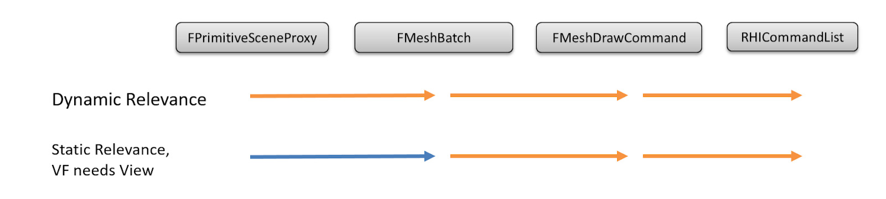
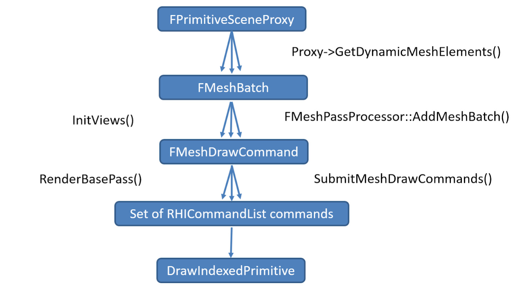
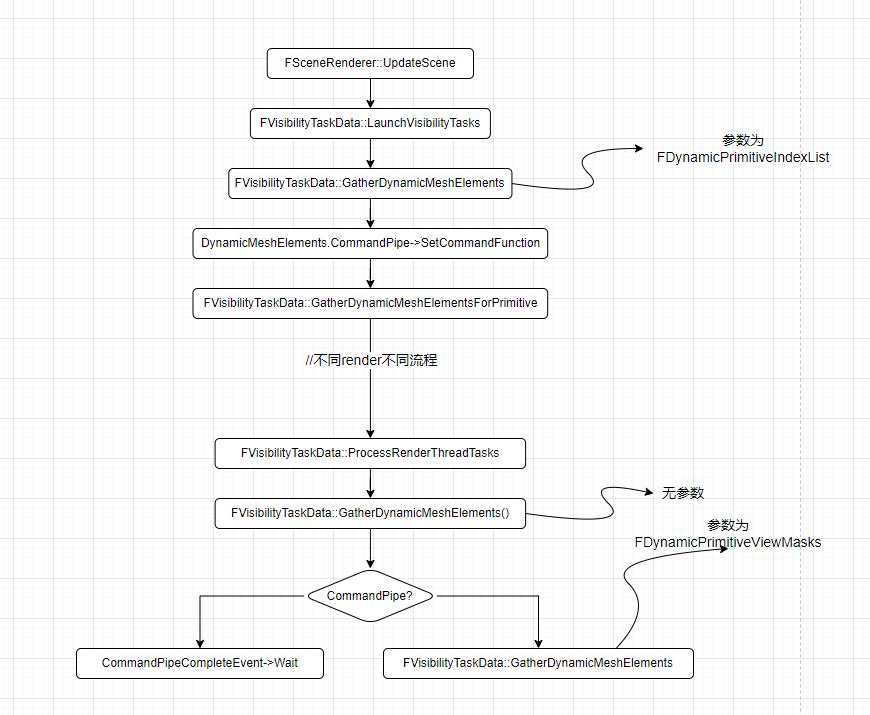

本部分内容主要包括:

- 整体绘制流程
- 场景绘制，drawcall的组织和调用
- meshrenderpipeline

### 整体流程概览

UE的网格体渲染分为两个部分，一个是dynamic的动态网格体，一个是静态网格体



橙色箭头表示每帧都必须执行的操作，而蓝色箭头表示执行一次就缓存的操作。

整体的绘制流程如下



上图中，FPrimitiveSceneProxy是渲染线程对象,它对应逻辑线程的UPrimitiveComponent

FPrimitiveSceneProxy通过GetDynamicMeshElements和DrawStaticElements将渲染数据FMeshBatch提交给渲染器。

FMeshBatch包含了绘制Pass所需的所有信息，解耦了网格Pass和FPrimitiveSceneProxy，FPrimitiveSceneProxy并不知道自己会被哪些Pass绘制。

FMeshBatch用于构建FMeshDrawCommand。FMeshDrawCommand用于更大程度更加可控地排序、缓存、合并绘制指令。它是一个完全无状态的绘制描述，存储了RI需要知道的，关于网格体绘制的所有信息：

- 要使用的着色器。
- 其资源绑定。
- 绘制调用参数。

这一抽象层级可以用于缓存和合并绘制调用。FMeshDrawCommand由FMeshPassProcessor根据FMeshBatch创建。

SubmitMeshDrawCommands用于将生成提交给RI的RHICommandList命令。


### 具体代码分析

#### 一些类和对象

| 类名                 | 描述                                                         |
| -------------------- | ------------------------------------------------------------ |
| UPrimitiveComponent  | 图元基类，是逻辑线程对象，继承它的对象看起来是各种具体的component，例如UModelComponent, 是CPU层裁剪的最小粒度单位 |
| FPrimitiveSceneProxy | 上面的图元基类的渲染线程对象，和上面的Component看起来是一一对应关系，如FModelSceneProxy |
| FPrimitiveSceneInfo  | 渲染器内部状态（描述了FRendererModule的实现），和FPrimitiveSceneProxy有一对一的映射关系 |
| FScene               | 场景对象，是UWorld的渲染线程对象，只有加入到FScene的物体才会被渲染器感知到。渲染线程拥有FScene的所有状态 |
| FSceneView           | 描述了FScene内的单个视图（view），同个FScene允许有多个view，换言之，一个场景可以被多个view绘制，或者多个view同时被绘制。表示从场景到2d屏幕空间的投影。 |
| FViewInfo            | 场景渲染器使用的SceneView,保存有额外信息                     |
| FSceneRenderer       | 场景渲染器的基类，派生出各种渲染器                           |
| FMeshBatchElement    | 单个网格模型的数据，包含网格渲染中所需的部分数据，如顶点、索引、UniformBuffer及各种标识等 |
| FMeshBatch           | 存着一组FMeshBatchElement的数据，这组FMeshBatchElement的数据拥有相同的材质和顶点缓冲。 |
| FMeshDrawCommand     | 完整地描述了一个Pass Draw Call的所有状态和数据，如shader绑定、顶点数据、索引数据、PSO缓存等。 |
| FMeshPassProcessor   | 网格渲染Pass处理器，负责将场景中感兴趣的网格对象执行处理，将其由FMeshBatch对象转成一个或多个FMeshDrawCommand。 |


### FPrimitiveSceneProxy到FMeshBatch

上面的流程图中，我们可以看到绘制的过程，其中第一步就是FPrimitiveSceneProxy产生FMeshBatch数据

每个PrimitiveSceneProxy，通过重载GetDynamicMeshElements()函数来进行meshbatch的创建和收集。

每帧中，场景Render会对当前场景执行可见性测试和剔除，在这个过程中，会对所有的FPrimitiveSceneProxy进行处理，并且使用一个FMeshElementCollector对Mesh数据进行收集。

这其中，不同的Render的做法有一点差异。但是总体来讲，嵌套都比较深。整体的流程如下



在Render函数开始时，延时管线和移动断线都会调用UpdateScene函数，该函数中，会遍历所有场景所有的图元，然后调用GetDynamicMeshElements创建FmeshBatch数据，简单的流程如下。

```c++
IVisibilityTaskData* FSceneRenderer::UpdateScene(FRDGBuilder& GraphBuilder, FGlobalDynamicBuffers GlobalDynamicBuffers)
{
	//其他逻辑，暂且跳过
	//....
	PrepareViewStateForVisibility(SceneTexturesConfig);
	//具体执行相关操作的函数
	return LaunchVisibilityTasks(GraphBuilder.RHICmdList, *this, GlobalDynamicBuffers);
}


void FVisibilityTaskData::LaunchVisibilityTasks()
{
	//跳过

	if (TaskConfig.Schedule == EVisibilityTaskSchedule::Parallel)
	{
		//view大于1
		//.....
		else if (Views.Num() == 1)
		{
			// When using a single view, dynamic mesh elements are pushed into a pipe that is executed on the render thread which allows for some overlap with compute relevance work.

			DynamicMeshElements.CommandPipe->SetCommandFunction([this](const FDynamicPrimitiveIndexList& DynamicPrimitiveIndexList)
				{
					GatherDynamicMeshElements(DynamicPrimitiveIndexList);
				});
			//....
		}
	}
	//其他逻辑
    //....
}

void FVisibilityTaskData::GatherDynamicMeshElements(const FDynamicPrimitiveIndexList& DynamicPrimitiveIndexList)
{
	constexpr uint8 ViewMask = 1;
	//遍历所有图元
	for (int32 PrimitiveIndex : DynamicPrimitiveIndexList.Primitives)
	{
		GatherDynamicMeshElementsForPrimitive(PrimitiveIndex, ViewMask);
	}

#if WITH_EDITOR
	for (int32 PrimitiveIndex : DynamicPrimitiveIndexList.EditorPrimitives)
	{
		GatherDynamicMeshElementsForEditorPrimitive(PrimitiveIndex, ViewMask);
	}
#endif
}
```

具体的GatherDynamicMeshElements的逻辑，则如下图所示。感觉没啥好说的，整体逻辑比较清晰，就是在上面的GatherDynamicMeshElements中遍历所有图元，然后收集MeshBatch

```c++
void FVisibilityTaskData::GatherDynamicMeshElementsForPrimitive(int32 PrimitiveIndex, uint8 ViewMask)
{
	TArray<int32, TInlineAllocator<4>> MeshBatchCountBefore;
	MeshBatchCountBefore.SetNumUninitialized(Views.Num());
    
	for (int32 ViewIndex = 0; ViewIndex < Views.Num(); ViewIndex++)
	{
		MeshBatchCountBefore[ViewIndex] = MeshCollector.GetMeshBatchCount(ViewIndex);
	}

	FPrimitiveSceneInfo* PrimitiveSceneInfo = Scene.Primitives[PrimitiveIndex];
	MeshCollector.SetPrimitive(PrimitiveSceneInfo->Proxy, PrimitiveSceneInfo->DefaultDynamicHitProxyId);
	//收集所有meshbach
	PrimitiveSceneInfo->Proxy->GetDynamicMeshElements(ViewFamily.Views, ViewFamily, ViewMask, MeshCollector);

	for (int32 ViewIndex = 0; ViewIndex < Views.Num(); ViewIndex++)
	{
		FViewInfo& View = Views[ViewIndex];
		if (ViewMask & (1 << ViewIndex))
		{
			FDynamicPrimitive& DynamicPrimitive = DynamicMeshElements.DynamicPrimitives.Emplace_GetRef();
			DynamicPrimitive.PrimitiveIndex = PrimitiveIndex;
			DynamicPrimitive.ViewIndex = ViewIndex;
			DynamicPrimitive.StartElementIndex = DynamicMeshElements.LastElementPerView[ViewIndex];
			DynamicPrimitive.EndElementIndex = View.DynamicMeshElements.Num();

			DynamicMeshElements.LastElementPerView[ViewIndex] = View.DynamicMeshElements.Num();
		}

		View.DynamicMeshElementRanges[PrimitiveIndex] = FInt32Vector2(MeshBatchCountBefore[ViewIndex], MeshCollector.GetMeshBatchCount(ViewIndex));
	}
};
```

在延时渲染管线中，会在begininitview里面等待相关task的完成，在移动管线中，则会调用InitViews进行处理

收集动态图元数据时，会使用FMeshElementCollector的对象，以便收集场景中所有可见的FPrimitiveSceneProxy的网格数据。Collector是由Render在初始化的时候创建的。

而收集过程中中间有一句关键的代码`PrimitiveSceneInfo->Proxy->GetDynamicMeshElements()`就是给每个图元对象向渲染器（收集器）添加可见图元元素的机会，前面也提到了这个是各个Proxy对象自行重载的，我们以ModelSceneProxy为例，抛开各种判断逻辑，我们可以看到，最终还是要通创建MeshBatch对象，将其添加到collector中进行保存

```c++
	virtual void GetDynamicMeshElements(const TArray<const FSceneView*>& Views, const FSceneViewFamily& ViewFamily, uint32 VisibilityMap, FMeshElementCollector& Collector) const override
	{
		//各种判断条件.....
		for (int32 ElementIndex = 0; ElementIndex < Elements.Num(); ElementIndex++)
		{
			const FModelElement& ModelElement = Component->GetElements()[ElementIndex];
			if (ModelElement.NumTriangles > 0)
			{
               //创建meshbatch并赋各种数据
				FMeshBatch& MeshElement = Collector.AllocateMesh();
				FMeshBatchElement& BatchElement = MeshElement.Elements[0];
				BatchElement.IndexBuffer = ModelElement.IndexBuffer;
				MeshElement.VertexFactory = &VertexFactory;
				MeshElement.MaterialRenderProxy = (MatProxyOverride != nullptr) ? MatProxyOverride : Elements[ElementIndex].GetMaterial()->GetRenderProxy();
				MeshElement.LCI = &Elements[ElementIndex];
				BatchElement.FirstIndex = ModelElement.FirstIndex;
				BatchElement.NumPrimitives = ModelElement.NumTriangles;
				BatchElement.MinVertexIndex = ModelElement.MinVertexIndex;
				BatchElement.MaxVertexIndex = ModelElement.MaxVertexIndex;
				BatchElement.VertexFactoryUserData = Elements[ElementIndex].GetVertexFactoryUniformBuffer();
				MeshElement.Type = PT_TriangleList;
				MeshElement.DepthPriorityGroup = DepthPriorityGroup;
				MeshElement.bCanApplyViewModeOverrides = true;
				MeshElement.bUseWireframeSelectionColoring = false;
				MeshElement.LODIndex = 0;
				Collector.AddMesh(ViewIndex, MeshElement);
            }
        }
        //其他逻辑....
    }
```

FMeshBatch中保存了渲染中会用到的各种数据。例如保存了FMeshBatchElement的List，VertexFactory，MaterialRenderProxy等等。具体代码如下

```c++
struct FMeshBatch
{
	TArray<FMeshBatchElement,TInlineAllocator<1> > Elements;     //上文中提到的FMeshBatch数据，至少有一个
	const FVertexFactory* VertexFactory;    //顶点工厂数据
	const FMaterialRenderProxy* MaterialRenderProxy;     //材质数据

	// can be NULL
	const FLightCacheInterface* LCI;

	FHitProxyId BatchHitProxyId; //hitproxy ID，估计是用来做pickpass的

	/** This is the threshold that will be used to know if we should use this mesh batch or use one with no tessellation enabled */
	float TessellationDisablingShadowMapMeshSize; //一个阈值数据，看起来是用于曲面细分的

	uint16 MeshIdInPrimitive;  // 图元所在的网格id, 用于相同图元的稳定排序.

	int8 LODIndex; //网格LOD索引, 用于LOD的平滑过渡
	uint8 SegmentIndex; 
	
    //裁剪相关的索引
	uint32 ReverseCulling : 1;
	uint32 bDisableBackfaceCulling : 1;

    //pass相关的数据，用于快速区分某些渲染配置
	uint32 CastShadow		: 1;	// Whether it can be used in shadow renderpasses.
	uint32 bUseForMaterial	: 1;	// Whether it can be used in renderpasses requiring material outputs.
	uint32 bUseForDepthPass : 1;	// Whether it can be used in depth pass.
	uint32 bUseAsOccluder	: 1;	// 是否是遮挡体
	uint32 bWireframe		: 1;	//线框模式
    
    //各种其他功能的一些标记，比如lod,虚拟贴图，等等。本文中暂时用不到，先跳过
	uint32 bCanApplyViewModeOverrides : 1;
	//.....
    
    //功能接口，例如判断半透明什么的
    ENGINE_API bool IsTranslucent(ERHIFeatureLevel::Type InFeatureLevel) const;
	ENGINE_API bool IsDecal(ERHIFeatureLevel::Type InFeatureLevel) const;
    //......
};
```

FMeshBatchElement中间保存的则是绘制过程中的uniformBuffer,indexBuffer等数据。（unreal里面，很多buffer都会被称为uniformbuffer，但是实际上具体使用的Buffer并不一定是常见意义上的UniformBuffer，可能是instancevb，可能是rwbuffer等等）

```c++
struct FMeshBatchElement
{
	//网格的uniformBuffer 如果使用GPU Scene, 则需要为null.
	FRHIUniformBuffer* PrimitiveUniformBuffer;

	//(TUniformBuffer* is known but not the FRHIUniformBuffer)
    //UniformBuffer的数据
	const TUniformBuffer<FPrimitiveUniformShaderParameters>* PrimitiveUniformBufferResource;

	//松散的UniformBuffer的数据，在MeshBatch中唯一的数据
	FUniformBufferRHIRef LooseParametersUniformBuffer;

	//indexbuffer
	const FIndexBuffer* IndexBuffer;
	
    //其他一些各种数据，包括实例化数据，用户数据等
    //......

};
```

就是更加细致的一些绘制用数据

前文中，我们提到了收集MeshBatch，而MeshBatch中间包含有各种pass的信息，这些pass的信息则是通过另外一个函数SetupMeshPasses来进行处理的。这个函数中有一个函数`ComputeDynamicMeshRelevance`，它的作用是计算当前的MeshBatch会被哪些MeshPass引用，从而加到view的对应MeshPass的计数中。这部分内容我们后面会再次提到

#### 总结

总体来说，FMeshBatch记录了一组拥有相同材质和顶点工厂的FMeshBatchElement数据，还存储了渲染Pass特定的标记和其它所需的数据，在网格渲染后续流程中使用和二次加工。FMeshBatch数据则是由PrimitiveSceneProxy收集的。

FMeshElementCollector和FSceneRenderer是一一对应关系，每个FSceneRenderer拥有一个收集器。收集器收集完对应view的可见图元列表后，通常拥有一组需要渲染的FMeshBatch列表，以及它们的管理数据和状态，为后续的流程收集和准备足够的准备。

在每帧绘制的过程中，FSceneRenderer会对Mesh数据进行收集。这主要是各个Proxy对象通过重载GetDynamicMeshElements来实现的。收集完所有MeshBatch数据之后，还会对其调用SetupMeshPasses函数，这个函数的作用是计算MeshBatch中间的各种pass信息。


### FMeshBatch 到FMeshDrawCommand

前面我们提到了收集FMeshElemnt，创建FMeshBatch的过程，在这个过程结束之后，会立马调用SetupMeshPasses函数，这个函数的名字显而易见，在执行过程中，会执行到SetupMeshPass函数，它会遍历EMeshPass定义的所有Pass，创建FMeshPassProcessor，获取指定Pass的FParallelMeshDrawCommandPass对象，并发创建所有的pass指令。代码如下

```c++
void FVisibilityTaskData::SetupMeshPasses(FExclusiveDepthStencil::Type BasePassDepthStencilAccess, FInstanceCullingManager& InstanceCullingManager)
{
	{
//.....跳过一些逻辑
		for (FDynamicPrimitive DynamicPrimitive : DynamicMeshElements.DynamicPrimitives)
		{
//.....跳过一些逻辑
			for (int32 ElementIndex = DynamicPrimitive.StartElementIndex; ElementIndex < DynamicPrimitive.EndElementIndex; ++ElementIndex)
			{
				const FMeshBatchAndRelevance& MeshBatch = View.DynamicMeshElements[ElementIndex];
				FMeshPassMask& PassRelevance = View.DynamicMeshElementsPassRelevance[ElementIndex];
				//对收集到的MeshBatch计算Pass信息
				ComputeDynamicMeshRelevance(ShadingPath, bAddLightmapDensityCommands, ViewRelevance, MeshBatch, View, PassRelevance, PrimitiveSceneInfo, Bounds);
			}
		}
	}

	for (int32 ViewIndex = 0; ViewIndex < Views.Num(); ViewIndex++)
	{
		FViewInfo& View = Views[ViewIndex];
		View.MeshDecalBatches.Sort();

//.....跳过一些逻辑
        //创建所有的pass指令
		SceneRenderer.SetupMeshPass(View, BasePassDepthStencilAccess, ViewCommands, InstanceCullingManager);
	}
}
```

上文中我们提到过ComputeDynamicMeshRelevance，会计算当前的MeshBatch会被哪些MeshPass引用，从而加到view的对应MeshPass的计数中，这部分的代码如下

```C++
static void ComputeDynamicMeshRelevance(
	EShadingPath ShadingPath,
	bool bAddLightmapDensityCommands,
	const FPrimitiveViewRelevance& ViewRelevance,
	const FMeshBatchAndRelevance& MeshBatch,
	FViewInfo& View,
	FMeshPassMask& PassMask,
	FPrimitiveSceneInfo* PrimitiveSceneInfo,
	const FPrimitiveBounds& Bounds)
{
	const int32 NumElements = MeshBatch.Mesh->Elements.Num();

	if (ViewRelevance.bDrawRelevance && (ViewRelevance.bRenderInMainPass || ViewRelevance.bRenderCustomDepth || ViewRelevance.bRenderInDepthPass))
	{
		if (ViewRelevance.bRenderInSecondStageDepthPass && ShadingPath != EShadingPath::Mobile)
		{
			PassMask.Set(EMeshPass::SecondStageDepthPass);
			View.NumVisibleDynamicMeshElements[EMeshPass::SecondStageDepthPass] += NumElements;
		}
		else
		{
			PassMask.Set(EMeshPass::DepthPass);
			View.NumVisibleDynamicMeshElements[EMeshPass::DepthPass] += NumElements;
		}

//后续类似的逻辑以及替他逻辑这里不展示
//...
}
```

创建所有的pass的相关信息的函数，由SetUpMeshPass函数处理，具体代码如下,简单来说UE做的事情就是遍历需要绘制的Pass，在SetupMeshPass阶段对需要用到的Pass并行化地生成DrawCommand。

```c++
void FSceneRenderer::SetupMeshPass(FViewInfo& View, FExclusiveDepthStencil::Type BasePassDepthStencilAccess, FViewCommands& ViewCommands, FInstanceCullingManager& InstanceCullingManager)
{
	SCOPE_CYCLE_COUNTER(STAT_SetupMeshPass);

	const EShadingPath ShadingPath = Scene->GetShadingPath();
	// 遍历EMeshPass定义的所有Pass。
	for (int32 PassIndex = 0; PassIndex < EMeshPass::Num; PassIndex++)
	{
//.....跳过部分逻辑
			 // 创建FMeshPassProcessor
			FMeshPassProcessor* MeshPassProcessor = FPassProcessorManager::CreateMeshPassProcessor(ShadingPath, PassType, Scene->GetFeatureLevel(), Scene, &View, nullptr);
			 // 获取指定Pass的FParallelMeshDrawCommandPass对象。
			FParallelMeshDrawCommandPass& Pass = View.ParallelMeshDrawCommandPasses[PassIndex];
			
        	//设置各种pass的设置，这里不展开太多
			if (ShouldDumpMeshDrawCommandInstancingStats())
			{
				Pass.SetDumpInstancingStats(GetMeshPassName(PassType));
			}
        	//....
	
			 // 并行地处理可见Pass的处理任务，创建此Pass的所有绘制命令。
			Pass.DispatchPassSetup(
				Scene,
				View,
				FInstanceCullingContext(FeatureLevel, &InstanceCullingManager, ViewIds, View.PrevViewInfo.HZB, InstanceCullingMode, CullingFlags),
				PassType,
				BasePassDepthStencilAccess,
				MeshPassProcessor,
				View.DynamicMeshElements,
				&View.DynamicMeshElementsPassRelevance,
				View.NumVisibleDynamicMeshElements[PassType],
				ViewCommands.DynamicMeshCommandBuildRequests[PassType],
				ViewCommands.NumDynamicMeshCommandBuildRequestElements[PassType],
				ViewCommands.MeshCommands[PassIndex]);
		}
	}
}
```

pass类型由枚举EMeshPass决定，共有34个。相关代码定义在MeshPassProcessor.h

```c++
/** Mesh pass types supported. */
namespace EMeshPass
{
	enum Type : uint8
	{
		DepthPass,
		SecondStageDepthPass,
		BasePass,
		AnisotropyPass,
		SkyPass,
		SingleLayerWaterPass,
		SingleLayerWaterDepthPrepass,
		CSMShadowDepth,
		VSMShadowDepth,
		Distortion,
		Velocity,
		TranslucentVelocity,
		TranslucencyStandard,
		TranslucencyStandardModulate,
		TranslucencyAfterDOF,
		TranslucencyAfterDOFModulate,
		TranslucencyAfterMotionBlur,
		TranslucencyAll, /** Drawing all translucency, regardless of separate or standard.  Used when drawing translucency outside of the main renderer, eg FRendererModule::DrawTile. */
		LightmapDensity,
		DebugViewMode, /** Any of EDebugViewShaderMode */
		CustomDepth,
		MobileBasePassCSM,  /** Mobile base pass with CSM shading enabled */
		VirtualTexture,
		LumenCardCapture,
		LumenCardNanite,
		LumenTranslucencyRadianceCacheMark,
		LumenFrontLayerTranslucencyGBuffer,
		DitheredLODFadingOutMaskPass, /** A mini depth pass used to mark pixels with dithered LOD fading out. Currently only used by ray tracing shadows. */
		NaniteMeshPass,
		MeshDecal,

#if WITH_EDITOR
		HitProxy,
		HitProxyOpaqueOnly,
		EditorLevelInstance,
		EditorSelection,
#endif

		Num,
		NumBits = 6,
	};
}
```

上文中提到的并发创建pass的函数是DispatchPassSetUp函数，这里做一下介绍，它的作用主要是设置pass中的各种配置，TaskContext的数据，收集生成MeshCommand所需的数据，设置排序方式等。还有一个重要操作就是分配这些操作的并发运行资源，使用TaskGraph系统执行

```c++
void FParallelMeshDrawCommandPass::DispatchPassSetup(
	FScene* Scene,
	const FViewInfo& View,
	FInstanceCullingContext&& InstanceCullingContext,
	EMeshPass::Type PassType,
	FExclusiveDepthStencil::Type BasePassDepthStencilAccess,
	FMeshPassProcessor* MeshPassProcessor,
	const TArray<FMeshBatchAndRelevance, SceneRenderingAllocator>& DynamicMeshElements,
	const TArray<FMeshPassMask, SceneRenderingAllocator>* DynamicMeshElementsPassRelevance,
	int32 NumDynamicMeshElements,
	TArray<const FStaticMeshBatch*, SceneRenderingAllocator>& InOutDynamicMeshCommandBuildRequests,
	int32 NumDynamicMeshCommandBuildRequestElements,
	FMeshCommandOneFrameArray& InOutMeshDrawCommands,
	FMeshPassProcessor* MobileBasePassCSMMeshPassProcessor,
	FMeshCommandOneFrameArray* InOutMobileBasePassCSMMeshDrawCommands
)
{
	TRACE_CPUPROFILER_EVENT_SCOPE(ParallelMdcDispatchPassSetup);
	check(!TaskEventRef.IsValid() && MeshPassProcessor != nullptr && TaskContext.PrimitiveIdBufferData == nullptr);
	check((PassType == EMeshPass::Num) == (DynamicMeshElementsPassRelevance == nullptr));

	MaxNumDraws = InOutMeshDrawCommands.Num() + NumDynamicMeshElements + NumDynamicMeshCommandBuildRequestElements;
	
    //配置TaskContext的各种配置
	TaskContext.MeshPassProcessor = MeshPassProcessor;
	TaskContext.MobileBasePassCSMMeshPassProcessor = MobileBasePassCSMMeshPassProcessor;
	TaskContext.DynamicMeshElements = &DynamicMeshElements;
	TaskContext.DynamicMeshElementsPassRelevance = DynamicMeshElementsPassRelevance;
	//....
    
	// 基于view的透明度排序配置
	TaskContext.TranslucencyPass = ETranslucencyPass::TPT_MAX;
	TaskContext.TranslucentSortPolicy = View.TranslucentSortPolicy;
	TaskContext.TranslucentSortAxis = View.TranslucentSortAxis;
	TaskContext.ViewOrigin = View.ViewMatrices.GetViewOrigin();
	TaskContext.ViewMatrix = View.ViewMatrices.GetViewMatrix();
	TaskContext.PrimitiveBounds = &Scene->PrimitiveBounds;
	
    //....
    
	//交换绘制命令列表
	Swap(TaskContext.MeshDrawCommands, InOutMeshDrawCommands);
	Swap(TaskContext.DynamicMeshCommandBuildRequests, InOutDynamicMeshCommandBuildRequests);

	//....

	if (MaxNumDraws > 0)
	{
		// 根据最大绘制数据预分配资源
		TaskContext.PrimitiveIdBufferDataSize = TaskContext.InstanceFactor * MaxNumDraws * sizeof(int32);
		TaskContext.PrimitiveIdBufferData = FMemory::Malloc(TaskContext.PrimitiveIdBufferDataSize);
#if DO_GUARD_SLOW
		FMemory::Memzero(TaskContext.PrimitiveIdBufferData, TaskContext.PrimitiveIdBufferDataSize);
#endif // DO_GUARD_SLOW
		TaskContext.MeshDrawCommands.Reserve(MaxNumDraws);
		TaskContext.TempVisibleMeshDrawCommands.Reserve(MaxNumDraws);

		const bool bExecuteInParallel = FApp::ShouldUseThreadingForPerformance()
			&& CVarMeshDrawCommandsParallelPassSetup.GetValueOnRenderThread() > 0
			&& GIsThreadedRendering; // Rendering thread is required to safely use rendering resources in parallel.
		//对于并发的执行使用taskgraph
		if (bExecuteInParallel)
		{
			if (IsOnDemandShaderCreationEnabled())
			{
				TaskEventRef = TGraphTask<FMeshDrawCommandPassSetupTask>::CreateTask(nullptr, ENamedThreads::GetRenderThread()).ConstructAndDispatchWhenReady(TaskContext);
			}
			else
			{
				FGraphEventArray DependentGraphEvents;
				DependentGraphEvents.Add(TGraphTask<FMeshDrawCommandPassSetupTask>::CreateTask(nullptr, ENamedThreads::GetRenderThread()).ConstructAndDispatchWhenReady(TaskContext));
				TaskEventRef = TGraphTask<FMeshDrawCommandInitResourcesTask>::CreateTask(&DependentGraphEvents, ENamedThreads::GetRenderThread()).ConstructAndDispatchWhenReady(TaskContext);
			}
		}
		else
		{
			QUICK_SCOPE_CYCLE_COUNTER(STAT_MeshPassSetupImmediate);
			FMeshDrawCommandPassSetupTask Task(TaskContext);
			Task.AnyThreadTask();
			if (!IsOnDemandShaderCreationEnabled())
			{
				FMeshDrawCommandInitResourcesTask DependentTask(TaskContext);
				DependentTask.AnyThreadTask();
			}
		}

        //确保需要在动态图元绘制的命令执行完之后执行的命令，看起来是剔除的命令
		auto FinalizeInstanceCullingSetup = [this, Scene](FInstanceCullingContext& InstanceCullingContext)
		{
			WaitForMeshPassSetupTask();

#if DO_CHECK
			for (const FVisibleMeshDrawCommand& VisibleMeshDrawCommand : TaskContext.MeshDrawCommands)
			{
				if (VisibleMeshDrawCommand.PrimitiveIdInfo.bIsDynamicPrimitive)
				{
					uint32 PrimitiveIndex = VisibleMeshDrawCommand.PrimitiveIdInfo.DrawPrimitiveId & ~GPrimIDDynamicFlag;
					TaskContext.View->DynamicPrimitiveCollector.CheckPrimitiveProcessed(PrimitiveIndex, Scene->GPUScene);
				}
			}
#endif
			InstanceCullingContext.SetDynamicPrimitiveInstanceOffsets(TaskContext.View->DynamicPrimitiveCollector.GetInstanceSceneDataOffset(), TaskContext.View->DynamicPrimitiveCollector.NumInstances());
		};
		TaskContext.InstanceCullingContext.BeginAsyncSetup(FinalizeInstanceCullingSetup);
	}
}

```

熟悉taskgraph的人对这当中的FMeshPassProcessor，FMeshDrawCommandPassSetupTaskContext,FMeshDrawCommandPassSetupTask`,`FMeshDrawCommandInitResourcesTask应该比较熟悉，这里不展开说明taskgrpah，但是这个FMeshDrawCommandPassSetupTask可以聊一聊

这个task的作用是并行设置网格绘制指令的任务. 包含动态网格绘制命令的生成, 排序, 合并等。它担当了在网格渲染管线中担当了相当重要的角色， 其中排序阶段的键值由FMeshDrawCommandSortKey决定。它的源码如下，核心函数就是这个AnyThreadTask

```c++
class FMeshDrawCommandPassSetupTask
{
    void AnyThreadTask()
	{
		FOptionalTaskTagScope Scope(ETaskTag::EParallelRenderingThread);
		SCOPED_NAMED_EVENT(MeshDrawCommandPassSetupTask, FColor::Magenta);
		// Mobile base pass is a special case, as final lists is created from two mesh passes based on CSM visibility.
		const bool bMobileShadingBasePass = Context.ShadingPath == EShadingPath::Mobile && Context.PassType == EMeshPass::BasePass;
		// On SM5 Mobile platform, still want the same sorting
		const bool bMobileVulkanSM5BasePass = IsVulkanMobileSM5Platform(Context.ShaderPlatform) && Context.PassType == EMeshPass::BasePass;
		//移动pass的绘制命令生成
		if (bMobileShadingBasePass)
		{
			MergeMobileBasePassMeshDrawCommands(
				Context.View->MobileCSMVisibilityInfo,
				Context.PrimitiveBounds->Num(),
				Context.MeshDrawCommands,
				Context.MobileBasePassCSMMeshDrawCommands
			);
			
			GenerateMobileBasePassDynamicMeshDrawCommands(
				*Context.View,
				Context.ShadingPath,
				Context.PassType,
				Context.MeshPassProcessor,
				Context.MobileBasePassCSMMeshPassProcessor,
				*Context.DynamicMeshElements,
				Context.DynamicMeshElementsPassRelevance,
				Context.NumDynamicMeshElements,
				Context.DynamicMeshCommandBuildRequests,
				Context.NumDynamicMeshCommandBuildRequestElements,
				Context.MeshDrawCommands,
				Context.MeshDrawCommandStorage,
				Context.MinimalPipelineStatePassSet,
				Context.NeedsShaderInitialisation
			);
		}
        //动态网格的绘制命令生成
		else
		{
			GenerateDynamicMeshDrawCommands(
				*Context.View,
				Context.ShadingPath,
				Context.PassType,
				Context.MeshPassProcessor,
				*Context.DynamicMeshElements,
				Context.DynamicMeshElementsPassRelevance,
				Context.NumDynamicMeshElements,
				Context.DynamicMeshCommandBuildRequests,
				Context.NumDynamicMeshCommandBuildRequestElements,
				Context.MeshDrawCommands,
				Context.MeshDrawCommandStorage,
				Context.MinimalPipelineStatePassSet,
				Context.NeedsShaderInitialisation
			);
		}

		if (Context.MeshDrawCommands.Num() > 0)
		{
            //// 应用view中已经存在的MeshDrawCommand
			if (Context.PassType != EMeshPass::Num)
			{
				ApplyViewOverridesToMeshDrawCommands(
					Context.ShadingPath,
					Context.PassType,
					Context.bReverseCulling,
					Context.bRenderSceneTwoSided,
					Context.BasePassDepthStencilAccess,
					Context.DefaultBasePassDepthStencilAccess,
					Context.MeshDrawCommands,
					Context.MeshDrawCommandStorage,
					Context.MinimalPipelineStatePassSet,
					Context.NeedsShaderInitialisation,
					Context.TempVisibleMeshDrawCommands
				);
			}

			// 更新排序键.
			if (bMobileShadingBasePass || bMobileVulkanSM5BasePass)
			{
				UpdateMobileBasePassMeshSortKeys(
					Context.ViewOrigin,
					*Context.PrimitiveBounds,
					Context.MeshDrawCommands
					);
			}
			else if (Context.TranslucencyPass != ETranslucencyPass::TPT_MAX)
			{
				// When per-pixel OIT is enabled, sort primitive from front to back ensure avoid 
				// constantly resorting front-to-back samples list.
				const bool bInverseSorting = OIT::IsEnabled(EOITSortingType::SortedPixels, Context.ShaderPlatform) && Context.View->AntiAliasingMethod != EAntiAliasingMethod::AAM_MSAA;

				UpdateTranslucentMeshSortKeys(
					Context.TranslucentSortPolicy,
					Context.TranslucentSortAxis,
					Context.ViewOrigin,
					Context.ViewMatrix,
					*Context.PrimitiveBounds,
					Context.TranslucencyPass,
					bInverseSorting,
					Context.MeshDrawCommands
				);
			}
			//MeshDrawCommand排序
			{
				QUICK_SCOPE_CYCLE_COUNTER(STAT_SortVisibleMeshDrawCommands);
				Context.MeshDrawCommands.Sort(FCompareFMeshDrawCommands());
			}
			
			if (Context.bUseGPUScene)
			{
				TArrayView<const FStateBucketAuxData> StateBucketsAuxData;
				if (Context.PassType != EMeshPass::Num)
				{
					StateBucketsAuxData = Context.Scene->CachedStateBucketsAuxData[Context.PassType];
				}
				 // 生成GPU场景的相关数据(主要是渲染场景中所有的Primitive数据).
				Context.InstanceCullingContext.SetupDrawCommands(
					StateBucketsAuxData,
					Context.MeshDrawCommands, 
					true, 
					Context.MaxInstances, 
					Context.VisibleMeshDrawCommandsNum, 
					Context.NewPassVisibleMeshDrawCommandsNum);
			}
		}
	}


}
```

上面提到的Context，则是FMeshDrawCommandPassSetupTaskContext，这是一个包含有各种数据的上下文对象

主要包括的数据有view相关的数据.pass processor数据，需在渲染线程预分配的资源，透明物体排序所需数据，这里就不意义列举出来了

FMeshDrawCommandSortKey虽然可存储BasePass、透明Pass、普通Pass3种键值，但同时只有一种数据生效。

```c++
class FMeshDrawCommandSortKey
{
public:
	union 
	{
		uint64 PackedData;

		struct
		{
			uint64 VertexShaderHash		: 16; // Order by vertex shader's hash.
			uint64 PixelShaderHash		: 32; // Order by pixel shader's hash.
			uint64 Masked				: 16; // First order by masked.
		} BasePass;

		struct
		{
			uint64 MeshIdInPrimitive	: 16; // Order meshes belonging to the same primitive by a stable id.
			uint64 Distance				: 32; // Order by distance.
			uint64 Priority				: 16; // First order by priority.
		} Translucent;

		struct 
		{
			uint64 VertexShaderHash : 32;	// Order by vertex shader's hash.
			uint64 PixelShaderHash : 32;	// First order by pixel shader's hash.
		} Generic;
	};
    //functions
    //....
}
```


关于具体的网格数据生成，我们可以看函数GenerateDynamicMeshDrawCommands，具体代码如下

```c++
void GenerateDynamicMeshDrawCommands(
	const FViewInfo& View,
	EShadingPath ShadingPath,
	EMeshPass::Type PassType,
	FMeshPassProcessor* PassMeshProcessor,
	const TArray<FMeshBatchAndRelevance, SceneRenderingAllocator>& DynamicMeshElements,
	const TArray<FMeshPassMask, SceneRenderingAllocator>* DynamicMeshElementsPassRelevance,
	int32 MaxNumDynamicMeshElements,
	const TArray<const FStaticMeshBatch*, SceneRenderingAllocator>& DynamicMeshCommandBuildRequests,
	int32 MaxNumBuildRequestElements,
	FMeshCommandOneFrameArray& VisibleCommands,
	FDynamicMeshDrawCommandStorage& MeshDrawCommandStorage,
	FGraphicsMinimalPipelineStateSet& MinimalPipelineStatePassSet,
	bool& NeedsShaderInitialisation
)
{
	QUICK_SCOPE_CYCLE_COUNTER(STAT_GenerateDynamicMeshDrawCommands);
	check(PassMeshProcessor);
	check((PassType == EMeshPass::Num) == (DynamicMeshElementsPassRelevance == nullptr));
    
 	// 构建FDynamicPassMeshDrawListContext实例, 用于传递PassMeshProcessor生成的绘制命令.
	FDynamicPassMeshDrawListContext DynamicPassMeshDrawListContext(
		MeshDrawCommandStorage,
		VisibleCommands,
		MinimalPipelineStatePassSet,
		NeedsShaderInitialisation
	);
	PassMeshProcessor->SetDrawListContext(&DynamicPassMeshDrawListContext);
	
     // 处理动态网格批次.
	{
		const int32 NumCommandsBefore = VisibleCommands.Num();
		const int32 NumDynamicMeshBatches = DynamicMeshElements.Num();
		
		for (int32 MeshIndex = 0; MeshIndex < NumDynamicMeshBatches; MeshIndex++)
		{
			if (!DynamicMeshElementsPassRelevance || (*DynamicMeshElementsPassRelevance)[MeshIndex].Get(PassType))
			{
				const FMeshBatchAndRelevance& MeshAndRelevance = DynamicMeshElements[MeshIndex];
				const uint64 BatchElementMask = ~0ull;
				//将MeshBatch转换为DrawCommand的核心函数
				PassMeshProcessor->AddMeshBatch(*MeshAndRelevance.Mesh, BatchElementMask, MeshAndRelevance.PrimitiveSceneProxy);
			}
		}
	//...
	}
	//处理静态网格批次
	{
		const int32 NumCommandsBefore = VisibleCommands.Num();
		const int32 NumStaticMeshBatches = DynamicMeshCommandBuildRequests.Num();

		for (int32 MeshIndex = 0; MeshIndex < NumStaticMeshBatches; MeshIndex++)
		{
			const FStaticMeshBatch* StaticMeshBatch = DynamicMeshCommandBuildRequests[MeshIndex];
			const uint64 DefaultBatchElementMask = ~0ul;

			if (StaticMeshBatch->bViewDependentArguments)
			{
				FMeshBatch ViewDepenedentMeshBatch(*StaticMeshBatch);
				StaticMeshBatch->PrimitiveSceneInfo->Proxy->ApplyViewDependentMeshArguments(View, ViewDepenedentMeshBatch);
                //将MeshBatch转换为DrawCommand的核心函数
				PassMeshProcessor->AddMeshBatch(ViewDepenedentMeshBatch, DefaultBatchElementMask, StaticMeshBatch->PrimitiveSceneInfo->Proxy, StaticMeshBatch->Id);
			}
			else
			{
                //将MeshBatch转换为DrawCommand的核心函数
				PassMeshProcessor->AddMeshBatch(*StaticMeshBatch, DefaultBatchElementMask, StaticMeshBatch->PrimitiveSceneInfo->Proxy, StaticMeshBatch->Id);
			}
		}

//....
}

```

> 上面计算键值时数次用到了`CityHash64`，`CityHash64`是一种计算任意数量字符串哈希值的算法，是一个快速的非加密哈希函数，也是一种快速的非加密的散列函数。它的实现代码在Engine\Source\Runtime\Core\Private\Hash\CityHash.cpp中，有兴趣的童鞋自行研读了。
>
> 与之相似的哈希算法有：HalfMD5，MD5，SipHash64，SipHash128，IntHash32，IntHash64，SHA1，SHA224，SHA256等等。


前文中我们说过，FMeshPassProcessor充当了将FMeshBatch转换成FMeshDrawCommands的角色。直接调用则是通过一个重载的AddMeshBatch函数

由子类实现，每个子类通常对应着MeshPass枚举的一个通道，比如

- FDepthPassMeshProcessor-深度pass
- FBasePassMeshProcessor-basepass
- FHitPRoxyMeshProcesssor-

我们以BasePassProcessor为例，看看AddMeshBatch函数

```c++
void FBasePassMeshProcessor::AddMeshBatch(const FMeshBatch& RESTRICT MeshBatch, uint64 BatchElementMask, const FPrimitiveSceneProxy* RESTRICT PrimitiveSceneProxy, int32 StaticMeshId)
{
	if (MeshBatch.bUseForMaterial)
	{
		// 确认材质
		const FMaterialRenderProxy* MaterialRenderProxy = MeshBatch.MaterialRenderProxy;
		while (MaterialRenderProxy)
		{
			const FMaterial* Material = MaterialRenderProxy->GetMaterialNoFallback(FeatureLevel);
			if (Material && Material->GetRenderingThreadShaderMap())
			{
				if (TryAddMeshBatch(MeshBatch, BatchElementMask, PrimitiveSceneProxy, StaticMeshId, *MaterialRenderProxy, *Material))
				{
					break;
				}
			}

			MaterialRenderProxy = MaterialRenderProxy->GetFallback(FeatureLevel);
		}
	}
}


bool FBasePassMeshProcessor::TryAddMeshBatch(const FMeshBatch& RESTRICT MeshBatch, uint64 BatchElementMask, const FPrimitiveSceneProxy* RESTRICT PrimitiveSceneProxy, int32 StaticMeshId, const FMaterialRenderProxy& MaterialRenderProxy, const FMaterial& Material)
{
	// 确定混合模式和材质设置
	const EBlendMode BlendMode = Material.GetBlendMode();
	//跳过一些材质设置
    
	//是否需要绘制
	bool bShouldDraw = false;
	if (AutoBeforeDOFTranslucencyBoundary > 0.0f && PrimitiveSceneProxy && bIsTranslucent && !Material.IsDeferredDecal())
	{
		//跳过一些判断条件的设置
		if (TranslucencyPassType == ETranslucencyPass::TPT_TranslucencyStandard)
		{
			if (bIsStandardTranslucency)
			{
				bShouldDraw = true;
			}
			else if (bIsInDOFBackground)
			{
				bShouldDraw = bIsAfterDOF || bIsAfterDOFModulate;
			}
		}
		else if (TranslucencyPassType == ETranslucencyPass::TPT_TranslucencyAfterDOF)
		{
			bShouldDraw = bIsAfterDOF && !bIsInDOFBackground;
		}
		else if (TranslucencyPassType == ETranslucencyPass::TPT_TranslucencyAfterDOFModulate)
		{
			bShouldDraw = bIsAfterDOFModulate && !bIsInDOFBackground;
		}
		else
		{
			unimplemented();
		}
	}
	else
	{
		bShouldDraw = ShouldDraw(Material);
	}

	// Only draw opaque materials.
	bool bResult = true;
	if (bShouldDraw
		&& (!PrimitiveSceneProxy || PrimitiveSceneProxy->ShouldRenderInMainPass())
		&& ShouldIncludeDomainInMeshPass(Material.GetMaterialDomain())
		&& ShouldIncludeMaterialInDefaultOpaquePass(Material))
	{
		//跳过一些判断条件设置
		// Render volumetric translucent self-shadowing only for >= SM4 and fallback to non-shadowed for lesser shader models
		if (bIsLitMaterial
			&& bIsTranslucent
			&& PrimitiveSceneProxy
			&& PrimitiveSceneProxy->CastsVolumetricTranslucentShadow())
		{
			//跳过一些判断条件设置

			if (bIsLitMaterial
				&& bAllowStaticLighting
				&& bUseVolumetricLightmap
				&& PrimitiveSceneProxy)
			{
                //处理meshbatch
				bResult = Process< FSelfShadowedVolumetricLightmapPolicy >(
					MeshBatch,
					BatchElementMask,
					StaticMeshId,
					PrimitiveSceneProxy,
					MaterialRenderProxy,
					Material,
					bIsMasked,
					bIsTranslucent,
					ShadingModels,
					FSelfShadowedVolumetricLightmapPolicy(),
					ElementData,
					MeshFillMode,
					MeshCullMode);
			}
			else if (IsIndirectLightingCacheAllowed(FeatureLevel)
				&& bAllowIndirectLightingCache
				&& PrimitiveSceneProxy)
			{
				//处理meshbatch
				bResult = Process< FSelfShadowedCachedPointIndirectLightingPolicy >(
					MeshBatch,
					BatchElementMask,
					StaticMeshId,
					PrimitiveSceneProxy,
					MaterialRenderProxy,
					Material,
					bIsMasked,
					bIsTranslucent,
					ShadingModels,
					FSelfShadowedCachedPointIndirectLightingPolicy(),
					ElementData,
					MeshFillMode,
					MeshCullMode);
			}
			else
			{
                //处理meshbatch
				bResult = Process< FSelfShadowedTranslucencyPolicy >(
					MeshBatch,
					BatchElementMask,
					StaticMeshId,
					PrimitiveSceneProxy,
					MaterialRenderProxy,
					Material,
					bIsMasked,
					bIsTranslucent,
					ShadingModels,
					FSelfShadowedTranslucencyPolicy(),
					ElementData.SelfShadowTranslucencyUniformBuffer,
					MeshFillMode,
					MeshCullMode);
			}
		}
		else
		{
			ELightMapPolicyType UniformLightMapPolicyType = GetUniformLightMapPolicyType(FeatureLevel, Scene, MeshBatch, PrimitiveSceneProxy, Material);
            //处理meshbatch
			bResult = Process< FUniformLightMapPolicy >(
				MeshBatch,
				BatchElementMask,
				StaticMeshId,
				PrimitiveSceneProxy,
				MaterialRenderProxy,
				Material,
				bIsMasked,
				bIsTranslucent,
				ShadingModels,
				FUniformLightMapPolicy(UniformLightMapPolicyType),
				MeshBatch.LCI,
				MeshFillMode,
				MeshCullMode);
		}
	}

	return bResult;
}
```

在上文的Process函数中，我们会做的事情主要包括获取并设置对应的shader，设置pass中各种属性，具体设置什么属性会根据具体的passprocessor实现。最终通过BuildMeshDrawCommands函数来创建命令。BuildMeshDrawCommands的代码如下

```c++
template<typename PassShadersType, typename ShaderElementDataType>
void FMeshPassProcessor::BuildMeshDrawCommands(
	const FMeshBatch& RESTRICT MeshBatch,
	uint64 BatchElementMask,
	const FPrimitiveSceneProxy* RESTRICT PrimitiveSceneProxy,
	const FMaterialRenderProxy& RESTRICT MaterialRenderProxy,
	const FMaterial& RESTRICT MaterialResource,
	const FMeshPassProcessorRenderState& RESTRICT DrawRenderState,
	PassShadersType PassShaders,
	ERasterizerFillMode MeshFillMode,
	ERasterizerCullMode MeshCullMode,
	FMeshDrawCommandSortKey SortKey,
	EMeshPassFeatures MeshPassFeatures,
	const ShaderElementDataType& ShaderElementData)
{
	const FVertexFactory* RESTRICT VertexFactory = MeshBatch.VertexFactory;
	const FPrimitiveSceneInfo* RESTRICT PrimitiveSceneInfo = PrimitiveSceneProxy ? PrimitiveSceneProxy->GetPrimitiveSceneInfo() : nullptr;
	//最终转化出来的DrawCommand，看上去是共享的
	FMeshDrawCommand SharedMeshDrawCommand;
    
    //....
    
	//pipelinestate object

	FGraphicsMinimalPipelineStateInitializer PipelineState;
	PipelineState.PrimitiveType = (EPrimitiveType)MeshBatch.Type;
	PipelineState.ImmutableSamplerState = MaterialRenderProxy.ImmutableSamplerState;
 
	
    //shader设置
	int32 DataOffset = 0;
	if (PassShaders.VertexShader.IsValid())
	{
		FMeshDrawSingleShaderBindings ShaderBindings = SharedMeshDrawCommand.ShaderBindings.GetSingleShaderBindings(SF_Vertex, DataOffset);
		PassShaders.VertexShader->GetShaderBindings(Scene, FeatureLevel, PrimitiveSceneProxy, MaterialRenderProxy, MaterialResource, DrawRenderState, ShaderElementData, ShaderBindings);
	}

	//......
    
	//处理Meshbatch里面的数据，主要是遍历element并将其添加到DrawListContext中，以及shader配置
	for (int32 BatchElementIndex = 0; BatchElementIndex < NumElements; BatchElementIndex++)
	{
		if ((1ull << BatchElementIndex) & BatchElementMask)
		{	
            //element独享的drawcmooand
			const FMeshBatchElement& BatchElement = MeshBatch.Elements[BatchElementIndex];
			FMeshDrawCommand& MeshDrawCommand = DrawListContext->AddCommand(SharedMeshDrawCommand, NumElements);
			
			//..... 
    
			DataOffset = 0;
			if (PassShaders.VertexShader.IsValid())
			{
				FMeshDrawSingleShaderBindings VertexShaderBindings = MeshDrawCommand.ShaderBindings.GetSingleShaderBindings(SF_Vertex, DataOffset);
				FMeshMaterialShader::GetElementShaderBindings(PassShaders.VertexShader, Scene, ViewIfDynamicMeshCommand, VertexFactory, InputStreamType, FeatureLevel, PrimitiveSceneProxy, MeshBatch, BatchElement, ShaderElementData, VertexShaderBindings, MeshDrawCommand.VertexStreams);
			}

			//....... 
            
			FMeshDrawCommandPrimitiveIdInfo IdInfo = GetDrawCommandPrimitiveId(PrimitiveSceneInfo, BatchElement);

			FMeshProcessorShaders ShadersForDebugging = PassShaders.GetUntypedShaders();
            
     		//将数据添加到上下文，后续绘制会用到
			DrawListContext->FinalizeCommand(MeshBatch, BatchElementIndex, IdInfo, MeshFillMode, MeshCullMode, SortKey, Flags, PipelineState, &ShadersForDebugging, MeshDrawCommand);
		}
	}
}
```

BuildMeshDrawCommands在最后阶段会调用FMeshPassDrawListContext::FinalizeCommand。FMeshPassDrawListContext需要由具体的子类实现，包括缓存网格的绘制指令上下文，动态绘制指令上下文，naite绘制指令上下文。分别代表了动态网格绘制指令和缓存网格绘制指令的上下文。我们以动态的为例

```c++
class FDynamicPassMeshDrawListContext : public FMeshPassDrawListContext
{
public:
	//......

	virtual FMeshDrawCommand& AddCommand(FMeshDrawCommand& Initializer, uint32 NumElements) override final
	{
		const int32 Index = DrawListStorage.MeshDrawCommands.AddElement(Initializer);
		FMeshDrawCommand& NewCommand = DrawListStorage.MeshDrawCommands[Index];
		return NewCommand;
	}
    
    virtual void FinalizeCommand(
		const FMeshBatch& MeshBatch, 
		int32 BatchElementIndex,
		const FMeshDrawCommandPrimitiveIdInfo &IdInfo,
		ERasterizerFillMode MeshFillMode,
		ERasterizerCullMode MeshCullMode,
		FMeshDrawCommandSortKey SortKey,
		EFVisibleMeshDrawCommandFlags Flags,
		const FGraphicsMinimalPipelineStateInitializer& PipelineState,
		const FMeshProcessorShaders* ShadersForDebugging,
		FMeshDrawCommand& MeshDrawCommand) override final
	{
		FGraphicsMinimalPipelineStateId PipelineId = FGraphicsMinimalPipelineStateId::GetPipelineStateId(PipelineState, GraphicsMinimalPipelineStateSet, NeedsShaderInitialisation);

		MeshDrawCommand.SetDrawParametersAndFinalize(MeshBatch, BatchElementIndex, PipelineId, ShadersForDebugging);

		FVisibleMeshDrawCommand NewVisibleMeshDrawCommand;
		//@todo MeshCommandPipeline - assign usable state ID for dynamic path draws
		// Currently dynamic path draws will not get dynamic instancing, but they will be roughly sorted by state
		const FMeshBatchElement& MeshBatchElement = MeshBatch.Elements[BatchElementIndex];
        //这里将meshdrawcommand转换为了visiblemeshdrawcommand，估计是做了可见性剔除
		NewVisibleMeshDrawCommand.Setup(&MeshDrawCommand, IdInfo, -1, MeshFillMode, MeshCullMode, Flags, SortKey,
			MeshBatchElement.bIsInstanceRuns ? MeshBatchElement.InstanceRuns : nullptr,
			MeshBatchElement.bIsInstanceRuns ? MeshBatchElement.NumInstances : 0
			);
		DrawList.Add(NewVisibleMeshDrawCommand);
	}
    //其他函数
    //......
}
```

从FMeshBatch到FMeshDrawCommand阶段，渲染器做了大量的处理，为的是将FMeshBatch转换到FMeshDrawCommand，并保存到FMeshPassProcessor的FMeshPassDrawListContext成员变量中。为后续绘制做准备

FMeshDrawCommand保存了所有RHI所需的绘制网格的信息，是基于数据驱动的设计，因此可以共享它的设备上下文。


#### 总结

由此可见，FMeshPassProcessor的主要作用是：

- Pass过滤。将该Pass无关的MeshBatch给过滤掉，比如深度Pass过滤掉透明物体。
- 选择绘制命令所需的Shader及渲染状态（深度、模板、混合状态、光栅化状态等）。
- 收集绘制命令涉及的Shader资源绑定。
  - Pass的Uniform Buffer，如ViewUniformBuffer、DepthPassUniformBuffer。
  - 顶点工厂绑定（顶点数据和索引）。
  - 材质绑定。
  - Pass的与绘制指令相关的绑定。

- 通过BuildMeshDrawCommands将FMeshBatch转换成FMeshDrawCommands。
- 最终生成FMeshPassDrawListContext给绘制使用


关于`FMeshDrawCommand`的合并，需要补充说明，动态绘制路径模式的`FDynamicPassMeshDrawListContext`的`FMeshDrawCommand`存储于`TArray`结构内，不会合并`FMeshDrawCommand`，亦不会动态实例化网格，但可以提升基于状态排序的鲁棒性。

缓存（静态）绘制路径模式的`FCachedPassMeshDrawListContext`依靠`FStateBucketMap`实现了合并和计数功能，以便在提交绘制阶段实例化绘制。


### 从FMeshDrawCommand到RHICommandList

FMeshBatch转换成FMeshDrawCommand后，每个Pass都对应了一个FMeshPassProcessor，每个FMeshPassProcessor保存了该Pass需要绘制的所有FMeshDrawCommand，以便渲染器在合适的时间触发并渲染。我们以一个render为例，来描述一下这个绘制过程

在一个pass的绘制过程中，我们始终需要将绘制命令通过taskgraph提交出去绘制。因此我们总能找到这么一个函数

```c++
	GraphBuilder.AddPass(
						RDG_EVENT_NAME("SkyPassParallel"),
						SkyPassPassParameters,
						ERDGPassFlags::Raster | ERDGPassFlags::SkipRenderPass,
						[this, &View, SkyPassPassParameters](const FRDGPass* InPass, FRHICommandListImmediate& RHICmdList)
					{
						FRDGParallelCommandListSet ParallelCommandListSet(InPass, RHICmdList, GET_STATID(STAT_CLP_BasePass), View, FParallelCommandListBindings(SkyPassPassParameters));
                        //这个枚举代表着这是什么pass
						View.ParallelMeshDrawCommandPasses[EMeshPass::SkyPass].DispatchDraw(&ParallelCommandListSet, RHICmdList, &SkyPassPassParameters->InstanceCullingDrawParams);
					});
```

这个函数(DispatchDraw)具体是创建绘制task，并将其添加到绘制列表中

```C++
//......	
if (ParallelCommandListSet)
	{
		//.....
		// 构造与工作线程数量相同的并行绘制任务数。
		const int32 NumThreads = FMath::Min<int32>(FTaskGraphInterface::Get().GetNumWorkerThreads(), ParallelCommandListSet->Width);
		const int32 NumTasks = FMath::Min<int32>(NumThreads, FMath::DivideAndRoundUp(MaxNumDraws, ParallelCommandListSet->MinDrawsPerCommandList));
		const int32 NumDrawsPerTask = FMath::DivideAndRoundUp(MaxNumDraws, NumTasks);
    
    	 // 遍历NumTasks次，构造NumTasks个绘制任务（FDrawVisibleMeshCommandsAnyThreadTask）实例。
		for (int32 TaskIndex = 0; TaskIndex < NumTasks; TaskIndex++)
		{
			const int32 StartIndex = TaskIndex * NumDrawsPerTask;
			const int32 NumDraws = FMath::Min(NumDrawsPerTask, MaxNumDraws - StartIndex);
			checkSlow(NumDraws > 0);

			FRHICommandList* CmdList = ParallelCommandListSet->NewParallelCommandList();
			//创建绘制task，并加入到并发列表中并发绘制
			FGraphEventRef AnyThreadCompletionEvent = TGraphTask<FDrawVisibleMeshCommandsAnyThreadTask>::CreateTask(&Prereqs, RenderThread)
				.ConstructAndDispatchWhenReady(*CmdList, TaskContext.InstanceCullingContext, TaskContext.MeshDrawCommands, TaskContext.MinimalPipelineStatePassSet,
					OverrideArgs,
					TaskContext.InstanceFactor,
					TaskIndex, NumTasks);
			
			ParallelCommandListSet->AddParallelCommandList(CmdList, AnyThreadCompletionEvent, NumDraws);
		}
	}
//....


```

需要注意的是，TaskContext中的MeshDrawCommands，实际上是visibable mesh draw commands。FDrawVisibleMeshCommandsAnyThreadTask的具体执行如下

```c++
class FDrawVisibleMeshCommandsAnyThreadTask : public FRenderTask
{
    //...
    void DoTask(ENamedThreads::Type CurrentThread, const FGraphEventRef& MyCompletionGraphEvent)
	{
		FOptionalTaskTagScope Scope(ETaskTag::EParallelRenderingThread);
		SCOPED_NAMED_EVENT_TEXT("DrawVisibleMeshCommandsAnyThreadTask", FColor::Magenta);
		checkSlow(RHICmdList.IsInsideRenderPass());

		// check for the multithreaded shader creation has been moved to FShaderCodeArchive::CreateShader() 

		// 计算绘制范围
		const int32 DrawNum = VisibleMeshDrawCommands.Num();
		const int32 NumDrawsPerTask = TaskIndex < DrawNum ? FMath::DivideAndRoundUp(DrawNum, TaskNum) : 0;
		const int32 StartIndex = TaskIndex * NumDrawsPerTask;
		const int32 NumDraws = FMath::Min(NumDrawsPerTask, DrawNum - StartIndex);
		//具体处理drawcall到cmdlist的录入
		InstanceCullingContext.SubmitDrawCommands(
			VisibleMeshDrawCommands,
			GraphicsMinimalPipelineStateSet,
			OverrideArgs,
			StartIndex,
			NumDraws,
			InstanceFactor,
			RHICmdList);
		RHICmdList.EndRenderPass();
		RHICmdList.FinishRecording();
	}
    //......
}
```

SubmitDrawCommands的作用就是具体将meshcommand的数据填充到rhicmdlist中，完成录入绘制指令的操作

```c++
void FInstanceCullingContext::SubmitDrawCommands(
	const FMeshCommandOneFrameArray& VisibleMeshDrawCommands,
	const FGraphicsMinimalPipelineStateSet& GraphicsMinimalPipelineStateSet,
	const FMeshDrawCommandOverrideArgs& OverrideArgs,
	int32 StartIndex,
	int32 NumMeshDrawCommands,
	uint32 InInstanceFactor,
	FRHICommandList& RHICmdList) const
{
	if (VisibleMeshDrawCommands.Num() == 0)
	{
		// FIXME: looks like parallel rendering can spawn empty FDrawVisibleMeshCommandsAnyThreadTask
		return;
	}
	
	if (IsEnabled())
	{
		check(MeshDrawCommandInfos.Num() >= (StartIndex + NumMeshDrawCommands));
	
		FMeshDrawCommandStateCache StateCache;
		INC_DWORD_STAT_BY(STAT_MeshDrawCalls, NumMeshDrawCommands);
		//提交一定范围内的command
		for (int32 DrawCommandIndex = StartIndex; DrawCommandIndex < StartIndex + NumMeshDrawCommands; DrawCommandIndex++)
		{
			//SCOPED_CONDITIONAL_DRAW_EVENTF(RHICmdList, MeshEvent, GEmitMeshDrawEvent != 0, TEXT("Mesh Draw"));
			const FVisibleMeshDrawCommand& VisibleMeshDrawCommand = VisibleMeshDrawCommands[DrawCommandIndex];
			const FMeshDrawCommandInfo& DrawCommandInfo = MeshDrawCommandInfos[DrawCommandIndex];
			
			uint32 InstanceFactor = InInstanceFactor;
			uint32 IndirectArgsByteOffset = 0;
			FRHIBuffer* IndirectArgsBuffer = nullptr;
			if (DrawCommandInfo.bUseIndirect)
			{
				IndirectArgsByteOffset = OverrideArgs.IndirectArgsByteOffset + DrawCommandInfo.IndirectArgsOffsetOrNumInstances;
				IndirectArgsBuffer = OverrideArgs.IndirectArgsBuffer;
			}
			else
			{
				// TODO: need a better way to override number of instances
				InstanceFactor = InInstanceFactor * DrawCommandInfo.IndirectArgsOffsetOrNumInstances;
			}
			
			const int32 InstanceDataByteOffset = OverrideArgs.InstanceDataByteOffset + DrawCommandInfo.InstanceDataByteOffset;

			FMeshDrawCommand::SubmitDraw(*VisibleMeshDrawCommand.MeshDrawCommand, GraphicsMinimalPipelineStateSet, OverrideArgs.InstanceBuffer, InstanceDataByteOffset, InstanceFactor, RHICmdList, StateCache, IndirectArgsBuffer, IndirectArgsByteOffset);
		}
	}
	else
	{
        //看着是关闭culling后的提交
		SubmitMeshDrawCommandsRange(VisibleMeshDrawCommands, GraphicsMinimalPipelineStateSet, nullptr, 0, 0, false, StartIndex, NumMeshDrawCommands, InInstanceFactor, RHICmdList);
	}
}


void FMeshDrawCommand::SubmitDraw(
	const FMeshDrawCommand& RESTRICT MeshDrawCommand,
	const FGraphicsMinimalPipelineStateSet& GraphicsMinimalPipelineStateSet,
	FRHIBuffer* ScenePrimitiveIdsBuffer,
	int32 PrimitiveIdOffset,
	uint32 InstanceFactor,
	FRHICommandList& RHICmdList,
	FMeshDrawCommandStateCache& RESTRICT StateCache,
	FRHIBuffer* IndirectArgsOverrideBuffer,
	uint32 IndirectArgsOverrideByteOffset)
{
	//debug信息
	bool bAllowSkipDrawCommand = true;
    //begin的作用是通过meshcommand设置各种命令
	if (SubmitDrawBegin(MeshDrawCommand, GraphicsMinimalPipelineStateSet, ScenePrimitiveIdsBuffer, PrimitiveIdOffset, InstanceFactor, RHICmdList, StateCache, bAllowSkipDrawCommand))
	{
        //根据不同的数据调用不同类型的绘制指令到RHICommandList.
		SubmitDrawEnd(MeshDrawCommand, InstanceFactor, RHICmdList, IndirectArgsOverrideBuffer, IndirectArgsOverrideByteOffset);
	}
}

bool FMeshDrawCommand::SubmitDrawBegin(
	const FMeshDrawCommand& RESTRICT MeshDrawCommand, 
	const FGraphicsMinimalPipelineStateSet& GraphicsMinimalPipelineStateSet,
	FRHIBuffer* ScenePrimitiveIdsBuffer,
	int32 PrimitiveIdOffset,
	uint32 InstanceFactor,
	FRHICommandList& RHICmdList,
	FMeshDrawCommandStateCache& RESTRICT StateCache,
	bool bAllowSkipDrawCommand)
{
	checkSlow(MeshDrawCommand.CachedPipelineId.IsValid());

	
	const FGraphicsMinimalPipelineStateInitializer& MeshPipelineState = MeshDrawCommand.CachedPipelineId.GetPipelineState(GraphicsMinimalPipelineStateSet);
	//设置和缓存pso
	if (MeshDrawCommand.CachedPipelineId.GetId() != StateCache.PipelineId)
	{
		FGraphicsPipelineStateInitializer GraphicsPSOInit = MeshPipelineState.AsGraphicsPipelineStateInitializer();
		RHICmdList.ApplyCachedRenderTargets(GraphicsPSOInit);

		EPSOPrecacheResult PSOPrecacheResult = RetrieveAndCachePSOPrecacheResult(MeshPipelineState, GraphicsPSOInit, bAllowSkipDrawCommand);

		//...debugdata

		// Try and skip draw if the PSO is not precached yet.
		if (bAllowSkipDrawCommand && GSkipDrawOnPSOPrecaching && PSOPrecacheResult == EPSOPrecacheResult::Active)
		{
			return false;
		}

		// We can set the new StencilRef here to avoid the set below
        //这里提前设置模板，虽然我看不懂。但是大受震撼
		bool bApplyAdditionalState = true;
		SetGraphicsPipelineState(RHICmdList, GraphicsPSOInit, MeshDrawCommand.StencilRef, EApplyRendertargetOption::CheckApply, bApplyAdditionalState, PSOPrecacheResult);
		StateCache.SetPipelineState(MeshDrawCommand.CachedPipelineId.GetId());
		StateCache.StencilRef = MeshDrawCommand.StencilRef;
	}
	//设置模板缓冲
	if (MeshDrawCommand.StencilRef != StateCache.StencilRef)
	{
		RHICmdList.SetStencilRef(MeshDrawCommand.StencilRef);
		StateCache.StencilRef = MeshDrawCommand.StencilRef;
	}
	//设置顶点数据
	for (int32 VertexBindingIndex = 0; VertexBindingIndex < MeshDrawCommand.VertexStreams.Num(); VertexBindingIndex++)
	{
		const FVertexInputStream& Stream = MeshDrawCommand.VertexStreams[VertexBindingIndex];

		if (MeshDrawCommand.PrimitiveIdStreamIndex != -1 && Stream.StreamIndex == MeshDrawCommand.PrimitiveIdStreamIndex)
		{
			RHICmdList.SetStreamSource(Stream.StreamIndex, ScenePrimitiveIdsBuffer, PrimitiveIdOffset);
			StateCache.VertexStreams[Stream.StreamIndex] = Stream;
		}
		else if (StateCache.VertexStreams[Stream.StreamIndex] != Stream)
		{
			RHICmdList.SetStreamSource(Stream.StreamIndex, Stream.VertexBuffer, Stream.Offset);
			StateCache.VertexStreams[Stream.StreamIndex] = Stream;
		}
	}
	//设置shader绑定的资源
	MeshDrawCommand.ShaderBindings.SetOnCommandList(RHICmdList, MeshPipelineState.BoundShaderState.AsBoundShaderState(), StateCache.ShaderBindings);

	return true;
}
//具体调用绘制
void FMeshDrawCommand::SubmitDrawEnd(const FMeshDrawCommand& MeshDrawCommand, uint32 InstanceFactor, FRHICommandList& RHICmdList,
	FRHIBuffer* IndirectArgsOverrideBuffer,
	uint32 IndirectArgsOverrideByteOffset)
{
	const bool bDoOverrideArgs = IndirectArgsOverrideBuffer != nullptr && MeshDrawCommand.PrimitiveIdStreamIndex >= 0;
	 // 根据不同的数据调用不同类型的绘制指令到RHICommandList.
	if (MeshDrawCommand.IndexBuffer)
	{
		if (MeshDrawCommand.NumPrimitives > 0 && !bDoOverrideArgs)
		{
			RHICmdList.DrawIndexedPrimitive(
				MeshDrawCommand.IndexBuffer,
				MeshDrawCommand.VertexParams.BaseVertexIndex,
				0,
				MeshDrawCommand.VertexParams.NumVertices,
				MeshDrawCommand.FirstIndex,
				MeshDrawCommand.NumPrimitives,
				MeshDrawCommand.NumInstances * InstanceFactor
			);
		}
		else
		{
			RHICmdList.DrawIndexedPrimitiveIndirect(
				MeshDrawCommand.IndexBuffer,
				bDoOverrideArgs ? IndirectArgsOverrideBuffer : MeshDrawCommand.IndirectArgs.Buffer,
				bDoOverrideArgs ? IndirectArgsOverrideByteOffset : MeshDrawCommand.IndirectArgs.Offset
			);
		}
	}
	else
	{
		if (MeshDrawCommand.NumPrimitives > 0 && !bDoOverrideArgs)
		{
			RHICmdList.DrawPrimitive(
				MeshDrawCommand.VertexParams.BaseVertexIndex + MeshDrawCommand.FirstIndex,
				MeshDrawCommand.NumPrimitives,
				MeshDrawCommand.NumInstances * InstanceFactor);
		}
		else
		{
			RHICmdList.DrawPrimitiveIndirect(
				bDoOverrideArgs ? IndirectArgsOverrideBuffer : MeshDrawCommand.IndirectArgs.Buffer,
				bDoOverrideArgs ? IndirectArgsOverrideByteOffset : MeshDrawCommand.IndirectArgs.Offset
			);
		}
	}
}
```


每个绘制的pass都会走上面的流程，将meshdrawcommand到使用具体的绘制指令

在上述的提交绘制过程中，有一些优化的点。

- 绘制的很多数据都是TArray，扁平化且连续地在内存中存储SubmitDraw所需的数据，可以提升缓存和预存取命中
  - `TChunkedArray<FMeshDrawCommand> MeshDrawCommands;`-出现于GenerateDynamicMeshDrawCommands,用于生成meshcommand
  - `typedef TArray<FVisibleMeshDrawCommand, SceneRenderingAllocator> FMeshCommandOneFrameArray;` 绘制时使用的command
- 通过对FMeshDrawCommand列表的排序和增加StateCache减少向RHICommandList提交的指令数量，减少RHICommandList转换和执行的负载。增加这个步骤后，Fortnite可以减少20%的RHI执行时间。
- 通过可见性集合就可以方便快捷地划分FVisibleMeshDrawCommand的数组，以便扁平化地将向多线程系统TaskGraph提交FMeshDrawCommand绘制指令


另外有一些比较有意思的DispatchDraw的点.

```c++
		const int32 NumThreads = FMath::Min<int32>(FTaskGraphInterface::Get().GetNumWorkerThreads(), ParallelCommandListSet->Width);
		const int32 NumTasks = FMath::Min<int32>(NumThreads, FMath::DivideAndRoundUp(MaxNumDraws, ParallelCommandListSet->MinDrawsPerCommandList));
		const int32 NumDrawsPerTask = FMath::DivideAndRoundUp(MaxNumDraws, NumTasks);
```

这里的并行的分配策略只是简单地将地将数组平均分成等同于工作线程的数量，然后每个工作线程执行指定范围的绘制指令。

看到一个说法

>这样做的好处是实现简单快捷易于理解，提升CPU的cache命中率，缺点是每个组内的任务执行时间可能存在较大的差异，这样整体的执行时间由最长的一组决定，势必拉长了时间，降低并行效率。针对这个问题，笔者想出了一些策略：
>
>- 启发性策略。记录上一帧每个MeshDrawCommand的执行时间，下一帧根据它们的执行时间将相邻的MeshDrawCommand相加，当它们的总和趋近每组的平均值时，作为一组执行体。
>- 考察MeshDrawCommand的某个或某几个属性。比如以网格的面数或材质数为分组的依据，将每组MeshDrawCommand的考察属性之和大致相同。

这个说法感觉对也不对，对的地方在于，确实会有上述的问题，不对的地方在于，这里的meshdrawcommand是经过排序处理的，并且是同一个pass的drawcall。会将使用同一个shader的command排在一起。提交command的配置应该是一致的，减少了RHICommandList转换和执行的负载，所以同一个group下，组内命令提交时间应该是大部分相似的（如果种类太多，排序太乱除外）。

`FMeshDrawCommand::SubmitDraw`还有间接渲染的办法。

#### 总结


###  从RHICommandList到GPU

RHICommandList负责收录与图形API无关的中间层绘制指令和数据。

RHICommandList收录了一系列中间绘制指令之后，会在RHI线程一一转换到对应目标图形API的接口。

这部分倒是没啥好说的调用的函数都是具体的绘制函数。

```c++
void FMeshDrawCommand::SubmitDrawEnd(const FMeshDrawCommand& MeshDrawCommand, uint32 InstanceFactor, FRHICommandList& RHICmdList,
	FRHIBuffer* IndirectArgsOverrideBuffer,
	uint32 IndirectArgsOverrideByteOffset)
{
	const bool bDoOverrideArgs = IndirectArgsOverrideBuffer != nullptr && MeshDrawCommand.PrimitiveIdStreamIndex >= 0;

	if (MeshDrawCommand.IndexBuffer)
	{	
		if (MeshDrawCommand.NumPrimitives > 0 && !bDoOverrideArgs)
		{
			RHICmdList.DrawIndexedPrimitive(
				MeshDrawCommand.IndexBuffer,
				MeshDrawCommand.VertexParams.BaseVertexIndex,
				0,
				MeshDrawCommand.VertexParams.NumVertices,
				MeshDrawCommand.FirstIndex,
				MeshDrawCommand.NumPrimitives,
				MeshDrawCommand.NumInstances * InstanceFactor
			);
		}
		//......
	}
	//......
}

```

这里的绘制需要最终转换为ri

```c++
//RHICommandList.h	
FORCEINLINE_DEBUGGABLE void DrawIndexedPrimitive(FRHIBuffer* IndexBuffer, int32 BaseVertexIndex, uint32 FirstInstance, uint32 NumVertices, uint32 StartIndex, uint32 NumPrimitives, uint32 NumInstances)
	{
		//check(IsOutsideRenderPass());
		if (Bypass())
		{
			GetContext().RHIDrawIndexedPrimitive(IndexBuffer, BaseVertexIndex, FirstInstance, NumVertices, StartIndex, NumPrimitives, NumInstances);
			return;
		}
		ALLOC_COMMAND(FRHICommandDrawIndexedPrimitive)(IndexBuffer, BaseVertexIndex, FirstInstance, NumVertices, StartIndex, NumPrimitives, NumInstances);
	}
```

这里的Context则是包括了不同种类的rhi

```c++
//RHIContext.h
virtual void RHIDrawIndexedPrimitive(FRHIBuffer* IndexBuffer, int32 BaseVertexIndex, uint32 FirstInstance, uint32 NumVertices, uint32 StartIndex, uint32 NumPrimitives, uint32 NumInstances) = 0;
```

ue目前支持dx11,dx12,vk,opengl,

#### 总结

这部分没啥好说的，多平台支持。


### 静态和动态绘制路径

根据前面的图片，UE存在2种网格绘制路径（橙色为每帧动态生成，蓝色为只生成一次后缓存）：第1种是动态绘制路径，从FPrimitiveSceneProxy到RHICommandList每帧都会动态创建，效率最低，但可控性最强；第2种是需要View的静态路径，可以缓存FMeshBatch数据，效率中，可控性中。根据看到的博客里面说有三种，但是最新的文档里没有，我估计是删了

诸如静态网格，通过实现DrawStaticElements接口注入FStaticMeshBatch，而DrawStaticElements通常是SceneProxy加入场景时被调用的。（待确认）

动态绘制路径每帧都会重建FMeshBatch数据，而不会缓存，因此可扩展性最强，但效率最低。

FParallelMeshDrawCommandPass是通用的网格Pass，建议只用于性能较关键的网格Pass中，因为只支持并行和缓存渲染。如果要使用并行或缓存路径，必须经过严格的设计，因为在InitViews之后不能修改网格绘制命令和shader绑定的任何数据。

除了FParallelMeshDrawCommandPass，还有一种更简单的调用绘制指令的方式：DrawDynamicMeshPass。DrawDynamicMeshPass只需要传入view/RHICommandList以及一个lambda匿名函数就可，它的声明及使用例子如下：

静态绘制路径的缓存数据只需要生成一次，所以可以减少渲染线程执行时间，提升运行效率。这其中AddStaticMeshed函数。这个函数会保存绘制命令。之前这个函数是在AddToScene中调用的，现在调整之后变成分开执行。每帧中，会执行UpdateAllPrimitiveSceneInfos来更新信息。UpdateAllPrimitiveSceneInfos是一个一千多行的函数。

```c++
void FScene::UpdateAllPrimitiveSceneInfos(FRDGBuilder& GraphBuilder, EUpdateAllPrimitiveSceneInfosAsyncOps AsyncOps)
{
    //.....	
	TArray<FPrimitiveSceneInfo*, SceneRenderingAllocator>& SceneInfosWithAddToScene = *GraphBuilder.AllocObject<TArray<FPrimitiveSceneInfo*, SceneRenderingAllocator>>();
	TArray<FPrimitiveSceneInfo*, SceneRenderingAllocator> SceneInfosWithFlushVirtualTexture;
	TArray<FPrimitiveSceneInfo*, SceneRenderingAllocator>& SceneInfosWithStaticDrawListUpdate = *GraphBuilder.AllocObject<TArray<FPrimitiveSceneInfo*, SceneRenderingAllocator>>();
	SceneInfosWithAddToScene.Reserve(SceneInfosContainerReservedSize);
	SceneInfosWithFlushVirtualTexture.Reserve(SceneInfosContainerReservedSize);
	SceneInfosWithStaticDrawListUpdate.Reserve(SceneInfosContainerReservedSize);
    //.....
	const auto QueueAddStaticMeshes = [&](FPrimitiveSceneInfo* SceneInfo)
	{
		if (!SceneInfo->bPendingAddStaticMeshes)
		{
			SceneInfo->bPendingAddStaticMeshes = 1;
			SceneInfosWithStaticDrawListUpdate.Push(SceneInfo);
			PrimitivesNeedingStaticMeshUpdate[SceneInfo->PackedIndex] = false;
			return true;
		}
		return false;
	};
    //.....
	if (SceneInfosWithStaticDrawListUpdate.Num() > 0)
	{
		FPrimitiveSceneInfo::AddStaticMeshes(this, SceneInfosWithStaticDrawListUpdate, false);
	}
	
    
}

void FPrimitiveSceneInfo::AddStaticMeshes(FScene* Scene, TArrayView<FPrimitiveSceneInfo*> SceneInfos, bool bCacheMeshDrawCommands)
{
	LLM_SCOPE(ELLMTag::StaticMesh);

	{
         // 并行处理静态图元。
		ParallelForTemplate(SceneInfos.Num(), [Scene, &SceneInfos](int32 Index)
		{
			FOptionalTaskTagScope Scope(ETaskTag::EParallelRenderingThread);
			SCOPED_NAMED_EVENT(FPrimitiveSceneInfo_AddStaticMeshes_DrawStaticElements, FColor::Magenta);
			FPrimitiveSceneInfo* SceneInfo = SceneInfos[Index];
			// Cache the primitive's static mesh elements.
			FBatchingSPDI BatchingSPDI(SceneInfo);
			BatchingSPDI.SetHitProxy(SceneInfo->DefaultDynamicHitProxy);
            // 调用Proxy的DrawStaticElements接口，将收集到的FStaticMeshBatch添加到SceneInfo->StaticMeshes中。
			SceneInfo->Proxy->DrawStaticElements(&BatchingSPDI);
			SceneInfo->StaticMeshes.Shrink();
			SceneInfo->StaticMeshRelevances.Shrink();
			SceneInfo->bPendingAddStaticMeshes = false;

			check(SceneInfo->StaticMeshRelevances.Num() == SceneInfo->StaticMeshes.Num());
		});
	}

	{
		const ERHIFeatureLevel::Type FeatureLevel = Scene->GetFeatureLevel();
		FRHICommandListBase& RHICmdList = FRHICommandListImmediate::Get();
		 // 将所有PrimitiveSceneInfo的staticMeshBatch添加到场景的StaticMeshe列表。
		SCOPED_NAMED_EVENT(FPrimitiveSceneInfo_AddStaticMeshes_UpdateSceneArrays, FColor::Blue);
		for (FPrimitiveSceneInfo* SceneInfo : SceneInfos)
		{
			// Allocate OIT index buffer where needed
			const bool bAllocateSortedTriangles = OIT::IsEnabled(EOITSortingType::SortedTriangles, GMaxRHIShaderPlatform) && SceneInfo->Proxy->SupportsSortedTriangles();

			for (int32 MeshIndex = 0; MeshIndex < SceneInfo->StaticMeshes.Num(); MeshIndex++)
			{
				FStaticMeshBatchRelevance& MeshRelevance = SceneInfo->StaticMeshRelevances[MeshIndex];
				FStaticMeshBatch& Mesh = SceneInfo->StaticMeshes[MeshIndex];

				// Add the static mesh to the scene's static mesh list.
				FSparseArrayAllocationInfo SceneArrayAllocation = Scene->StaticMeshes.AddUninitialized();
				Scene->StaticMeshes[SceneArrayAllocation.Index] = &Mesh;
				Mesh.Id = SceneArrayAllocation.Index;
				MeshRelevance.Id = SceneArrayAllocation.Index;

				if (bAllocateSortedTriangles && OIT::IsCompatible(Mesh, FeatureLevel))
				{
					FSortedTriangleData Allocation = Scene->OITSceneData.Allocate(RHICmdList, Mesh.Elements[0].IndexBuffer, EPrimitiveType(Mesh.Type), Mesh.Elements[0].FirstIndex, Mesh.Elements[0].NumPrimitives);
					OIT::ConvertSortedIndexToDynamicIndex(&Allocation, &Mesh.Elements[0].DynamicIndexBuffer);
				}
			}
		}
	}

	if (bCacheMeshDrawCommands)
	{	
        //缓存
		CacheMeshDrawCommands(Scene, SceneInfos);
		CacheNaniteDrawCommands(Scene, SceneInfos);
	#if RHI_RAYTRACING
		CacheRayTracingPrimitives(Scene, SceneInfos);
	#endif
	}
}


```

静态网格在加入场景时就会缓存FMeshBatch，并且可能缓存对应的FMeshDrawCommand。其中判断是否支持缓存FMeshDrawCommand的关键接口是SupportsCachingMeshDrawCommands，它的实现如下

```c++
bool SupportsCachingMeshDrawCommands(const FMeshBatch& MeshBatch)
{
	return
		// Cached mesh commands only allow for a single mesh element per batch.
		(MeshBatch.Elements.Num() == 1) &&

		// View dependent arguments can't be cached
		(MeshBatch.bViewDependentArguments == 0) &&

		// Vertex factory needs to support caching.
		MeshBatch.VertexFactory->GetType()->SupportsCachingMeshDrawCommands();
}
```

调用RequestStaticMeshUpdate函数可以使缓存无效并进行更新

使缓存无效会影响渲染性能，可选的替代方案是将可变的数据放到该Pass的UniformBuffer，通过UniformBuffer去执行不同的shader逻辑，以分离对基于view的shader绑定的依赖。

与动态绘制路径不一样的是，在收集静态网格元素时，调用的是FPrimitiveSceneProxy::DrawStaticElements接口

例如

```c++
virtual void DrawStaticElements(FStaticPrimitiveDrawInterface* PDI) override
	{
		if (!HasViewDependentDPG())
		{
			// Determine the DPG the primitive should be drawn in.
			ESceneDepthPriorityGroup PrimitiveDPG = GetStaticDepthPriorityGroup();

			PDI->ReserveMemoryForMeshes(Elements.Num());

			for (int32 ElementIndex = 0;ElementIndex < Elements.Num();ElementIndex++)
			{
				const FModelElement& ModelElement = Component->GetElements()[ElementIndex];
				if (ModelElement.NumTriangles > 0)
				{
					FMeshBatch MeshElement;
					FMeshBatchElement& BatchElement = MeshElement.Elements[0];
					BatchElement.IndexBuffer = ModelElement.IndexBuffer;
					MeshElement.VertexFactory = &VertexFactory;
					MeshElement.MaterialRenderProxy = Elements[ElementIndex].GetMaterial()->GetRenderProxy();
					MeshElement.LCI = &Elements[ElementIndex];
					BatchElement.FirstIndex = ModelElement.FirstIndex;
					BatchElement.NumPrimitives = ModelElement.NumTriangles;
					BatchElement.MinVertexIndex = ModelElement.MinVertexIndex;
					BatchElement.MaxVertexIndex = ModelElement.MaxVertexIndex;
					BatchElement.VertexFactoryUserData = Elements[ElementIndex].GetVertexFactoryUniformBuffer();
					MeshElement.Type = PT_TriangleList;
					MeshElement.DepthPriorityGroup = (uint8)PrimitiveDPG;
					MeshElement.LODIndex = 0;
					const bool bValidIndexBuffer = !BatchElement.IndexBuffer || (BatchElement.IndexBuffer && BatchElement.IndexBuffer->IsInitialized() && BatchElement.IndexBuffer->IndexBufferRHI);
					ensure(bValidIndexBuffer);
					if (bValidIndexBuffer)
					{
						PDI->DrawMesh(MeshElement, FLT_MAX);
					}
				}
			}
		}
	}
```

由此可见，DrawStaticElements接口会传入FStaticPrimitiveDrawInterface的实例，以收集该PrimitiveSceneProxy的所有静态元素

```C++
class FBatchingSPDI : public FStaticPrimitiveDrawInterface
{
public:
	//......

	virtual void DrawMesh(const FMeshBatch& Mesh, float ScreenSize) final override
	{
		if (Mesh.HasAnyDrawCalls())
		{
			checkSlow(IsInParallelRenderingThread());

			FPrimitiveSceneProxy* PrimitiveSceneProxy = PrimitiveSceneInfo->Proxy;
			const ERHIFeatureLevel::Type FeatureLevel = PrimitiveSceneInfo->Scene->GetFeatureLevel();

			if (!Mesh.Validate(PrimitiveSceneProxy, FeatureLevel))
			{
				return;
			}
			// 创建新的FStaticMeshBatch实例，且加入到PrimitiveSceneInfo的StaticMeshe列表中。
			FStaticMeshBatch* StaticMesh = new(PrimitiveSceneInfo->StaticMeshes) FStaticMeshBatch(
				PrimitiveSceneInfo,
				Mesh,
				CurrentHitProxy ? CurrentHitProxy->Id : FHitProxyId()
			);

			StaticMesh->PreparePrimitiveUniformBuffer(PrimitiveSceneProxy, FeatureLevel);
			// Volumetric self shadow mesh commands need to be generated every frame, as they depend on single frame uniform buffers with self shadow data.
			const bool bSupportsCachingMeshDrawCommands = SupportsCachingMeshDrawCommands(*StaticMesh, FeatureLevel) && !PrimitiveSceneProxy->CastsVolumetricTranslucentShadow();

			const FMaterial& Material = Mesh.MaterialRenderProxy->GetIncompleteMaterialWithFallback(FeatureLevel);
			bool bUseSkyMaterial = Material.IsSky();
			bool bUseSingleLayerWaterMaterial = Material.GetShadingModels().HasShadingModel(MSM_SingleLayerWater);
			bool bUseAnisotropy = Material.GetShadingModels().HasAnyShadingModel({MSM_DefaultLit, MSM_ClearCoat}) && Material.MaterialUsesAnisotropy_RenderThread();
			bool bSupportsNaniteRendering = SupportsNaniteRendering(StaticMesh->VertexFactory, PrimitiveSceneProxy, Mesh.MaterialRenderProxy, FeatureLevel);
			bool bSupportsGPUScene = StaticMesh->VertexFactory->SupportsGPUScene(FeatureLevel);

			FStaticMeshBatchRelevance* StaticMeshRelevance = new(PrimitiveSceneInfo->StaticMeshRelevances) FStaticMeshBatchRelevance(
				*StaticMesh, 
				ScreenSize, 
				bSupportsCachingMeshDrawCommands,
				bUseSkyMaterial,
				bUseSingleLayerWaterMaterial,
				bUseAnisotropy,
				bSupportsNaniteRendering,
				bSupportsGPUScene,
				FeatureLevel
				);
		}
	}
}
```


FBatchingSPDI::DrawMesh最主要作用是将PrimitiveSceneProxy转换成FStaticMeshBatch，然后处理网格的Relevance数据。

### 总结

前面章节已经详细阐述了UE是如何将图元从Component一步步地转成最终的绘制指令，这样做的目的主要是为了提升渲染性能，总结起来，涉及的优化技术主要有以下几点：

- **绘制调用合并**

由于所有的`FMeshDrawCommands` 都是事先捕获，而不是立即提交给GPU，这就给Draw Call合并提供了有利的基础保障。不过目前版本的合并是基于D3D11的特性，根据shader绑定决定是否合并成同一个instance调用。基于D3D12的聚合合并目前尚未实现。

除了合并，排序也能使得相似的指令在相邻时间绘制，提升CPU和GPU的缓存命中，减少调用指令数量。

- **动态实例化**

为了合并两个Draw Call，它们必须拥有一致的shader绑定（`FMeshDrawCommand::MatchesForDynamicInstancing`返回true）。

当前只有缓存的网格绘制命令才会被动态实例化，并且受`FLocalVertexFactory`是否支持缓存的限制。另外，有一些特殊的情况也会阻止合并：

- Lightmap产生了很小的纹理（可调整`DefaultEngine.ini`的**MaxLightmapRadius** 参数）。

- 逐组件的顶点颜色。
- SpeedTree带风节点。

使用控制台命令**r.MeshDrawCommands.LogDynamicInstancingStats 1**可探查动态实例的效益。

- **并行绘制**

大多数的网格绘制任务不是在渲染线程中执行的，而是由TaskGraph系统并行触发。并行部分有Pass的Content设置，动态指令生成/排序/合并等。

并行的数量由运行设备的CPU核心数量决定，并行开启之后，存在Join阶段，以等待并行的所有线程都执行完毕（`FSceneRenderer::WaitForTasksClearSnapshotsAndDeleteSceneRenderer`开启并行绘制等待）。

- **缓存绘制指令**

UE为了提升缓存的比例和效率，分离了动态和静态物体的绘制，分别形成动态绘制路径和静态绘制路径，而静态绘制路径可以在图元加入场景时就缓存FMeshBatch和FMeshDrawCommand，这样就达成了一次生成多次绘制带来的高效益。

- **提升缓存命中率**

CPU或GPU的缓存都具体时间局部性和空间局部性原则。时间局部性意味着最近访问的数据如果再次被访问，则缓存命中的概率较大；空间局部性意味着当前在处理的数据的相邻数据被缓存命中的概率较大，还包含预读取（prefetch）命中率。

UE通过以下手段来提升缓存命中率：

- 基于数据驱动的设计，而非面向对象的设计。

  - 如FMeshDrawCommand的结构设计。

- 连续存储数据。

  - 使用TChunkedArray存储FMeshDrawCommand。

- 内存对齐。

  - 使用定制的内存对齐器和内存分配器。

- 轻量化数据结构。

- 连续存取数据。

  - 连续遍历绘制指令。

- 绘制指令排序。

  - 使相似的指令排在一起，充分利用缓存的时间局部性
