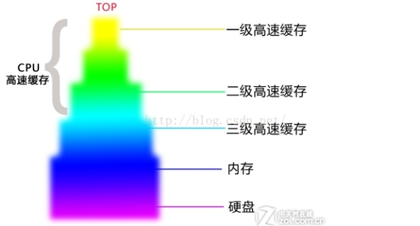

ECS（Entity-Component-System）架构，近年来已经成为一个非常热门的开发框架，当然，这个框架本身提出也是具有一定的历史了，最近被大家所熟识并热烈讨论，还是源于GDC2017，守望先锋对于他们系统中的ECS架构的介绍。针对FPS，MOBA这类的竞技游戏，ECS架构有着得天独厚的优势。本文则是对ECS架构的一点小小的总结。

### 0. 开始之前

#### 为什么要用ECS

首先需要解决一个问题，为什么要用ECS。ECS的优势在于其的高性能，以及DOD( Data-Oriented Design) 设计带来的低耦合度以及清晰的代码架构。但是从本质上，在笔者看来，使用ECS的原因只有一个：

**做ECS是为了优化性能，因为接口编程已经足够解耦了，同时在项目达到一定体量之后，系统的复杂程度带来的负面效果也是非常大的**

### 一.什么是ECS

ECS是一个面向数据编程的编程的编程模式，和面向对象，面向过程一样，也是一种编程思维。做一个简单的比较的话，它们之间的区别如下

- 面向过程：建立解决问题所需的各个步骤（函数）
- 面向对象：建立解决问题所需的各个模型（类，对象）
- 面向数据：优先考虑数据的存取和布局（数据）

而ECS就是基于数据编程的一种设计思路，它由三个部分组成，分别是下面三点

- E -- Entity 实体
- C -- Component 组件
- S -- System 系统

#### 1. Enity 实体

Enity，也称为实体，它是一个概念上的定义，也可以理解为我们常规意义上的gameobject。它在ECS架构下扮演的是Component的载体，为了与其他不同的Enity区分开，在代码中通常以一个全局唯一ID标记，这样可以明确了不同的Enity有哪些Component，它仅仅只是Component的组合和用以做区分的存在，因此不应该存在逻辑相关的操作。在某些实际运用中，Enity可以用于生命周期管理。

#### 2. Component 组件

component是ECS架构的核心之一，它是数据的载体，是一堆数据的集合，并且只包含数据。组件上的数据描述了某一项特征，从设计角度，它不应该包含任何逻辑操作。component可以是继承某个原型的，也可以是单例的，这取决于实际需求

#### 3.System 系统

System和component正好相反，他是逻辑的载体，在设计角度，它应该是仅有逻辑，处理一类或多类Component，并且没有数据的。同时，并且应独立运行，互相隔离。另外，System的设计应该符合函数式编程的思路。

假设我们有这么一个使用ECS的需求，那么一个基本架构如图所示


我们的游戏中，有狗，玩家，树木三种对象，我们通过ECS来设计一下这三者 ,其中E开头的为游戏的实体，C开头的为各种组件

- E_Player(C_Position, C_Health,C_Shout)
- E_Dog(C_Position, C_Health，C_Shout,C_Tail)
- E_Tree(C_Position, C_Flower)

而我们的组件，也可以由一些子组件构成

- C_Position(C_Velocity,C_Xyz)

这时，我们接到了一个新的需求，我们需要我们游戏场景中的人和动物都惊恐的大叫，这时候，我们只需要设计一个System，这个System只需要找到所有Shout组件，然后执行大叫相关的操作就行，它只关心大叫这一个操作，而不关心这个大叫究竟是谁喊出来的。这就是System的作用。

在守望先锋的实际运用中，有一个管理玩家的玩家连接的Connection_System，这个System遍历所有的Connection组件，Connection组件用来管理服务器上的玩家网络连接，是挂在代表玩家的实体上的。它可以是正在进行比赛的玩家、观战者或者其他玩家控制的角色。System不知道也不关心这些细节，它的职责就是强制下线。

每一个Connection组件的元组包含了输入流(InputStream)和Stats组件（从输入流组件读入玩家操作，来确保玩家必须做点什么事情，例如键盘按键；并从Stats组件读取玩家在某种程度上对游戏的贡献。)

因此，只要玩家做这些操作就会不停重置AFK定时器，否则的话，Connection_System就会通过存储在Connection组件上的网络连接句柄发消息给你的客户端，踢你下线。而像游戏里的机器人实体就没有Connection组件和输入流组件，只有一个Stats组件，所以它就不会受到强制下线功能的影响。这是由于Connection_System无法在机器人的Enity同时找到inputStream组件和States组件。下图就是这个过程的示意图

#### System 和数据

关于ECS架构中的核心System，从设计角度上，不应该维护有数据，但是在实际的运用中，可能并非如此。

比如在守望先锋中，有一个InputSystem,可以把玩家输入信息保存在InputSystem里，而其他System如果也需要感知按键是否被按下，只需要一个指向InputSystem的指针就能实现。这种应用，即在System中维护自己的数据结构。

在一定规模内，上述的操作是可行的，但是当需求开始增加，就会遇上问题。比如如果有另外一个System也需要使用同样的数据，这就会导致破坏了System和System之间的隔离，这样就导致了最危险的内部系统的耦合度增加。针对这个问题，守望先锋使用了一个新的解决方案，即把数据结构作为 Singleton 来管理，即开发一个单例组件（Component），System负责从ECS收集信息输入数据结构，并查询结果。这个 Singleton 完全由 System 来驱动，作为一个附属映像，不破坏逻辑的主导权。因此上文中提到的InputSystem的全部按键信息都存在一个单例里面。任何System如果想知道按键是否按下，只需要拿这个单例组件就行了。这样做以后，一些很麻烦的耦合问题消失了，也更加遵循ECS的架构哲学了：System没有状态；组件不带行为。

同时非常有趣的是，在守望先锋使用了单例组件后，他们发现单例模式的使用非常普遍，其整个游戏里的40%组件都是单例的（2017年）。（另外，他们最开始没有使用单例组件原因是因为认为创建了一个组件类型后，只实例化一次是非常愚蠢的，但是后面还是真香了）

#### System之间的隔离

从定义上看，System之间确实是只盯着自己所需的Component，相互之间没有联系，定义上面还写着每个System应该处于一个独立的线程中。但是实际上存在两个问题，第一，System 之间有着逻辑上的顺序耦合，第二，System 之间有着 data race 存在。

要解决这两个问题并不困难

1. 逻辑上的顺序耦合应该就是逻辑的问题，那么应该由编码者自己决定。
2. 对于 data race，编码者可以给出自己需求的读写权限（每个 System 是简单函数的情况下很容易做到），然后以 Component 为粒度进行依赖的分析，从而避开这个问题。

#### 共享的行为

System会控制各种不同的逻辑，这些逻辑只会盯着自己所需的Component，但是这时候可能就会出现重合，例如说公园里的一棵树，公园管理者和园丁都会对掉落的树叶感兴趣，虽然他们的处理各不相同，但是对于树叶他们都是需求的。这就是共享的行为（sharedbehavior）

对于这种共享的行为的情况，以守望先锋为例，他们将一些共用的行为抽象为Utility函数（例如，很多System都会使用到一个CombatUtilityIsHostile函数来判断是否为敌对）。而这些函数的规范则是，如果你想在多处调用一个Utility函数，那么这个函数就应该依赖很少的组件，而且不应该带副作用或者很少的副作用。如果你的Utility函数依赖很多组件，那就试着限制调用点的数量。

同时，有些行为可能产生严重的副作用，又必须执行时，他们通过“推迟”（Deferment）来解决System间耦合的问题。“推迟”存储了行为所需状态，然后把副作用延后到当前帧里更好的时机再执行。

### 二. ECS的优势

ECS的优势主要有两点，第一个也是我认为最重要的一个，就是快.第二个就是由于ECS的指导思想，将数据和逻辑尽可能的进行解耦，带来的更为清晰的结构。

#### ECS为什么会很快

##### 1.Cache Miss

学过计算机组成原理的小伙伴都知道，Cache作为储存器子系统的组成部分，储存着程序经常用的指令和数据，是缓解访问延时而预读的buffer，当计算需要读取数据的时候，我们会从最快的Cache开始查找，而这些缓存会分为多层，每一层的速度都不相同（数量级的差异）。相应的，如果预读的数据无法满足需求，则需要花费更多的时间去获取到对应的数据（Cache Miss），例如去内存中读，甚至到硬盘中读。概括一下，就是如下两点

- CPU处理数据的速度非常快，因此设计CPU高速缓存区来提高了数据访问效率，CPU自身有三级缓存，第一级最快，容量最小，第三级最慢，容量最大。我们常说的内存是指CPU拿取数据的起源点，CPU访问内存的速率远小于三级缓存速率。
- CPU操作数据会先从一，二，三级缓存中取得数据，速度非常快，尤其在一级缓存处速率基本可以满足CPU的需求（即不让CPU歇着），但是**有些情况下我们请求的数据不在这三级缓存中（缺页中断），就需要寻址到内存中的数据（包含这个数据的一整块数据都将被存入缓存），并且把目标数据放到三级缓存中，提高下一次的访问速度**（因为这一次调用的数据块可能在不久的将来还会用到）。



在大部分的情况下，现代CPU的运算力足够强大，**CacheMiss带来的性能问题会成为程序的性能瓶颈，并且在代码中并不易于发现。因此复杂度O(n)的代码不一定性能就一定好，现在的程序效率=数据+代码**，最常见的例子就是，在数据量小的情况下遍历数组会比 （Hash）Map 快上很多，这也是Java或C#这类语言的效率陷阱.。

##### 2.避免CacheMiss

从上面我们就知道，如果要避免CacheMiss，十分简单，那就是让预读能够将需要的数据都放进来。但是要怎么做呢？一般来说，预读策略为线性预读，那我们就应该保证数据读写的连续性。那么问题来了，什么会导致数据连续性中断呢？举几个例子

- 遍历大的数组（但是只访问少数成员）
- 操作数组的顺序不连续（比较差的哈希表）
- 操作对象应用（oop）

那么我们能做的事情就包括，尽量**使用数组（多连续啊！），尽量分割属性（只遍历需要的属性，不要的统统不遍历）**这么一看是不是就很熟悉，这不就是ECS的思路吗，将数据拆分成一个个的组件，根据需求组合成不同的实体。实体只是作为标识符。组件不包含逻辑，就只有数据，我们可以使用**紧密的数组**来储存它。

ECS架构在执行逻辑时，只会操作需要操作的数据，而**E和C这两者的配合把相关数据紧密的排列在一起**，并且通过Fliter组件过滤掉不需要的数据，这样就减少了缺页中断次数，整体上提高了程序效率。

以unity的ECS框架为例，下图说明了组件数据是如何按原型类型存储在块中的。而原型则只是作为一个索引存在


而相比于OOP编程，例如我做一个如下的更新操作，可以看到则需要使用指针指向不同的内存区域，这种指来指去的结构对CPU缓存极其不友好：为了访问组件总是跳转到不相邻的内存。

```c++
for(int i = 0; i < GameObjectsNum; ++i) {
      g[i].update();
      if(g[i].componet1 != nullptr)g[i].componet1->update();
      if(g[i].componet2 != nullptr)g[i].componet2->update();
}
```

##### 3. SIMD

**SIMD全称Single Instruction Multiple Data，单指令流多数据流，是一种采用一个控制器来控制多个处理器，同时对若干个数据分别执行相同的操作从而实现空间上的并行性的技术**简单来说，这个技术可以让CPU在一个指令周期执行多个数据的操作（不过操作需要一样），而不是一个指令周期执行一个数据的操作，这种技术和ECS这种数据密集型的架构相性极好，因此也能够进一步提高性能

##### 4. 更多

前面提到过 Cache 存放着程序经常使用的**指令**和数据，现代 CPU 在数据 IO 的时候并不会完全的挂起，而是会利用空闲的运算力继续执行后续的指令，且指令也是一种数据，这意味着我们不光要照顾数据的连续性，还需要考虑到指令的连续性，那么什么情况会破坏指令的连续性呢？可能是函数指针（虚函数的调用，回调等），循环超长代码块等。特别是函数指针在 IO 期间，CPU 无事可做，于是**在需要高性能的情形下，应该尽量避免虚函数**。虚函数大家都知道，是继承的好伙伴。继承，则是OOP的常见操作。**(在某些情况下，甚至还会有为了继承而继承，为了封装而封装的操作)**

ECS模式下，系统（System）只耦合于组件（Component），即系统的修改不会影响到程序其余部分的其余对象，而其设计思路也应该是函数式的，而函数式编程，在并行上有天生的优势，系统负责管理组件的信息是透明的，于是我们对系统对组件的读写便一目了然 - 注意结构体之间没有任何依赖，系统与系统之间的冲突也一目了然。在通常情况下，系统是一个白箱，运作系统的代码将**不会经过虚函数**，不管是效率还是可测试性都是极好的**。甚至对于系统的执行调度也完全暴露了出来，这在实现网络同步之类的框架的时候能提供很大的便捷性。**

#### 总结

总结一下，ECS的优势主要如下

- **Cache友好，缓解CacheMiss**
- **虚函数调用开销小**
- **适应SIMD**
- **结构清晰，能够降低代码耦合**
- **易于多线程**

对比传统的面向对象编程，**ECS模式无疑更加适合现代CPU架构，因为它可以做到高效的处理数据而不用把多余的数据字段存入宝贵的缓存从而导致多次缺页中断**

### 3. ECS真有那么神吗

很遗憾，答案是**否定**的，首先要提一个问题，你的项目真的符合ECS展开的需求吗？它真的能给你的项目带来项目优势吗？

#### 关于ECS的缺点的一些思考

总所周知，ECS的两大性能优势，cache友好，以及易于多线程，但是首要的性能热点都不是游戏逻辑本身，同时，有一些技术方案本身就是非常cache不友好,例如lua,就算使用上了ecs，也不见得会对性能有什么改善。

另外还有一个问题需要考虑，**ECS就会让你的代码cache友好了吗**？

首先我们需要知道，启用ECS是有一定的门槛的，对于一些超多对象的统一管理和操作的情况下，它确实可以起到很好的效果，但是在正常的情况下呢，实际上性能应该是不分伯仲的。

如果模拟成千上万的单位做一样的简单逻辑事情，就一样地移动、放相同的技能，那么你可以很容易就写出几个for循环，每个循环内用很少的数据，就可以完成整个逻辑。

又或者你的项目像之前例子中常说的守望先锋那样，需要触及到底层，能够对数据密集的代码进行优化（寻路、碰撞、移动等等），那么这些地方也很适合通过for循环来高效遍历

但是正常情况下，实现一个好的ECS架构需要**对数据进行精细的拆分和设计，从而做到对数据的连续读写**，一个不注意，说不定就被破坏了这种连续性，就丧失了优势

还有一个问题**ECS真的能让程序更加清晰吗？**

反OOP的设计，那么必然没有天然的多态支持，那么如果你想要实现多态，那就必然要设计一大堆component去对应，例如上面提到的守望先锋，就有数以百计的System和一大堆Component需要维护，在项目膨胀到一定体积之后，可读性不见得有多好。而如果要实现多态来进行逻辑的书写，那么又是cache不友好的了= _=！

另外还有一点也需要注意，ECS架构本身对于代码质量的要求也比较高。

#### 关于ECS适用项目的一些简单思考

ECS适合适用的场景有什么呢，ECS绝对是提高游戏开发中数据密集运算的性能以及解决网络预测回滚的很好的手段（尤其是看完守望先锋使用ECS对于网络同步的问题的解决，真的牛），并且在某些情况下，他真的能够比OOP或者EC更好地解耦和简化代码。

对于需要进行大量对象遍历和计算密集的项目，我认为ECS是非常值得尝试的架构。虽然有些系统在ECS中不好实现，但是碰到这个问题你可以保留EC，将S封装成OO的系统去处理，比如AI。而在遇到性能问题时，你手上会有一套极其强大的武器去解决。

所以最后我个人的结论

要求逻辑/玩法部分一定要用ECS是不现实的，可能有部分游戏类型（fps/moba）比较适用。总体来说，这部分代码的性能痛点一般不会是需要ECS去解决的，当然，戴森球计划这种密集计算型的项目就非常适合。

引擎，底层的逻辑部分，则可以使用ECS实现，例如优化移动逻辑，寻路逻辑，物理计算这类密集运算，然后封装接口，让项目正常写代码使用。


### 4. 总结

每个框架都需要真正的思考过，才能真正的去用好一个框架。软件开发没有“银弹”这种东西，有得必有失，ECS作为一个新兴的对象，在某些领域上必然是有其一席之地，并且是一个极其强大的解决问题的武器。但是如果指望一个东西能够解决所有问题，那必然陷入误解或者过分使用（例如MVC，我觉得就是过分使用了）

总的来说ECS是一个看上去就非常美好的东西，但是随着系统不断地开发与扩展，难免会有需要取舍的地方，例如，当系统复杂度越来越高，你是会继续细化System去保证和数据的解耦，从而增加了System维护的复杂度，亦或者放弃这个部分，让System变得更加好维护呢

世界上没有两全其美的好事，我们经常要去做决策、去权衡每种做法的利弊。一味刻板地循规蹈矩也是不可取的，框架只是工具，而要怎么用好这个工具，则取决于使用的人是否能够找到真正使用对的地方。


参考文档

 ECS的泛泛之谈 https://zhuanlan.zhihu.com/p/41652478

 浅谈《守望先锋》中的 ECS 构架 https://blog.codingnow.com/2017/06/overwatch_ecs.html

Overwatch Gameplay Architecture and Netcode -《守望先锋》架构设计与网络同步 -- GDC2017 精品分享实录 https://www.yinxiang.com/everhub/note/2215de6c-b084-4152-a959-6ad99c1cf9f4  （有条件的建议去看看原视频，文本的话中间有一段不太好理解）

ECS 真的是未来主流的架构吗 https://www.zhihu.com/question/286963885/answer/1082019675


