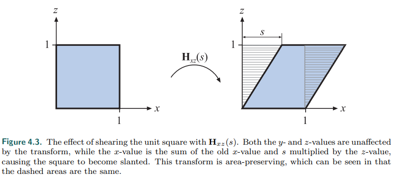

#### 综述

变换是一个将顶点，向量，甚至是颜色按照一定的方式变换的一个操作。它们可以确定位置，变形，还可以让对象，光照，摄像机动起来。而且也能够保证所有的计算的结果都是在同一个坐标系空间下的，并以不同的方式将物体投射到平面上。

从说人话的角度来讲，常规的变化主要是对一个对象的各个点，将其进行移动，变形，投影等操作的操作。

**线性变换(liner transform)**是一种保持向量加法和标量乘法的变换

主要包括，旋转，缩放，但是不包括平移变换，因为平移变换是非线性的

为了结合线性变换和平移变换可以使用**仿射变换**(*affine transform*)，即先完成线性变换，再进行平移变换。通常情况下，我们使用矩阵来表示变换的过程，二维变换一个仿射变换的表示如下
$$
\left(\begin{matrix}
x^{'}\\y^{'}\\
\end{matrix}
\right) = 
\left(\begin{matrix}
a &b\\c &d\\
\end{matrix}
\right)\left(\begin{matrix}
x\\y\\
\end{matrix}
\right)+\left(\begin{matrix}
t_x\\t_y\\
\end{matrix}
\right)
$$
然而这种表示下，就会显得比较繁琐，因为引入平移这个运算。因此我们引入了一个新的概念，齐次坐标

#### 齐次坐标

**齐次坐标(Homogeneous coordinate)**，由August Ferdinand Möbius提出)使得能够在投影空间中进行图形和几何的计算。齐次坐标是一种用 （N+1） 个数表示 N 维坐标的方法。

为了表示2D齐次坐标，我们简单地在已有的(笛卡尔坐标)坐标上添加一个变量$w$ 。因此，一个笛卡尔坐标用$(X,Y)$齐次坐标表示就变成了 $(x,y,w)$。笛卡尔形式的  $X,Y$与齐次坐标  和$(x,y,w)$之间的关系为:
$$
X = x/w,Y = y/w
$$

在计算机图形学的平移中，以二维空间为例，一个点$p(x,y)$​的齐次坐标可以表示为（x,y,1）而一个向量$p$​​​​​则应该表示为(x,y,0)。这是由于向量需要具有平移不变性。更深层的理解就是，在这种表示下，vector+point = point,这是一个平移，而point-point=vector,而vector+vector=vector。而在齐次坐标的表示下，Point+point表示的就是它的中点。

#### 仿射变换

新的公式如下
$$
\left(\begin{matrix}
x^{'}\\y^{'}\\1\\
\end{matrix}
\right) = 
\left(\begin{matrix}
a &b &t_x\\c &d &t_y\\0 &0 &1\\
\end{matrix}
\right)\left(\begin{matrix}
x\\y\\1\\
\end{matrix}
\right)
$$
因此，左上角的2x2矩阵就是线性变换，右上角的$t_x,t_y$就是平移的变换

而引入了齐次坐标的结果，代价就是需要多存储一个数据。如果是三维空间情况下，则需要再增加一个维度
$$
\left(\begin{matrix}
x^{'}\\y^{'}\\z^{'}\\1
\end{matrix}
\right) = 
\left(\begin{matrix}
a &b &c &t_x\\d &e &f &t_y\\g &h &i &t_z\\0 &0 &0 &1\\
\end{matrix}
\right)\left(\begin{matrix}
x\\y\\z\\1
\end{matrix}
\right)
$$

#### 矩阵的逆和组合

在数学上，逆矩阵和矩阵相乘，得到的结果就是单位矩阵，而在我们的变换中，一个变换的逆变换，就是可以通过逆矩阵进行计算。

而矩阵的组合，顺序是从右向左组合的，例如是

$C = TRS$.注意这里的顺序，实际计算中，它的计算顺序是$TRSp = (T(R(Sp)))$(p是被变换的点)，其中$TRS$​​​是被屏幕的图形系统最常用的顺序。即先缩放，再旋转，再平移

#### 具体的变换

##### 错切变换

这个变换的主要要点就是某一个坐标不变，而其他的坐标进行了一个改变

##### 平移变换

##### 旋转变换

##### 缩放变换

上面三个变换可以通过一个图来表示

