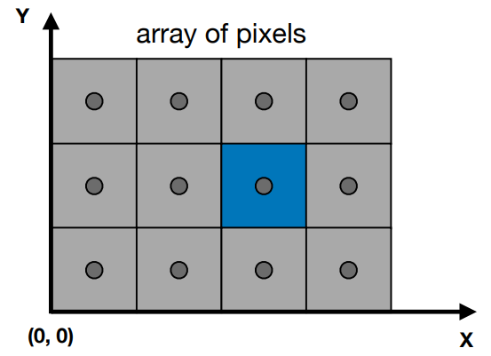

### 光栅化

我们知道，屏幕上显示出一个画面，是靠屏幕中每个不同的像素显示出不同的颜色，从而组合出各种不同的效果。而光栅化，则是将我们需要画的图形，转换为像素信息的过程。在渲染过程中，光栅化一般会做下面几个事情

####  三角形setup

在这个部分，会计算三角形所需要的数据，这些数据会在遍历三角形中所用到，包括了会在像素处理中用到的数据

#### 三角形遍历

在这个阶段，每个被三角形所覆盖的像素都会被检查，并且一个片段（用于片段着色器）将会在这个阶段中生成。每个三角形片段的生成过程会被称为三角形遍历。每个三角形都是通过顶点数据然后通过插值算法生成的。

在上述的三角形遍历阶段，我们需要遍历的三角形，则是已经经过了mvp转换后，然后投影到屏幕上所需要的三角形。

如上图所示，假设我们屏幕分辨率1000*1000,即横竖各有1000个像素，而每个像素则是一个规整的小正方形，而位置（2,1)则代表上图蓝色像素的左下角，而真正的像素中心坐标则是（2.5,1.5），当我们要进行三角形的判断的时候，我们可以通过像素中心的坐标来进行判断

这种视口转换矩阵如下
$$
M_{viewport} = \left(\begin{matrix}
\frac{width}{2} &0 &0 &\frac{width}{2}\\
0 &\frac{height}{2} &0 &\frac{height}{2}\\
0 &0 &1 &0\\
0 &0 &0 &1
\end{matrix}
\right)
$$

#### 为什么是三角形来进行绘制呢

- 三角形是最基础的多边形
- 保证是平面的 
- 定义明确的内部 
- 有明确的插值方法

#### 如何进行像素在三角形中的判断呢

按照三角形遍历中我们提到的，像素是一块一块的，因此我们可以使用像素的中心来进行判断，如下图，在三角形中的像素则会被置为红色，不再的则是无色

当我们拿像素中心点来进行判断的时候，问题就简化了，变成了下面的情况

判断点是否在三角形中的办法很多，我们这里使用的是向量的方法。如图所示，当点q同时在向量$\vec{p_{1}p_{2}}$和$\vec{p_{2}p_{0}}$以及$\vec{p_{0}p_{1}}$的同一边时，点则在三角形中。如何判断方向呢，我们首先可以使用叉乘法，我们将$\vec{p_{1}Q}$和$\vec{p_{1}p_{2}}$进行叉乘，那么我们就会得到一个方向，这个方向则是z轴的方向，这个方向的正负则由左手系或者右手系确定，当用这种方式，我们以顺时针或者逆时针的形式计算了每一个向量和点的叉乘的方向后，如果三次结果的方向一致，则点在三角形内，否则在三角形外。

另外我们还可以拓展一下思路，比如说使用面积的方式，也可以进行比较。

#### 加速算法

前面提到，我们要遍历来判断一个点是否在三角形内，因此，在遍历开始之前，我们可以进行一个优化。例如说，找到这个三角形的aabb包围盒，这样就可以剔除掉大量原来不需要的点。另外还有一些其他的算法，适用于各种不同的情况，以下图为例

这是递增式的对三角形进行遍历，这种遍历方式，相比起遍历整个包围盒，还是要快一些的

### 走样（Aliasing）

上面，我们提到了光栅化后的三角形，而这些像素合在一起，可能就是下面的情况（放大后）

这就是我们接下来要提到的，锯齿，即走样。走样问题是三角形在像素中显示要么存在，要么不存在导致的。为了避免这个问题，我们就需要引入反走样技术

要解释为什么会发生走样，那么还是要设计到采样和滤波理论。渲染图像的处理本身就是一个采样任务。图像的生成就是三维场景采样的处理过程，其目的是为图像中的每一个像素（一个离散的像素数组），找到相应的颜色值。下图中展示了在频域中，一个信号是怎么被采样然后被重建的

不论何时进行采样，都有可能会出现走样，这是我们不想要造成的的情况。有一个关于走样的经典案例，即电影摄像机拍摄的一个旋转的马车车轮，由于它移动的比摄像机记录图像的速度快很多，车轮看起来就是向后或者是不转。或者想象一下，我们人在看到一个高速旋转的轮子的时候，会发现轮子是向后转的。这是因为车轮的图像是以一系列步长被记录的，这被称作时间走样（temporal aliasing）

当一个信号被以过慢的频率采样时，走样就会出现，为了使一个信号被合适的采样（或者说就是能够被正确的重建原始信号），采样频率必须大于被采样频率信号的两倍，这被称为采样定律，并且该采样频率以一位在 1928 年发现此频率的瑞典科学家 哈里·奈奎斯特（Harry Nyquist） (1889–1976) 命名，被称为奈奎斯特率（Nyquist rate）[1447] 或奈奎斯特极限（Nyquist limit）。奈奎斯特极限如图 5.16 所示。该定理使用术语“最大频率”的这一事实暗示着信号应该受到频带限制（band-limited），这仅仅意味着任何频率都不能超过特定限制。换句话说，信号相对于相邻样本间的间隔应该足够平滑。

以上图为例，图中的虚线可以理解为重建后的信号，这样很明显它是走样的，如果将虚线理解为另外一个信号，红点为采样的频率，可以看出采样的频率是和被采样频率相关的，是大于被采样频率信号的两倍

#### 渲染时的走样

前面我们提到了采样和重建，当采样频率不合适时，就可能会发生走样现象。我们可以通过傅里叶变换，将时域的信号转化为频域数据。而在上面的图5-15中的采样和重建则可以表示为下面的一个情况

从右边的图我们可以看出，采样=重复的频率内容。而走样是怎么导致的呢,下图中，上面的是密集的采样，而下面的是稀疏采样。即上图中的f图,稀疏采样导致了频率内容的混合，因此信号就产生了变化，所以就导致了走样

####  反走样和滤波

书接上文，那么开始考虑反走样的问题了，那么马上就能有一个办法，如下图所示

这个办法就是给将信号给裁剪一点，去掉一部分的高频信号，然后让稀疏的采样也能够比较好的对图像进行采样。即滤波。

这里补充一点高频信号和低频信号的相关内容，**高频信号，在图像中是变化比较大的，低频则是变化较小的**，如下面图

低通滤波的结果，如上图所示，则是模糊的结果，而高通滤波的相反，刚好是边缘的地方这些变化波动较大的信息，中通滤波器，结果就比较奇怪了

滤波=卷积 =平均化。而滤波则会需要不同的滤波器，就像卷积中有不同的卷积核一样，不同的滤波器/卷积核会带来不同的结果。常见的滤波器有Box滤波器，tent滤波器，理想的低通滤波器sinc滤波器等,这些滤波器如下图所示

放到我们上面的例子中，不考虑各种奇奇怪怪的滤波器，那就是对三角形进行模糊，如下图所示

而经过模糊之后，我们的三角形的周边变化不会那么尖锐，因此锯齿的效果就整体上减弱了

#### 反走样（ Antialiasing）

上面提到了一个模糊操作，而这个模糊操作的算法，我们就可以称为是反走样算法。反走样算法的数量有很多，每种不同的算法都有其优势和劣势。回到上面的走样问题，我们想要得到一个更加平滑过渡的图像，那么我们应该做的就如下图

即，让一个像素的值不是非黑即白的，而是根据其和被三角形覆盖的比率，来确定它的颜色。具体如何来做到这点呢，我们知道，由于采样的频率的局限性，在默认情况下，我们每个像素点只会进行一次采样，而且没有做 filter 处理。那么要处理反走样问题，有两个思路

**第一种思路自然就是在每个像素中进行多次采样**，然后根据多次采样的结果综合来计算像素的颜色值。使用这种方式来实现的抗锯齿技术有SSAA,MSAA，TAA，。

**第二种思路是通过后处理的方式，寻找屏幕中的像素块边界**，然后根据边界的信息，将两侧的像素点颜色进行插值，这样就会得到平滑过渡的边缘，实现抗锯齿的效果。使用这种方式来实现的抗锯齿技术有FXAA，SMAA。

##### SSAA(Super Sampling Anti-Aliasing)

其中一个行之有效，并且非常简单的做法就是将图形按照 xN 倍的大小进行渲染，再将图像整体缩小，即做一个降采样。拿4xSSAA举例子，假设最终屏幕输出的分辨率是800x600, 4xSSAA就会先渲染到一个分辨率1600x1200的buffer上，然后再直接把这个放大4倍的buffer下采样致800x600。处理这个图像缩小的处理方式是直接取对应原始四个像素点颜色的平均值，这其实就是使用前面说的 box filter 进行 filter 处理。这样图像就会自然形成抗锯齿效果。

还有一种方式是 使用 **accumulation buffer**，比如现在要得到 2X2 SSAA 的图像，可以分别使用四张图片渲染，渲染每张图时将坐标进行略微偏移，最后将结果求平均即可。

**总体来说，就是为了得到上面的图片的根据覆盖率得到不同程度颜色，采用更高的采样率**

这种方式就是**超级采样抗锯齿/SSAA(Super Sampling Anti-Aliasing)**，在数学上，这种方法是最完美的抗锯齿。但是劣势也很明显，光栅化和着色的计算负荷都比原来多了4倍，render target的大小也涨了4倍。产生的额外的性能消耗是惊人的，所以一般很少会在实践中使用这种抗锯齿方式。

##### MSAA(Multi-Sampling AA)

由于SSAA的性能问题，MSAA进行了一个非常聪明的优化。**简单来说， SSAA 和 MSAA 的最大差别在于 SSAA 对每个采样点都要着色，而 MSAA 仍然是每个三角形覆盖的每个像素计算一次。**具体的实现上，MSAA只是在光栅化阶段，判断一个三角形是否被像素覆盖的时候会计算多个覆盖样本（Coverage sample），但是在pixel shader着色阶段计算像素颜色的时候每个像素还是只计算一次，就和最正常的着色一样，只是计算了覆盖率。例如下图中，假设我们的一个像素有四个采样点，当我们计算像素颜色时，根据覆盖的采样点的比率，我们会对这个像素的颜色值分别乘50%，75%，25%几个不同比率，**而不用真的把每个采样点都着色出来**。

更加具体来讲，MSAA的实现中，GPU 硬件会使用 **centroid sampling** 来调整采样点的位置，当像素中心点被覆盖时，是正常的像素中心点的采样，而当像素中心点未被三角形覆盖时，GPU就会挑选最近的通过覆盖测试的次像素点，作为采样点。

MSAA 是使用单独的贴图格式来存储的，比如 RGBA8_4X，表示4个次采样点的MSAA贴图，占用内存是普通贴图的4倍。当然在真正的运用中，4x的msaa不代表你的消耗就增加了四倍，而是会有各种复用和优化。

如上图左边所示，对于 MSAA，每个像素上的次像素点，都会单独存储颜色值。一种优化的方案是使用 NVIDIA 的 CSAA(coverage sampling antialiasing)或者 AMD 的 EQAA(enhanced quality antialiasing)。如上图右边所示，这种方式下每个次像素点不会记录颜色，而是记录颜色列表的索引，这样可以减少内存的消耗。顺便提一下之前NV的CSAA，它就是更进一步的把coverage sample和depth，stencil test分开了。

当所有的渲染工作都完成后，就可以对 MSAA 的 RenderTarget 进行 **resolve** 操作，来得到最终的结果。一般情况下，MSAA 是硬件直接用 box filter 进行 resolve，也就是将像素中对应的次像素点中的颜色直接取平均值。这样 filter 之后，就可以得到边缘平滑的抗锯齿效果，每个像素上的次像素采样点越多，得到的效果也就越好：

一般来说，MSAA 不会直接在一个像素上进行网格状均匀放置次像素点。我们更加倾向于使用**低差异采样序列**，比如 Halton 序列，Poisson disk 等。这里不展开

同时使用MSAA是比较简单的，重要工作都是 GPU 来自动完成的，我们只需要使用即可。

**缺点：**

1. **依然会额外消耗大量内存和带宽，特别是对于延迟渲染来说，GBuffer 本身就已经很大了，如果再使用 MSAA，额外的带宽消耗极大。因此延迟渲染一般不会使用 MSAA来作为实现抗锯齿手段。**
2. **从对硬件的利用率上来说，MSAA 对硬件的利用率其实很低，因为很多时候我们想要抗锯齿的部分，都只是在物体边缘或者高光变化的高频部分。其他颜色不怎么变化，比较低频的地方，其实是不需要抗锯齿效果的。使用 MSAA 进行大量物体的渲染时，很多带宽是被浪费的。**

但是在某些情况下，后处理的方式没法进行抗锯齿，那我们依旧还是要回归经典，使用起msaa

##### TAA（**Temporal** AA）

TAA可以理解为时序上的反走样，**它的核心思路就是将msaa带来的额外采样消耗分摊倒了多个帧中** ，它综合历史帧的数据来实现抗锯齿，这样会将每个像素点的多次采样均摊到多个帧中，相对的开销要小得多。关于TAA，我们可以分为静态场景和动态场景来进行分析。不过这个算法某些地方还是比较复杂的，这里只是简单提一下

**1.静态场景**

在前面讲到 MSAA 时我们知道，实现抗锯齿要在一个像素中的多个位置进行采样。在 MSAA 中，我们在一帧中，在每个像素中放置了多个次像素采样点。在 TAA 中，我们实现的方式，就是在每帧采样时，将采样的点进行偏移，实现**抖动 (jitter)**。采样点抖动的偏移，是和 MSAA 的次像素采样点放置是相同的，都需要使用低差异的采样序列，来实现更好的抗锯齿效果。TAA 中都会直接使用 Halton 序列。之后就是对历史的帧进行混合了，具体怎么混合和抖动，这里暂时不提。

**2.重投影**

镜头移动后，原来投射到某个像素上的物体，现在很可能不在原来的位置上了。假设物体是不动的，我们就可以使用当前帧的深度信息，反算出世界坐标，使用上一帧的投影矩阵，在混合计算时做一次重投影 **Reprojection/重投影**。不过重投影只能适用于静态的物体，如果物体是移动的，我们就无法精确还原物体上一帧的投影位置了。

**3.运动物体**

物体本身的移动比较复杂，包含了平移旋转缩放。再加上摄影机本身的移动，直接在混合时进行计算的话，计算起来非常困难。

要对历史数据进行混合，就要能够还原出当前物体在屏幕中投影的位置。为了能够精确地记录物体在屏幕空间中的移动，我们使用 **Motion Vector**（运动向量） 贴图来记录物体在屏幕空间中的变化距离，表示当前帧和上一帧中，物体在屏幕空间投影坐标的变化值。因为 Motion Vector 的精度要求比较高，因此用RG16格式来存储。Motion Vector 可以作为延迟渲染的 GBuffer 的一部分，除了用了实现 TAA，还可以实现移动模糊/Motion Blur 等效果。

在渲染物体时，我们需要用到上一帧的投影矩阵和上一帧该物体的位置信息，这样可以得到当前帧和上一帧的位置差，并写入到 Motion Vector。对于带蒙皮动画的物体，我们同时需要上一帧的骨骼的位置，来计算处上一帧中投影到的位置。计算上一帧位置和当前帧位置的方法是一样的，都是从 VS 中输出裁剪空间的齐次坐标，在 PS 中读取，然后就可以做差求得 Motion 值。为了使 Motion 的值比较精确，我们在计算 Motion 时，**不会**添加抖动。

另外一个需要考虑的地方是一些基于UV 变化的动画效果，需要将偏移值转化为屏幕空间中的偏移。

还有就是平面反射的效果，需要小心翼翼地推导出反射时使用的矩阵和抖动，反射的位置信息等，这里的原理并不复杂，但是计算起来会非常麻烦

尽管理论上来说，所有的物体都应该有 Motion Vector 信息，但是有些物体却无法做到，比如：

- 带有复杂贴图动画的物体，粒子烟雾、水流等；
- 半透明物体，因为 Motion Vector 只有一层，因此无法写入。

不过因为这些物体往往都是很薄的一层，且都是很快消失的，因此抖动产生的误差比较不容易注意到，因此一般也不需要去特殊处理。

接下来就是使用 Motion Vector 进行混合计算了，这里略过。

**4.历史帧数据处理**

由于像素抖动，模型变化，渲染光照变化导致渲染结果发生变化时，会导致历史帧得到的像素值失效，就会产生 **鬼影/ghosting** 和 **闪烁 /flicking** 问题。为了缓解鬼影和闪烁的问题，我们还要对采样的历史帧和当前帧数据进行对比，将历史帧数据 **clamp/截断** 在合理的范围内。

**5.数据的混合**

然后就可以混合历史颜色和当前的颜色了，不同于在静态场景中直接使用 0.05 作为混合系数，我们在这里使用一个可变化的混合系数值来平衡抖动和模糊的效果，当物体的 Motion Vector 值比较大时，就增大 blendFactor 的值，反之则减小：

**总结**

因为 TAA 本质上是和 SSAA 类似的原理，所以完全不会有后处理抗锯齿的次像素问题，AA效果可以和 MSAA 相当。由于 MSAA 在延迟渲染管线中无法使用，且使用 Motion Vector 也和延迟渲染比较契合，因此在 Unreal 引擎的带领下，TAA 目前也逐渐成为现代 3A游戏的标配。

当然其缺点也比较明显，虽然 TAA 实现的原理并不复杂，但是和渲染管线关系密切，需要改动的地方较多。可以说是牵一发而动全身，对于其他的每一项渲染功能，都需要考虑 TAA 的影响。

除此之外 TAA 中很容易出现一些闪烁，鬼影等问题，需要不同的应用场景进行处理。因为 TAA 和渲染管线是紧密相关的，在不同游戏引擎中，TAA的很多细节处理方式都不太一样。

拓展的话可以看看这个文章 https://zhuanlan.zhihu.com/p/20786650

##### FXAA（Fast approximate antialiasing）快速近似抗锯齿

**FXAA(fast approximate antialiasing)** 是一种比较注重性能的形变抗锯齿方式，只需要一次 Pass 就能得到结果，FXAA 注重快速的视觉抗锯齿效果，而非追求完美的真实抗锯齿效果。

根据网上看到的说法“FXAA的发明人原来是我们组的，他自己都不知道这个为什么会work- -”。

简单来说，这种类型的处理方法，**都是不依赖于任何硬件，完全用图像处理的方法来搞的**（当然具体实现上另说）。这一类东西包括FXAA，TXAA等，都是一种叫Post Processing AA这一类技术，核心思路就是以图像后处理的方式，找到边界，遇到有锯齿的边界，它会将有锯齿的边界替换为没有锯齿的边界。

比如下图中的图像，左边是待处理的图像，中间是找到的边界，右侧是将边界两侧像素混合后得到的抗锯齿效果。

另外一称为SMAA的抗锯齿的方法，称为SMAA,也是使用这种思路进行的。

FXAA 的边缘提取是根据 SceneColor 的 Luma 值进行检测的，所以可以提取到高光、阴影，几何边缘，半透明物体。这是 FXAA 相对于 MSAA 最大的优势。

想要实现FXAA，我们可能需要关注下面几点

1.对比度计算 2. 基于亮度的混合系数计算 3. 计算混合方向 4.混合 5.边界混合系数计算

FXAA 的优点就是集成比较方便，只需要一个 Pass 来实现抗锯齿，是目前手机上的最常用的抗锯齿方式。

FXAA的缺点是画面会略微有些模糊。而且由于FXAA是基于后处理判断边界来实现的，因此没有次像素特性，在光照高频(颜色变化很快)的地方会不稳定。单独看静态的场景没有问题，但是移动摄影机时，就会导致一些闪烁。

##### DLSS

传说中的大力水手，是一个（Superr esolution），是指采样率不够，但是希望能够恢复到一个高分辨率的情况。而DLSS则是基于深度学习的一个技术，即，虽然目前的图像锯齿比较多，但是可以通过猜/经验给他一个值，使其不糊。这也是深度学习的一大应用，但是既然是深度学习，那么样本和模型的训练程度就是非常重要的，因此在不同游戏中，dlss的效果是相当不同的，这点需要注意

### 总结

总而言之，由于在图像的连续性和像素的离散性，走样或者说锯齿现象是一定会存在的。而反走样则是一个非常重要的工作，但是这里需要考虑到硬件的性能和分级，同时还需要注意的一点是，没有最好的方法，只要能够让玩家看起来不糊，不锯齿，那就已经达到了目的，至于如何达到，这不重要。

本文中，比较重要的几个反走样方法，我认为一个是TAA，这是一个延时渲染友好的方法，另外一个则是fxaa，以它为代表的硬件无关的算法，也是一个非常重要的体系。

