### 综述

变换是一个将顶点，向量，甚至是颜色按照一定的方式变换的一个操作。它们可以确定位置，变形，还可以让对象，光照，摄像机动起来。而且也能够保证所有的计算的结果都是在同一个坐标系空间下的，并以不同的方式将物体投射到平面上。

从说人话的角度来讲，常规的变化主要是对一个对象的各个点，将其进行移动，变形，投影等操作的操作。

**线性变换(liner transform)**是一种保持向量加法和标量乘法的变换

主要包括，旋转，缩放，但是不包括平移变换，因为平移变换是非线性的

为了结合线性变换和平移变换可以使用**仿射变换**(*affine transform*)，即先完成线性变换，再进行平移变换。通常情况下，我们使用矩阵来表示变换的过程，二维变换一个仿射变换的表示如下
$$
\left(\begin{matrix}
x^{'}\\y^{'}\\
\end{matrix}
\right) = 
\left(\begin{matrix}
a &b\\c &d\\
\end{matrix}
\right)\left(\begin{matrix}
x\\y\\
\end{matrix}
\right)+\left(\begin{matrix}
t_x\\t_y\\
\end{matrix}
\right)
$$
然而这种表示下，就会显得比较繁琐，因为引入平移这个运算。因此我们引入了一个新的概念，齐次坐标

### 齐次坐标

**齐次坐标(Homogeneous coordinate)**，由August Ferdinand Möbius提出)使得能够在投影空间中进行图形和几何的计算。齐次坐标是一种用 （N+1） 个数表示 N 维坐标的方法。

为了表示2D齐次坐标，我们简单地在已有的(笛卡尔坐标)坐标上添加一个变量$w$ 。因此，一个笛卡尔坐标用$(X,Y)$齐次坐标表示就变成了 $(x,y,w)$。笛卡尔形式的  $X,Y$与齐次坐标  和$(x,y,w)$之间的关系为:
$$
X = x/w,Y = y/w
$$

在计算机图形学的平移中，以二维空间为例，一个点$p(x,y)$​的齐次坐标可以表示为（x,y,1）而一个向量$p$​​​​​则应该表示为(x,y,0)。这是由于向量需要具有平移不变性。更深层的理解就是，在这种表示下，vector+point = point,这是一个平移，而point-point=vector,而vector+vector=vector。而在齐次坐标的表示下，Point+point表示的就是它的中点。

### 仿射变换

新的公式如下
$$
\left(\begin{matrix}
x^{'}\\y^{'}\\1\\
\end{matrix}
\right) = 
\left(\begin{matrix}
a &b &t_x\\c &d &t_y\\0 &0 &1\\
\end{matrix}
\right)\left(\begin{matrix}
x\\y\\1\\
\end{matrix}
\right)
$$
因此，左上角的2x2矩阵就是线性变换，右上角的$t_x,t_y$就是平移的变换

而引入了齐次坐标的结果，代价就是需要多存储一个数据。如果是三维空间情况下，则需要再增加一个维度
$$
\left(\begin{matrix}
x^{'}\\y^{'}\\z^{'}\\1
\end{matrix}
\right) = 
\left(\begin{matrix}
a &b &c &t_x\\d &e &f &t_y\\g &h &i &t_z\\0 &0 &0 &1\\
\end{matrix}
\right)\left(\begin{matrix}
x\\y\\z\\1
\end{matrix}
\right)
$$

### 矩阵的逆和组合

在数学上，逆矩阵和矩阵相乘，得到的结果就是单位矩阵，而在我们的变换中，一个变换的逆变换，就是可以通过逆矩阵进行计算。

而矩阵的组合，顺序是从右向左组合的，例如是

$C = TRS$.注意这里的顺序，实际计算中，它的计算顺序是$TRSp = (T(R(Sp)))$(p是被变换的点)，其中$TRS$​​​是被屏幕的图形系统最常用的顺序。即先缩放，再旋转，再平移

### 具体的变换

***错切变换***

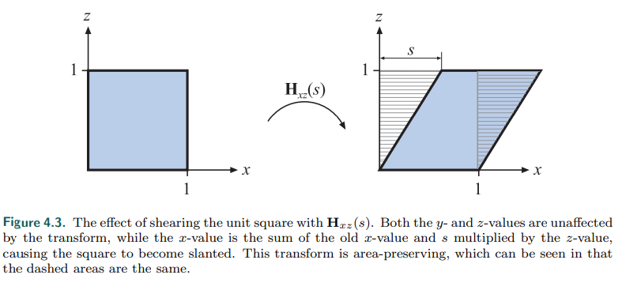

这个变换的主要要点就是某一个坐标不变，而其他的坐标进行了一个改变

***平移变换 旋转变换 缩放变换***

上面三个变换可以通过一个图来表示

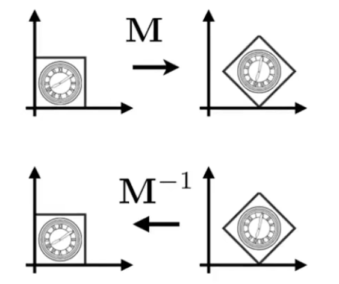

对于上述的变化，总结一下变化公式

1. **平移变换**

   一个从一个坐标转移到另外的位置由一个平移矩阵$T$来表示。这个矩阵使用一个向量$t=(t_x,t_y,t_z)$来进行转换，这个矩阵如下

$$
T(t) = T(t_x,t_y,t_z) =  
\left(\begin{matrix}
1 &0 &0 &t_x\\0 &1 &0 &t_y\\0 &0 &1 &t_z\\0 &0 &0 &1\\
\end{matrix}
\right)\tag{平移}
$$

平移矩阵的逆矩阵是$T^{-1}(-t)$，区别就是向量$t$是负数
$$
T(t) = T(t_x,t_y,t_z) =  
\left(\begin{matrix}
1 &0 &0 &-t_x\\0 &1 &0 &-t_y\\0 &0 &1 &-t_z\\0 &0 &0 &1\\
\end{matrix}
\right)\tag{平移的逆}
$$

2. **旋转变换**

   用一个给定的旋转角度和过原心的旋转轴来旋转一个向量(位置或方向)。和平移矩阵一样，它是一个刚体变换(*rigid-body transform*)，即它保持变换后点之间的距离不变。以二维为例，我们要证明，在二维空间中，假设我们有一个向量$v=(v_x,v_y)$,我们可以把它参数化为$v=(v_x,v_y)=(r\cos{\phi},r\sin{\phi})$.而如果我们想要将他（逆时针）旋转$\theta$弧度，那我们会获得 $u=(r\cos(\theta+\phi),r\sin(\theta+\phi))$.

   用图来表示大概就是这样。下图中我们假设$\phi$为0

   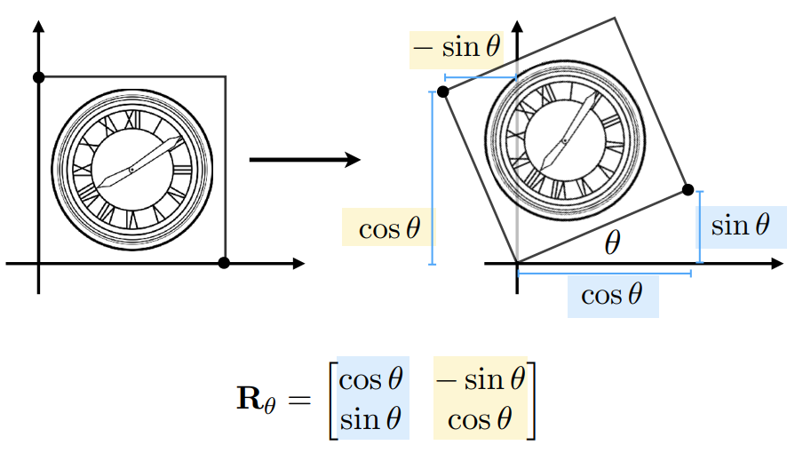

   三维的条件下就比较复杂了，但是也是同样的思路可以证明，这里直接给出一个旋转矩阵的公式，其中，旋转角为$\theta$,上面
   $$
   R_{x}(\theta)=\left(\begin{matrix}
   1 &0 &0 &0\\0 &cos(\theta) &-sin(\theta) &0\\0 &sin(\theta) &cos(\theta) &0\\0 &0 &0 &1\\
   \end{matrix}
   \right)\tag{绕x}
   $$

   $$
   R_{y}(\theta)=\left(\begin{matrix}
   cos(\theta) &0 &sin(\theta) &0\\0 &1 &0 &0\\-sin(\theta) &0 &cos(\theta) &0\\0 &0 &0 &1\\
   \end{matrix}
   \right)\tag{绕y}
   $$

   $$
   R_{z}(\theta)=\left(\begin{matrix}
   cos(\theta) &-sin(\theta) &0 &0\\sin(\theta) &cos(\theta) &0 &0\\0 &0 &1 &0\\0 &0 &0 &1\\
   \end{matrix}
   \right)\tag{绕z}
   $$

   上面的三个矩阵，我们可以看出，实际上还是二维旋转矩阵的扩展，同时，y轴旋转的负号会看起来比较奇怪，这里的话我们可以考虑三轴的关系可以推出来。旋转矩阵$R_i(\phi)$的特征，除了它绕着轴i旋转了$\phi$度，它使所有旋转轴$i$上的点保持不变。这三种轴变换矩阵结合(即矩阵相乘)起来可以表示**任意旋转矩阵**。所有旋转矩阵都是正交矩阵并且它们的行列式值都为1。这也适用于任何数量的这些转换的串联。ps:在图形学中常用到正交矩阵，正交矩阵的逆矩阵和转置矩阵相同。旋转矩阵的逆矩阵: $R_i^{-1}(\phi) = R_i(-\phi)$作用是绕同一轴，以相反的方向旋转。我们这里举一个例子

   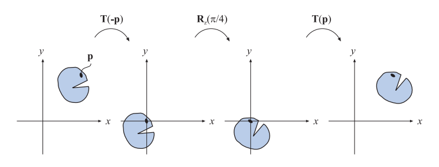

   如上图所示，有一个不规则物体，其上有一点 $P$，要绕点 $P$ 旋转物体，则可按如下步骤进行:

   1. 对物体施加平移变换 $T(-p)$
   2. 对物体施加旋转变换 $R_z(\phi)$这是真正的旋转部分
   3. 对物体施加平移变换 $T(p)$

   则把这三步的变换矩阵“结合”起来就得到了最终的变换矩阵:$X=T(p)R_z(\phi)T(-p)$

   注意这三个矩阵的顺序，要按照从右往左的顺序读，先发生右边的变换(在opgl里面也有提到)。

   3. **缩放** 

      一个**缩放矩阵**$S(s) = S(s_x,s_y,s_z)$用系数$s_x,s_y,s_z$分别沿着x, y, z方向缩放实体(entity, 即一个向量，可能表示物体)。缩放矩阵可以用放大或缩小物体.当$s_i,i\in{x,y,z}$越大，那么在这个方向上实体就会越大。把S中任何方向的缩放比率设为1就是避免了这个地方的缩放。这个也比较好理解，直接上矩阵
      $$
      S(s) = S(s_x,s_y,s_z) =  
      \left(\begin{matrix}
      s_x &0 &0 &0\\0 &s_y &0 &0\\0 &0 &s_z &0\\0 &0 &0 &1\\
      \end{matrix}
      \right)\tag{缩放}
      $$
      如果 $s_x=s_y=s_z$，即三个方向上的缩放量一样，则称为*uniform* (或*isotropic* 均匀尺度) scaling，否则称为*nonuniform* (或*anisotropic*非均匀尺度) scaling。缩放矩阵的逆矩阵为$S^{-1}(s) = S(\frac{1}{S_x},\frac{1}{S_y},\frac{1}{S_z})$。如果**S**中有一个或三个分量的值为负数，则得到一个**反射矩阵**(reflection matrix)或**镜像矩阵**(mirror matrix)。

      一些题外话，例如说下列的两个矩阵,右边的矩阵在运算时可能会更低效，因为涉及到了除法
      $$
      S(5)  =  
      \left(\begin{matrix}
      5 &0 &0 &0\\0 &5 &0 &0\\0 &0 &5 &0\\0 &0 &0 &1\\
      \end{matrix}
      \right)
      S^{'}  =  
      \left(\begin{matrix}
      1 &0 &0 &0\\0 &1 &0 &0\\0 &0 &1 &0\\0 &0 &0 &1/5\\
      \end{matrix}
      \right)
      $$

   4. **错切**

      一共有六种基本的错切矩阵，它们分别是$H_{xy}(s),H_{xz}(s),H_{yx}(s),H_{yz}(s)，H_{zx}(s)，H_{zy}(s)$，.第一个下标用于表示哪一个坐标被错切矩阵改变，第二个下标表示完成错切的坐标，不想多说啥，直接上矩阵
      $$
      H_{xz}(s) = 
      \left\{
      \begin{matrix}
      1 &0 &s &0\\
      0 &1 &0 &0\\
      0 &0 &1 &0\\
      0 &0 &0 &1
      \end{matrix}
      \right\}\tag{错切}
      $$
      

   

### 变换的组合

#### 刚体变换(rigid-body transform)

什么是刚体变换呢？举个例子，你从课桌上拿了一支钢笔，然后放进书包里了，则这只钢笔只是朝向和位置变了，而钢笔的形状没有发生变化。这样**只有平移和旋转组成的变换称为刚体变换(rigid-body transform)**。刚体变化具有保持长度(lengths)、角度(angles)和handedness不变性。

任意一个刚体变换矩阵可以被写成一个平移矩阵$T(t)$和一个旋转矩阵$R$的连接，因此，刚体矩阵$X$大概是长下面这个样子的
$$
X = T(t)R =\left\{
\begin{matrix}
r_{00} &r_{01} &r_{02} &t_x\\
r_{10} &r_{11} &r_{12} &t_y\\
r_{20} &r_{21} &r_{22} &t_z\\
0     &0     &0      &1
\end{matrix}
\right\}\tag{4.17}
$$
刚体变换矩阵的逆举证很好计算，公式为$X^{-1} = (T(t)R)^{-1} = R^{-1}T(t)^{-1} = R^TT(-t)$,因此即计算逆矩阵时只需要把左上角的$3*3$ 子矩阵设置为$R$​的转置矩阵，右边最后一列的平移分量变号。

#### 欧拉变换(The Euler Transform)

欧拉变换是一个直观的方法，用于构造一个矩阵设置你自己(即照相机camera)或者任何别的实体朝向某个方向。其名字来源于伟大的瑞士数学家莱昂哈德·欧拉(Leonhard Euler，1707–1783).

首先，某个默认的观察方向(或者视线方向view direction)需要被确立。它经常是沿着-z轴，使头部朝向正y轴，如图4.7所示。这里可以想像一下右手坐标系，正y轴朝向电脑屏幕正上方，正z轴，从垂直电脑屏幕指向屏幕外，而负z轴指向屏幕里。也就是默认观察方向指向屏幕里。如图

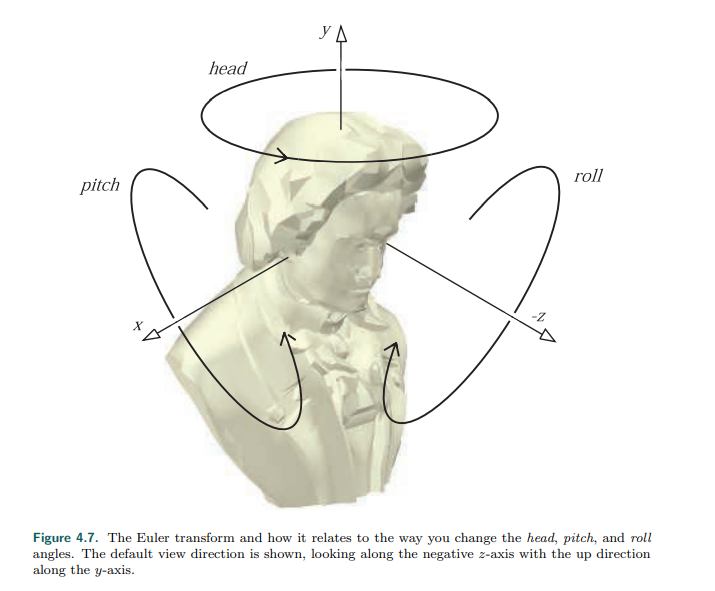

欧拉变换是三个矩阵的乘积，如图中所示的旋转，我们将变换命名为$E$,那么**$E(h,p,r) = R_z(r)R_x(p)R_y(h)$**。因为 $E$ 是多个旋转的连接，则它也是一个旋转矩阵，是正交的。因此它的逆阵可表示为 $E^{-1} = E^T = (R_zR_xR_y)^T = R_y^TR_X^TR_z^T$,当然直接用e的转置更容易。

> 欧拉变换涉及到三个角度，即欧拉角(Euler angles): head, pitch, roll，如图4.7所示。它们分别简称为 $h,p,r$​ ，分别表示应该绕对应的轴旋转的角度。有时它们也会被称为"rolls"，例如，"head"对应"y-roll"，"pitch"对应"x-roll"。"head"有时也会称为"yaw"，表示偏航角。

**怎么记住三个欧拉角各自的作用(对应的轴)?**

> 想像一下，静止状态时一个观察者站立，双臂向两边平伸展开，目视前方，这时如图所示，视线方向为-z(roll),头顶为y(head),右手为+z(pitch),变化head，就是使观察者视线左右转动，即绕y轴旋转head弧度，而变换pitch，则是是视线上下转动，即绕x轴旋转pitch弧度，而变换roll则是让观察者头部倾斜（画个圆）

注意欧拉变换不仅可以用于设置照相机的朝向，也可以设置任何物体或实体的朝向。这些变换可以在全局的世界坐标系下完成，也可以在相对于某个物体的局部坐标系完成。

> 需要注意的是，欧拉角的某些情形下，把z轴作为初始的up direction(即上方向，而我们这里使用y轴作为up direction)。这种差异仅仅是一个符号改变，但可能会令人困惑。在计算机图形学中，如何看待世界(the world)和如何排列内容，有一个区分(a division)或者说有两种方式: y-up或者z-up。大多数生产过程(Most manufacturing processes)，包括3D打印，把z-direction作为世界空间(world space)的up方向。航空和海上运输工具认为−z是up方向。而媒体相关的建模系经常认为y-direction为世界坐系下的up方向，这和图形学中描述照相机屏幕上方向(a camera's screen up direction)的方式一致。在本文中，我们使用y-up。
>
> 这里需要指出**观察空间(view space)**内的**照相机的上方向(camera's up direction)**和**世界空间的上方向(world's up direction)**没有什么特别的关系。毕竟处于两个坐标系中。

尽管对于一些小的角度变化或观察者朝向改变，欧拉角很有用，但是他也有一些严重的限制。比如说同时结合使用两个欧拉角集合是很困难的，比如对两个欧拉角集合之间进行插值不是简单地对两组集合的三个角度进行插值，因为两个不同的欧拉角集合可能给出相同的朝向，此时任何插值都不会旋转物体。因此这些是考虑用[四元数](https://zhuanlan.zhihu.com/p/78987582)(Quaternion)等来代替欧拉角的原因。（我记得learnopgl里面，好像用的就是欧拉角，有限制）

#### 四元数(Quaternion)

如果想要更进一步，那么就不得不提到四元数。四元数最早于1843年由Sir William Rowan Hamilton发明，作为复数(complex numbers)的扩展。直到1985年才由Shoemake把四元数引入到计算机图形学中。四元数在一些方面优于Euler angles(欧拉角)和matrices。任意一个三维空间中的定向(orientation，即调置朝向)都可以被表示为一个绕某个特定轴的旋转。给定旋转轴及旋转角度，很容易把其它形式的旋转表示转化为四元数或者从四元数转化为其它形式。四元数可以用于稳定的、经常性的(constant)的orientations(即旋转)插值，而这些在欧拉角中是很难实现的。

一个复数具有实部和虚部，每一部分由两个实数表示，其中第一个实数要乘以 $\sqrt{-1}$​。相似地，四元数由四部分组成，一个实部，三个虚部。三个虚部与旋转轴密切相关，而旋转角度影响四个部分。

关于四元数，也是一个独立的方向，这里不多赘述

### 投影(projection)

在实际渲染一个场景之前，场景中的所有相关对象都必须要投影到某种平面或者某种简单的立方体里面

#### 正交投影(orthographic projection)

我们先来使用一个图来表示正交投影

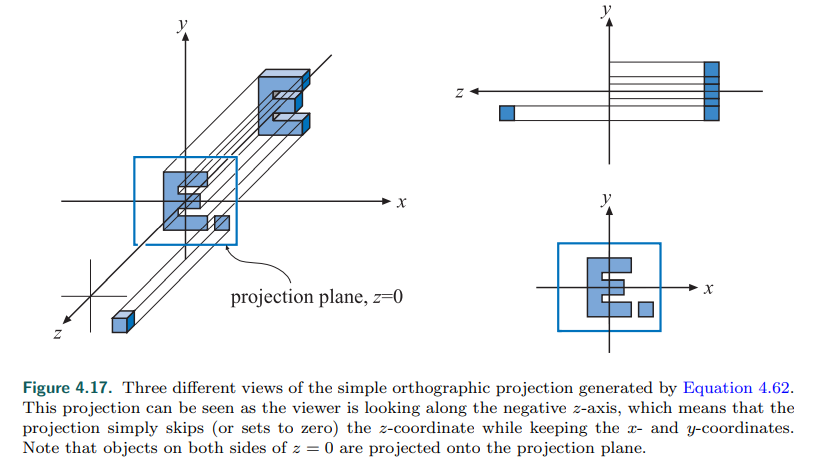

从上面这张图，我们来总结三点

- 摄像机在原点，看向-z轴，y向上
- 丢弃掉z轴的数据
- 平移，然后将最后的结果缩放到[-1,1]

在实际的运用中，我们会使用另外一个方法，使用六元组（six-tuple）,(l,r,b,t,n,f)，简单来说就是使用一个矩形，它们分别表示左，右，下，上，近和远面，我们可以将这个矩形平移到原点，然后缩放，使其符合需求。如图所示

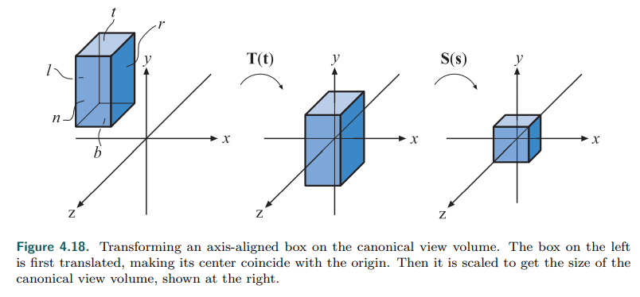

这里需要注意的一点是，n>f。因为我们在这个坐标空间中，我们的视线方向是看向z轴的负方向。通常来说近处的值应该要比远处的值要小，因此可以让用户提供这个值，然后再对他们取反。

由上图我们可以得出正交投影矩阵
$$
M_{ortho} = S(s)T(t) =\left\{
\begin{matrix}
\frac{2}{r-l} &0 &0 &0\\
0 &\frac{2}{t-b} &0 &0\\
0 &0 &\frac{2}{f-n} &0\\
0 &0 &0 &1
\end{matrix}
\right\}
\left\{
\begin{matrix}
1 &0 &0 &-\frac{l+r}{2}\\
0 &1 &0 &-\frac{t+b}{2}\\
0 &0 &1 &-\frac{f+n}{2}\\
0 &0 &0 &1
\end{matrix}
\right\} = 
\left\{
\begin{matrix}
\frac{2}{r-l} &0 &0 &-\frac{l+r}{r-l}\\
0 &\frac{2}{t-b} &0 &-\frac{t+b}{t-b}\\
0 &0 &\frac{2}{f-n} &-\frac{f+n}{f-n}\\
0 &0 &0 &1
\end{matrix}
\right\}\tag{正交}
$$
值得注意的是，如果你是原点对称的一个矩形，甚至直接不用平移

DX将z值深度映射到[0,1]之间，和opengl的[-1,1]区间有所不同，它的正交投影矩阵为
$$
M_{ortho[0,1]}  = \left\{\begin{matrix}
\frac{2}{r-l} &0 &0 &-\frac{r+l}{r-1}\\
0 &\frac{2}{t-b} &0 &-\frac{t+b}{t-b}\\
0 &0 &\frac{1}{f-n} &-\frac{n}{f-n}\\
0 &0 &0 &1
\end{matrix}\right\}
$$

#### 透视投影（Perspective Projection）

一个比正交投影更加复杂的投影就是透视投影，这个是在大部分的计算机图形应用中所运用的。通过透视投影后，平行线大多变得不平行了。并且他们有可能在极端情况下收敛到一个点。透视投影更加接近世界中我们观察世界的方式，即更远的物体更小。

和之前的正交转换一样，我们也有透视转换。但是实际上它并不是将对象投影到一个平面上，二是将视锥体转换到之前提到的规范视图体力。这里假设视锥开始于Z=N，结束于z=f，其中0>n>f,在z=n处的矩形在(l,b,n)处有最小的角，而在(r,t,n)处有最大角。具体可以看图

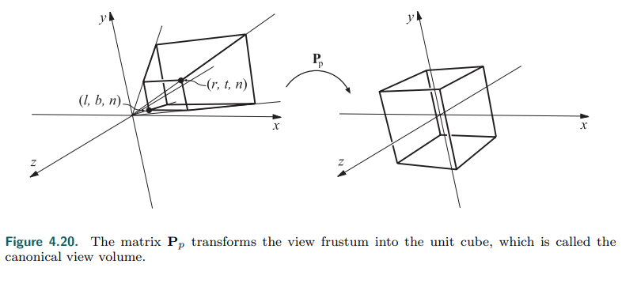

更加形象直观一点的话，就如下图

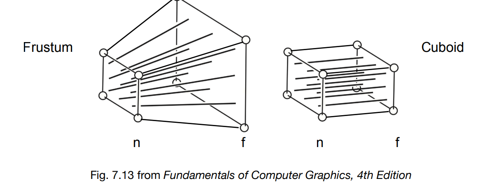

因此，要得出透视投影的矩阵，我们需要做的一件事就是获取透视投影转换到正交投影的小方块，然后再进行一手正交转化

方程的推导过程较为复杂，涉及到很多数学运算证明，这里就直接给出答案

将视锥转换为单位立方体的透视变换矩阵如下:
$$
M_{persp->ortho} = \left\{\begin{matrix}
\frac{2n}{r-l} &0 &-\frac{r+l}{r-l} &0\\
0 &\frac{2n}{t-b} &-\frac{t+b}{t-b} &0\\
0 &0 &\frac{f+n}{f-n} &-\frac{2fn}{f-n}\\
0 &0 &1 &0
\end{matrix}\right\}
$$
接下来，我们需要做的事情就简单了$M_{persp} = M_{ortho}M_{persp->ortho}$。而opengl的透视投影矩阵如下
$$
M_{persp} = = \left\{\begin{matrix}
\frac{2n}{r-l} &0 &\frac{r+l}{r-l} &0\\
0 &\frac{2n}{t-b} &\frac{t+b}{t-b} &0\\
0 &0 &-\frac{f+n}{f-n} &-\frac{2fn}{f-n}\\
0 &0 &-1 &0
\end{matrix}\right\}\tag{opengl}
$$
另外，还有一个更简单的方式来表示，我们首先需要认识两个概念

aspect 宽高比 aspect= r/t

fovY 垂直可视角  $tan\frac{fovY}{2} =\frac{t}{\abs{n}}$

这两个值如图所示

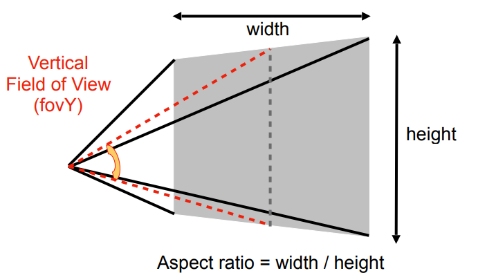

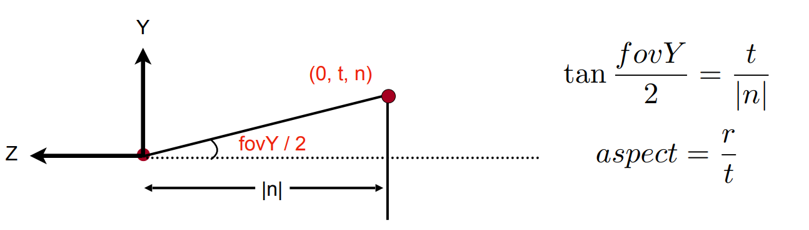

因此，我们假设$c=1.0/\tan(\phi/2)$,可以得出下面的矩阵
$$
M_{persp} = = \left\{\begin{matrix}
\frac{c}{aspect} &0 &0 &0\\
0 &c &0 &0\\
0 &0 &-\frac{f+n}{f-n} &-\frac{2fn}{f-n}\\
0 &0 &-1 &0
\end{matrix}\right\}\tag{opengl}
$$
另外dx的矩阵大概如下图
$$
M_{persp[0,1]}  = \left\{\begin{matrix}
\frac{2n}{r-l} &0 &-\frac{r+l}{r-l} &0\\
0 &\frac{2n}{t-b} &-\frac{t+b}{t-b} &0\\
0 &0 &\frac{f}{f-n} &-\frac{fn}{f-n}\\
0 &0 &1 &0
\end{matrix}\right\}\tag{dx}
$$

### 结语

我们都知道在绘制图像之前都需要进行坐标的转换，无非就是下面三步

- **M**odel transformation (placing objects)  **模型变换**

- **V**iew transformation (placing camera) **视图变换**
- **P**rojection transformation  **投影变换**
  - **正交投影(Orthographic projection)** (转换到一个 ${[-1, 1]}^3$的方形上) 
  - **透视投影(Perspective projection)** (更加复杂的转换到一个 ${[-1, 1]}^3$的方形上) 

这些变换也就是本文的主要内容

