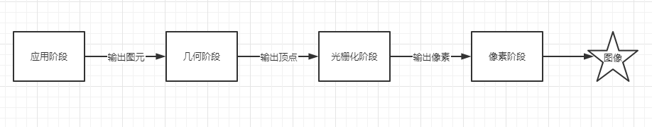
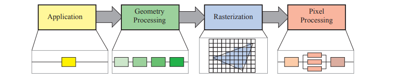
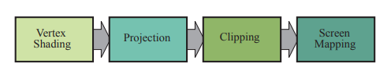
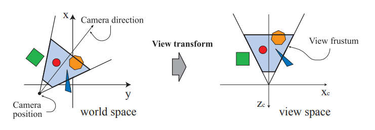
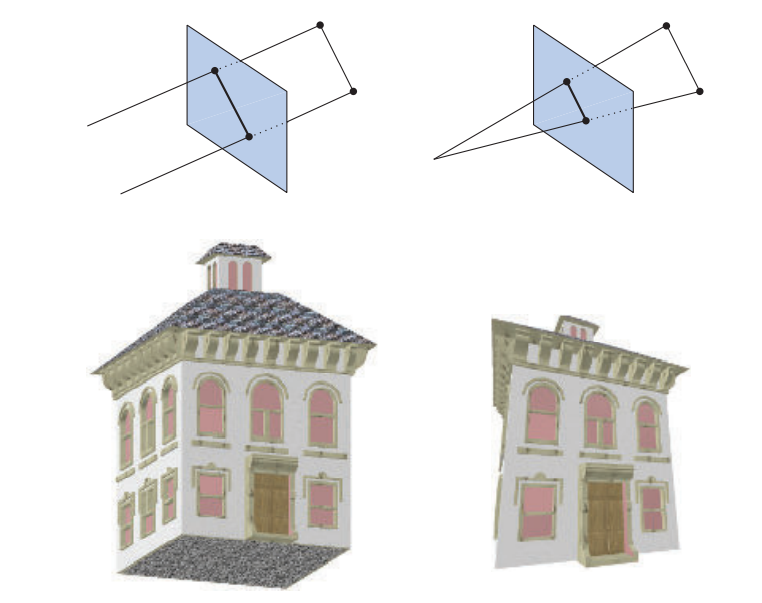
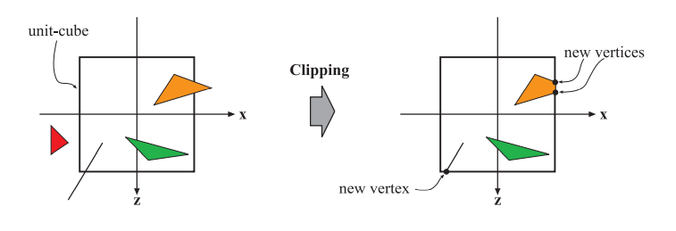
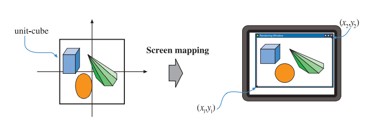
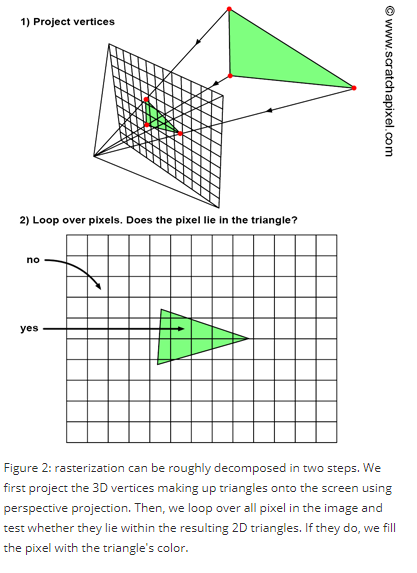
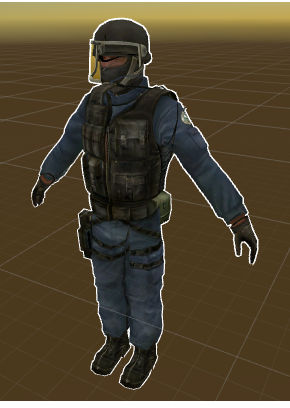
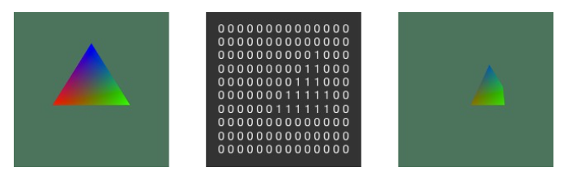

### CPU和GPU

聊到渲染，就离不开渲染管线。那么什么是渲染管线呢？这就要从CPU和GPU的区别开始说起了。和CPU不同，GPU是由NVIDIA公司提出的，和传统CPU不同的，专为图形计算的独立计算单元。可以类比汽车工业的发展，在1913年前福特开发出汽车流水线前，汽车组装只能让一位位工人逐工序完成，年产不过12台，效率极低；而引入了流水线概念后，每位工人只需要做不停地做同一道工序，所有工序并行进行，极大地提高了工厂的生产效率，生产效率提高了8倍。

GPU对图像处理的高效率体现了同样的思路，GPU采用了数量众多的计算单元和超长的流水线，但每一个部分只有非常简单的控制逻辑。而这个流水线，就是我们俗称的渲染管线。而在真正的渲染流程中，GPU和CPU就像是生产的工厂和运货的卡车一样，通力合作渲染出最终的产品：图像

### 渲染管线（Rendering Pipeline)

正如上面提到的，图形渲染管线和普通的工厂流水线一样，都是一个部分流水线主要处理一部分的内容，并且在可以并行计算。而图形渲染可以说大体分为四个阶段：

或者看这个图

1. **应用阶段（application stage）**，这个阶段主要做的工作就是包括了真正使用的软件部分，它能够计算各种我们渲染时需要的数据，有一些物理相关的计算，如碰撞检测，全局加速算法那，动画，物理模拟等等都可以在应用阶段进行计算。
2. **几何处理阶段（Geometry processing）**，这个阶段主要处理变换，投影，等等各种图形处理，这个阶段要决定什么需要渲染（比如说裁剪），在哪里渲染，要怎么渲染，该阶段开始就是在GPU中计算的了
3. **光栅化阶段（rasterization stage）**，光栅化阶段就是将集合处理阶段的顶点数据，转换为我们实际显示需要的像素化的数据，他做的事情就是将找到各个三角形（三角形片元）需要的像素，然后传给下一个阶段
4. **像素处理阶段（pixel processing stage）**,这个阶段就是决定每个像素具体要显示什么颜色，并且可能会计算深度测试判断他是否可见，它还会做一些例如说逐像素的计算，例如说混合颜色等。

每个阶段都是一个独立的流水线。

总体而言，这个流水线的结构分成了四个部分，而之前常看见的(在LearnOPGL里面看到的)，**顶点着色器(vertex shader)=>图元装配（shape assembly）=>几何着色器(geometry)=>=>光栅化（rasterization ）=>测试与混合（test and blending）=>片段着色器（fragment shader）=>光栅化（rasterization ）**这个流水线则是上述四个部分的细化，例如前面的顶点着色器开始就是几何处理阶段，和片段着色器就到了最后的像素处理阶段.

下面，我们将逐一简单介绍每个阶段。

#### 1.  应用阶段（application stage）

​	应用阶段做的事情是开发者可以控制的，这种直接运行的程序。开发者在这里的操作会影响整个渲染过程。例如可以在应用层就可以减少需要渲染的三角形的数量。这个阶段可以做的事情有如下几个例子：

1. **计算着色器（compute shader）**，我们可以将一部分计算交给gpu来运算，利用的是gpu强大的并行运算能力。例如说在戴森球计划里面，为了优化性能，就大量的运用了这一技术。
2. **rendering primitives** ,应用阶段我们将会将需要渲染的数据填充给几何处理阶段的程序，在性能优化阶段，我们常说的减少drawcall就是这个道理，在应用阶段我们会将需要渲染的点，线，三角形数据传递给下一个阶段。（CPU计算通常是并行的，而渲染管线的计算也通常是并行的，这意味着可能可以通过并行阶段同时feed每一个阶段）
3. **碰撞检测**，应用层将会对对象之间的碰撞检测进行计算，这也会影响到某些输入输出
4. 一些优化算法，例如**剔除算法（particular culling）**

​    我们同样用工业流水线进行类比，这一块相当于工厂的产品进口部门，采购员（CPU）联系发货单位（RAM）订购想要的原材料（数据），并经过一番精挑细选拿出自己满意的材料（数据处理，如剔除），把这些材料连同他们的加工方式（如应当使用的着色器）丢给工厂。值得注意的是，由于这一块采购员是与发货单位的商人而不是工厂里的工人交流， 所以他可以使用更复杂的语言（如高级程序语言）与商人讨价还价，而不是像在工厂中向工人发号施令时使用的指令（着色器语言）。

### 2. 几何处理阶段

这个阶段开始，就是由GPU主导的阶段，从这个阶段开始，我们就进入到了之前提到的渲染流水线阶段。在这个阶段里面，我们会将CPU在应用阶段传过来的数据进行进一步的处理，而这个阶段又会分成一个个小的流水线阶段。在这个阶段里，GPU会处理逐三角形（网格）和逐顶点的操作，这部分的内容主要包括有**顶点着色(Vertex Shading)**，**投影(Projection)**，**裁剪(Clipping)**，**屏幕映射(ScreenMapping)**几个方面。在下面的介绍中，投影不会做过多的停留，我会将他放到顶点着色里面稍微提及一下─=≡Σ(((つ•̀ω•́)つ

#### 2.1顶点着色(Vertrx Shading)

顶点着色器是GPU流水线的第一个阶段，也是必须的一个阶段。这一部分是可以完全由开发者所控制的。在顶点着色器中，每次处理顶点都是独立的，不需要额外考虑其他，因此这一步会比较快。顶点着色主要有两个大的作用，一是计算顶点的位置，二是确定程序需要作为顶点输出的部分，例如输出法线和纹理坐标。

在这里，GPU还需要进行**模型转化与相机转换（Model- & Camera transformation）**，在3D渲染中，我们必须要设置一个摄像机来接收图像，这个摄像机的视野决定了GPU最终会让我们看到什么样的画面，为了方便之后的运算，这里还需要根据视锥体（可以理解为摄像机能够看到的范围）将坐标空间由世界空间映射到摄像机的观察空间。

顶点着色的一些知识点的整理

1. 顶点位置的计算方式，首先我们通常需要一组坐标，在显示到屏幕的过程中，一个模型会被变换到各种不同的坐标系或者空间。
   1. 最初，模型的坐标都是基于他自身的模型空间，每个模型都有一个model transform， 这样它才能够定位它自己。由于这个的存在，模型才能在同一个场景下拷贝出相同的结果。
   2. 经过转换，模型会被转换到唯一的世界坐标系中。
   3. 接下来，我们还需要将他转换到照相机的坐标系下，因为只有被摄像机看到的东西，才会被显示。摄像机在世界坐标系中也会有一个坐标来定位。视觉变换矩阵用于设置摄像机位于原点，并且面向Z轴的负方向，这是Y轴向上，而X轴向右，而有的会面向Z轴的正方向，（DX和OPGL），这个坐标系我们称之为view space ,eye space或者camera space
   
2. 渲染的时候，只渲染形状和位置是不足够的，整体模型的外观也是很重要的。比如光的影响，材质的影响。因此顶点处理还会处理一些额外的内容，比如法向数据，颜色数据，纹理坐标等。最后顶点着色的结果会被送去光栅化阶段进行插值处理，而这个处理总体而言会比像素处理效果差一些

3. 顶点着色的过程还会进行一个投影的处理，投影方式包括了正交/平行投影和透视投影。而投影的方式，这两种方式都可以通过一个4*4矩阵来进行计算。经过投影之后，模型可以说进入了裁剪坐标系中。而顶点着色器的输出结果都得在这个坐标系中，这样裁剪才能正常工作。投影过程中，Z值会被存储到Zbuffer中，这个时候就完成了3D转2D的转换

   

#### 2.2 额外的顶点着色处理

有些顶点着色处理有几个了额外步骤：**曲面细分（Tessellation Stage）**。**几何着色（geometry shading）**，**流式输出（stream output）**。当然这个很依赖与GPU，并且不是必须要做的操作。

1. **曲面细分（tessellation）**: 这个操作的作用是，确定一个模型所需要的合理的三角形数目，例如，一个足球模型，在实际场景中它离的很远，如果你使用过多三角形来描述它，就是一种浪费。而这个处理的目的就是选择一个合适的数量的三角形来惊醒渲染。顶点着色之后，我们获取到的其实是一系列顶点数据，而在tessellation过程中，它包括了几个步骤，包括了hull shader,tessellator, domain shader等等，这些会将顶点坐标处理为新的一组数据，用于生成三角形，这样就能确定具体要显示多少个网格的三角形。
2. **几何着色器 （geometry shader）**:几何着色器更为普遍，几何着色器的常见操作例如说模拟一些图像效果例如烟火爆炸，粒子效果等，一个粒子效果，如爆炸，经常被表示为一个点，而几何着色器会将其转换为一个面（通过两个三角形组成），然后使其面对摄像机，这样子就更方便的处理粒子效果 
3. **流式输出（stream output）**: 这个部分让我们将GPU作为一个简单的几何处理器，在这个阶段那我们可以输出这里的数据用于额外用途，这些数据可以被CPU或者后面的GPU操作使用到，这部分内容也会用于粒子系统

这三个阶段的顺序为曲面细分,几何着色，流式输出，而这三个阶段都是任意可选的

#### 2.3 裁剪（Clipping）

裁剪阶段，我们会将不需要渲染的部分给裁减掉，从计算来说，我们会将顶点数据和裁剪矩阵进行计算，从物理角度来说，这是使用一个6面的方块进行了裁切，同时，我们还可以定义一个额外的裁切平面进行裁切

裁剪操作的目的就是把摄像机看不到的顶点剔除出去，使他们不被渲染到。在使用过裁剪之后，部分在视野之外的对象会经过额外的处理，会将在外的部分去掉，然后替换为新的顶点数据。

> 在把不需要的顶点裁剪掉后，GPU需要把顶点映射到屏幕空间，这是一个从三维空间转换到二维空间的操作，更符合大家对“投影”的理解。对透视裁剪空间来说，GPU需要对裁剪空间中的顶点执行齐次除法（其实就是将齐次坐标系中的w分量除x、y、z分量），得到顶点的**归一化的设备坐标（Normalized Device Coordinates, NDC**），经过齐次除法后，透视裁剪空间会变成一个x、y、z三个坐标都在[-1,1]区间内的立方体。对于正交裁剪空间就要简单得多，只需要把w分量去掉即可。此时顶点的x、y坐标就已经很接近于它们在屏幕上所处的位置了，不过还有一个多出来的z分量，不过它也不会被白白丢弃，而是被写入了**深度缓冲（z-buffer）**中,可以做一些有关于顶点到摄像机距离的计算。

#### 2.4 屏幕映射（Screen Mapping）

经过裁剪之后，图像还是处于3D坐标系上，而要显示，则还需要映射到屏幕上,而这个操作就是**屏幕映射（Screen Mapping）**

X,Y,Z都会被映射为一个新的区间[x1,x2] [y1,y2]  [z1,z2] (-1,1)/(0,1) 这个在上面的裁剪阶段中也有提到

接下来我们会将坐标和像素对应，对应方式很简单，像素的中心为0.5(d=floor(c),c=d+0.5)

DX和opengl略有不同

### 3 光栅化(Rasterization )

光栅化阶段，主要包括了图元装配（三角形setup）和三角形遍历，光栅化的过程主要是确定一个像素是否属于一个三角形。

#### 3.1 三角形设置（**Triangle Setup**）/图元装配（Primitive Assembly）

这个过程做的工作就是把顶点数据收集并组装为简单的基本体（线、点或三角形），通俗的说就是把相关的两个顶点“连连看”，有些能构成面，有些只是线，还有一些只是“单身”点

#### 3.2 三角形遍历（Triangle Traversal）

在这个阶段，每个被三角形所覆盖的像素都会被检查，并且一个片元（Fragment/片元）（用于片元着色器）将会在这个阶段中生成。每个三角形片段的生成过程会被称为三角形遍历。每个三角形都是通过顶点数据然后通过插值算法生成的。

当然，并不是所有的像素都会被一个三角形完整地覆盖，有相当多的情况都是一个像素块内只有一部分被三角形覆盖，对于这种情况，有三种解决方案：常用的有**Standard Rasterization**（中心点被覆盖即被划入片元）、**Outer-conservative Rasterization**（只要被覆盖了，哪怕只有一点也被划入片元）、**Inner-conservative Rasterization**（完全被覆盖才会被划入片元）。值得注意的是，片元不是真正意义上的像素，而是包含了很多种状态的集合（譬如屏幕坐标、深度、法线、纹理等），这些状态用于最终计算出每个像素的颜色。

这一阶段牵扯到了**抗锯齿（Anti-aliasing）**操作。因为不管用什么划分片元的方法，三角形边缘部分总会显得很锐利。当然，程序员们也想出了各种各样的抗锯齿方法来解决这个问题，譬如**多重采样抗锯齿（MultiSampling Anti-Aliasing，MSAA）**，这种抗锯齿方法对中心点不在三角形内的边缘处采用不同程度的浓度进行计算。

关于抗锯齿的内容，那也就更多了，之后有机会再写一下。

除此以外，GPU还将对覆盖区域的每个像素的深度进行插值计算。因为对于屏幕上的一个像素来说，它可能有着多个三角形的重叠，所以这一步对于后面计算遮挡、半透明等效果有着重要的作用。

### 4 像素处理（Pixel Processing）

像素处理阶段所处理的像素，是和前面的数据相关联的。这个部分的内容主要分为两个部分，一是**像素着色(Pixel Shading)**，二是**混合（Merging）**

#### 4.1 像素着色(Pixel Shading)/片元着色

像素着色阶段，使用前面阶段计算完成的插值计算后的数据，计算的结果是一个或者多个颜色。然后会传递到下一个阶段，这部分内容是使用可编程的GPU核心之一，因此，这部分的内容可以通过片元着色器来定制化。这部分的核心功能是纹理，纹理映射的意思就是将一张图映射到渲染对象上。

#### 4.2 混合（Merging）

混合阶段主要负责将像素着色阶段的片段颜色和已经保存在颜色缓冲中的数据混合。每个像素的信息都储存在颜色缓冲中，这是一个颜色矩阵。这个阶段也称作**ROP（raster operations pipeline/Raster Operation/ROP-Unit/光栅化处理单元/渲染输出单元）**,这个阶段和完全可以通过编程来定制化的片元着色器不同，他不是完全可定制的，但是高度可配置的。

这个部分还负责处理可见性，即处理什么时候整个场景需要渲染。这就是**深度测试（Depth Test）**对于绝大部分图形硬件来说，这是通过**深度缓冲（Z-BUFFER）**来处理的，z-buffer和颜色缓冲是有相同大小的。Z值代表着离摄像机的远近，因此，z越大，离摄像机就越近。一个z值较小的像素则不会被渲染。然而这个算法是比较简单的，因此不能用来对半透明对象进行计算，因此半透明对象需要一个特别的算法，并且是需要从后往前进行渲染，需在最后来处理这个。基础z-buffer的弱点就是半透明运算。透明度运算也是一个非常蛋疼的问题，不过由于z-buffer足够应付大部分情况，因此它还是广泛的使用

**模版缓冲（*stencil buffer*）**或**印模缓冲** 是另外一种数据缓冲，和深度缓冲类似，它为屏幕上的每一个像素保存一个8位的无符号整数，从片元着色器出来的数据，在进入到深度测试之前，会进行一个模板测试，我们可以通过这个部分来控制进入到颜色缓冲和z-buffer的数据，从而做到丢弃或者保留某些像素的功能。模板缓冲对于实现某些特效特别有用。比如常见的用法如**模型轮廓描边**

一个简单的模板缓冲例子如下：最左侧是原始渲染效果，中间是Stencil Buffer的内容，右侧是根据Buffer剪裁之后的效果。

所有这些功能统称为混合操作，他们就是最终得出三角形的最终颜色的操作。总体而言，该阶段只有有限的可配置的操作，有一些API能够支持可编程的混合能力。

**需要强调一下，虽然本文中模板测试是写在深度测试之后，但是他的执行顺序还是在深度测试之前的**

**帧缓冲（framebuffer）**就是由所有上述系统的buffer组合而成的。当所有图形都通过了光栅化阶段，并显示到屏幕上时，他显示的是颜色缓冲中的内容。这个时候GPU会使用**双重缓冲（Double Buffering）**的策略，即屏幕上显示**前置缓冲（Front Buffer）**，而渲染好的颜色先被送入**后置缓冲（Back Buffer）**，再替换前置缓冲，以此避免在屏幕上显示正在光栅化的图元。这部分的替换通常是在vertical retrace中进行替换的

到这里，就是一个完整的渲染管线流程了，本文内容比较长，牵扯到了许多其他的内容，总体而言，只是对渲染管线的一个简单介绍，而这个流水线中具体详细的功能，每一个都是值得探究的。

参考文献：

很多没来得及整理