虽然计算机的发展速度很快，性能也越来越好，但是渲染任务的繁重程度也在增加。

在实时渲染中，我们至少有四个性能目标：更多的每秒帧数、更高的分辨率和采样率、更高的分辨率和采样率。更逼真的材料和照明。
以及增加几何的复杂性。一般来说，每秒60-90帧的速度是被认为是足够快了。
即使有运动模糊，可以降低图像质量所需的帧率，仍然需要快速的帧率，以尽量减少与场景互动时的延迟。

### 一、空间数据结构（Spatial Data Structures）

空间数据结构（Spatial Data Structures）是将几何体组织在N维空间中的一系列数据结构。这些空间数据结构可以用于很多实时渲染相关操作的加速查询中，如场景管理，裁减算法、相交测试、光线追踪、以及碰撞检测等。

空间数据结构的组织通常是层次结构的。宽泛地说，即最顶层包含它之下的层次，后者又包含更下层的层次，以此类推。因此，这种结构具有嵌套和递归的特点。

用层次结构的实现方式对访问速度的提升很有帮助，复杂度可以从O(n)提升到O(log n)。但同时，使用了层次结构的大多数空间数据结构的构造开销都比较大，虽然也可以在实时过程中进行渐进更新，但是通常需要作为一个预处理的过程来完成。

一些常见的空间数据结构包括：

- 层次包围盒（Bounding Volume Hierachy，BVH）
- 二元空间分割树（Binary Space Partitioning，BSP），
- 四叉树
- kd树
- 八叉树（Octree）
- 场景图 （Scene Graphs）

其中，BSP树和八叉树都是基于空间细分（Space Subdivision）的数据结构，这说明它们是对整个场景空间进行细分并编码到数据结构中的。例如，所有叶子节点的空间集合等同于整个场景空间，而且叶子节点不相互重叠。

BSP树的大多数变种形式都是不规则的，而松散地意味着空间可以被任意细分。

八叉树是规则的，意味着空间是以一种均匀的形式进行分割，虽然这种均匀性限制比较大，但这种均匀性常常是效率的源泉。另外值得注意的是，八叉树是四叉树的三维空间推广。

另一方面，层次包围盒不是空间细分结构，它仅将几何物体周围的空间包围起来，所以包围层次不需要包围所有的空间。

#### 1、层次包围盒BVH | Bounding Volume Hierarchies

层次包围盒（Bounding Volume Hierarchies, BVH）方法的核心思想是用体积略大而几何特征简单的包围盒来近似地描述复杂的几何对象，从而只需对包围盒重叠的对象进行进一步的相交测试。此外，通过构造树状层次结构，可以越来越逼近对象的几何模型，直到几乎完全获得对象的几何特征。

对于三维场景的实时渲染来说，层次包围体（Bounding Volume Hierarchy，BVH）是最常使用的一种空间数据结构。例如，层次包围体经常用于层次视锥裁减。场景以层次树结构进行组织，包含一个根节点（root）、一些内部节点（internal nodes），以及一些叶子节点（leaves）。顶部的节点是根，其无父节点。叶子节点（leaf node）包含需渲染的实际几何体，且其没有子节点。

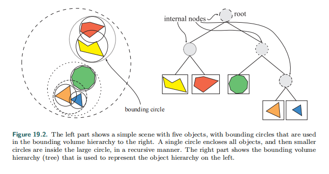

#### 2、BSP树 | BSP Trees

BSP树(二叉空间分割树，全称Binary Space Partitioning Tree)是一种常用于判别对象可见性的空间数据结构。类似于画家算法，BSP树可以方便地将表面由后往前地在屏幕上渲染出来，特别适用于场景中对象固定不变，仅视点移动的情况。

BSP 树是一棵二叉树，每个节点表示一个有向超平面，其将当前空间划分为前向（front）和背向（back）两个子空间，分别对应当前节点的左子树和右子树。

BSP树有一些不同的实现，如多边形对齐的BSP树 轴对齐BSP树(k-D树)

**BSP树的遍历**

从根节点开始，判断输入位置与当前分割平面的“前”、“后”关系，

“前”则遍历左子树，“后”则遍历右子树，递归到叶子节点终止。下图展示的是三种不同的树

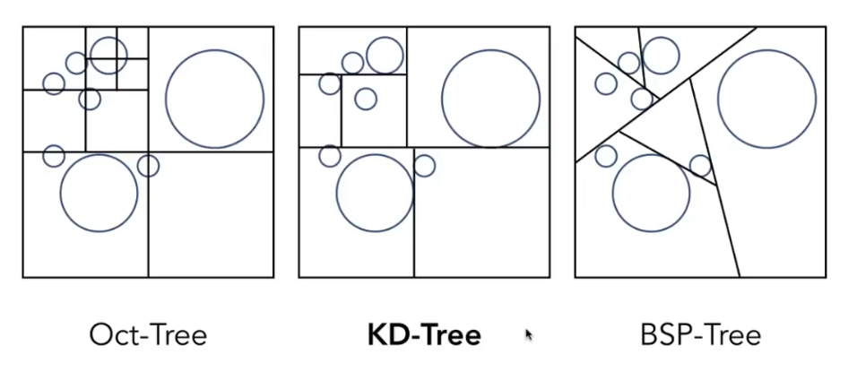

#### 3、八叉树 | Octrees

八叉树（octree），或称八元树，是一种用于描述三维空间的树状数据结构。八叉树的每个节点表示一个正方体的体积元素，每个节点有八个子节点，这八个子节点所表示的体积元素加在一起就等于父节点的体积。一般中心点作为节点的分叉中心。

简单来说，八叉树的空间划分方式很简单，即递归地进行规整地1分为8的操作。如下图，把一个立方体分割为八个同样大小的小立方体，然后递归地分割出更的小立方体。这个就是八叉树的命名来源。这种分割方式可以得到比较规则的结构，从而使得查询变得高效。

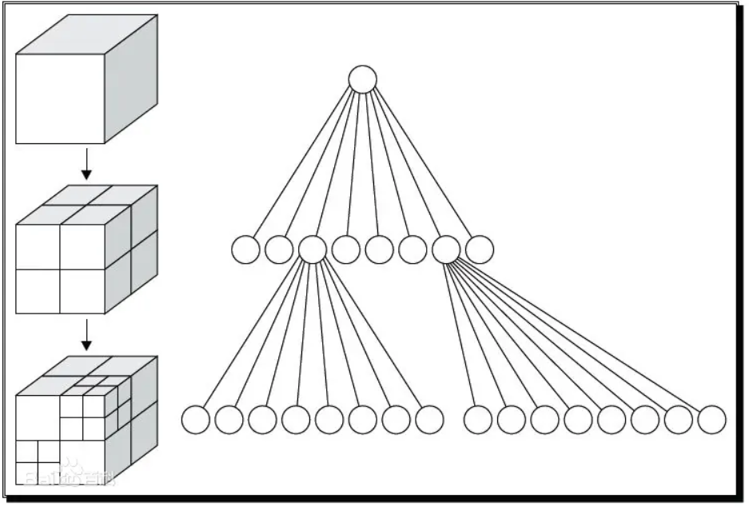

**松散八叉树**

松散四叉树边长的公式修改为：

L(depth)=k∗W/(2depth)

节点的间距依旧与传统八叉树保持一致。这意味着同层节点的包围盒会相互重叠，如图所示：

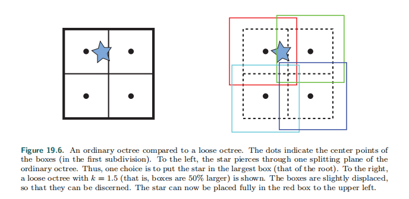

而k值的选择就是一个比较重要的问题，k值过小则无法体现松散八叉树减少粘性区域的优势，k值过大则会导致包围体过于松散。一般k值等于2。这样可以有个重要性质：如果一个对象的大小小于等于一个节点的大小（内边界），那这个对象的中心点在这个节点内边界范围内，就能保证这个对象是在这个节点的松散包围体内。

#### 4、场景图 | Scene Graphs

BVH、BSP树和八叉树都是使用某种形式的树来作为基本的数据结构，它们的具体区别在于各自是如何进行空间分割和几何体的存储，且他们均是以层次的形式来保存几何物体。然而三维场景的绘制不仅仅是几何体。

然而，渲染三维场景不仅仅只是渲染出几何图形，对动画，可见性，以及其他元素的控制，往往需要通过场景图（Scene Graphs）来完成。这在glTF中被称为节点层次结构。这是一个面向用户的树状结构，它由纹理、可见性和其他元素组成。纹理、变换、细节层次、渲染状态（例如，材料属性）、光源以及其他任何合适的东西。它是由一棵树表示的。这棵树以某种顺序被遍历以渲染场景。比如说。一个光源可以被放在一个内部节点上，它只影响其子树的内容。另一个例子是在树中遇到了一个材质。该材质可以应用于该节点子树中的所有几何体，或者可能被子树的设置所覆盖。

场景图被誉为“当今最优秀且最为可重用的数据结构之一。”Wiki中的对场景图的定义是“场景图（Scene Graph）是组织和管理三维虚拟场景的一种数据结构，是一个有向无环图（DirectedAcyclic Graph， DAG）。”

场景图是一个面向用户的树结构，可以通过纹理、变换、细节层次、渲染状态（例如材质属性）、光源以及其他任何合适的内容进行扩充。它由一棵以深度优先遍历来渲染整个场景的树来表示。

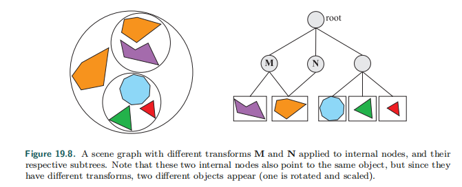

另外提一句，开源的场景图有Open Scene Graph和OpenSG等，有兴趣的朋友们可以进行进一步了解。

### 二、裁剪技术 | Culling Techniques

裁剪（Culling）的字面意思是“从大量事物中进行删除”。在计算机图形学中，相对应的就是裁剪技术（Culling Techniques）所要做的工作——“从大量游戏事物中进行删除”。所谓的“大量事物”就是需要绘制的整个场景，删除的是对最终图像没有贡献的场景部分，然后将剩余场景发送到渲染管线。因此，在渲染方面通常使用“可见性裁剪（Visibility Culling）”这个术语。但其实，裁剪也可以用于程序的其他部分，如碰撞检测（对不可见物体进行不十分精确的计算）、物理学计算，以及人工智能（AI）领域。

与渲染相关的裁剪技术，常见的有背面裁剪（Backface Culling），视锥裁剪（View Frustum Culling），以及遮挡裁剪（Occlusion Culling，也常常称作遮挡剔除）。

- 背面裁剪即是将背向视点的物体删除，是一种非常简单直观的操作，只能一次一对个单一多边形进行操作。
- 视锥裁剪是将视锥之外的多边形删除，相对而言，这种操作比背面裁剪稍微复杂。
- 遮挡裁剪，是将被其他物体遮挡的物体进行删除，这种操作在三者中最为复杂，因为其需要聚集一个或者多个物体，同时还需使用其他物体的位置信息。

下图是三种裁剪技术的对比

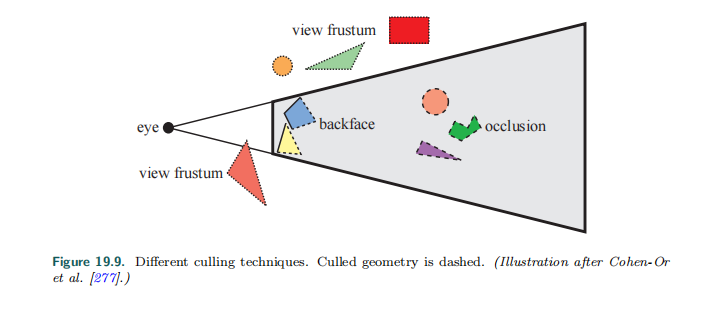

#### 1. 背面裁剪 | Backface Culling  

假设你正在观察一个场景中不透明的球体。大约有一半的球体是不可见的。那么，可以从中这个例子里得到一个众所周知的结论，那就是，对不可见的内容不需要进行渲染，因为它们对最终的渲染图像没有贡献。

不需要对球体的背面进行处理，这就是背面裁剪的基本思想。对于一组物体来说，还可以一次性地进行背面裁剪，这也称为聚集背面裁剪（Clustered Backface Culling）。

#### 2. 层次视锥裁剪| Hierarchical View Frustum Culling

如上文所示，只需对完全或者部分在视锥中的图元进行渲染。一种加快渲染速度的方法便是将每个物体的包围体与视锥进行比较，如果包围体位于视锥之外，那么便不需要渲染包围体中的几何体。由于这些计算在CPU上进行，因此包围体中的几何体不需要通过管线中的几何和光栅阶段。相反，如果包围体在视锥内或者与视锥相交，那么包围体中的内容就是可见的，所以必须发送到渲染管线中去。

利用空间数据结构，可以分层地来应用这种裁剪。例如，对于层次包围体BVH来说，从根节点进行先序遍历（Preorder Transversal），就可以完成这一任务。

视锥裁剪操作位于应用程序阶段（CPU），这意味着几何阶段和光栅阶段都可以从中受益，对于大场景或者一定的相机视线来说，场景只有一小部分是可见的，只需要将这部分发送到渲染管线。可期望获得一定的加速效果，视锥裁剪技术利用了场景中的空间相关性，因为可以将彼此靠近的物体包围在一个包围体中，而且几乎所有包围体都是以层次形式聚集在一起。

除了层次包围体，其他的空间数据结构同样也可以用于视锥裁剪，包括上文提到的八叉树和BSP树。但是当渲染动态场景时，这些方法便会显得不够灵活,不如层次包围体。

#### 3. 入口裁剪 | Portal Culling

对建筑物模型来说，很多裁剪方面的算法可以归结为入口裁剪（Protal Culling）。在这个方向，最早的算法由Airey提出，随后Teller和Sequin，以及Teller和Hanrahan构造出了更高效，更复杂的算法。

入口裁剪算法的基本思想是，在室内场景中，建筑物墙面通常充当大的遮挡物，通过每个入口（如门或者窗户）进行视锥裁剪。当遍历入口的时候，就减小视锥。

使得与入口尽可能紧密贴合。因此，可以将入口裁减算法看作是视锥裁剪算法的一种扩展，且需将位于视锥之外的入口丢弃。

入口裁剪方法以某种方式对场景进行预处理，可以是自动形式，也可以是手动形式，可以将场景分割为一系列单元（Cells），其通常对应于建筑物中的房间或者走廊；链接进阶房间的门和窗口称为入口（Protals）。单元中的每个物体和单元的墙面可以存储在一个与单元关联的数据结构中，还可以将邻接单元和链接这些单元的入口信息保存在一个临接图中。

单元分别从A到H，入口是连接单元的通路，只对穿过入口能看到的几何体进行渲染。

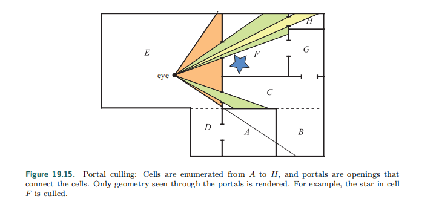

#### 4. 遮挡剔除 | Occlusion Culling

遮挡裁剪（Occlusion Culling），也常被称作遮挡剔除。

聊一聊遮挡剔除必要性。不难理解，可见性问题可以通过Z缓冲器的硬件构造来实现，即使可以使用Z缓冲器正确解决可见性问题，但其中Z缓冲并不是在所有方面都不是一个很“聪明”的机制。例如，假设视点正沿着一条直线观察，其中，在这条直线上有10个球体，虽然这10个球体进行了扫描转换，同时与Z缓冲器进行了比较并写入了颜色缓冲器和Z缓冲器，但是这个从这个视点渲染出的图像只会显示一个球体，即使所有10个球体都将被光栅化并与Z缓冲区进行比较，然后可能写入到颜色缓冲区与Z缓冲区。

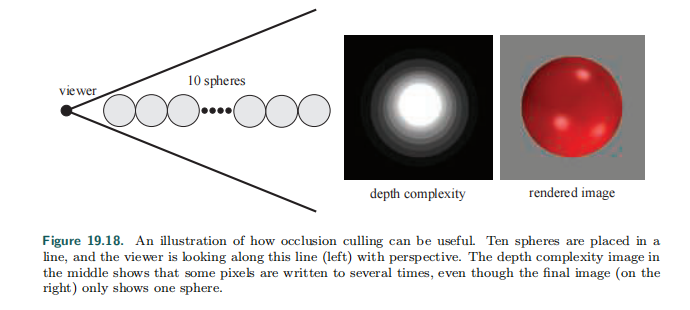

这种遮挡在现实生活中却很常见，如热带雨林，发动机，城市，以及摩天大楼的内部。

这种用来避免低效率的算法可以带来速度上的补偿，具体可以将这些方法归类为遮挡裁剪算法（Occlusion Culling Algorithms），因为它们都试图裁剪掉被遮挡的部分，也就是被场景中其他物体遮挡的物体，最优的遮挡裁剪算法只选择其中可见得的部分。

有两种主要形式的遮挡裁剪算法，分别是基于点的遮挡裁剪和基于单元的遮挡裁剪

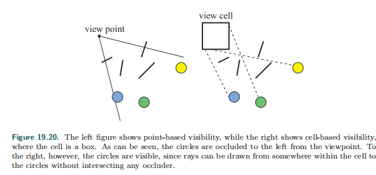

### 三、层次细节 | LOD，Level of Detail

细节层次（Level of Detail,LOD）的基本思想是当物体对渲染出图像贡献越少，使用越简单的形式来表达该物体。这是一个已经在各种游戏中广泛使用的基本优化技术。这点大家应该是耳熟能详的。

例如，考虑一个包含1万个三角形的牛，其中所包含的细节信息比较丰富。当视点靠近物体时，可以使用详细的细节表示，而当视点远离物体时，比如仅需覆盖200个像素，则完全无需渲染出1百万个三角形，相反，我可以使用诸如只有1000个三角形的简化模型。而由于距离的原因，简化后的模型与细节较丰富的模型看上去其实很接近。以这种方式，可以显著地提高渲染的性能开销。

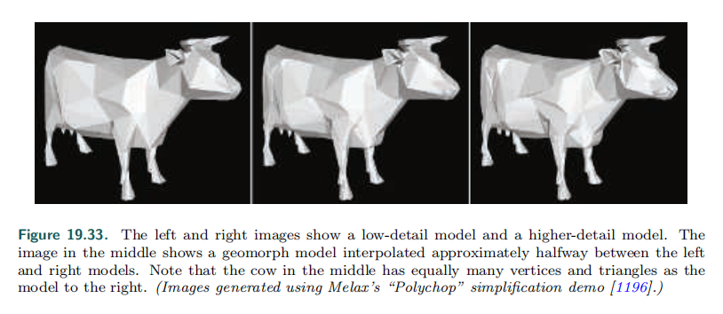

通常情况下，雾效会与LOD一起使用。这样我们可以完全跳过对一些物体的渲染，直接用不透明的雾来进行遮挡。另外，雾效的机制可以实现下文所介绍到的Time-Critical LOD Rendering。通过将元平面移近观察者，可以更早地剔除对象，并且可以实现更快速的渲染以保持帧速率。

一般情况下，完整的LOD算法包含3个主要部分：

- 生成Generation
- 选择Selection
- 切换Switching

其中，LOD的生成就是生成不同细节的模型表示。RTR3书中12.5节中讨论的简化方法可用于生成所需数量的LOD。另一种方法是手工制作具有不同数量的三角形模型。选择机制就是基于某种准则选取一个层次细节模型，比如屏幕上的评估面积。最后，我们还需要从一个细节层次转换到另一个细节层次，而这个过程便称为LOD切换。

#### 基于距离的LOD选取 |Range-Based

选取LOD的一种常用方法是将物体的不同LOD于不同距离联系起来。细节最丰富的LOD的距离从0到一个用户定义值r1之间，下次层次的LOD的距离位于r1~r2之间，以此类推，如下图：

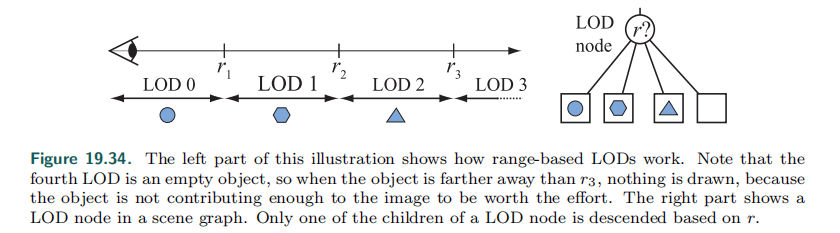

### 四 问题定位

#### 一、渲染管线的瓶颈定位策略

##### 1.1 光栅化操作的瓶颈定位

**光栅化操作的瓶颈主要与帧缓冲带宽（Frame-Buffer Bandwidth）相关**。众所周知，位于管线末端的光栅化操作（Raster Operations，常被简称为ROP），用于深度缓冲区和模板缓冲区的读写、比较，颜色缓冲区读写颜色，以及进行alpha 混合和测试。光栅化操作中许多负载都加重了帧缓冲带宽负载。

**测试帧缓冲带宽是否是瓶颈所在，比较好的办法是改变颜色缓冲的位深度，或深度缓冲的位深度（也可以同时改变两者）**。如果此操作（比如将颜色缓冲或深度缓冲的位深度从32位减少到16位）明显地提高了性能，那么帧缓冲带宽必然是瓶颈所在。

另外，帧缓冲带宽也与GPU显存频率（GPU memory clock）有关，因此，修改该频率也可以帮助识别瓶颈。

##### 1.2 片元着色器的瓶颈定位

片元着色关系到产生一个片元的实际开销，与颜色和深度值有关。这就是运行”像素着色器（Pixel Shader ）“或”片元着色器（Fragment Shader ）“的开销。片元着色（Fragment shading）和帧缓冲带宽（Frame-Buffer Bandwidth）由于填充率（Fill Rate）的关系，经常在一起考虑，因为他们都与屏幕分辨率相关。尽管它们在管线中位于两个截然不同的阶段，区分两者的差别对有效优化至关重要。

**片元着色器的是否是瓶颈所在可以通过改变屏幕分辨率来测试**。如果较低的屏幕分辨率导致帧速率明显上升，片元着色器则是瓶颈，至少在某些时候会是这样。当然，如果是渲染的是LOD系统，就需斟酌一下是否瓶颈确实是片元着色器了。

片元着色的速度与GPU核心频率有关。

##### 1.3 纹理带宽的瓶颈定位

**在内存中出现纹理读取请求时，就会消耗纹理带宽(Texture Bandwidth)。**

***过程：***从显存读取纹理到GPU的纹理高速缓冲区，尽管现代GPU的纹理高速缓存设计旨在减少多余的内存请求，但纹理的存取依然会消耗大量的内存带宽。

**缩小纹理尺寸，改变纹理过滤方式，如果此修改显著地改善性能，则意味着纹理带宽是瓶颈限制。**

纹理带宽也与GPU显存频率相关。

##### 1.4 点着色器的瓶颈定位

渲染管线中的***顶点着色器，主要工作是坐标变换，逐顶点光照和输出后续阶段所需的数据***。输入一组顶点属性（如模型空间位置、顶点法线、纹理坐标等等），输出一组适合裁剪和光栅化的属性（如齐次裁剪空间位置，顶点光照结果（正向渲染），纹理坐标等等）。当然，这个阶段的性能与每个顶点完成的工作，以及正在处理的顶点数量有关。

**如果减少顶点着色器的指令数量，帧率有明显变化，则说明瓶颈在顶点着色器，这种情况一般不会出现。**

**如果减少顶点数量，帧率有明显变化，则说明瓶颈可能在顶点过多，或顶点AGP传输限制，此时可能通过模型LOD来解决问题。**

另外需要注意，顶点处理的速度与GPU核心频率有关。

##### 1.5 顶点与索引传输的瓶颈定位

GPU渲染管线的第一步，是让GPU获取顶点和索引。而GPU获取顶点和索引的操作性能取决于顶点和索引的实际位置。其位置通常是在系统内存中（通过AGP或PCI Express总线传送到GPU），或在局部帧缓冲内存中。**如果在顶点着色器中访问纹理会比较慢，瓶颈可能在顶点着色器（Shader Model 3.0）。**

#### 二. 优化策略

##### 2.1 使用批处理

​       使用批处理技术减少DrawCall数目。批处理技术原理是减少每帧需要的DrawCall数目，即每次调用DrawCall时尽可能的处理多个物体。**过多的DrawCall影响绘制的原因：**主要是每次绘制时，CPU通过底层图像编程接口发出渲染命令DrawCall，而每个DrawCall需要很多准备工作，检测渲染状态、提交渲染数据、提交渲染状态，而GPU本身可以很快处理完渲染任务。DrawCall过多，CPU负载过多，而GPU性能闲置。

**CPU发送DrawCall需要完成的操作：**

- ***CPU可以向GPU发送命令以将多个已知的变量统一地转换为渲染状态。此命令称为SetPass调用***。SetPass调用告诉GPU用于渲染下一个网格的设置。仅当要渲染的下一个网格需要从前一个网格更改渲染状态时，才会发送SetPass调用。
- CPU将绘图调用发送到GPU。绘图调用指示GPU使用最近的SetPass调用中定义的设置呈现指定的网格。
- 在某些情况下，一个批次可能有多次Pass。对于批次中的每个Pass，CPU必须发送新的SetPass调用，然后必须再次发送DrawCall。

**同时，GPU执行以下工作：**

- GPU按照发送顺序处理来自CPU的任务。
- 如果当前任务是SetPass调用，则GPU更新渲染状态。
- 如果当前任务是DrawCall，则GPU渲染网格。这是分阶段发生的，由着色器代码的不同部分定义。渲染的这一部分很复杂，我们不会详细介绍它，但是我们理解一段称为顶点着色器的代码告诉GPU如何处理网格的顶点，然后是一段代码称为片段着色器告诉GPU如何绘制单个像素。
- 重复此过程，直到GPU处理完所有从CPU发送的任务为止。

##### 2.2 减少需要的顶点数目

**（1）优化模型，尽可能的减少三角形的面数，移除不必要的硬边及纹理衔接，避免边界平滑和纹理分离。**

**（2）使用模型的LOD技术**

**（3）使用遮挡剔除技术**

**（4）Camera.layerCullDistances**

**（5）视椎体越小越好，注意远裁减面的距离**，顶点数量最多80k-100k之间

**（6）Culling Mask ，剔除不需要渲染的层，减少性能开销**

**（7）使用视椎体检测，裁剪场景中不需要渲染的特效。**

##### 2.3 优化光照计算

光照计算可以通过多种方式进行优化：

- 实时光源越少越好，甚至不用实时光
- 利用离线烘焙，light mapping
- Spotlight（聚光灯）开销很大，少用
- 限制像素光的数量
- Culling Mask ，取消不需要进行光照计算的层
- 谨慎使用实时阴影
- 尽量用Hard Shadow
- 减少Shadow Distance
- 不用Shadow Castcade

##### 2.4 加速片元着色

如果你正在使用长而复杂的片元着色器，那么往往瓶颈就处于片元着色器中。若果真如此，那么可以试试如下这些建议：

- **优先渲染深度。**在渲染主要着色通道（Pass）前，先进行仅含深度的通道（depth-only (no-color) pass）的渲染，能显著地提高性能，尤其是在高深度复杂性的场景中。因为这样可以减少需要执行的片元着色量，以及帧缓冲存储器的存取量，从而提高性能。而为了发挥仅含深度的通道的全部优势，仅仅禁用颜色写入帧缓冲是远远不够的，同时也应该禁用所有片元的着色，甚至禁用影响到深度以及颜色的着色（比如 alpha test）。
- **帮助early-z优化（即Z缓冲优化），来避免多余片元处理 。**现代GPU配有设计良好的芯片，以避免对被遮挡片元的着色，但是这些优化依赖场景知识。而以粗略地从前向后的顺序进行渲染，可以明显提高性能。以及，先在单独的pass中先渲染深度，通过将着色深度复杂度减少到1，可以有效地帮助之后的pass（主要的昂贵的shader计算的位置）进行加速。
- **把纹理作为查找表( lookup tables)，存储数据。**其实非常好用，而且可以无消耗地过滤它们的结果。一个典型例子便是单位立方体贴图，它仅允许以一个单一纹理查找的代价来高精度地对任意向量进行标准化。
- **将更多每片元的工作移到顶点着色器。**对于优化的大方向而言，正如顶点着色器中的每个物体的计算量工作应该尽可能地移到CPU中一样，每顶点的计算也应该尽量被移到顶点着色器（连同在屏幕空间中线性插值计算）。常见的例子包括计算向量和坐标系之间的变换向量。
- **使用必需的最低精度。**诸如DirectX之类的API允许我们在着色器代码中指定精度，以减少精度高所带来的额外计算量。很多GPU都可以利用这些提示来减少内部精度以及提高性能。
- **避免过度归一化（Normalization）**。在写shader时，对每个步骤的每个矢量都进行归一化的习惯，常常被调侃为“以归一化为乐（Normalization-Happy）”。这个习惯通常来说其实是不太好的习惯。我们应该意识到不改变长度的变换（例如标准正交基上的变换）和不依赖矢量长度的计算（例如正方体贴图的查询）是完全没必要进行归一化后再进行的。
- **考虑使用片元着色器的LOD层次细节。**虽然片元着色器的层次细节不像顶点着色器的层次细节影响那么大（由于投射，在远处物体本身的层次细节自然与像素处理有关），但是减少远处着色器的复杂性和表面的通道数，可以减少片元处理的负载。
- **在不必要的地方禁用三线性过滤。**在现代GPU结构的片元着色器中计算三线性过滤(Trilinear filtering)，即使不消耗额外的纹理带宽，也要消耗额外的循环。在mip级别转换不容易辨别的纹理上，关掉三线性过滤，可以节省填充率。

**补充：**

LUT（Look Up Table）指的是“颜色查找表”，是原始颜色通过LUT的颜色查找表映射到新的色彩上去。是单独针对色彩空间的一种管理和转换。

##### 2.5 优化帧缓冲带宽

管线的最后阶段，**片元操作或光栅化操作，与帧缓冲存储器直接衔接，是消耗帧缓冲带宽的主要阶段**。因此如果带宽出了问题，经常会追踪到光栅化操作。下面几条技巧将讲到如何优化帧缓冲带宽。

- **首先渲染深度。**这个步骤不但减少片元着色的开销，也会减少帧缓冲带宽的消耗。
- **减少Alpha混合，尽量不要使用Alpha测试。**当alpha混合的目标混合因子非0时，则要求对帧缓冲区进行读取和写入操作，因此可能消耗双倍的带宽。所以只有在必要时才进行alpha混合，并且要防止高深度级别的alpha混合复杂性。
- **在移动平台，渲染透明物体，Alpha混合性能比Alpha测试更好。**
- **尽可能关闭深度写入。**深度写入会消耗额外的带宽，应该在多通道的渲染中被禁用（且多通道渲染中的最终深度已经在深度缓冲区中了）。比如在渲染alpha混合效果（例如粒子）时，也比如将物体渲染进阴影映射时，都应该关闭深度写入。另外，渲染进基于颜色的阴影映射也可以关闭深度读取。
- **避免无关的颜色缓冲区清除。**如果每个像素在缓冲区都要被重写，那么就不必清除颜色缓冲区，因为清除颜色缓冲区的操作会消耗昂贵的带宽。但是，只要是可能就应该清除深度和模板缓冲区，这是因为许多早期z值优化都依赖被清空的深度缓冲区的内容。
- **默认大致上从前向后进行渲染。**除了上文提到的片元着色器会从默认大致上从前向后进行渲染这个方法中受益外，帧缓冲区带宽也会得到类似的好处。早期z值硬件优化能去掉无关的帧缓冲区读出和写入。实际上，没有优化功能的老硬件也会从此方法中受益。因为通不过深度测试的片元越多，需要写入帧缓冲区的颜色和深度就越少。
- **优化天空盒的渲染。**天空盒经常是帧缓冲带宽的瓶颈，因此必须决定如何对其进行优化，以下有两种策略：
  （1）最后渲染天空盒，读取深度，但不写入深度，而且允许和一般的深度缓冲一起进行早期early-z优化，以节省带宽。（2）首先渲染天空盒，而且禁用所有深度读取和写入。
  以上两种策略，究竟哪一种会节省更多开销，取决于目标硬件的功能和在最终帧中有多大部分的天空盒可见。如果大部分的天空盒被遮挡，那么策略（1）更好，否则，策略（2）可以节省更多带宽。
- **仅在必要时使用浮点帧缓冲区。**显然，这种格式比起较小的整数格式来说，会消耗更多的带宽，所以，能不用就不用。对多渲染目标( Multiple Render Targets，MRT)也同样如此。
- **尽可能使用16位的深度缓冲区。**深度处理会消耗大量带宽，因此使用16位代替32位是极有好处的，且16位对于小规模、不需要模板操作的室内场景往往就足够了。对于需要深度的纹理效果，16位深度缓冲区也常常足够渲染，如动态的立方体贴图。
- **尽可能使用16位的颜色。**这个建议尤其适用于对纹理的渲染效果，因为这些工作的大多数，用16位的颜色能工作得很好，例如动态立方体贴图和彩色投射阴影贴图。

##### 2.6 减少计算复杂度

**（1）使用Shader的LOD技术**

Shader的LOD技术可以控制使用的Shader等级。原理是只有Shader的LOD值小于某个设定值，这个Shader才会被使用。在某些情况下，我们可能需要去掉一些使用复杂计算的Shader渲染。这时，我们可以使用Shader.maximumLOD或Shader.globalMaximumLOD来设置允许的最大LOD值。

**（2）代码方面的优化**

- 尽可能使用低精度的浮点值进行计算。
- 使用插值寄存器把数据从顶点着色器传递给下一个阶段时，应该使用尽可能少的插值变量。
- 尽量不要使用全屏的屏幕后处理效果，如果真的需要使用，尽量使用低精度计算，高精度计算可以使用查找表（LUT）或者转移到顶点着色器中进行处理。
- 尽可能不要使用分支或循环语句。
- 尽可能避免使用类似sin、tan、pow、log等较为复杂的数学计算，请考虑使用查找纹理（lookup texture， LUT）作为复杂数学计算的替代方法。

##### 2.7 对内存的优化策略

节省内存带宽

**（1）减少纹理大小，考虑目标分辨率和纹理坐标，长宽值最好是2的整数幂。这样很多优化策略才可以发挥最大效用。**

**（2）针对不同平台，采用压缩纹理来减少纹理大小，可以加快加载速度，减少内存占用，显著提高渲染性能。**

**（3）利用Mip Maps优化显存带宽，但此规则例外的是：UI元素或2D游戏中，不要使用（内存消耗）。**

**（4）对于特定机型进行分辨率缩放，Screen.SetResolution **

​	