说起着色模型，我们就得聊一下，什么是着色。在我个人理解来看，着色就是确定屏幕中某一个像素的颜色的过程。在实际的绘制过程中，决定一个像素颜色的因素有很多。如下图中，一个像素的颜色取决于光照，自身的材料，如杯子是瓷的，墙壁是凹凸不平的石灰，桌子是光滑的木头桌等等。将光照具体拆分具体拆分一下，则分为镜面反射，漫反射和环境光。而这些影响因素综合起来，就会得出我们最后的像素的颜色，如高光就是白色等等。而计算这些东西的一个整体的方式，就是一个着色模型的工作，**用来描述对象的颜色如何被各种因素如表面方向，视图方向，照明等因素的变化所影响**。需要提一点的是，**着色和阴影无关**

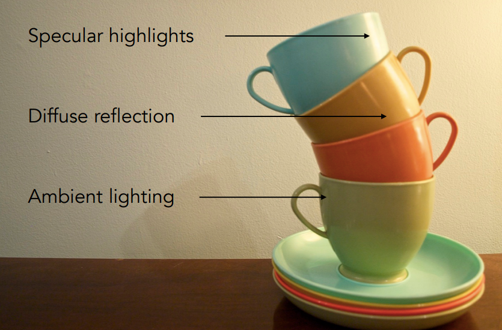

### 一个简单的着色模型-Blinn-Phong Reflectance Model

上面我们聊到了着色模型，这里我们使用Blinn-Phong Reflectance Model来进行着色模型的介绍。还是以上面的茶杯为例，一个着色点（shadingpoint）需要考虑它的颜色，那么它需要考虑下图中的几个属性

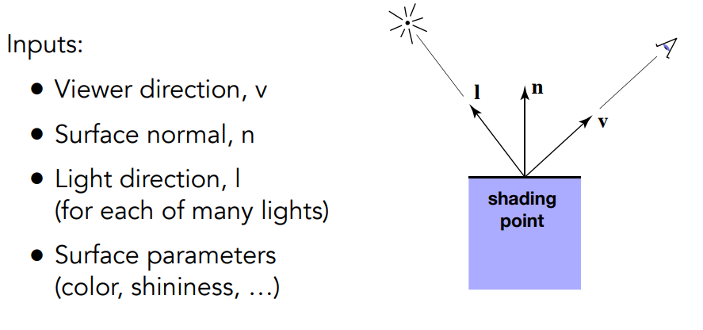

图中的属性包括，观察方向，表面法线，光照方向，以及表面系数，表面系数影响的东西很多，包括表面颜色，各种反射系数等等。

#### 漫反射（Lambertian (Diffuse)）

漫反射的特点是光线均匀地散射到各个方向，即所有观察方向的表面颜色都是一样的。计算漫反射的影响，我们需要考虑光线方向和着色点的夹角的问题。因为这会影响到这个点接收到的光的强度，我们可以通过兰伯特余弦定律来进行计算，如下图所示

另外，光线随着距离会有能量上的衰减，其衰减和距离光源距离成平方反比

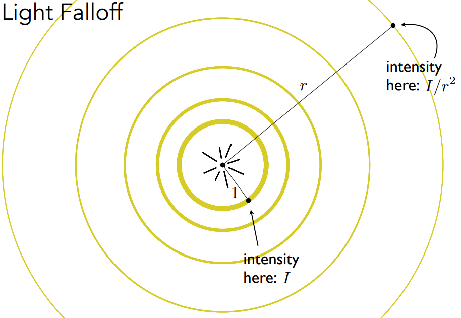

因此我们可以得出兰伯特漫反射着色（Lambertian (Diffuse) Shading）的公式如下$L_d=k_d(I/r^2)max(0,n·l)$其中，漫反射系数，一般来说以纹理颜色来做系数，而后面计算中要和max做一个大小对比的原因是由于超过180°的夹角没有意义

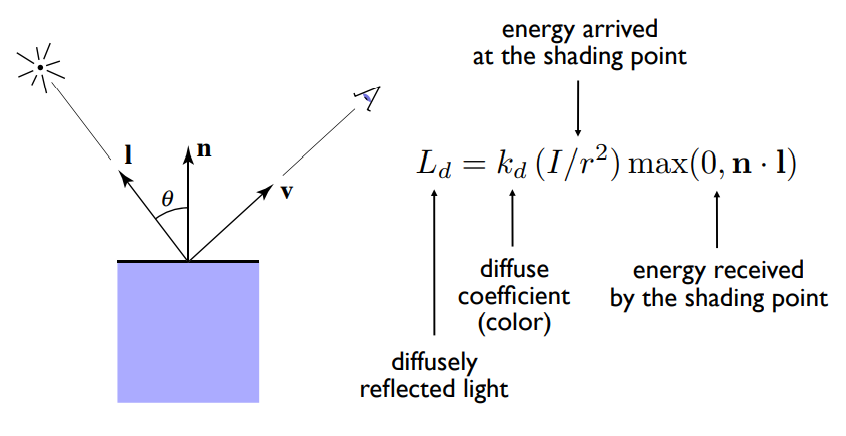

#### 镜面反射(Blinn-Phong)

镜面反射的特点是高光，并且区域范围小。我们这里直接给出公式$L_s = k_s(I/r^2)max(0,n·h)^p$。

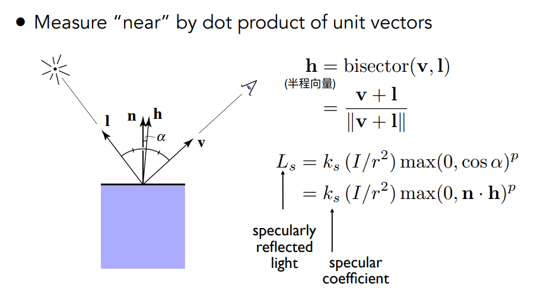

这里很聪明的用半程向量和法线的夹角来确定方向的影响。而镜面反射和观察方向是有关的，半程向量和法向量的夹角，效果和反射方向与观察方向的夹角效果一致。这里需要注意的一个点就是，这里使用p次方的原因是，镜面反射在你移动一点点的角度时，反射强度就会发生剧烈的变化，而使用p次方，则可以模拟这种剧烈的变化。如下图所示

#### 环境光

环境光，在我们的模型中是一个近似的，假的值，其公式如下$L_a=k_aI_a$

#### 最终值

求出上面三个不同的值之后，我们将其混合，最后就可以得到完整的光照效果了。
$$
L=L_a+L_d+L_s \\
=k_aI_a+k_d(I/r^2)\max(0,n·l)+k_s(I/r^2)\max(0,n·h)^p
$$

### 着色方式

着色方式，我们这里直接说明主要有三个

1. **Flat shading 即按照每个三角形进行着色**，也就是说，每个平面求法向量，这样渲染出来的结果就是非光滑的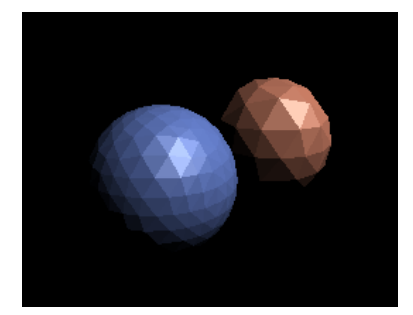
2. **Gouraud shading** 即对每个顶点进行着色，然后中间使用插值的做法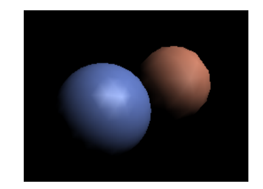
3. **Phong shading**，即每个像素的着色，我们会对三角形进行法线的插值，所以每个像素都会进行完全的着色运算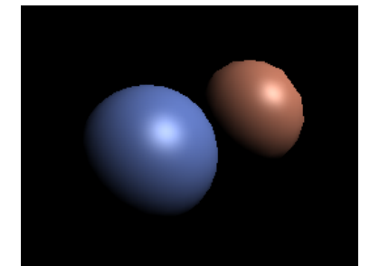

在实际渲染中，真正的渲染效果其实还是和模型复杂度有关，当顶点/三角形达到了一定数量的时候，大家的渲染效果会接近，如果说三角形的数量都大于像素数量了，可想而知，逐像素的渲染可能消耗也不是那么大

我们之前提到了，逐顶点的着色和逐像素的着色都要顶点法线，那么顶点法线怎么求呢，有一个简单的办法，即将该顶点周边的三角形法线进行一个平均就好了，当然每个面有大有小，因此我们可以进行的是一个加权平均

逐像素的着色需要进行一个插值，而这个插值方法是**Barycentric interpolation**（重心坐标插值）

### 渲染管线

写过了，跳过

### 纹理映射

所谓纹理映射，我们就可以将它理解为在任意3d物体的一个表面点，在一个2d的纹理/采样图 中，能够找到他的对应值的一个操作。在渲染中，每一个三角形顶点都能够对应到一个纹理坐标（u，v）

另外，在纹理映射中，不同的点可以映射到同一个uv中，例如说一个砖墙的纹理，可能就是一个小纹理然后重复到贴满。

#### 重心坐标

首先先来定义一下重心坐标，重心坐标，即用一个坐标表示三角形中的一个点，
$$
(x,y) = \alpha A+\beta B+\gamma C\\
\alpha +\beta +\gamma = 1
$$
我们定义，A，B，C三点的坐标分别为 (1,0,0)，(0,1,0)，(0,0,1),而三角形中心的坐标则是1/3A+1/3B+1/3C。重心坐标的的公式如下

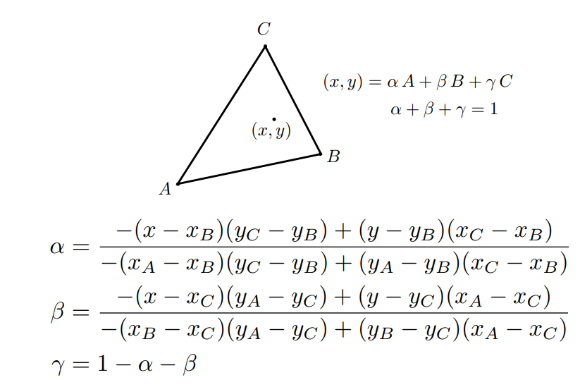

因此，使用了重心坐标之后，我们对线性插值的方法就出来了
$$
V=\alpha V_A+\beta V_B+\gamma V_C
$$
其中，V可以使位置，纹理坐标，法线，深度，等等等等

**需要注意的是，重心坐标没有投影不变性，因此如果想要投影后的数据保持正确，需要对投影后的坐标处理才行**

#### 纹理的应用

纹理的应用，简单来说就是目前这个点的坐标，获取到纹理坐标，然后取颜色，然后赋值，完了。那么我们需要考虑一个问题，当纹理的分辨率过小的时候该怎么办？

例如说我们有一个4K的图像，而我们的纹理只有256*256，那么放大的结果，就必然会有没法取到具体的某个像素，即取到一个非像素中心的坐标。这个非像素中心的坐标要怎么处理呢？最简单的一个方法就是就近原则，取最近的那个像素的颜色，那么就会导致一个问题,就是锯齿

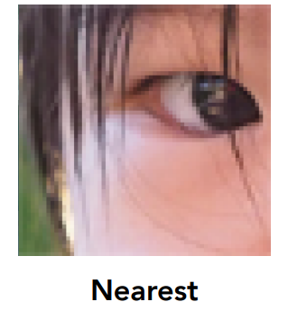

那么为了处理这个问题，我们当然就是需要将它变得平滑，要平滑的话很简单，做一个插值。

##### 双线性插值（Bilinear interpolation）

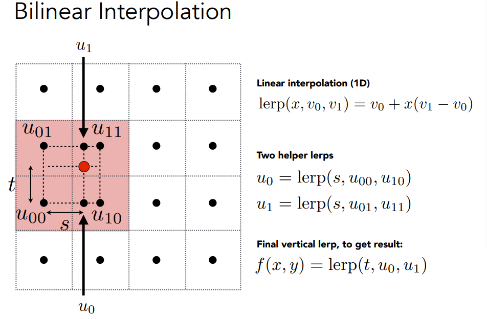

上图中的方法是双线性插值，这个方法主要过程如下

1. 找到四个周围的点
2. 确定偏移范围s,t，这里的s,t是以左下角的像素为中心
3. 做两次插值，找到在s方向上和采样点相同的两个点u1.u2
4. 对u1,u2做第二次插值，获取到真实采样点的颜色

这里的双线性，指的是第三步和第四步

当然，双线性插值的效果还可以继续提升，比如说可以使用**Bicubic**插值，取周围16个点，每次用四个的插值方式，效果会更好，当然，计算成本成倍提升了。下图是对比，主要区分在眼角处

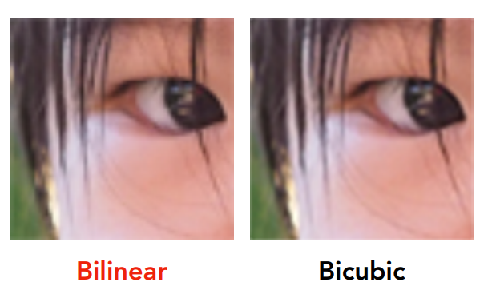

##### mipmap

说完纹理过小的情况，我们就需要说一下纹理过大的情况了，当纹理过大，我们就会出现下面的情况，即摩尔纹和锯齿

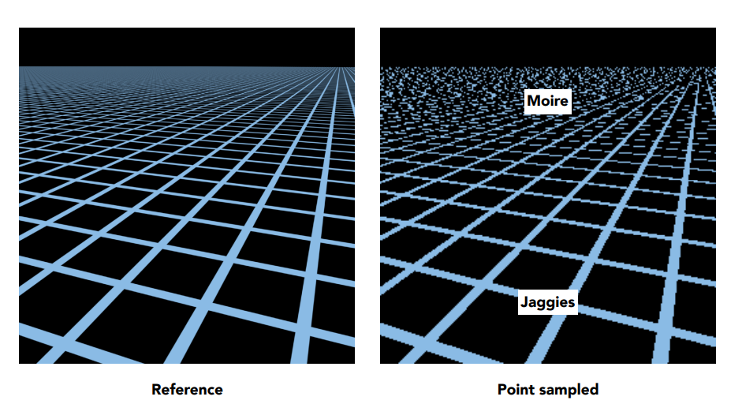

这个原因很好理解，在远处，我们一个像素所占的纹理的像素就更多了，如图所示,左边是上采样，即放大图像，右边是降采样，即缩小图片

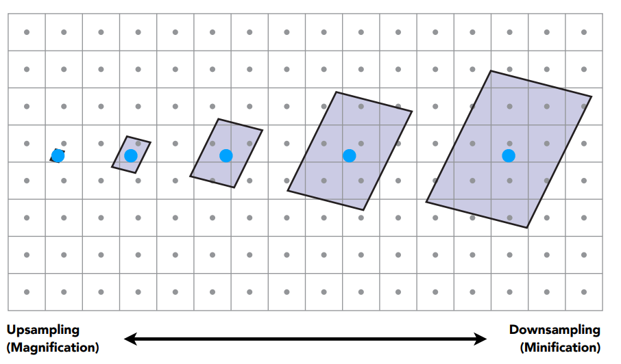

要处理这个问题，该怎么办呢，首先想到的就是抗锯齿中的增加采样频率，这确实可以起到作用，但是开销就会变得很大

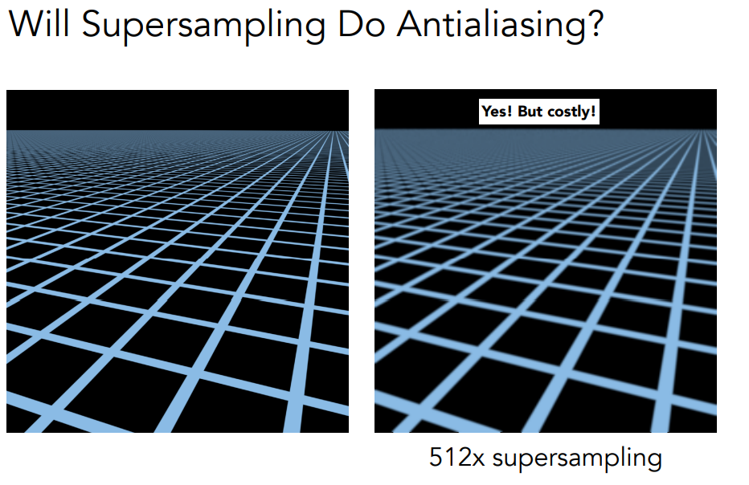

从频率的角度分析，当图片被缩小之后，每个像素中，信号的频率就会变得过大，即颜色变化过大，因此更大的采样频率就能解决问题。但是从另外一个角度，在纹理采样的角度，我们不需要这么高的频率的数据，那我们将这个范围的数据取个平均，不就解决了问题。

为了提高速度，我们引入了一个快速近似的方法，就是Mipmap，mipmap是多层级结构，我们可以理解为一层就将图像缩小1/2，示意图如下

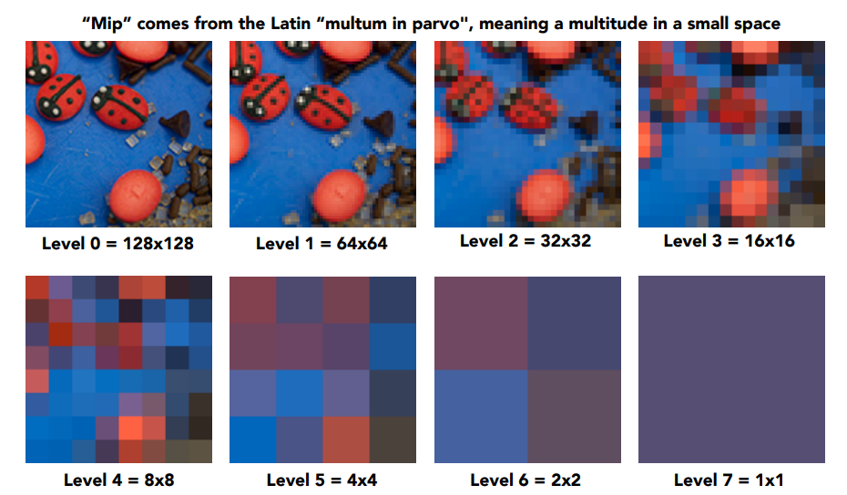

**mipmap 的特点是快，只能采样方形区域，提前计算，需要消耗额外1/3的存储量**

mipmap的采样机制如下

我们使用采样点和采样点周边的三个点的纹理坐标，计算出覆盖的方形区域的长度，然后通过这个长度了，来判断使用哪一级的的mipmap等级D，如果非整数的话，我们可以简单的使用最近的整数级别，然后选择对应的取值。当然，这样的取值还是有问题的，因为这样颜色会有突变和锯齿，

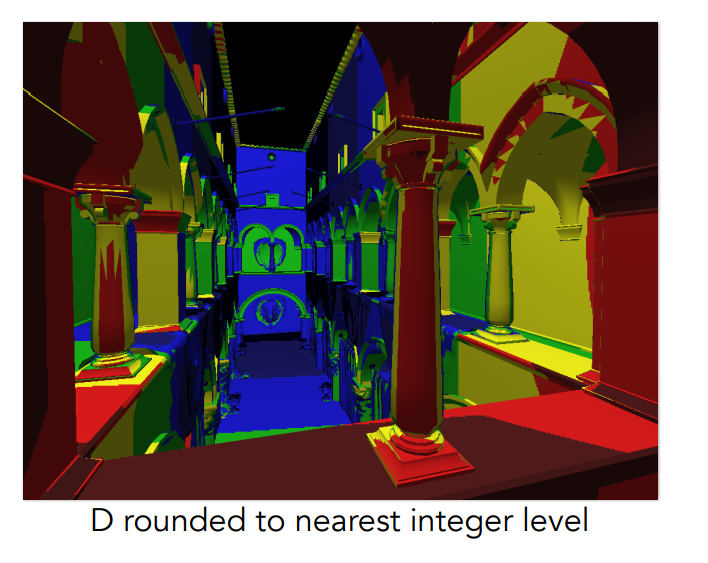

##### 三线性插值（Trilinear Interpolation）

为了处理这种情况，我们还是要使用我们的老办法，插值

mipmap可以使用**三线性插值（Trilinear Interpolation）**，我们在等级D的mipmap中得到一个双线性插值的结果，再从D+1级的mipmap中取到一个双线性插值的结果，然后再对这两个结果进行一个插值，从而得到一个需要的中间结果

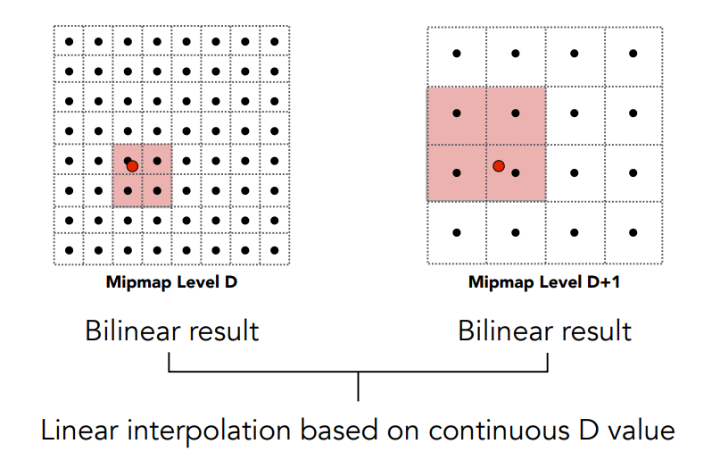

经过这样的处理之后，我们就会得到一个明显更柔和的结果了

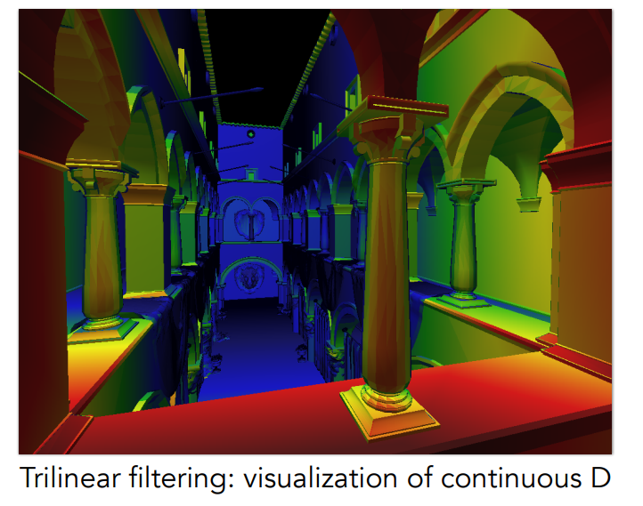

##### 各向异性过滤（Anisotropic Filtering）

当然，mipmap并不是一个能够完全解决这个问题的解决方案，例如上面提到的摩尔纹的问题。可能就会overblur

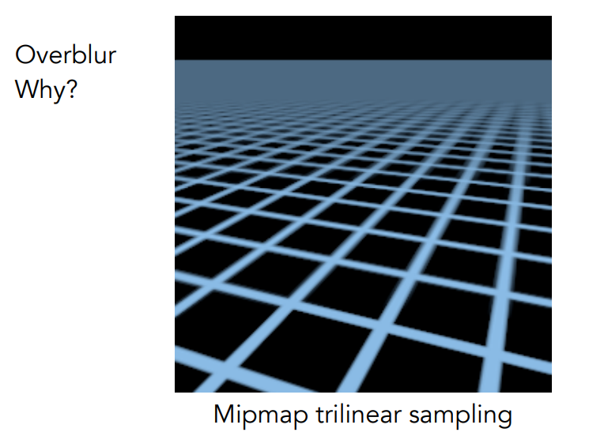

为什么会有这个问题呢，我们前面提到，mipmap的取值是近似的一个正方形区域对于一些不规则形体的情况下，就会出现过渡模糊的情况，如下图

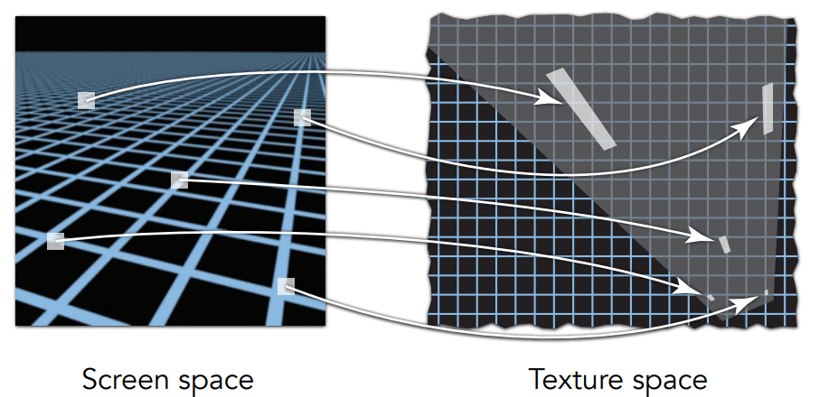

这个时候，我们可以有一个更近一步的解决方案，那就是**各向异性过滤（Anisotropic Filtering）**

和mipmap不同，各向异性过滤不仅仅会保存等比例缩小的结果，它还会保存x,y的结果，这种做法使其的取值范围为一个矩形。但是这种做法的同样无法处理上图中的对角线形式的情况。因此再进一步的话，有ewa过滤这种方法。当然，效果越好，性能开销就会越大，例如各向异性过滤的方法，就会是3倍的开销

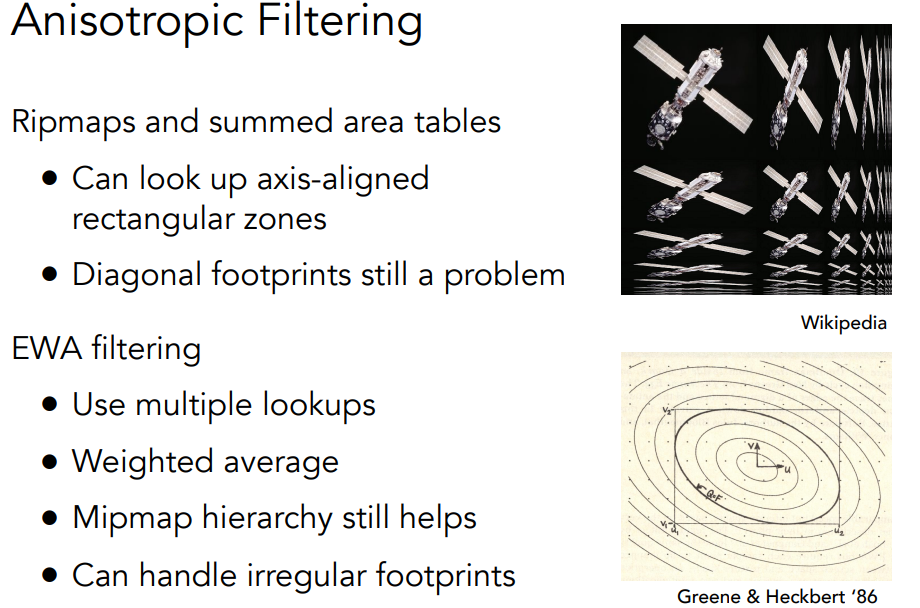

