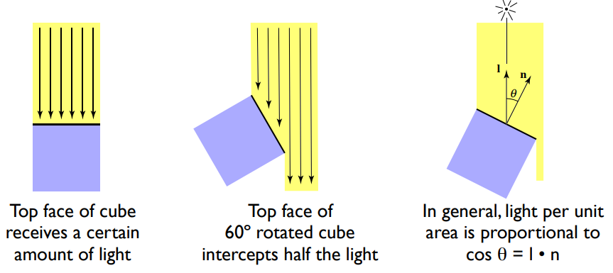

说起着色模型，我们就得聊一下，什么是着色。在我个人理解来看，着色就是确定屏幕中某一个像素的颜色的过程。在实际的绘制过程中，决定一个像素颜色的因素有很多。如下图中，一个像素的颜色取决于光照，自身的材料，如杯子是瓷的，墙壁是凹凸不平的石灰，桌子是光滑的木头桌等等。将光照具体拆分具体拆分一下，则分为镜面反射，漫反射和环境光。而这些影响因素综合起来，就会得出我们最后的像素的颜色，如高光就是白色等等。而计算这些东西的一个整体的方式，就是一个着色模型的工作，**用来描述对象的颜色如何被各种因素如表面方向，视图方向，照明等因素的变化所影响**。需要提一点的是，**着色和阴影无关**

### 一个简单的着色模型-Blinn-Phong Reflectance Model

上面我们聊到了着色模型，这里我们使用Blinn-Phong Reflectance Model来进行着色模型的介绍。还是以上面的茶杯为例，一个着色点（shadingpoint）需要考虑它的颜色，那么它需要考虑下图中的几个属性

图中的属性包括，观察方向，表面法线，光照方向，以及表面系数，表面系数影响的东西很多，包括表面颜色，各种反射系数等等。

#### 漫反射（Lambertian (Diffuse)）

漫反射的特点是光线均匀地散射到各个方向，即所有观察方向的表面颜色都是一样的。计算漫反射的影响，我们需要考虑光线方向和着色点的夹角的问题。因为这会影响到这个点接收到的光的强度，我们可以通过兰伯特余弦定律来进行计算，如下图所示

另外，光线随着距离会有能量上的衰减，其衰减和距离光源距离成平方反比

因此我们可以得出兰伯特漫反射着色（Lambertian (Diffuse) Shading）的公式如下$L_d=k_d(I/r^2)max(0,n·l)$其中，漫反射系数，一般来说以纹理颜色来做系数，而后面计算中要和max做一个大小对比的原因是由于超过180°的夹角没有意义

#### 镜面反射(Blinn-Phong)

镜面反射的特点是高光，并且区域范围小。我们这里直接给出公式$L_s = k_s(I/r^2)max(0,n·h)^p$。

这里很聪明的用半程向量和法线的夹角来确定方向的影响。而镜面反射和观察方向是有关的，半程向量和法向量的夹角，效果和反射方向与观察方向的夹角效果一致。这里需要注意的一个点就是，这里使用p次方的原因是，镜面反射在你移动一点点的角度时，反射强度就会发生剧烈的变化，而使用p次方，则可以模拟这种剧烈的变化。如下图所示

#### 环境光

环境光，在我们的模型中是一个近似的，假的值，其公式如下$L_a=k_aI_a$

