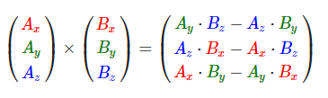
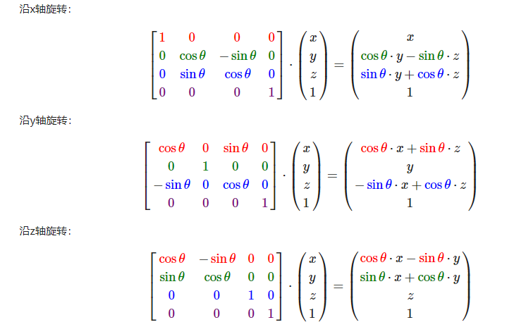
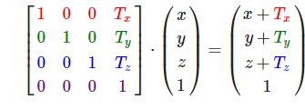
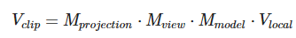

## 第一节 创建窗口
### mainpoint
* 视口`viewpoint`，类似于摄像机的口，在这里我们使用`glViewPoint`来设置
* 双缓冲`doublebuffer`，双缓冲的作用是后缓冲保存好数据，前缓冲显示
* 缓冲位`buffer bit`，分别有颜色缓冲`GL_COLOR_BUFFER_BIT`、像素缓冲、深度缓冲`GL_DEPTH_BUFFER_BIT`、模板缓冲`GL_STENCIL_BUFFER_BIT`
## 第二节 三角形
### mainpoint
* 顶点数组对象：Vertex Array Object，VAO<br>
  顶点缓冲对象：Vertex Buffer Object，VBO<br>
  索引缓冲对象：Element Buffer Object，EBO或Index Buffer Object，IBO<br>
* 2D坐标和像素也是不同的，2D坐标精确表示一个点在2D空间中的位置，而2D像素是这个点的近似值，2D像素受到你的屏幕/窗口分辨率的限制。
* 渲染管线： 3D坐标需要转化为2D的像素，渲染管线实际上指的是一堆原始图形数据途经一个输送管道，期间经过各种变化处理最终出现在屏幕的过程，渲染管线实际上做了两件事情
    * 一是将3D图形坐标转换为2D的坐标
    * 二是将2D坐标转化为带有颜色的2D像素。
    * 图形渲染管线接受一组3D坐标，然后把它们转变为你屏幕上的有色2D像素输出。图形渲染管线可以被划分为几个阶段，每个阶段将会把前一个阶段的输出作为输入。
      1. 所有这些阶段都是高度专门化的（它们都有一个特定的函数），并且很容易并行执行。正是由于它们具有并行执行的特性，当今大多数显卡都有成千上万的小处理核心，它们在GPU上为每一个（渲染管线）阶段运行各自的小程序，从而在图形渲染管线中快速处理你的数据。这些小程序叫做着色器(Shader)。
      2. 有些着色器允许开发者自己配置，这就允许我们用自己写的着色器来替换默认的。这样我们就可以更细致地控制图形渲染管线中的特定部分了，这个就是所谓的可编程管线
      3. 整体过程大致如下 顶点数据`Vertex Data`=>顶点着色器`Vertex Shader`=>图元装配`Shape assembly`=>几何着色器`GeometryShader`=>光栅化`Rasterization`=>片段着色器`Fradment Shader`=>测试和混合`Test and Blending`
         1. 图形渲染管线的第一个部分是顶点着色器(Vertex Shader)，它把一个单独的顶点作为输入。顶点着色器主要的目的是把3D坐标转为另一种3D坐标（估计是世界坐标系），同时顶点着色器允许我们对顶点属性进行一些基本处理。
         2. 图元装配(Primitive Assembly)阶段将顶点着色器输出的所有顶点作为输入（如果是GL_POINTS，那么就是一个顶点），并所有的点装配成指定图元的形状；本节例子中是一个三角形。
         3. 图元装配阶段的输出会传递给几何着色器(Geometry Shader)。几何着色器把图元形式的一系列顶点的集合作为输入，它可以通过产生新顶点构造出新的（或是其它的）图元来生成其他形状。例子中，它生成了另一个三角形。
         4. 几何着色器的输出会被传入光栅化阶段(Rasterization Stage)，这里它会把图元映射为最终屏幕上相应的像素，生成供片段着色器(Fragment Shader)使用的片段(Fragment)。**在片段着色器运行之前会执行裁切(Clipping)**。裁切会丢弃超出你的视图以外的所有像素，用来提升执行效率。
         5. **片段着色器的主要目的是计算一个像素的最终颜色**，这也是所有OpenGL高级效果产生的地方。**通常，片段着色器包含3D场景的数据（比如光照、阴影、光的颜色等等），这些数据可以被用来计算最终像素的颜色。**`OpenGL中的一个片段是OpenGL渲染一个像素所需的所有数据。
         6. 在所有对应颜色值确定以后，最终的对象将会被传到最后一个阶段，我们叫做Alpha测试和混合(Blending)阶段。**这个阶段检测片段的对应的深度（和模板(Stencil)）值（后面会讲），用它们来判断这个像素是其它物体的前面还是后面，决定是否应该丢弃。这个阶段也会检查alpha值（alpha值定义了一个物体的透明度）并对物体进行混合(Blend)。所以，即使在片段着色器中计算出来了一个像素输出的颜色，在渲染多个三角形的时候最后的像素颜色也可能完全不同。**
* OpenGL是一个3D图形库，所以我们在OpenGL中指定的所有坐标都是3D坐标（x、y和z）。OpenGL不是简单地把所有的3D坐标变换为屏幕上的2D像素；OpenGL仅当3D坐标在3个轴（x、y和z）上都为-1.0到1.0的范围内时才处理它。所有在所谓的**标准化设备坐标(Normalized Device Coordinates)范围内的坐标**才会最终呈现在屏幕上（在这个范围以外的坐标都不会显示）。
* glVertexAttribPointer函数的参数非常多，所以我会逐一介绍它们`glVertexAttribPointer(0, 3, GL_FLOAT, GL_FALSE, 3 * sizeof(float), (void*)0);`：
  第一个参数指定我们要配置的顶点属性。还记得我们在顶点着色器中使用layout(location = 0)定义了position顶点属性的位置值(Location)吗？它可以把顶点属性的位置值设置为0。因为我们希望把数据传递到这一个顶点属性中，所以这里我们传入0。
  第二个参数指定顶点属性的大小。顶点属性是一个vec3，它由3个值组成，所以大小是3。
  第三个参数指定数据的类型，这里是GL_FLOAT(GLSL中vec*都是由浮点数值组成的)。
  下个参数定义我们是否希望数据被标准化(Normalize)。如果我们设置为GL_TRUE，所有数据都会被映射到0（对于有符号型signed数据是-1）到1之间。我们把它设置为GL_FALSE。
  第五个参数叫做步长(Stride)，它告诉我们在连续的顶点属性组之间的间隔。由于下个组位置数据在3个float之后，我们把步长设置为3 * sizeof(float)。要注意的是由于我们知道这个数组是紧密排列的（在两个顶点属性之间没有空隙）我们也可以设置为0来让OpenGL决定具体步长是多少（只有当数值是紧密排列时才可用）。一旦我们有更多的顶点属性，我们就必须更小心地定义每个顶点属性之间的间隔，我们在后面会看到更多的例子（译注: 这个参数的意思简单说就是从这个属性第二次出现的地方到整个数组0位置之间有多少字节）。
  最后一个参数的类型是void*，所以需要我们进行这个奇怪的强制类型转换。它表示位置数据在缓冲中起始位置的偏移量(Offset)。由于位置数据在数组的开头，所以这里是0。我们会在后面详细解释这个参数
* 顶点数组对象(Vertex Array Object, VAO)可以像顶点缓冲对象那样被绑定，任何随后的顶点属性调用都会储存在这个VAO中。这样的好处就是，当配置顶点属性指针时，你只需要将那些调用执行一次，之后再绘制物体的时候只需要绑定相应的VAO就行了。这使在不同顶点数据和属性配置之间切换变得非常简单，只需要绑定不同的VAO就行了。刚刚设置的所有状态都将存储在VAO中
## 第三节 着色器
### mainpoint 
* uniform
* 顶点传入输入的多样化
```glsl
layout (location = 0)
in vec3 aPos;
layout (location = 1) 
in vec3 aColor;
out vec3 ourColor;
```
deno
## 第四节 纹理
### mainpoint
* 为了能够把纹理映射(Map)到三角形上，我们需要指定三角形的每个顶点各自对应纹理的哪个部分。这样每个顶点就会关联着一个纹理坐标(Texture Coordinate)，用来标明该从纹理图像的哪个部分采样（译注：采集片段颜色）。之后在图形的其它片段上进行片段插值(Fragment Interpolation)。
* GL_REPEAT	对纹理的默认行为。重复纹理图像。
GL_MIRRORED_REPEAT	和GL_REPEAT一样，但每次重复图片是镜像放置的。
GL_CLAMP_TO_EDGE	纹理坐标会被约束在0到1之间，超出的部分会重复纹理坐标的边缘，产生一种边缘被拉伸的效果。
GL_CLAMP_TO_BORDER	超出的坐标为用户指定的边缘颜色。
* 纹理坐标不依赖于分辨率(Resolution)，它可以是任意浮点值，所以OpenGL需要知道怎样将纹理像素(Texture Pixel，也叫Texel，译注1)映射到纹理坐标。当你有一个很大的物体但是纹理的分辨率很低的时候这就变得很重要了。你可能已经猜到了，OpenGL也有对于纹理过滤(Texture Filtering)的选项。纹理过滤有很多个选项，但是现在我们只讨论最重要的两种：GL_NEAREST和GL_LINEAR。
* GL_NEAREST（也叫邻近过滤，Nearest Neighbor Filtering）是OpenGL默认的纹理过滤方式。当设置为GL_NEAREST的时候，OpenGL会选择中心点最接近纹理坐标的那个像素。
* GL_LINEAR（也叫线性过滤，(Bi)linear Filtering）它会基于纹理坐标附近的纹理像素，计算出一个插值，近似出这些纹理像素之间的颜色。一个纹理像素的中心距离纹理坐标越近，那么这个纹理像素的颜色对最终的样本颜色的贡献越大。
* GL_NEAREST产生了颗粒状的图案，我们能够清晰看到组成纹理的像素，而GL_LINEAR能够产生更平滑的图案，很难看出单个的纹理像素。GL_LINEAR可以产生更真实的输出，但有些开发者更喜欢8-bit风格，所以他们会用GL_NEAREST选项。当进行放大(Magnify)和缩小(Minify)操作的时候可以设置纹理过滤的选项，比如你可以在纹理被缩小的时候使用邻近过滤，被放大时使用线性过滤。我们需要使用glTexParameter*函数为放大和缩小指定过滤方式。这段代码看起来会和纹理环绕方式的设置很相似：
* OpenGL使用一种叫做多级渐远纹理(Mipmap)的概念来解决这个问题，它简单来说就是一系列的纹理图像，后一个纹理图像是前一个的二分之一。多级渐远纹理背后的理念很简单：距观察者的距离超过一定的阈值，OpenGL会使用不同的多级渐远纹理，即最适合物体的距离的那个。由于距离远，解析度不高也不会被用户注意到。同时，多级渐远纹理另一加分之处是它的性能非常好。让我们看一下多级渐远纹理是什么样子的：
* 你可能会奇怪为什么sampler2D变量是个uniform，我们却不用glUniform给它赋值。使用glUniform1i，我们可以给纹理采样器分配一个位置值，这样的话我们能够在一个片段着色器中设置多个纹理。一个纹理的位置值通常称为一个纹理单元(Texture Unit)。一个纹理的默认纹理单元是0，它是默认的激活纹理单元，所以教程前面部分我们没有分配一个位置值。
```c++
ourShader.use(); // 不要忘记在设置uniform变量之前激活着色器程序！
glUniform1i(glGetUniformLocation(ourShader.ID, "texture1"), 0); // 手动设置
ourShader.setInt("texture2", 1); // 或者使用着色器类设置
```
## 第五节 变换
### mainpoint
* 矩阵运算是很多东西的基础
* 向量的加法可以被定义为是分量的(Component-wise)相加，即将一个向量中的每一个分量加上另一个向量的对应分量：就像普通数字的加减一样，向量的减法等于加上第二个向量的相反向量：两个向量的相减会得到这两个向量指向位置的差。这在我们想要获取两点的差会非常有用。有一个特殊类型的向量叫做单位向量(Unit Vector)。单位向量有一个特别的性质——它的长度是1。我们可以用任意向量的每个分量除以向量的长度得到它的单位向量n^：我们把这种方法叫做一个向量的标准化(Normalizing)。单位向量头上有一个^样子的记号。通常单位向量会变得很有用，特别是在我们只关心方向不关心长度的时候（如果改变向量的长度，它的方向并不会改变）。
* 向量的点乘和叉乘：两个向量的点乘等于它们的数乘结果乘以两个向量之间夹角的余弦值。
* 叉乘只在3D空间中有定义，它需要两个不平行向量作为输入，生成一个正交于两个输入向量的第三个向量。如果输入的两个向量也是正交的，那么叉乘之后将会产生3个互相正交的向量。接下来的教程中这会非常有用。下面的图片展示了3D空间中叉乘的样子：
* 和矩阵与标量的加减一样，矩阵与标量之间的乘法也是矩阵的每一个元素分别乘以该标量。下面的例子展示了乘法的过程：
* 矩阵之间的乘法不见得有多复杂，但的确很难让人适应。矩阵乘法基本上意味着遵照规定好的法则进行相乘。当然，相乘还有一些限制：只有当左侧矩阵的列数与右侧矩阵的行数相等，两个矩阵才能相乘。
矩阵相乘不遵守交换律(Commutative)，也就是说A⋅B≠B⋅A。计算一项的结果值的方式是先计算左侧矩阵对应行和右侧矩阵对应列的第一个元素之积，然后是第二个，第三个，第四个等等，然后把所有的乘积相加，
* 最简单的变换矩阵就是单位矩阵(Identity Matrix)。单位矩阵是一个除了对角线以外都是0的N×N矩阵。在下式中可以看到，这种变换矩阵使一个向量完全不变：
* 几个常见的矩阵，旋转，平移，缩放等`https://learnopengl-cn.github.io/01%20Getting%20started/07%20Transformations/`
* 
* 向量叉乘
* 
* 旋转矩阵
* 
* 一个平移矩阵
* 
### 坐標系
****
1. 局部坐标是对象相对于局部原点的坐标，也是物体起始的坐标。
2. 下一步是将局部坐标变换为世界空间坐标，世界空间坐标是处于一个更大的空间范围的。这些坐标相对于世界的全局原点，它们会和其它物体一起相对于世界的原点进行摆放。
3. 接下来我们将世界坐标变换为观察空间坐标，使得每个坐标都是从摄像机或者说观察者的角度进行观察的。
4. 坐标到达观察空间之后，我们需要将其投影到裁剪坐标。裁剪坐标会被处理至-1.0到1.0的范围内，并判断哪些顶点将会出现在屏幕上。
5. 最后，我们将裁剪坐标变换为屏幕坐标，我们将使用一个叫做视口变换(Viewport Transform)的过程。视口变换将位于-1.0到1.0范围的坐标变换到由glViewport函数所定义的坐标范围内。最后变换出来的坐标将会送到光栅器，将其转化为片段。

1. 局部空间
2. 世界空间
3. 观察空间
4. 裁剪空间：正射投影，透视投影
