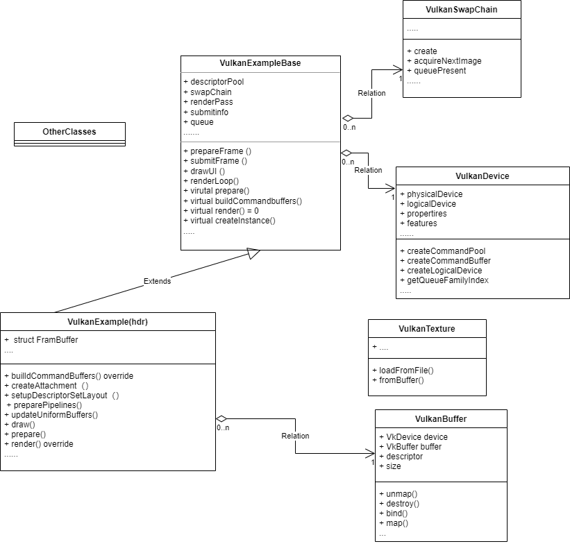

Vulkan是一个非常复杂的图形API， 但是另外一个方面，复杂就代表着它能够操控各个方面的细节。本文会以vulkanexample的hdr例子来试图分析一下vulkan的渲染流程

关于vulkan，有一个非常经典图如下，这是amd的 understanding vulkan objects


这张图表示的是vulkan的object的关系。也是我们要捋清楚渲染流程的重中之重

### 1. 一些对象的总结

根据上面的对象图以及相关内容的学习，我们将这些对象分为下面的部分

#### 一、HardWare:硬件类的一些对象

硬件支持会给出几个组件，它会影响到创建出来的实例和能够提供的功能。

##### Instance

instance是vulkan的实例，在这个instance中会处理所有和vulkan有关的东西，它表示从应用程序到vulkan运行时的链接。因此在应用程序中只应存在一个。它还存储使用vulkan所需的所有应用程序特定状态。因此，必须在创建实例时指定所有层(如验证层)和要开启的所有扩展。

##### PhysicalDevice

看名字就知道，这是物理设备相关的对象，这个对象表示特定的Vulkan兼容设备，例如显卡。可以从instance中枚举这些，然后查询它们的vendorID，deviceid和支持的功能，以及其他属性和限制。例如可以枚举所有可用类型的**队列族**。图形队列是主要队列，但可能还有其他支持计算或传输的队列。另外，它还可以枚举其中的内存堆和内存类型。内存堆代表特定的RAM池。它可以抽象主板上的系统RAM或专用显卡上视频RAM中的某个内存空间，分配内存时必须指定内存类型。它对内存blob(memory blob)具有特定要求，例如对主机可见，一致性(在cpu和GPU之间)和缓存。根据设备驱动程序的不同，可能有这些的任意组合。

##### Device

上一个是物理设备，那么我们可以认为device是逻辑设备，它表示已初始化vulkan设备的主对象，该设备已准备好创建所有其他对象。这与DirectX中的设备对象概念类似。在设备创建过程中，需要指定要开启的功能，其中一些功能是基本功能，如各向异性纹理过滤。还必须说明将要使用的所有队列，它们的编号和队列族啥的信息

##### SwapChain

交换链，其实交换链我也不大确定是否要放到硬件这部分内容中。**the general purpose of the swap chain is to synchronize the presentation of images with the refresh rate of the screen.**,在渲染的过程中，我们将整个过程分类为渲染和呈现，**渲染器和呈现引擎通过一个队列来交换数据，这个队列就叫做 Swap Chain。**Swap Chain肯定被设备所支持，因此我们需要找到的就是最符合我们需要的设置。Vulkan教程中我们需要关注下面的几个

1. **表面格式**

2. **显示模式**，以我们的vulkan教程为例，在VkPresentModeKHR中可选择的有

   1. `VK_PRESENT_MODE_IMMEDIATE_KHR`：不加缓冲，画面渲染好了直接写入到 copying 图像中（破坏了原子性），可能会导致同一时间有两张图像被呈现，**导致“撕裂”**。有些 GPU 和操作系统不支持这个模式。

   2. `VK_PRESENT_MODE_FIFO_KHR`：类似于其它 API 的 **双重缓冲（Double Buffering）**，使用一个队列保存渲染好的 Image，Vblank 时取队首 Image 准备呈现，copy 到呈现设备后回收供渲染器再次写入。这样做可以避免撕裂。由于队列是有固定长度的，所以如果渲染速度贼快导致队列满了，渲染这边就要不到新的 Image 用来渲染，从而导致等待（Hang），同时队列里的 Image 因为并没有更新导致该图像的生成时间和当前用户的输入时间差比较大，造成用户的输入延迟。兼容 Vulkan 的显卡必须支持这个模式。

   3. `VK_PRESENT_MODE_FIFO_RELAXED_KHR`：和 FIFO 差不多，但 FIFO 状态下，如果性能不足没来得及渲染一整张画面导致队列为空，但 Vblank 来了，则呈现引擎会再度把之前呈现的画面再呈现一次，导致延迟更大了。在 FIFO Relaxed 模式下， Vblank 时队列空则直接（IMMEDIATE）输出，**当性能跟不上刷新率时会导致撕裂，性能跟得上时实现双重缓冲**，也算是一种比较好的妥协。

   4. `VK_PRESENT_MODE_MAILBOX_KHR`：类似于 **三重缓冲（Triple Buffering）**。这里不再使用 FIFO 的概念，而是每次渲染完毕时直接拿走队尾里最旧的那个 Image 来回收，然后把新的 Image 放进队首。呈现引擎拿走队首的，避免撕裂同时减小延迟。例如：

      ```
       Spare  | Beefy GPU 💪 | Present
      #1  #2        #3            #4
      #3  #1        #2            #4     - 显示器依然没到Vblank；从队列中拿取最旧的(#2)渲染
      #2  #3        #1            #4     - 显示器依然没到Vblank；从队列中拿取最旧的(#1)渲染
      #4  #3        #1            #2     - Vblank到了（没渲染完毕），从队列中拿取最新的(#1)呈现
      ```

      如果 CPU/GPU 特别强且刷新率不太高的情况下，除了呈现引擎的那张 Image 以外，其它图将会一圈又一圈的被重复渲染。其能够减小输入延迟，但会浪费掉很多性能，在移动平台等地方要慎用。

3. **图像分辨率**

4. **图像数量**，图像数量和选择的显示模式有关，但要多了也不会怎么样。一个经验主义的设置方法就是比 `VkSurfaceCapabilitiesKHR` 实例里的 `minImageCount` 多要一个。

#### 二 、Command&Queue：队列和命令

在Mantle世代的api中，出现了命令队列这个玩意。队列更像是对硬件执行流水线的抽象。通过组织命令并提交运行。

##### Queue：

Queue是一个对象，表示要在设备上执行的命令队列。GPU完成的所有实际工作都是通过填充CommandBuffers，并使用函数vkQueueSubmit将它们提供给队列来请求的。如果有多个队列，例如主图形队列和计算队列，则可以向每个队列提交不同的CommandBuffers。通过这种方式，可以启用异步计算，如果操作正确，可以大大提高计算速度。

1. **QueueFamily**此处说到的队列家族，就是我们在上面说到physicaldecive时说到的由硬件提供的队列族。例如说图形队列，计算队列这类的。例如说computeshader就要使用专门的计算队列进行计算。**每个family中会有若干个queue，这也就是我们能够使用的queue的上限。**另外**vulkan中是禁止同一时间多个线程操作单个queue的**。

##### CommandBuffer

顾名思义，Command Buffer 存放一组绘制指令，客户端向其填充指令到 Command Buffer 并在记录完毕后提交到特定队列，驱动拿到这份指令清单后驱动 GPU 执行

1. **CommandBufferPool**,是一个简单的对象，用于分配CommandBuffers。它连接到特定的队列族。另外，我们的CommandBuffer都是通过这个pool分配的

在需要执行一个操作的时候，我们会录入这些操作，然后提交给queue，然后就开始执行

#### 三 、Buffer&Image

Vulkan中，Buffer和Image是两种占用内存的资源，从字面意思就可以理解。而他们真正要用起来，还需要配备一个VkDeviceMemory，

创建特定长度的Buffer或具有特定尺寸的Image不会自动为其分配内存。这是一个3步过程，必须手动执行：

1. 分配设备内存
2. 创建buffer或Image
3. 使用函数vkBindBufferMemory或vkBindImageMemory把1和2绑定

而关于这两种类型的资源，交给shader使用时，还需要和**Descriptor**结合使用。则需要注意下面的三个东西。另外，我觉得这个还比较复杂，需要细细理解

##### Descriptor

Descriptor是用于传递数据的表述器，它的种类有很多，大致上分为三类：**采样器、图像和通用数据缓冲（UBO, SSBO）**，而区别就在于用途和随之而来的性能优化。具体种类可以参考`VkDescriptorType` 中的枚举，这里就不提了

Descriptor需要通过`VkDescriptorSetLayoutBinding`来将其和布局绑定，这里需要注意的一点是，**绑定布局的时候仅仅只是在描述一个Descriptor，没有传入任何具体的资源**

这里我们可以参考描述绑定的结构体来理解这个操作

```c++
typedef struct VkDescriptorSetLayoutBinding {
    uint32_t              binding; //与 shader 中 binding 字段的数字一致，这样就绑定上了。
    VkDescriptorType      descriptorType; //上面提到的资源描述类型。
    uint32_t              descriptorCount; //资源描述个数。例如说一个 Uniform Buffer，因此设置为 1。大于 1 就表示一个数组（Array of Descriptors），在 Shader 中可以直接用一对中括号
    VkShaderStageFlags    stageFlags;  //该资源被引用的着色器阶段，例如给顶点着色器做坐标变换用，所以给VK_SHADER_STAGE_VERTEX_BIT
    const VkSampler*      pImmutableSamplers; //图像采样的
} VkDescriptorSetLayoutBinding;
```

Descriptor想要能够正式使用，得使用 `VkDescriptorBufferInfo` 结构体来**描述 descriptor 本身的属性**，同时将该结构体更新到资源描述中需要再填写一个`VkWriteDescriptorSet`，**用来描述 Descriptor 和 Set 的关系**：之后调用 `vkUpdateDescriptorSets` 方法，将上述所有的配置写入系统托管的对应资源描述集中。在**VkDescriptorBufferInfo**中，我们会绑定了对应的真正的资源，这才是真正用的数据

##### DescriptorSetLayout

这个对象的作用是描述layout的布局。类似于shader中`layout(set = 0,binding =111)`,它初始化时的createinfo 如下

``` c++
typedef struct VkDescriptorSetLayoutCreateInfo {
    VkStructureType                        sType;
    const void*                            pNext;
    VkDescriptorSetLayoutCreateFlags       flags;
    uint32_t                               bindingCount;
    const VkDescriptorSetLayoutBinding*    pBindings;    // 这里就是descriptor的绑定信息
} VkDescriptorSetLayoutCreateInfo;
```

DescriptorSetLayout需要传递到pipelinelayout的创建信息中，具体的设置代码如下

```c++
typedef struct VkPipelineLayoutCreateInfo {
    VkStructureType                 sType;
    const void*                     pNext;
    VkPipelineLayoutCreateFlags     flags;
    uint32_t                        setLayoutCount; // !
    const VkDescriptorSetLayout*    pSetLayouts;    // !
    uint32_t                        pushConstantRangeCount;
    const VkPushConstantRange*      pPushConstantRanges;
} VkPipelineLayoutCreateInfo;
```

**由于 Descriptor Set Layout 是流水线的一部分**，因此声明 layout 的位置需要在创建流水线之前，即 `createGraphPipeline()` 之前。创建流水线的时候需要传入这个 layout 来生成 Pipeline Layout。上面的pSetLayouts可以传入一个或者多个的SetLayout，即多个布局。对应到shader中就比如`layout(set = 1,binding =111)`

##### DescriptorPool

 创建完布局之后，我们需要创建***\*DescriptorPool\****。它是一个用于分配描述符集的简单对象。创建描述符池时，必须指定要从中分配的描述符集和不同类型描述符的最大数量,举个例子如下

```c++
VkDescriptorPoolSize poolSize = {};
poolSize.type = VK_DESCRIPTOR_TYPE_UNIFORM_BUFFER; // 我需要 Uniform Buffer!
poolSize.descriptorCount = static_cast<uint32_t>(swapChainImages.size()); // 一个 Swap Chain Image 来一个
```

##### DescriptorSet

上述的layout描述了Descriptor的布局。如果粗暴点理解的话，上述的DescriptorSetLayout描述了的一个set的descriptor的描述，这个粗暴点理解为layout的实例，用于将各种descriptor打包在一起，并且将其绑定到流水线的指定的位置。创建的时候，我们会通过descriptorsetpool进行创建。

```c++
typedef struct VkDescriptorSetAllocateInfo {
    VkStructureType                 sType;
    const void*                     pNext;
    VkDescriptorPool                descriptorPool;
    uint32_t                        descriptorSetCount;
    const VkDescriptorSetLayout*    pSetLayouts; //此处就和前面的描述联系在一起了
} VkDescriptorSetAllocateInfo;
```

而在使用时，我们则通过`vkCmdBindDescriptorSets`来调用，具体例子如下

```c++
vkCmdBindDescriptorSets(commandBuffers[i], VK_PIPELINE_BIND_POINT_GRAPHICS, pipelineLayout, 0, 1, &descriptorSets[i], 0, nullptr);
```

#### 四、pipeline和渲染相关对象

##### pipeline

pipeline是创建起来最麻烦的对象，它定义的是管线状态，各种工嗯呢该都在在这里设置的。这里很重要的一个状态就是绑定shader，创好了之后就不能改了,对于渲染期间所需的每一组不同参数、必须创建一个新的管道。然后通过调用函数vkcmdBindPipeline将其设置为CommandBuffer中的当前活动管道。

还有一个名为**PipelineCache**的辅助对象，可用于加速管道创建。

##### FrameBuffer

通过指定RenderPass和一组Imageview创建一个Framebuffer对象。当然，它们的数量和格式必须与RenderPass的规范相匹配。Framebuffer是Image之上的另一层，基本上将这些Imageview组合在一起，以便在渲染特定RenderPass期间绑定为附件。每当开始渲染RernderPass时，调用函数vkCmdBeginRenderPass并将FrameBuffer传递给它。

##### Attachment

是vulkan的名称，它是一个渲染目标---一个用作渲染输出的图像

##### RenderPass

本质上是描述一次渲染的绘制目标长啥样，它的参数里面就包括了attachment，主要是用于描述一些需要的配置，然后绑定上述的Frambuffer,输出结果。

#### 五、同步操作

不仅仅是内存需要自己分配，，同步操作也需要手工控制。例如说cpu提交之后，啥时候gpu才会完成呢？这就需要用于同步的对象了

##### Fence

向主机发出任务执行完成的信号。它可以在主机上等待、轮询和手动取消信号。它没有自己的命令函数，但在调用vkQueueSubmit时传递。一旦提交的队列完成，相应的栅栏就会发出信号。

##### Semaphore

是在没有配置参数的情况下创建的。它可用于控制跨多个队列的资源访问。可以作为命令缓冲区提交的一部分发出信号或等待，也可以调用vkQueueSubmit，它可以在一个队列(例如计算)上发出信号并在另一个队列(例如图形)上等待。

##### **event**-没用过

上面五个点是比较重要的一些对象的总结，这里没有提到的是内存分配，内存分配在vulkan中也是完全由自己控制的。即gpu内存也可以由程序员控制。**vulkan的分配次数在设备上是有上限的**

### 2. 核心的流程

#### 整体工作流

如果以教程为例，整体的代码工作流大致如下

1. 创建最上层的 Instance 和 Surface（此处即显示窗口）
2. 找到显卡（Physical Device）
3. 创建出逻辑绘图设备（Device）
4. 创建绘制队列（Queue）、交换链（Swap Chain）
5.  准备我们绘制用的缓冲（Buffer）和图像（Image）
6. 创建和显卡通信所使用的指令缓冲（Command Buffer），配置绘制所需要的帧缓冲（Framebuffer）、流水线（Pipeline）、Render Pass
7. 做好绘制/呈现/客户端同步所使用的信号量（Semaphore，Fence）
8. 开始绘制。

#### 渲染工作流

而上述的过程中，绘制的过程大约就是第六步的配置。大致描述一下一个渲染的步骤和关键函数

1. 从swapchain中获取下一个可以绘制到屏幕的image，一般可以看到 **vkAcquireNextImageKHR**这个函数
2. 对CommandBuffer进行处理，开始指令的录制。当然，在开始录制之前，一般会通过`vkResetCommandPool`/`vkResetCommandBuffer`清除上一次的录制，但是如果指令没有变化，可以不做操作。我们会通过**vkBeginCommandBuffer**函数进行指令录制
3. 启用RenderPass,这里连同绑定了一个FramBuffer,此处调用**vkCmdBeginRenderPass**
4. 绑定pipeline,此处调用 **vkCmdBindPipeline**
5. 绑定描述聚合 **vkCmdBindDescriptorSets**
6. (如果有)**vkCmdBindVertexBuffers**,**vkCmdBindIndexBuffer**
7. 绘制 **vkDraw**
8. 结束renderPass ··**vkCmdEndRenderPass**
9. 结束CommandBuffer**vkEndCommandBuffer**
10. 提交 **vkQueueSubmit**
11. 呈现**vkQueuePresentKHR**

从上述的过程中，可以看出，CommandBuffer的指令操作通常都是以`cmdxxx`开始的

另外，所有以`KHR`结尾的东西均代表Khronos团队开发的，非标准中的功能，例如硬件相关的功能。**方法**名前缀为`vk`

### 3. 以example为例描述整体的渲染流程

接下来，我们以**SaschaWillems** 的开源案例库，从基础到进阶渲染。 https://github.com/SaschaWillems/Vulkan 的hdr例子来介绍一下整体的流程。先来说一下整体的运行流程，每个例子的入口通过宏**VULKAN_EXAMPLE_MAIN**来调用,该宏调用顺序如下。


可以看到，在进入绘制循环之前，共调用了四个函数，其中，第一个为例子的实例化函数。该函数的作用是对本例进行实例化。我们这里可以暂时不讨论它究竟做了什么，重点是后面的三个函数。分别是InitVulkan,setupWindow,prepare三个函数。

**initVulkan函数是初始化vulkan相关变量的函数**，它主要做的事情有如下几件

1. 创建vulkan实例
2. 选择physicalDevice
3. 创建logicalDevice
4. 创建同步Semaphore

**setupWindow函数是用于创建窗口的函数**，此处不是用glfw创建的，这里暂不深究

**prepare是用于初始化各种vulkan的对象**.它的执行流程可以概括为下面几步

1. 初始化交换链
2. 初始化Commandpool
3. 创建CommandBuffer
4. 创建同步fence
5. 设置深度&模板缓冲
6. 设置通用renderpass
7. 创建pipelinecache用于加速
8. 设置frambuffer
9. **准备其他的buffer和对应的descriptor，创建好其他需要的renderpass**
10. **准备好使用的pipeline**
11. **录入好CommandBuffer指令（此处是由于例子中渲染内容不变，可以提前录制）**

renderloop则是渲染的过程。由于我们在prepare中已经录入好了CommandBuffer，因此我们只需要提交绘制就可。在上述的过程中，**1~8是通用的操作，即父类中的操作，9到11则是我们子类做的操作**

在绘制过程中，我们主要做了。

1. 获取下一帧的framebuffer
2. 提交渲染指令渲染到frambuffer中

总体来说，和我们上述的一些内容差别不大。原本我还想要画一下相关的类图，但是仔细看了看，似乎也没有什么太大的必要。因为总体结构是十分清晰的。因此只画了一个简单的类图




### 4.  总结

vulkan确实比较复杂，但是捋清楚了的话，更多的是繁琐。他需要你亲力亲为的设置很多各种配置，很多配置都包含一大堆选项。（选项多意味着容易出错）让人防不胜防。但是换来的确是高可控性和可能的更高性能。当然在pc上可能不如DX12，但是跨平台的特性还是相当优秀的。

在初始化成功一个vulkan环境之后，和很多引擎一样，我们需要做的就是编辑CommandBuffer指令，更新数据，然后提交绘制。没有太多特别麻烦的地方。

在编写vulkan相关代码的过程中，有一个救命的东西，那就是Validation Layer

