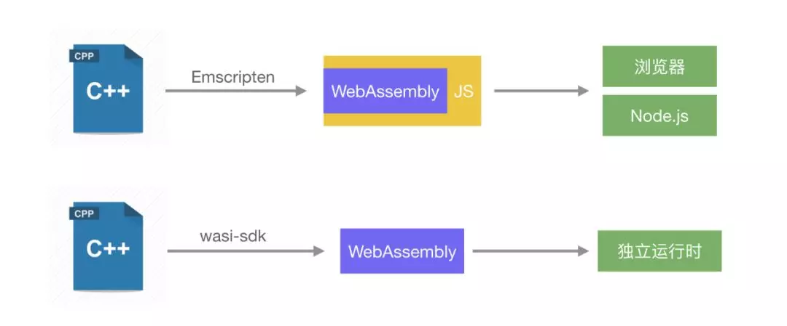
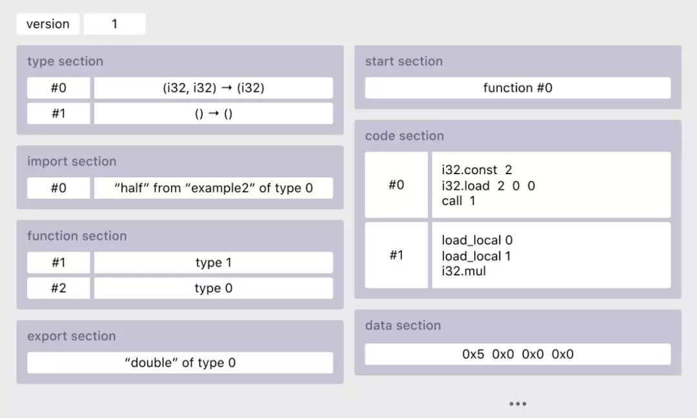

### webassembly是什么

webassembly是什么这个问题，根据MDN的说法:

> WebAssembly是一种运行在现代网络浏览器中的新型代码，并且提供新的性能特性和效果。它设计的目的不是为了手写代码,而是为诸如C、C++和Rust等低级源语言提供一个高效的编译目标。
>
> 对于网络平台而言，这具有巨大的意义——这为客户端app提供了一种在网络平台以接近本地速度的方式运行多种语言编写的代码的方式；在这之前，客户端app是不可能做到的。
>
> 而且，你在不知道如何编写WebAssembly代码的情况下就可以使用它。WebAssembly的模块可以被导入的到一个网络app（或Node.js）中，并且暴露出供JavaScript使用的WebAssembly函数。JavaScript框架不但可以使用WebAssembly获得巨大性能优势和新特性，而且还能使得各种功能保持对网络开发者的易用性。

简单的概括一下，我们可以看到两个要点

1. 跨平台，为C++,C,Rust等语言提供一个高效的编译目标，可以通过js使用。
2. 高性能，在web上可以接近本地速度的方式进行运行。

而他的标准如下

> - 快速、高效、可移植——通过利用[常见的硬件能力](http://webassembly.org/docs/portability/#assumptions-for-efficient-execution)，WebAssembly代码在不同平台上能够以接近本地速度运行。
> - 可读、可调试——WebAssembly是一门低阶语言，但是它有确实有一种人类可读的文本格式（其标准即将得到最终版本），这允许通过手工来写代码，看代码以及调试代码。
> - 保持安全——WebAssembly被限制运行在一个安全的沙箱执行环境中。像其他网络代码一样，它遵循浏览器的同源策略和授权策略。
> - 不破坏网络——WebAssembly的设计原则是与其他网络技术和谐共处并保持向后兼容。

因此我们得到最终的结论，总结一下就是，WebAssembly（wasm）就是一个可移植、体积小、加载快并且兼容 Web 的全新格式。

假设我们现在有一个段C++源码，然后我们将其编译成了wasm的形式，那么，在浏览器中，它运行时就是以二进制源码运行的。

```js
 00 61 73 6d  01 00 00 00  01 0c 02 60  02 7f 7f 01
  7f 60 01 7f  01 7f 03 03  02 00 01 07  10 02 03 61
  64 64 00 00  06 73 71 75  61 72 65 00  01 0a 13 02
  08 00 20 00  20 01 6a 0f  0b 08 00 20  00 20 00 6c
  0f 0b
```

而在我们的分析中，它的代码可能就是长这样的

```js
(func $encodeScript (;2;) (export "encodeScript") (param $var0 i32) (param $var1 i32) (result i32)
    (local $var2 i32) (local $var3 i32)
    local.get $var1
    call $func3
    local.set $var2
    block $label0
      local.get $var0
      i32.load8_u
      i32.eqz
      br_if $label0
      i32.const 0
      local.set $var1
      loop $label1
        local.get $var0
        local.get $var1
        i32.add
        local.tee $var3
        local.get $var3
        i32.load8_u
        local.get $var2
        i32.xor
        i32.store8
        local.get $var1
        i32.const 1
        i32.add
        local.tee $var1
        local.get $var0
        call $func3
        i32.ne
        br_if $label1
      end $label1
    end $label0
    local.get $var0
  )
```

这种代码可以说，基本上是难以阅读和编辑的，这也变相的导致了代码的安全性大大的提高了。同时，相较于直接写的JavaScript,一般情况下，webassembly的运行速度会更快。（**当然，运用一些高超的编程技巧，直接使用JavaScript编写的代码的性能是可以达到甚至高于wasm的运行速度的**）

### Wasm为什么会更快

WebAssembly 比 JavaScript 执行更快主要是因为下面的几个点：

- 文件抓取阶段，WebAssembly 比 JavaScript 抓取文件更快。即使 JavaScript 进行了压缩，WebAssembly 文件的体积也比 JavaScript 更小，即便通过压缩算法可以显著地减小 JavaScript 的包大小，但是压缩后的 WebAssembly 的二进制代码依然更小。；
- 解析阶段，WebAssembly 的解码时间比 JavaScript 的解析时间更短，到达浏览器时，JavaScript 源代码就被解析成了抽象语法树，而 WebAssembly 则不需要这种转换，因为它本身就是中间代码。它要做的只是解码并且检查确认代码没有错误就可以了；
- 编译和优化阶段，WebAssembly 更具优势，因为 WebAssembly 的代码更接近机器码，而 JavaScript 要先通过服务器端进行代码优化。
- 重优化阶段，WebAssembly 不会发生重优化现象。而 JS 引擎的优化假设则可能会发生“抛弃优化代码<->重优化”现象（重优化阶段主要是JIT优化时，会对warm的代码进行一个优化）。
- 执行阶段，WebAssembly 更快是因为开发人员不需要懂太多的编译器技巧，而这在 JavaScript 中是需要的，但是为了可读性，开发人员不一定会编写这种代码。WebAssembly 代码则是编译后代码，也更适合生成机器执行效率更高的指令。
- 垃圾回收阶段，WebAssembly 垃圾回收都是手动控制的，效率比自动回收更高。

这就是为什么在大多数情况下，同一个任务 WebAssembly 比 JavaScript 表现更好的原因。

想要理解上面的点，我们需要理解JavaScript的引擎的执行的机制。这里不展开讲，推荐6篇文章

[1.生动形象的介绍Webassembly](https://zhuanlan.zhihu.com/p/25800318)

[2.JavaScript Just-in-time (JIT) 工作原理](https://zhuanlan.zhihu.com/p/25669120)

[3.编译器如何生成汇编](https://zhuanlan.zhihu.com/p/25718411)

[4.WebAssembly 工作原理](https://zhuanlan.zhihu.com/p/25754084)

[5.为什么WebAssembly更快](https://zhuanlan.zhihu.com/p/25773367)

[6.现在和未来](https://zhuanlan.zhihu.com/p/25799683)

### Wasm的缺点

引用我阅读过的文章的一段话

> 第一个问题是 WebAssembly 的使用场景，但是不能为了用新技术而用新技术，得找到最适合使用 WebAssembly 而且具备不可替代性的场景，目前来看，客户端上用在视频、游戏、AR、AI 等领域比较合适。
>
> 第二个问题是促进 WebAssembly 的发展，解决实践中的问题帮助它落地。要实现 WebAssembly 在真实业务场景中落地，还需要继续完善基础设施，我很期待社区能够有人解决下面几个问题：
>
> 在工程层面解决 WebAssembly 研发链路的问题。现在无论是开发、编译还是调试都会遇到很多问题，开发体验和开发效率都比较低。目前我个人觉得比较靠谱的三种开发语言是 C++、Rust 和 AssemblyScript，分别面向不同类型的开发者。
> 在平台侧解决 WebAssembly 模块的管理问题。解决 wasm 在真正使用时的加载、分发、依赖管理、复用等问题，要是能构建出 npm 这样丰富的生态就好了。
> 在客户端/服务端解决 WebAssembly 独立运行时的问题。能够把丰富的平台原生能力，高效的、标准的透出到 wasm 模块中，并且解决性能、稳定性、安全性等问题。
> 性能优化！性能优化！性能优化！ 无需多说，性能优化永无止境。
> 等上面的基础设施建设完成后，可以为 WebAssembly 的落地扫清大部分障碍。

从目前来看，wasm的运用门槛相对于其他JavaScript模块要更加复杂，需要开发者具有另外一门语言运用能力，理解语言的编译流程，同时在开发过程中，开发者所做的工作主要是在两门不同的语言之间的相互调用，总体复杂度较高。而目前而言，对于整体的链路，无论是开发、编译还是调试都会遇到很多问题，开发体验和开发效率都比较低（从我个人的经验和体验来看），总体而言是一个好用却难用的工具。

### Wasm实际使用

#### 技术准备

1.  **一门熟悉的语言：C/C++,JAVA,GO,TYPESCRIPT,RUST....**
2. 搭建编译环境，参考文档[emscripten](https://emscripten.org/docs/getting_started/downloads.html)

在环境搭建完成后，在windows平台下，需要将emscripten的环境变量配置到用户环境变量中，才能比较方便的使用，而需要配置的变量，可以通过emsdk下的emcmdprompt.bat 运行来看具体需要设置哪些环境变量

#### 一个简单的示例

将一个C\C++文件编译为wasm只需要三步

1. 编写C\C++代码
2. 使用emscripten编译为wasm
3. 编写js使用代码

以我们的`hello world.c为例`

``` c
#include <stdio.h>
int main() {
  printf("Hello World!\n");
  return 0;
}
```

我们可以执行如下代码就可以生成 wasm 的包：

```javascript
emcc hello.c -O3 -o out/hello-emcc.wasm
```

但是，上面这个命令隐含了 -s STANDALONE_WASM 的配置 ，实际上触发的是 WebAssembly Standalone build ，只生成了一个 wasm 的包，需要自己写 loader 加载和执行。如果不想费这个劲，就可以使用如下命令直接生成 wasm + js 文件：

```javascript
emcc hello.c -O3 -o out/hello-emcc.js
```

该命令除了生成 js 文件以外，还会生成同名的 hello-emcc.wasm 文件，可以使用 WABT (WebAssembly Binary Toolkit) 提供的小工具把 wasm 文件转成对等的文本格式，方便阅读。

```javascript
wasm2wat out/hello-emcc.wasm -o out/hello-emcc.wat
```

>  代码比较短，但是生成出来的 wasm 文件有 2.1KB，js 文件 16KB，主要是因为 stdio.h 头文件里有很多依赖，在运行时是由 js 代码来实现的。用 wasm 做 io 本身也不是个好的用法。 

最后，直接在 Node.js 环境里执行这个 js 文件就行了，可以看到控制台输出了 Hello World! 。

```javascript
node out/hello-emcc.js
```

此外，如果想要快速得到一个效果，我们也可以直接输出html文件，就是直接将上面的.js改成输出.html即可

#### 了解编译参数

在wasm的运用中，编译参数会极大的影响我们的使用效果，也会影响编译器产生的胶水代码的模样。下面我将以我们目前实际使用到的编译参数来简单介绍一下wasm的重要的编译参数

```js
emcc wrapper2.cpp zip/src/zip.c  
    -o res/wrapper2.js 
    -O3 
    -s WASM=1 
    -s FORCE_FILESYSTEM=1 
    -s EXPORTED_RUNTIME_METHODS="['cwrap', 'addFunction', 'UTF8ToString', 'FS','ccall']" 
    -s RESERVED_FUNCTION_POINTERS=1 
    -s MODULARIZE=1 
    -s ASSERTIONS=1 
    -s EXPORT_ES6=1 
    -s EXPORTED_FUNCTIONS="['_load_zip_data']" 
	-s MAXIMUM_MEMORY = 1024mb
    -s INITIAL_MEMORY = 1024mb
    -s ALLOW_MEMORY_GROWTH = 1
```

从头开始往下看,我们通过emcc指令将代码编译为字节码，然后根据不同的目标编译为asm.js或wasm。emcc和gcc编译选项类似，例如-s OPTIONS=VALUE、-O等。另外为了适应Web环境，emcc增加了一些特有的选项。

- -o 设置的是输出，和我们上面提到的那样，如果我们输出的文件为xxx.wasm，那么emscripten将不会生成胶水代码，则需要开发者自己完成，因此一般情况下，我们最好是输出.js文件，这样会同时带有wasm和胶水代码，可以省很多事

- -O3 `-O`为优化选项，`-O0`时显示的日志调试信息最完整，生成的js文件的格式名称也都是易读的，强烈建议一开始调试时用该选项 `-O3`是性能更高的优化 -`Os`在增加编译时间方面与此类似，但侧重于在进行额外优化的同时减少代码大小。

- Wasm,WASM=0生成asm.js格式(适用于WebAssembly不支持的情况),WASM=1生成包含wasm格式,WASM=2 asm.js与wasm格式均生成，添加支持判定，优先使用wasm格式。

- EXPORTED_RUNTIME_METHODS,该项主要的影响的是导出的胶水代码的函数，上述例子中，导出的UTF8ToString，FS等函数，都是在导出后的模块里面可以调用的函数，但是并不是我们编译过来的wasm里面的函数,这些函数需要自行研究emscripten的文档来判断是否需要使用

- MODULARIZE 闭包相关

  > Consider using `-s MODULARIZE=1` when using closure, as it minifies globals to names that might conflict with others in the global scope. `MODULARIZE` puts all the output into a function

- EXPORT_ES6，这个选项会将包导出为ES6模式，实际上，由于胶水代码相当复杂，因此我使用的时候只是运用到了它的getModule函数来进行模块的初始化。

- EXPORTED_FUNCTIONS,这个选项控制你是否要导出的函数，函数名会在你实际函数的命名编译后前加一个_，为什么要强调编译后呢，__因为C++编译后，函数名则会发生改变__

- MAXIMUM_MEMORY，wasm运行环境是一个沙盒，因此这个环境中，不管是各种操作都是需要我们手工分配的（emscripten的胶水代码会帮我们做一些）

- INITIAL_MEMORY，初始化分配的可用的内存大小

- ALLOW_MEMORY_GROWTH，允许内存增长

- FORCE_FILESYSTEM 强制确定模拟的沙盒中的文件系统类型

这部分参数是我们运行中所使用过的，实际上还会有更多的编译参数，这些参数可以让我们比较简单的做一些操作，有一些也会影响我们的wasm的性能

#### 参数的传递和函数的调用

想要真正的完成一个wasm项目的开发和运用，必须要解决的问题就是函数的调用。就是要实现这么一个调用链路：

```js
demo.js <-----> [gluejs] <-----> wasmapi
```

WebAssembly 是一种编译目标，虽然运行时是 wasm 和 JS 之间互相调用，但是写代码的时候感知到的是 C++ 和 JS 之间的互相调用。文中说的 JS 和 C++ 的调用，实际意思是 JS 和 wasm 模块之间的调用。

一个真正的C/C++的API会接受各种类型的数据作为接口。然而 wasm 目前只可以 import 和 export C 语言函数风格的 API，而且参数只有四种数据类型（i32, i64, f32, f64），都是数字（或者buffer），可以理解为赤裸裸的二进制编码，没法直接传递复杂的类型和数据结构。所以在浏览器中这些高级类型的 API 必须靠 JS 来封装，中间还需要一个机制实现跨语言转换复杂的数据结构。

总结下来，是两个问题：

1. 在 C++ 和 JS 之间传递复杂数据结构。（数据通信）
2. 实现 C++ 和 JS 复杂数据类型的一对一绑定。（类型绑定）

在较为普通的需求中，我们可以通过emscripten中的胶水代码来完成数据的转换，从而我们可以比较正常的去进行各种操作用,而如果是使用另外一个编译方式， wasi-sdk的方式， 可以编译出独立的 wasm 包，但是想把它运行起来需要运行时给它注入必要的接口。



我们这里直接使用emscripten来进行编译，通过上文中的配置，我们就可以编译出一个我们需要的函数的胶水函数。

接下来就是进行函数的调用，以上面的配置为例，我们使用

```js
    -s EXPORTED_RUNTIME_METHODS="['cwrap', 'addFunction', 'UTF8ToString', 'FS','ccall']" 
    -s EXPORTED_FUNCTIONS="['_load_zip_data']" 
```

这两个配置，分别导出了我们需要的绑定函数和实际调用的函数，值得注意的一个点就是，虽然我们在下面的指令中导出了`_load_zip_data`函数，并且也能够直接访问到它，但是我们依然无法给它传递参数，这是由于它需要的参数，是模拟的C环境下的参数，因此我们需要进行参数的绑定。我们这个例子中的函数参数为一个string,而返回也是返回一个string，因此我们可以这么写

```js
module.ccall("load_zip_data","string",["string"],"test")
```

这里这么写的原因就是，我们需要传递的参数string,在Ccall的过程中，就会直接被转为对应的utf-8array，这是可以直接进行通信的。而如果不能直接通信的情况呢，举个例子，假设我们的函数需要读取一个zip文件，需要从文件系统中读取。那我们所需要做的事情就是，创建一块内存，然后将我们需要的文件写到这块内存中，然后将这块内存命名为xxx.zip。当然，这个部分我们的胶水代码也有，因此在这个例子中，我们就是使用runtime method中的模拟的fs函数来写

```js
module.FS("test.zip",new int8array(buffer))
```

有的时候，我们需要传递一些复杂的参数，例如对象，例如函数，这些就需要我们自己分配内存，传递内存，以函数为例，函数的话也有现成的接口，假设我们需要传递一个void函数 func,它接收的参数为（char\*buf,int size,char\*name），在C中，我们实际传递的就是它们的指针，而这个函数，我们也可以传递它们的指针.而在wasm中，指针以数字来代表

那么绑定和调用函数如下

```js
funcptr = module.addFunction(func,'viii')
module.ccall("load_zip_data","string",["number"],funcptr)
```

在上面的例子中，我们注册函数的时候，将其他指针类参数和数值全部注册为i(int)，而拿到的函数指针则作为number传递给函数。如果作为string可能会被转义

那么如果是胶水代码没有做好的一些传递，我们就得靠操作内存来做了要传递复杂值，必须借助 [WebAssembly.Memory() ](https://developer.aliyun.com/article/740902#)实现，它是由宿主环境开辟的内存，交给 wasm 模块来运行，在运行时这块内存可以被 wasm 模块和宿主环境共同管理，这是 wasm 和宿主环境实现大块数据通信的基础。

**传递内存 buffer**

如下代码创建了一块初始大小为 256 的内存（单位是“页”，每页64KB），并在实例化时传递给 wasm 模块。

```js
const wasmMemory = new WebAssembly.Memory({ initial: 256 })
WebAssembly.instantiate(wasmBinary, {
  env: {
    memory: wasmMemory
  }
})
```

这块内存就是 wasm 模块运行时使用的内存，可以通过 wasm 指令读取、写入以及 grow，对应到 C++ 源码里就是指针和 new/malloc 之类的操作；同时这块内存又是一个 js 变量，也可以在 js 里读写它的值。
所以 js 和 wasm 通信的过程就是：先把想要传递的数据序列化成 ArrayBuffer，然后把 buffer 写入 Memory 并且把数据的起始位置、数据大小传给 wasm 模块，在 wasm 中根据位置取到这块 buffer，最后把 buffer 反序列化成自己想要的类型。伪代码如下：

```js
// 把想要传递的数据转成 ArrayBuffer (假设是 Uint8Array)
const dataBuffer = encodeDataByJS({ /* my data */ })
// 向 wasm 申请一段内存，由 wasm 代码负责实现并返回内存内存起始地址
const offset = applyMemoryFormWasm(dataBuffer.length)
// 以 unit8 的格式操作 wasm 的内存 (格式应该与 dataBuffer 的格式相同)
const heapUint8 = new Uint8Array(wasmMemory.buffer, offset, dataBuffer.length)
// 把数据写入 wasm 内存
heapUint8.set(dataBuffer)
```

**传递复杂数据结构**

仅支持传递 buffer 并不能解决所有问题，总不能在写代码的时候都去手动操作内存吧，而且 JS 的数据类型和 C++ 的数据类型差别很大，传递数字和数组还好一些，在传递复杂数据结构的时候，如何正确的实现数据的序列化和反序列化？

先说一下通用的解法，这是一个跨语言数据结构转换的问题。面对同一块内存，要让不同的语言都能按照同样的格式（或内存布局）来读取这块内存，就得定义一套语言无关的二进制数据格式。这个在业界有挺多方案的，首先有种叫 [BSON ](https://developer.aliyun.com/article/740902#)的数据格式，就是二进制版本的 JSON，主要用在 MongoDB 数据库里。另外 Google 的 [Protocol Buffers](https://developer.aliyun.com/article/740902#) 也是做这个事情的，[自定义了一套二进制格式](https://developer.aliyun.com/article/740902#)，并且提供了多种语言（没有 JS）的序列化、反序列化 API。另外 Flutter 的 MethodChannel 也是[自己设计了一套二进制编码格式](https://developer.aliyun.com/article/740902#)，用于实现跨语言的接口调用。

但是上面这些方式用在 WebAssembly 里都不太合适，或者说太重太麻烦了，现在 WebAssembly 社区在讨论的 WebAssembly Interface Types 就是要解决这个问题的，借鉴 Web IDL 的思路，有希望定义出一套适用于 wasm 的语言无关的类型标准，但是目前还有很多问题需要解决，如 anyref 和 GC objects 的支持等。

### 原理初探

wasm都需要一个胶水代码，我们可以自己手写，也可以使用编译工具生成。总体而言，编译工具生成的代码相对来说较为厚重，但是可以减少许多我们需要做的操作。一个简单的helloworld都可以编译出非常大的胶水代码，因此如果需要多个功能的wasm的话，最好的选择是将这些东西全都做成一个wasm包，这样可以减少胶水代码的体积。

而wasm本体也是这样，就算是一个简单的helloworld，编译出来的wasm也是比较大的，为什么会这样呢？这个问题与 WebAssembly 的技术特点有关。

> WebAssembly 本质上讲就是一种二进制格式而已，一个 wasm 文件可以认为就是一个独立的模块，模块的开头是个固定的硬编码，然后是各种 section ⑫，所有 section 都是可选的，其中 type section 是声明函数类型的，还有 function, code, data 这些 section 都是封装内部逻辑的，start section 声明了自执行的函数，另外还有 table, global, memory, element 等。最需要外部关注的，与外界环境交互的是 import section 和 export section，分别定义了导入和导出的接口。具体可以看下图



简单来说 WebAssembly 定义了导入和导出的接口和内部的运算逻辑，想要使用到宿主环境的能力，只能声明出依赖的接口，然后由宿主环境来注入。例如发送网络请求、读写文件、打日志等等，不同宿主环境中的接口是不一样的，wasm 包里声明了一套自己想要的接口，宿主环境在实例化 wasm 模块的时候，按照 wasm 自己定义的格式，把当前环境的真实接口传递给它。一个简单的wasm的文本化后的代码为例，这里就通过`emscripten_resize_heap`，来进行一个内存空间的注入

```js
(func $env.emscripten_resize_heap (;0;) (import "env" "emscripten_resize_heap") (param i32) (result i32))
  (table $__indirect_function_table (;0;) (export "__indirect_function_table") 1 funcref)
  (memory $memory (;0;) (export "memory") 256 256)
  (global $global0 (mut i32) (i32.const 5244432))
  (global $global1 (mut i32) (i32.const 0))
  (global $global2 (mut i32) (i32.const 0))
  (func $__wasm_call_ctors (;1;) (export "__wasm_call_ctors")
    call $emscripten_stack_init
  )
```

wasm依赖宿主环境注册 env 接口，只有正确注入了这些接口才能确保 wasm 包可以正确的运行起来。在 Emscripten 同时生成的那个 js 文件里，就包含了这些接口的实现，在实例化 wasm 的时候自动注入进来，是它的内部逻辑，外部使用的时候不必关心。例如上面提到的`emscripten_resize_heap`

```js
  function _emscripten_resize_heap(requestedSize) {
      var oldSize = HEAPU8.length;
      requestedSize = requestedSize >>> 0;
      abortOnCannotGrowMemory(requestedSize);
    }
```

如果是使用wasi-sdk 生成的文件，需要导入的接口的标准化就会更好一些，wasi 定义的标准接口，只要宿主环境按照规范实现了这些接口，就可以运行这个 wasm 包。而且这些 wasi 接口也不是用 js 实现的，性能更好一些，也完全不依赖 js 引擎。但是使用起来难度就会相当高了，Emscripten 强依赖 Emscripten 生成的 js 文件才能运行，而 wasi 接口就具备了更好的性能和跨平台能力。二者选择哪个全依赖个人水平和实际需求。

### 总结

总体而言，webassembly是一个前景看上去十分美好，但是运用场景整体不够清晰，并且运用复杂度较高的一个实际效果还不错的工具。但是上手门槛较高，除了需要了解其他语言，还需要了解编译相关的只是，具备较强的阅读文档的能力。同时资料也会较少，较为不清晰。在我个人的运用过程中就遇到过大量的老旧文档/错误示例/等等各种各样的误导。但是如果能够实际运用上，在运算速度方面，的确会有较大的提升。是一个需要花时间研究的技术。


