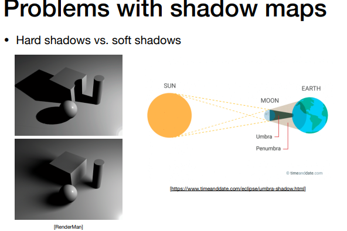

几何（Geometry），在图形学中，就是研究如何描述一个图形的学问，也是非常难的一个方向（反正我觉得很难）。很多图形都是非常难表示的，除了需要表示类似于布料，滴水的这种奇怪的图形，还有就是需要处理例如说毛发，城市，这种复杂并且数量庞大的几何。我们将这些几何进行归类，分为两个

### 表示方式

#### 隐式表示的几何（Implicit Geometry）

隐式表示一个几何是什么意思呢，隐式表示的定义即告诉了你点满足的一个关系，但是不会直接告诉你这个点是啥。比如我定义一个函数f(x,y,z)=0,只要一个点能够满足这个条件，那么我就说这个点在这个几何上。例如说，球中，就是表示$x^2+y^2+z^2-1 =0$,

**隐式几何的好处**

好处是，判定一个点在不在面上特别简单，例如说。上面球的式子，如果一个点的值是负的，那么这个点在内，反之则在外面

**隐式几何的坏处**

坏处是，没办法通过这个式子比较高效的找到在这个几何体中的点

**更进一步**

除了使用数学公式，直接表示一个几何的方式在复杂的情况下还是比较蛋疼。所以可以有一些更近一步的方法

1. **csg(Constructive Solid Geometry)**，将基础的几何（隐式），然后通过交并差运算，来进行形状的融合，具体如下图

![]aaaaa

2. **Distance Functions** 距离函数，是一个点到另外一个形体的任意一个点最近距离的函数，这个距离可以使正，也可以是负，例如说我们认为远距离，就是正的。当我们使用两个距离函数进行一个融合，然后再进行恢复，就可以得到结果，以下图为例，我们来说一下sdf的作用![]aaaaa当我们找到了一个距离函数之后，我们可以通过这个距离函数，来找到距离函数都是0的位置，就是表面了。
3. **水平集(level set methods)**水平集是距离函数的升级版，即距离函数不好表示的时候，我们不一定要用函数来表示，我们是靠一个集合中，关注某个函数在某些地方的值，类似于等高线
4. **Fractals**自带分型

#### 显示表示的几何（Explicit）

直接定义或者通过参数映射的方式，就是显式表示的几何例如定义一个uv，任何UV都可以映射到三维空间中某个点，例如
$$
f(u,v) = ((2+cosu)cosv,(2+cosu)sinv,sinu)
$$
我们可以发现，和隐式表示的几何相比，如果想要找到所有图中的点，只需要找到所有UV的映射点。但是坏处是，判断点是否在内外，则会较难

几何的表示方法，则需要实际来搞

**更进一步**

1. **点云** 最简单的方式进行表示，只要点的密度很高，就会自然而然的表现出一个形状。在实际运用中，扫描的时候会得到一系列点，然后根据一些方法编程三角形
2. **多边形面（polygon mesh）**,例如光栅化的过程中，我们整出来一队三角形。例如说obj文件会保存 空间中的点，法线，以及纹理坐标，定义连接关系

### 曲线

#### 贝塞尔曲线（Bezier Curve）

贝塞尔曲线是定义一些控制点，来定义出一条曲线。以下图为例，这个曲线，会以p0开始运动，结束到了p3.，出发时沿着p0p1的方向，结束时在p2p3方向。

##### 贝塞尔曲线的画法

我们使用**de casteljau algorithm**算法，以下图为例，我们求三个点控制的贝塞尔曲线，b0,b1,b2是控制点，我们只要能找到任意时间t时，我们这个曲线的点在哪里就好了。因此我们只需要下面几步，

1. 在b0到b1，b1到b2找到时间t运动到的点。
2. 然后我们将这两个点连起来
3. 同样找到这个新线段上$b_0^1b_1^1$上，时间t时的点。然后我们没法找到更多的点了，那么这个点就是时间t时，曲线上的点。

如果是一个更多个控制点的贝塞尔曲线要怎么办呢，也是一样的办法，只是递归层数变多了，如下图所示

**贝塞尔曲线可以由t来映射，所以是显式表示的几何**

##### 贝塞尔曲线的代数表示

任意一个时刻，某一个点相当于时间影响下的三个点的和

如下图所示

从下面这张图，可以看出这个关系

而这个东西，我们可以使用伯恩斯坦多项式来进行表示
$$
b^n(t) = b^n_0(t) = \sum^{n}_{j=0}b_jB^n_j(t)\\
B^{n}_i(t)=(^i_i)t^i(1-t^{n-i})
$$

举个例子则如下图

上面的两个公式中，第二个公司2则如下图

##### 贝塞尔曲线的性质

1. 仿射变换的性质，在仿射变换中，顶点进行了变换，我们只需要对贝塞尔曲线上的每一个点进行仿射变换，就能得到新的贝塞尔曲线。但是投影这种变换就不是仿射变换。仿射变换包括平移旋转，缩放，反射，错切等。
2. 贝塞尔曲线还有一个凸包性质，即曲线肯定会在控制点的凸包内

##### 逐段的贝塞尔曲线

贝塞尔曲线，如果顶点过多，例如11个点的10阶贝塞尔曲线，不一定会有更好的结果，因为他并不能直观表现一个结果。因此我们会进行逐段的贝塞尔曲线

通常情况下，3阶贝塞尔曲线会更加受欢迎（4点）

曲线的连续性，在几何上，当两个曲线都通过这个点，当一个线的尾是另外一个线的头，那么就是C0连续。更近一步，我们要求切线也是连续的，就要求下图中红色的切线两个控制点是共线，和中间的点的距离相同，那么就是C1连续

还有一些其他的方式画曲线，例如例如说B-spline

它可以不需要分段，有局部性，但是需要更多的信息点。

较为复杂，可以自行学习

#### 贝塞尔曲面

将贝塞尔曲线的概念衍生到贝塞尔曲面理解所一个曲面，是多个控制点控制的曲线合成的

例如说16个点，从横向获取四个点，这四个点作为纵向的控制点生成曲线。如下图所示

### 网格（mesh）

#### 细分

细分的方法有很多

##### 1.loop细分

这里的loop是人名，不适循环的意思，它的细分方式是将每个三角形细分为4个，然后再对细分后的顶点进行偏移

对于新的顶点，偏移方式为

这里的1/8是算法设计如此

而对于旧顶点，偏移方式如下

这里的变化公式是对旧的顶点做位置分析，虚线代表着新的三角形。这个顶点它会取决于自己的旧值和周围的顶点的 数据的影响。上面公式中，如果有大量的顶点，那么基本上原始数据不会影响太多，否咋，则主要是由自己的数据影响

对于三角形面来说，十分的好用，但是对于通常的面片来说，就不是这样的好用

##### catmull-clark subdivision 

这个方法下，我们需要定义一个被称为奇异点的点，奇异点的性质是，它的度数不为4，于是我们找到这个奇异点在的两个三角形

，在三角形中选择另外两个点，如何选择这两个点呢，我们取下图中两个三角形每个边的中点并连接。这样，每个三角形又都变成了四边形。即没有存在任何一个四边形了，同时，奇异点也增加了两个，一共四个，然后我们接着对四边形进行细分。

然后进一步细分，就会细分各种四边形，这样就会比较简单了。和loop细分一样，我们需要考虑细分后顶点的变化，变化公式如下

上面的f,e的变化方式，为f，它用周围四个点的数据来确定，而边上的细分点，那么就受面中的和边上的点影响。而旧的点，则会受到细分的新点和面中的点的影响。

##### 降采样

除了提高质量，我们还需要一个方法，去降低质量，从而获得更好的性能。另外，如果一个图形离我们较远。那么我们也应该让模型的质量减低。类似于我们的mipmap

这里一个减少三角形的方法是边坍缩

这个方法能显著的降低三角形数，但是会有一个误差。被例如说我们有五个顶点，我要去掉两个，即下图中的蓝色三角形。如下图左，我们做了一个平均，就会发现差别很大。因此为了让这个点的位置，因此我们需要让这个新点让他到平方和的距离最小。

所以，我们可以有一个更好的点子，即选择一个二次度量误差最小的。例如说我可以计算每一条边坍缩，得到一个二次度量误差，然后选择最小的一个。取完这个最小的值之后，我们需要以最小的代价去更新其他受到影响的值。因此这里可以使用堆/优先队列来进行操作。

### shadow mapping(阴影映射)

什么是阴影映射？阴影映射是一个图像空间的算法，不需要场景的信息，会有走样的问题。阴影映射是一种阴影的绘制方式，我们利用提前运算出的被阴影覆盖的点，来在最终渲染时得到一个点是否在阴影中。而阴影映射的关键思路为，一个光源和摄像机都能看见的点就不是在阴影中

需要注意的是，阴影映射是硬阴影，边界明显，处理的是点光源

1. render from light，即从光源方向，记录出深度图

2. Render from eye，即从视线出发，获取标准的深度

3.  project to light ，即投影回光源，例如说如果能够得到相同的值，那么这个点不在阴影中

如果不同，那么则这个点在阴影中

当然，这个方法也不是完美无缺的。因为float是很难比较的，所以这样的阴影会有点脏。

当然，shadowmapping也有它的问题，

例如

1. 硬阴影
2. 质量取决于shadow map的精度
3. 浮点数比较，意味着偏差

