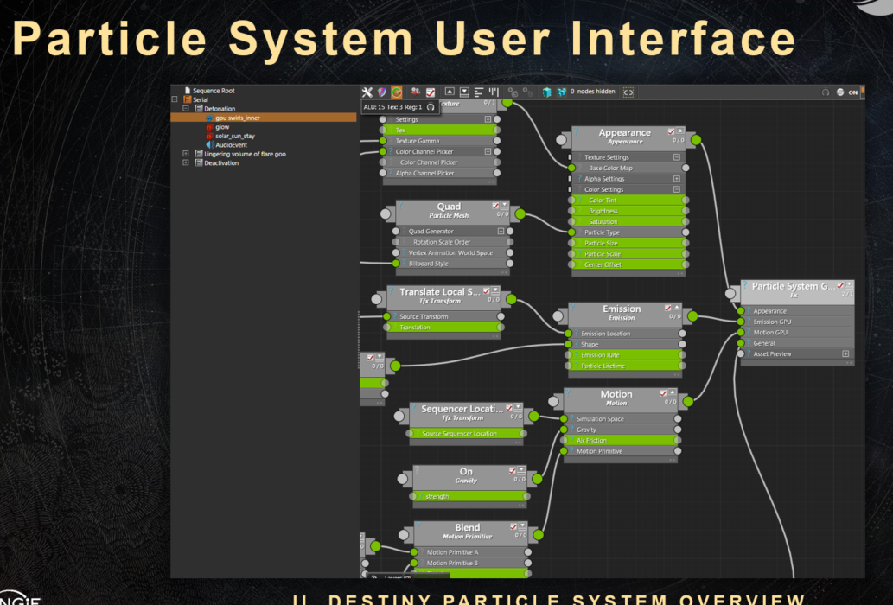
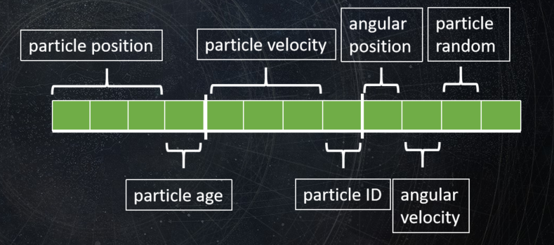

### 一、概述

命运2的粒子系统是围绕着三个核心目标来进行设计的。他的核心目标主要有三个

1. **强大的表现力**，可以灵活多样的模拟各种表现方式，已达到更酷炫的效果
2. **高速易迭代**，强调即时反馈和简单应用，特效组可以直接作出一些效果使用，提高生产力
3. **高性能**，可以支持各种机型，支持更大更好效果

基于这三个目标，他们使用自制的tfx以及编辑器结合，创建出了在保持性能和支持快速迭代的同时，支持各种各样的粒子效果模拟的粒子工作流。这套粒子系统核心的地方是表达式的支持，这些表达式不仅可以模拟复杂的效果，而且支持实时的编辑，对制作人员来说非常友好。同时制作出来的粒子能够直接生成shader交付于项目使用，能够很大的提高生产力。

### 二、整体架构一览

#### 2.1 整体架构

三个阶段

1. **Emission（发射阶段）**，本阶段的作用是用于初始化粒子，用于初始化例如数量，初始速度等方面的数据
2. **Motion（运动阶段）**,本阶段的作用是用于模拟粒子的运动。
3. **Appearance（表现阶段）**，本阶段的作用是处理粒子的显示状态。决定例如说如何渲染，材质等属性



通过编辑器操作，特效组的成员可以通过编辑器来进行特效的编辑。需要调整的内容主要就包含有上述三个方面的内容。以上面的图为例，一个“Particle System”包含有一系列共享同一个Emission，Motion，Appearnce的粒子

使用者在使用粒子系统的时候，每个添加的节点可以包含两类属性。 其他节点和参数(用表达式/参数表示)。值得注意的是，在这个类似于材质编辑器的编辑器中，美术的编辑结果可以直接作为shader来进行使用。根据他们的原文

>We had a huge variety of shaders authored by artists – in the Taken King there were 
>
>18,000 artist authored shaders (content) (Although a number of them shared vast 
>
>portions of their subgraphs from a few key templates). 

而支撑这个工作流则离不开一个非常重要的功能，TFX系统。

#### 2.2 TFX

TFX是一种自定义着色语言。 可以看做是一个围绕标准着色器代码的包装语言，但它不仅仅是一个包装器——它是一个完整的着色器管理系统。 所有粒子节点和参数都在这个TFX代码中定义。 大多数Destiny粒子代码都是TFX代码。这里不会过多深入TFX。

TFX会解析编辑器的保存文件，然后将其解析为一系列的可以被gpu运行的shader代码。它的整体流程如下图


上述四个步骤的工作如下

1. TFXSource是用于定义节点，参数，以及着色器语言片段的，
2. NodeGraph阶段则是我们使用编辑器创建各种节点，添加各种参数和表达式的阶段
3. 解析上个阶段的nodegraph，烘焙生成出实际使用的shader
4. 实时运行中提交

**每个粒子特效实例的shader代码都是动态组装成的。本身一个空函数，在编辑器中每添加一个节点，就在shader中加入一段对应hlsl的代码，最终根据所有节点组装成一个完整shader代码。**


中间高亮这段就是一个TFX的hlsl的片段，也就是用于插入的代码。

总体来说，TFX就是一个动态拼装shader的玩意。有了它，美术就可以通过编辑器大量产出直接可以用于游戏的shader。十分的高效。这便是这个系统的三个目标之一，高效产出。

#### 2.3 表达式和参数

以上面的一个发射器为例


它的部分TFX代码如下

```c++
component c_emitter_shape:ring
{
	c_initial_velocity_type:* initial_velocity_type;
	
	float radius;

	#hlsl
		float3 calculate_initial_position()
		{
			float2 circle_point= random_point_on_unit_circle();
			return float3(0, circle_point * radius);
		}
	#end
}

```

而如何能将参数和下面的代码中结合呢，即radius的使用，这就是表达式的功能。在命运2中，对于表达式的编辑有两种情况，一种是直接通过自己输入表达式的方式


如果不想手写表达式，也可以通过已有的函数进行调节。命运2的项目组支持了表达式函数的编辑，用来更加方便的调整各种表达式的效果，如下图中展示的那些函数那样。


上述的表达式编辑，以及参数的调整，都可以直观的看到渲染的结果。

**这类参数表达式就是粒子系统中最核心的部分，通过表达式可以模拟出各种类型的运动方式/表现效果，支持表达式的实时编辑来增加工作效率。通过对表达式的烘焙，可以提高运行时的效率**

### 三、一些设计的细节

#### 3.1  数据

所有的数据被分为了两类，一类是有状态的数据(stateful data),另外一类是无状态数据（stateless data）

**有状态的数据需要上一帧的数据进行计算**，如当前帧的例子数据

**无状态的数据指不需要上一帧的数据来计算当前帧的值的数据**，如各种输入数据，例如表达式的输入值


这里命运2中规定，美术控制无状态的数据。所有在粒子编辑器中编辑的参数都是无状态的数据。而这些数据中有一些区分，emission,motion的一些参数会影响到有状态数据，而appearance只会影响到无状态数据.这样就可以对两种数据进行不同的处理，有状态数据的数据需要每帧都保存到下来，而无状态数据并不需要这样做，可以针对这种情况进行内存和效率的优化

#### 3.2 内存架构和生命周期

粒子系统的数据会被打包成float4。



粒子的生成和销毁都是在cpu上计算的，因此此处做了一个优化，即不会每帧每个粒子都计算它的存活时间，这里会记录每帧粒子数量，然后每个粒子的生存时间为其最大生存时间(从内存角度)，这里会浪费掉一部分内存。这里会通过每帧粒子数量和粒子最大存活时间，计算出每帧需要销毁的粒子数量


上图中的例子是假设在0ms的时候生成了30个例子，而1的时候销毁了所有最长存在时间为16ms的例子，然后是33ms的时候再销毁一波。因为记录了下粒子的生存时间、数量，就很容易计算出存在最多粒子数量，这样就可以在开始阶段直接以最多数量来分配内存。

#### 3.3 同时支持CPU&GPU粒子

GPU的运算能力在大数量级的粒子的情况下坑定是要优于cpu粒子的，GPU上计算的逻辑就是使用computeshader来计算粒子的发射，模拟和显示。这里和普通的gpu粒子系统设计也差不多。命运2中选择支持并行的粒子系统主要是有几个原因

1. 对于数量较少的粒子，直接使用cpu粒子可能更好
2. 避免重写原有粒子系统，而是在现有的系统上进行改造更友好
3. 历史遗留问题，旧设备问题。

整体的工作流程如下


这里在Emission开始阶段，会通过粒子数量来决定是否要用computeshader的gpu粒子

**但是这里显然会带来一个问题，对于同一个效果来说，cpu和gpu不应该有表现上的差异，因此如果修改的了CPU的spawn，simulation等代码，同时也要维护gpu的同时修改。这也是并行两种系统的弊端**

#### 3.4 bytecode&expression

在前面的内容中，我们简单提到了在编辑器中设置的各种参数，这些参数可以使用表达式进行表达，然后实时预览。而实时预览的核心就是在于将表达式转换为bytecode，然后再让gpu运行。

在编辑器中，可以实时编辑表达式，然后在通过将其转换为指令存入bytecode，然后再将bytecode的数据传入到gpu中，这样就可以实时计算表达式了。

表达式的翻译我们可以看这个图

显然这是一个将表达式进行ast分析后，转换为bytecode的一个过程。

转换成为bytecode之后，可以通过GPU中进行执行,下面是一个例子

```c++
  //总执行函数  
void evaluate_bytecode(const uint8 *bytecode_start, uint32 bytecode_size, 
	const vector4 *bytecode_constants, const vector4 **bytecode_inputs, 
	vector4 **bytecode_outputs)
{
	vector4 stack[32];
	vector4 *stack_top = stack – 1; // Stack starts out empty
	const uint8 *pc = bytecode_start; // program counter
	const uint8 *bytecode_end = bytecode_start + bytecode_size;

	while (pc < bytecode_end)
	{
		switch (*pc)
		{
			// A WHOLE LOT OF CASE STATEMENTS (SEE NEXT SLIDE)
		}
	}
}
//单个执行函数，例如说加

case k_bytecode_op_add:
	*(stack_top-1) = *(stack_top-1) + *stack_top;
	stack_top--;
	pc += 1;
	break;


//hlsl
void main(){
        ...
        particle.size = evaluate_bytecode(bytecode_buffer,constant_buffer);
        ...
}
```

上述的代码中，会对bytecode进行解析，然后通过特别长的遗传switch来判断要执行什么函数

**在GPU中对bytecode指令解析是一件很耗的事情，在runtime的时候并不需要实时的修改表达式，这表示可以在离线的情况下直接把表达式烘焙到shader中。这种情况下可以有效的提升runtime时的效率**


### 四、总结

整套系统看下来，核心的地方还是他这个高效高速的工作流。可以通过编辑器实时编辑各种各样的表达式来获得大量的不可思议的效果并且实时看到效果，同时编辑器的结果还能直接输出给项目使用，以达到真正的所见即所得。

并且整个编辑过程也是比较简单易上手的，特效制作者只需要关注如何做出符合需求的效果，这样就可以将粒子特效相关的制作工作流当做一个黑盒，不同的项目/美术都可以通用这一套流程，达到高速高效的制作出各种各样漂亮的效果。是真正能够大幅度提高生产力的设计。

系统中的其他设计都是为了核心的目标服务，即高效的做出各种酷炫的效果并且能够高性能使用这个目标，因此这里主要需要学习的还是整体工作流的设计思路。


