#### 纹理的补充

1. 纹理作为环境光的描述，因为环境光就是反射环境。认为环境光是无限远的
2. 球状的纹理展开，在极点会扭曲，因此引入天空盒
3. 凹凸贴图，在不变化图形结构的情况下，修改法线，就是在模拟变化了顶点后的法线。对每一个像素的法线进行扰动
4. 还有一种纹理，会替换掉原顶点，这里有一个要求，这个模型精度，即顶点应该比位移贴图要细致，DX会有一个技术，就是动态曲面细分，可以在需要时再细分模型
5. 3维纹理，3d空间内噪声函数，定义每个像素的映射
6. 预计算，阴影等

#### 几何

如何去描述各种形状

#### 隐式的几何

1. 告诉你一个几何中的点满足的条件，例如说，球中，就是表示$x^2+y^2+z^2 =1$,因此一个隐式几何就是 f(x,y,z)=0
2. 隐式的几何的好处和坏处
   1. 坏处是，没办法通过这个式子比较高效的找到在这个集合体中的点
   2. 好处是，判定一个点在不在面上特别简单，例如说。上面球的式子，如果一个点的值是负的，那么这个点在内，反之则在玩

##### csg

将基础的几何（隐式），然后通过交并差运算，来进行形状的融合。

##### 距离函数

使用距离函数，来进行融合。距离函数意思通过空间上的任意一个点，然后它距离物体的表面的最小距离，是有正负的。可以细究一下

##### 水平集

关注某个函数在某些地方的值，类似于等高线

#### 分形几何

#### 显式的几何

直接定义或者通过参数映射的方式，例如定义一个uv，任何UV都可以映射到三维空间中某个点，例如
$$
f(u,v) = ((2+cosu)cosv,(2+cosu)sinv,sinu)
$$
我们我可以发现，如果想要找到所有图的点，只需要找到所有UV的映射点。但是坏处是，判断点是否在内外，则会较难

几何的表示方法，根据实际需要来搞

##### 点云

点云即是点的列表，当点足够多的时候，就可以看出形状了

之后变成一个多边形的面

##### 多边形面

例如说三角形

obj文件会保存 空间中的点，法线，以及纹理坐标，定义连接关系

#### 贝塞尔曲线

贝塞尔曲线求法，例如说，4个控制点的贝塞尔曲线，即三阶贝塞尔曲线。如何求呢，我们使用 de casteljau algorithm 算法，例如说，我们求三个点的贝塞尔曲线，b123是控制点，我们找到时间t，把b1到b2，b2到b3找到时间t运动到的点。然后我们将这两个点连起来，同样找到时间t在的点。发现没有新的线段了，那就是这个点了

代数表述方法

任意一个时刻，某一个点相当于时间影响下的三个点的和

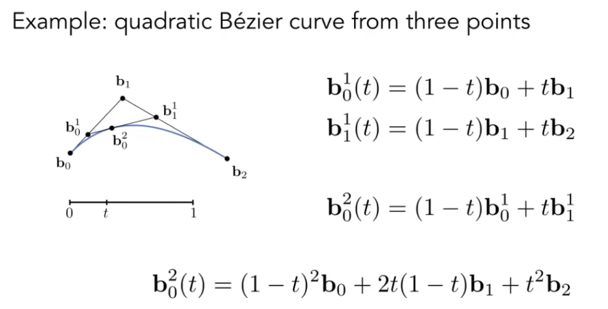
$$
b^n(t) = b^n_0(t) = \sum^{n}_{j=0}b_jB^n_j(t)\\
B^{n}_i(t)=(^i_i)t^i(1-t^{n-i})
$$

贝塞尔曲线还有一个性质，仿射变换下，顶点变换了，贝塞尔曲线进行放射变换，就能得到新的贝塞尔曲线

贝塞尔曲线还有一个凸包性质，即曲线肯定会在控制点的凸包内

贝塞尔曲线，如果顶点过高，不一定会有更好的结果，因为他并不能直观表现一个结果。因此我们会进行逐段的贝塞尔曲线，例如说四个点拼起来

c0连续，

c1连续，需要控制点在左右两个控制点连线中间

例如说B-spline

#### 贝塞尔曲面

将贝塞尔曲线的概念衍生到贝塞尔曲面理解所一个曲面，是多个控制点控制的曲线合成的例如说16个点，从横向获取四个点，这四个点作为纵向的控制点生成曲线啥的

#### 网格

网格的操作主要有两种，一个是降采样，用于减少面片，一个是上采样，用于增加面片

##### 曲面细分-loop细分

细分的方法有很多，例如说，loop细分，这里的loop是人名，不适循环的意思，它的细分方式是将每个三角形细分为4个，然后再对细分后的顶点进行偏移

对于新的顶点，偏移方式为

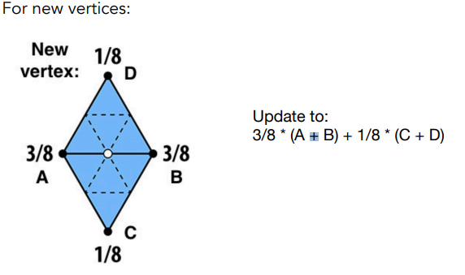

这里的1/8是算法设计如此

而对于旧顶点，偏移方式如下

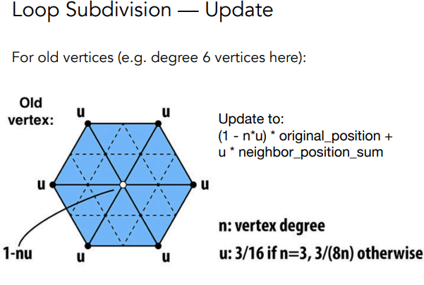

这里的变化公式是，（还等重听）

loop细分，对于三角形面来说，十分的好用，但是对于通常的面片来说，就不是这样

##### catmull-clark subdivision 

这个方法下，我们需要定义一个定义，即奇异点，奇异点的性质是，它的度数不为4，于是我们找到这个奇异点在的两个三角形

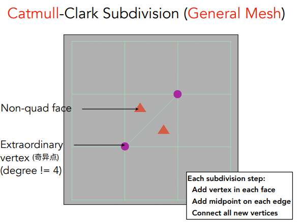

，在三角形中电商另外两个点，这样图形就全部变成了四边形，同时，奇异点也增加了两个，一共四个，然后我们接着对四边形进行细分，就是这样下

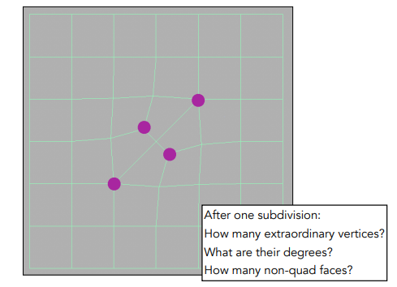

而它的顶点变换公式如下

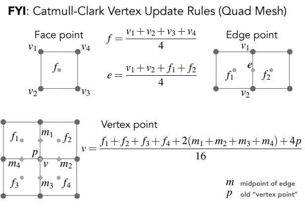

##### 降采样

除了提高质量，我们还需要一个方法，去降低质量，从而获得更好的性能。另外，如果一个

这里一个减少三角形的方法是边坍缩

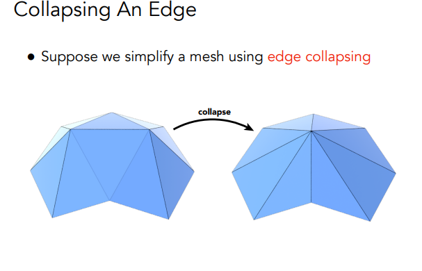

这个方法能显著的降低三角形数，但是会有一个误差

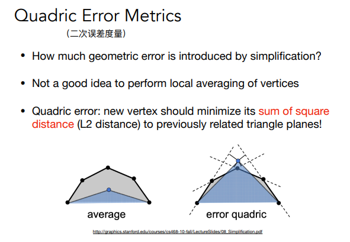

所以，我们可以有一个更好的点子，即选择一个二次度量误差最小的。

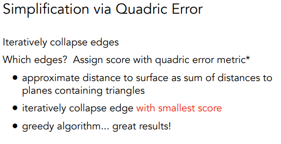

#### shadow mapping

流程 

1. render from light，即从光源方向，记录出深度图

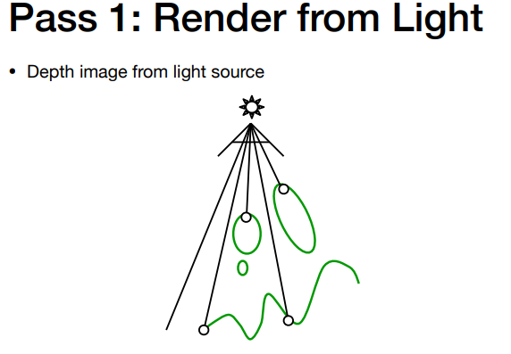

2. Render from eye，即从视线出发，获取标准的深度

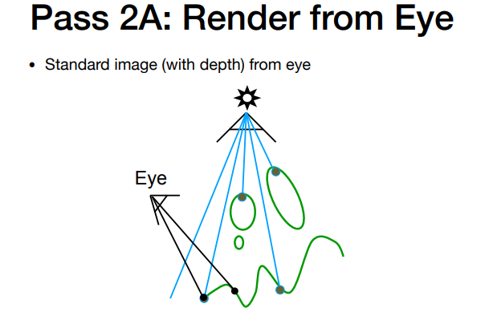

3.  project to light ，即投影回光源，例如说如果能够得到相同的值，那么这个点不在阴影中

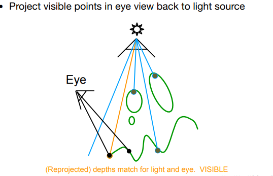

如果不同，那么则这个点在阴影中

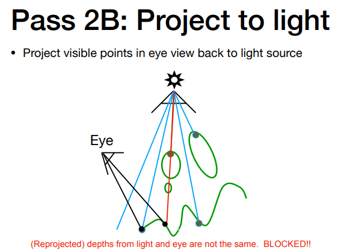

当然，这个方法也不是完美无缺的。因为float是很难比较的，所以这样的阴影会有点脏

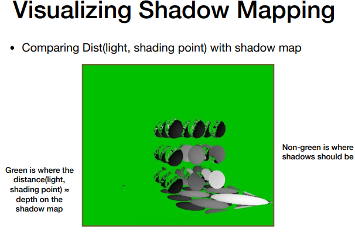

当然，shadowmapping也有它的问题，

例如

1. 硬阴影
2. 质量取决于shadow map的精度
3. 浮点数比较，意味着偏差

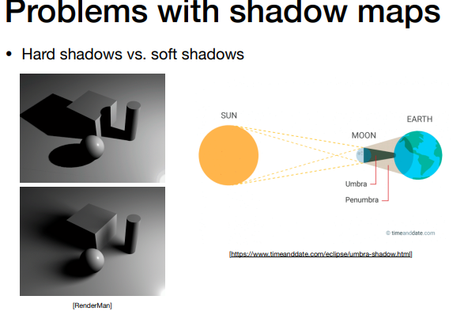

